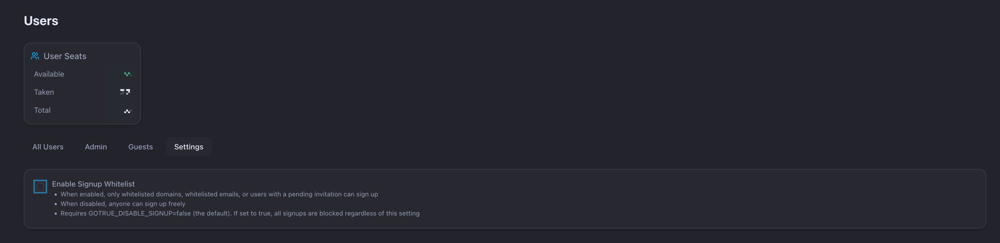
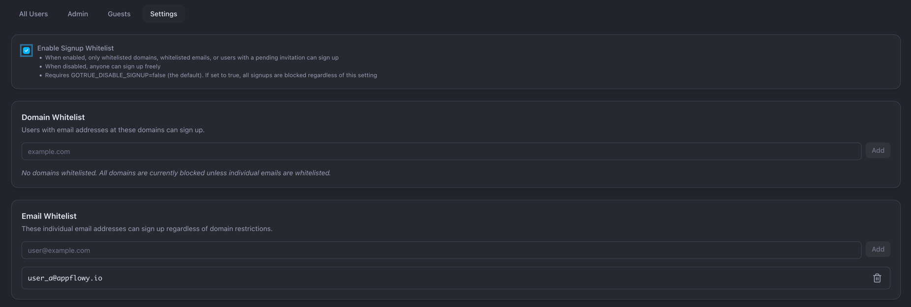
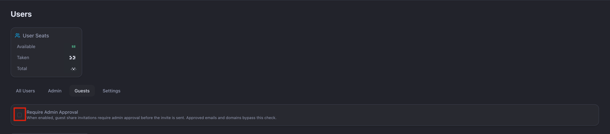
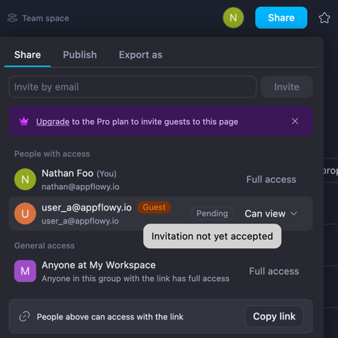
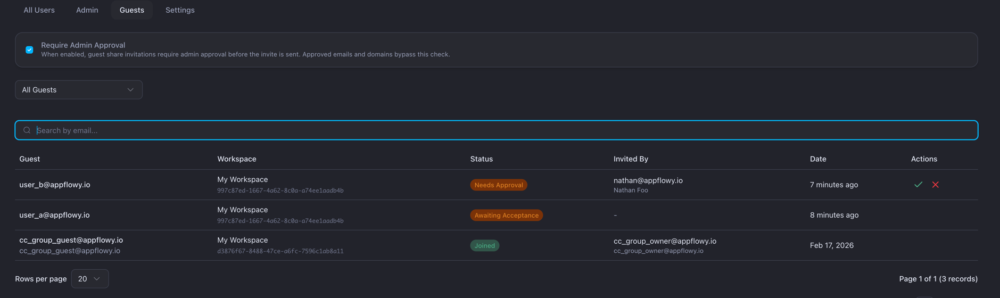
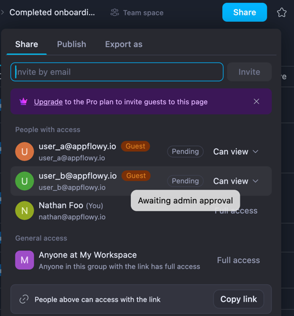

# AppFlowy-SelfHost-Commercial

> The commercial fork is distributed solely under the [AppFlowy Self-Hosted Commercial License](https://github.com/AppFlowy-IO/AppFlowy-SelfHost-Commercial/blob/main/SELF_HOST_LICENSE_AGREEMENT.md)

---

## Release

### 🚀 v0.15.0 (Latest)

#### New Features

- **Signup whitelist** — Admins can control who is allowed to register by managing domain and email allowlists from the admin dashboard. Signup whitelisting can be toggled on or off at any time without redeployment.
- **System-wide AI toggle** — A single admin setting now disables all AI functionality across the platform. When turned off, all AI features become unavailable instantly across every service.
- **Guest-invite admin approval** — Workspace owners can now queue guest invitations that require admin approval before the invite email is sent. Admins receive email notifications for new pending requests and can review, approve, or reject invites from the admin dashboard. Clients can distinguish between invites waiting on admin approval and those waiting on the invitee to accept.

---

#### Signup Whitelist

Admins can restrict new user registrations by enabling the signup whitelist in the admin dashboard. When enabled, only users whose email matches the configured allowlist (by domain or individual address) can sign up.

By default, the signup whitelist is **disabled**, so anyone can register.


**To enable it:**

1. Set the environment variable `GOTRUE_DISABLE_SIGNUP=false`. The signup whitelist only takes effect when signups are enabled at the GoTrue level — if `GOTRUE_DISABLE_SIGNUP=true`, all signups are blocked regardless of the whitelist.
2. In the admin dashboard, toggle on **Enable Signup Whitelist**.
3. Add allowed email domains (e.g., `@yourcompany.com`) or specific email addresses.



---

#### Guest-Invite Admin Approval

From the admin frontend, navigate to **Users → Guest Invite** to view pending guest invitations. You can approve or reject each request; approved invites trigger the invitation email automatically.

To require admin approval for all guest invites, toggle on **Require admin approval for guest invites**. This setting is **off** by default.

**Example — admin approval disabled:**

A workspace owner invites `user_a@appflowy.io`. The guest receives the invitation email immediately and can accept it without admin intervention.




**Example — admin approval enabled:**

A workspace owner invites `user_b@appflowy.io`. The invitation is marked **Pending Admin Approval**. Once an admin approves it, the guest receives the invitation email and can accept it to access the workspace.




---

#### ⚠️ Action Required: Upgrade Services

This release requires upgrading the following services to `0.15.0`:

- `appflowy-cloud`
- `gotrue`
- `admin-frontend`

### 🚀 v0.14.17

#### New Features

- Added server-side database row duplication, including row document cloning
- Improved published database pages so sibling database views are surfaced more consistently in published outlines and page metadata

#### Bug Fixes

- Fixed unpublished collabs to return `RecordNotFound` instead of stale publish metadata
- Fixed PDF export title and spacing issues
- Fixed relation rendering in PDF export to use relation titles instead of raw UUIDs
- Fixed hidden database fields appearing in PDF exports
- Fixed duplicate-row metadata so failed row-document duplication does not leave dangling document references

**Platform Compatibility**

- Replaced `aws-lc-rs` with `ring` to prevent `SIGILL` crashes on ARM64 Raspberry Pi deployments

### 🚀 v0.13.8

#### Bug Fixes

- Fix Notion import issues: handle inaccessible databases/documents, restore missing database row pages, and abort import gracefully when the zip file is corrupted
- Fix miscellaneous application logic bugs

#### Optimizations

- Optimize Redis connection handling for different usage scenarios

---

### 🚀 v0.13.4

#### Optimizations

- Optimize Redis connection
- Fix missing access to pages after importing a Notion zip file

---

### 🚀 v0.13.2

#### Optimizations

**AppFlowy Search**

- Support cancellable search requests
- Pipeline search requests with automatic cancellation of in-flight previous requests

**AppFlowy Worker**

- Fix Notion import bug: corrected embedded database view links and mention database links
- Fix additional Notion import bugs

---

### 🚀 v0.13.0

#### New Features

**AppFlowy Search**

A new dedicated search service (`appflowy_search`) is now available, enabling both keyword and semantic (vector) search across your documents. It runs as a standalone service on port 4002.

**Setup:**
- Pull the latest `docker-compose.yml` from the [AppFlowy Cloud repo](https://github.com/AppFlowy-IO/AppFlowy-Cloud/blob/main/docker-compose.yml), as it has been updated to include this service
- `APPFLOWY_SEARCH_SERVICE_URL` defaults to `http://appflowy_search:4002` and works out of the box. You only need to set it if you have a custom deployment configuration

**AppFlowy AI**

AI chat now leverages the search service for context retrieval, delivering more relevant and accurate responses by drawing from your workspace content.

**Admin Frontend**

A new **AI** tab has been added to the admin panel, allowing you to configure AI models and switch providers on the fly — no redeployment required.


---

#### ⚠️ Action Required: Nginx Configuration Update

If you are using a **custom Nginx configuration**, you need to add the following location block:

```nginx
location /ai/ {
    proxy_pass $appflowy_cloud_backend;
    proxy_set_header X-Request-Id $request_id;
    proxy_set_header Host $http_host;
    proxy_set_header X-Real-IP $remote_addr;
    proxy_set_header X-Forwarded-For $proxy_add_x_forwarded_for;
    proxy_set_header X-Forwarded-Proto $scheme;
}
```

> **Note:** If you are using the default Nginx configuration provided by AppFlowy Cloud, this change is already included — no action needed.

### 🚀 v0.10.1

#### Features

- Added AI Meeting feature for intelligent meeting assistance
  - **Requires:** Set the `ASSEMBLYAI_API_KEY` environment variable. [Get your API key here](https://www.assemblyai.com/docs/faq/how-to-get-your-api-key)
- Enhanced Web API with improved database creation capabilities

#### Improvements

- Improved performance by caching user and member profiles in Redis

### 🚀 v0.9.159

#### Improvements

- Optimized the Publish Page for faster loading and smoother performance
- Made file and image URLs private across the app, with access allowed only on the Publish Page

#### Bug Fixes

- Fixed an issue in the join-by-invite-code flow where an already-seated Member/Owner was incorrectly counted again. The system now properly avoids consuming an extra seat

#### Other Changes

- Deprecated the ws v1 API endpoint in preparation for future cleanup and migration
