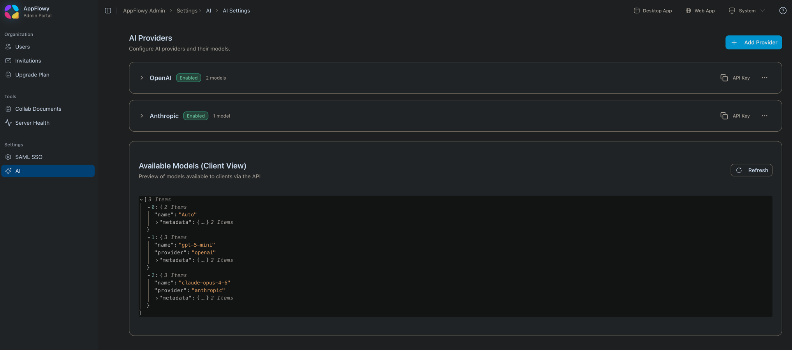

# AppFlowy-SelfHost-Commercial

> The commercial fork is distributed solely under the [AppFlowy Self-Hosted Commercial License](https://github.com/AppFlowy-IO/AppFlowy-SelfHost-Commercial/blob/main/SELF_HOST_LICENSE_AGREEMENT.md)

---

## Release

### 🚀 v0.13.0 (Latest)

#### New Features

**AppFlowy Search**

A new dedicated search service (`appflowy_search`) is now available, enabling both keyword and semantic (vector) search across your documents. It runs as a standalone service on port 4002.

**Setup:**
- Pull the latest `docker-compose.yml` from the [AppFlowy Cloud repo](https://github.com/AppFlowy-IO/AppFlowy-Cloud/blob/main/docker-compose.yml), as it has been updated to include this service
- `APPFLOWY_SEARCH_SERVICE_URL` defaults to `http://appflowy_search:4002` and works out of the box. You only need to set it if you have a custom deployment configuration

**AppFlowy AI**

AI chat now leverages the search service for context retrieval, delivering more relevant and accurate responses by drawing from your workspace content.

**Admin Frontend**

A new **AI** tab has been added to the admin panel, allowing you to configure AI models and switch providers on the fly — no redeployment required.



---

#### ⚠️ Action Required: Nginx Configuration Update

If you are using a **custom Nginx configuration**, you need to add the following location block:

```nginx
location /ai/ {
    proxy_pass $appflowy_cloud_backend;
    proxy_set_header X-Request-Id $request_id;
    proxy_set_header Host $http_host;
    proxy_set_header X-Real-IP $remote_addr;
    proxy_set_header X-Forwarded-For $proxy_add_x_forwarded_for;
    proxy_set_header X-Forwarded-Proto $scheme;
}
```

> **Note:** If you are using the default Nginx configuration provided by AppFlowy Cloud, this change is already included — no action needed.

### 🚀 v0.10.1

#### Features

- Added AI Meeting feature for intelligent meeting assistance
  - **Requires:** Set the `ASSEMBLYAI_API_KEY` environment variable. [Get your API key here](https://www.assemblyai.com/docs/faq/how-to-get-your-api-key)
- Enhanced Web API with improved database creation capabilities

#### Improvements

- Improved performance by caching user and member profiles in Redis

### 🚀 v0.9.159

#### Improvements

- Optimized the Publish Page for faster loading and smoother performance
- Made file and image URLs private across the app, with access allowed only on the Publish Page

#### Bug Fixes

- Fixed an issue in the join-by-invite-code flow where an already-seated Member/Owner was incorrectly counted again. The system now properly avoids consuming an extra seat

#### Other Changes

- Deprecated the ws v1 API endpoint in preparation for future cleanup and migration