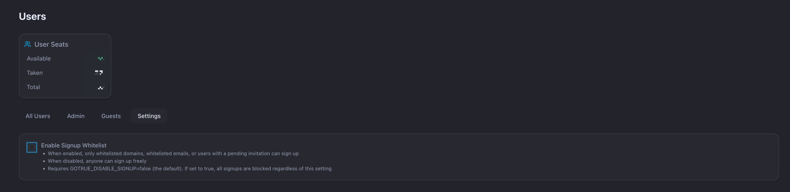
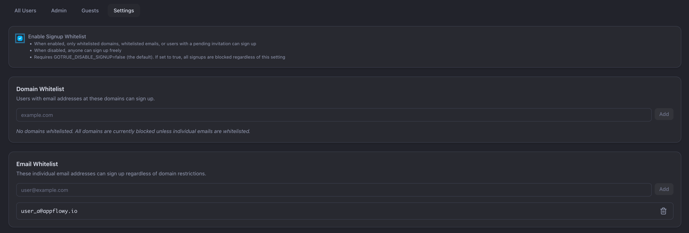
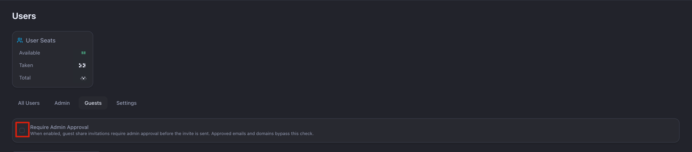
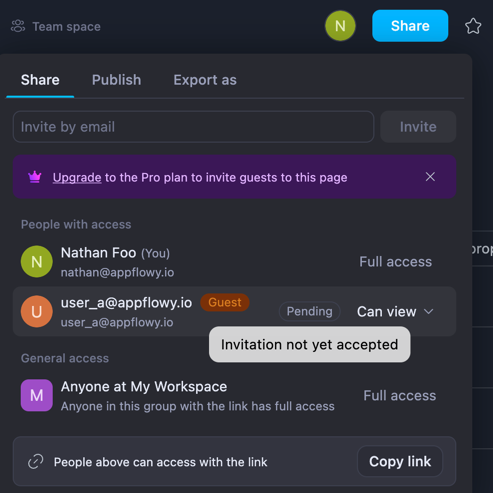
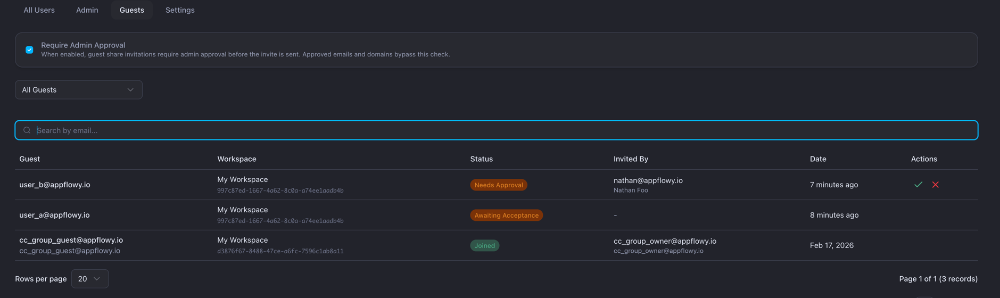
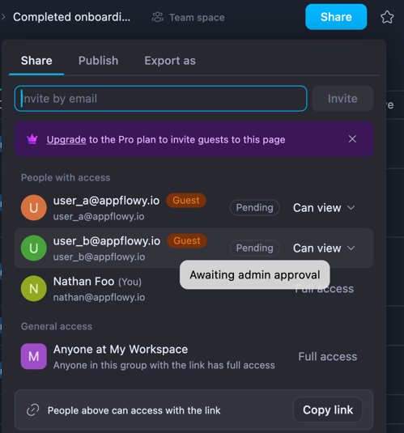
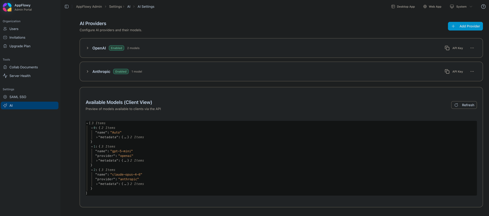

# AppFlowy-SelfHost-Commercial

> The commercial fork is distributed solely under the [AppFlowy Self-Hosted Commercial License](https://github.com/AppFlowy-IO/AppFlowy-SelfHost-Commercial/blob/main/SELF_HOST_LICENSE_AGREEMENT.md)

---

## Release

### 🚀 v0.18.3 (Latest)

#### Improvements

- **Permission caching** — Isolated access-detail group projections from realtime authorization and added a rollout-gated per-object Folder inventory, reducing broad cache invalidation without weakening access checks.
- **Restore capacity** — Added auto-sized memory and disk staging profiles that bounded restore memory, row, object, and temporary-storage use to the Cloud container's configured limits.
- **Search summaries** — Separated long AI-summary requests from ordinary interactive search timeouts so provider timeouts could return a structured response instead of an empty HTTP timeout.

#### Bug Fixes

- Fixed CSV imports so inferred field types were preserved, a later Rich Text column could become the title, and typed-only CSVs received a populated title without changing the source columns.
- Fixed commercial seat enforcement so creating or joining another workspace did not double-count an existing person, while genuine distinct-user increases still respected the license limit after legacy overages or downgrades.
- Fixed collaboration recovery by containing exact pending-gap resend loops, guaranteeing manifest repair after quarantine, repairing drained Folder projection wedges on Worker cold start, and backing off failed database-blob reconciliation.
- Fixed legacy row-document access so pages created before provenance tracking safely inherited their parent database permission on first open without a migration.

**Baseline:** [`7cc1303f1254e1001de7d85e9c46132f64bd1b65`](https://github.com/AppFlowy-IO/AppFlowy-Cloud-Preminum/commit/7cc1303f1254e1001de7d85e9c46132f64bd1b65)

### 🚀 v0.18.0

#### New Features

- **Structured space permissions** — Added Public, Private, and Custom spaces with owner, member, and everyone-else access levels, access requests, safe visibility transitions, and controls for invitations, sidebar editing, guests, public links, and exports.
- **Workspace groups** — Added manual group management and group-based access to spaces and individual pages; SCIM groups were projected into the same permission model.
- **Admin recovery and diagnostics** — Added restoration of permanently deleted document and database views when their underlying collabs survived, plus secure download of database blobs selected through the database inspector.
- **Database attribution** — Added read-only Created by and Last edited by fields and a row-by-ID update API that maintained editor attribution.

#### Bug Fixes

- Fixed workspace imports, exports, and CSV completion so recoverable content and row ordering were preserved instead of failing or reporting completion too early.
- Fixed published database duplication and unpublishing across multi-view databases, relation dependencies, legacy relation identifiers, and incomplete database payloads.
- Fixed realtime recovery issues involving Redis awareness reconnects, dependent updates, orphaned views, Folder create retries, and database-row template uploads.
- Fixed space ownership and guest and group visibility edge cases, inline-comment anchoring and cross-device notifications, and renewed-license rebind consistency.
- Fixed a SQL injection vulnerability in the Quick Note API endpoint.

**Baseline:** [`d07810bafe7cc24925d0d20eda2028919fbfd517`](https://github.com/AppFlowy-IO/AppFlowy-Cloud-Preminum/commit/d07810bafe7cc24925d0d20eda2028919fbfd517)

### 🚀 v0.17.4

#### Highlights

- **Collaboration & sync** — Improved realtime diagnostics, queue performance, replay recovery, and full-state synchronization.
- **Data integrity** — Strengthened snapshots, database row recovery, private folder repair, and transient-write handling.
- **Administration** — Added client diagnostic log upload and download, collab snapshot previews, and cloud invite and license management.
- **Publishing & templates** — Unpublished trashed page trees automatically and fixed legacy, large-ID, and nested template publishing.
- **Additional fixes** — Improved permissions, authentication rate-limit handling, workspace exports, folder-only chat attachments, and self-hosted Ollama Qwen documentation.

**Baseline:** [`359e02ed78e825908e912376f586b4abebe7b4bb`](https://github.com/AppFlowy-IO/AppFlowy-Cloud-Premium/commit/359e02ed78e825908e912376f586b4abebe7b4bb)

### 🚀 v0.17.3

#### Enterprise Identity

- **SCIM 2.0 directory sync** — Provision and deprovision users and Groups from Microsoft Entra ID, Okta, Authentik, and other compatible identity providers. Directory Groups can be mapped to AppFlowy workspace roles.
- **LDAP login** — Authenticate against configured LDAP directories and, when automatic provisioning is enabled, add users to their workspace on first login.
- **Enterprise identity administration** — Configure LDAP, SCIM, and custom OIDC connections through AppFlowy Admin.

These enterprise-authentication features require the Seed plan or higher. SCIM handles directory provisioning only; users continue to sign in through LDAP, SAML, or OIDC.

#### Required Companion Versions

Use these component versions with the v0.17.3 enterprise identity features:

| Component | Version | Purpose |
| --- | --- | --- |
| Admin Frontend | `0.16.5` | Configure LDAP, SCIM, and custom OIDC connections |
| AppFlowy | `0.17.1` | Desktop LDAP and custom OIDC sign-in |
| AppFlowy Web | `0.16.5` | Web LDAP and custom OIDC sign-in |

#### ⚠️ Action Required: Expose SCIM Through Nginx

SCIM is served at `/scim/v2/*`. The standard self-host deployment bind-mounts the public AppFlowy Cloud [`nginx/nginx.conf`](https://github.com/AppFlowy-IO/AppFlowy-Cloud/blob/main/nginx/nginx.conf) into the Nginx container, so upgrading only the `appflowy_cloud` image does not update its routes.

In a copied or customized Nginx configuration, add this sibling location alongside the `location /` frontend catch-all:

```nginx
location /scim {
    # The bundled Nginx terminates TLS itself. Never redirect a bearer request
    # after its credential has already crossed plaintext.
    if ($scheme != https) {
        return 403;
    }

    # SCIM filters can contain email addresses and external IDs.
    access_log off;
    error_log /dev/null;
    # No trailing slash or rewrite: preserve /scim/v2/* for AppFlowy Cloud.
    proxy_pass $appflowy_cloud_backend;
}
```

LDAP also needs a trusted client address for per-IP rate limiting. In the existing `location /api`, add this directive, replacing any existing `X-Forwarded-For` directive rather than adding a duplicate:

```nginx
proxy_set_header X-Forwarded-For $remote_addr;
```

For rollout:

1. Upgrade `appflowy_cloud` and wait for its migrations and health checks to complete.
2. Reload or recreate Nginx with the SCIM route.
3. In Admin Frontend `0.16.5`, create the SCIM connection and copy the bearer token when it is returned. Configure the identity provider to use `https://<host>/scim/v2`. AppFlowy stores only the token hash, and the token must be rotated before its 90-day expiry.

The bundled Nginx listens on `443 ssl`, which is why the block above checks `$scheme`. Replace its development certificate with a valid certificate trusted by the identity provider. If a trusted load balancer terminates TLS before Nginx, enforce HTTPS at that outer edge and configure Nginx's trusted real-client-IP boundary explicitly instead of copying the guard unchanged. Do not redirect SCIM bearer-token requests from HTTP to HTTPS.

No additional Docker Compose service, port, SCIM environment variable, CORS rule, or proprietary header is required. Nginx forwards the standard `Authorization` header by default. If another edge applies browser login or external authentication, exempt `/scim` so it does not consume that header; do not cache SCIM responses or automatically retry non-idempotent `POST` or `PATCH` requests. New installations using the matching public AppFlowy Cloud release include these directives; existing or customized installations must merge them into their local bind-mounted configuration.

### 🚀 v0.17.2

#### Workspace Import & Export

- Hardened workspace imports to improve data integrity.
- Made degraded workspace exports tolerate inactive collabs.

#### Collaboration & Sync

- Upgraded RocksDB to prevent file descriptor leaks.
- Improved sync speed and performance, especially under heavy workloads.

#### Repair & Migration

- Fixed retained Folder tail recovery when the frontier is missing.
- Improved the Folder frontier migration so it converges on stalled backlogs.

#### Permissions

- Shared active-identity evidence across sessions during the SLO window.


### 🚀 v0.17.1

#### AppFlowy Server

- **Workspace export** — Fixed failures for large workspaces, stalled tasks, and workspaces with missing or inconsistent data, while preserving all readable content.
- **Database blob diff API** — Added opt-in paginated responses with bounded page sizes and resumable continuation cursors for `POST /api/workspace/{workspace_id}/database/{database_id}/blob/diff`, while preserving compatibility with existing clients.
- **Search indexing** — Made workspace index repair bounded and progressive so one problematic document cannot stall indexing for the rest of the workspace.
- **Client compatibility** — Added `APPFLOWY_MIN_CLIENT_VERSION` so operators can configure the minimum supported client version.

### 🚀 v0.17.0


#### Highlights

- **More reliable realtime collaboration** — Stronger sync and reconnection handling keeps documents in sync, recovers cleanly after interruptions, and monitors for stalls.
- **More durable snapshots and version history** — Improved snapshot recovery and gating so saved versions and history stay dependable.
- **Stronger permissions** — Explicit per-page permissions for workspace members, with revocations now taking effect immediately.
- **Better database integrity** — More consistent row identity and safer handling of concurrent edits.
- **Faster, leaner search and AI** — Lower CPU and memory usage in search and AI indexing, with better prioritization and grounding.

#### Collaboration & Sync

- Improved WebSocket reconnection and recovery after interruptions.
- More reliable convergence so everyone sees the same, correct document state.
- Fixed syncing of restored versions.
- Improved handling of missing or out-of-order updates, including quarantine of problematic gaps.

#### Permissions

- Added explicit page-level permissions for workspace members.
- Permission revocations now take effect immediately.
- Fixed cases where stale permissions could linger.
- Editors can now resolve comments.
- Isolated notifications per user so people only see what is meant for them.

#### Snapshots & Version History

- Improved snapshot recovery and worker reliability.
- Version history now relies on durable snapshots.

#### Database

- More consistent database row identity for reliable parent/child relationships.
- Safer database migrations.
- Support for concurrent workspace updates.
- Improved row-permission performance.
- Reduced memory usage when comparing large database entries.

#### Search & AI

- Lower CPU usage and better backpressure handling in search.
- Smarter query prioritization.
- Provider-aware AI indexing with support for dynamic embedding dimensions.

#### Improvements & Fixes

- Improved mention notifications.
- Isolated the recent-pages cache to prevent cross-contamination.

#### Upgrade & Rollout Notes

- This release includes database identity migrations.
- Deploy AppFlowy Cloud and AppFlowy Worker together.
- Deploy AppFlowy Cloud before AppFlowy AI and Admin Frontend.
- Changing embedding models or dimensions requires re-embedding existing content.

### 🚀 v0.15.0

#### New Features

- **Signup whitelist** — Admins can control who is allowed to register by managing domain and email allowlists from the admin dashboard. Signup whitelisting can be toggled on or off at any time without redeployment.
- **System-wide AI toggle** — A single admin setting now disables all AI functionality across the platform. When turned off, all AI features become unavailable instantly across every service.
- **Guest-invite admin approval** — Workspace owners can now queue guest invitations that require admin approval before the invite email is sent. Admins receive email notifications for new pending requests and can review, approve, or reject invites from the admin dashboard. Clients can distinguish between invites waiting on admin approval and those waiting on the invitee to accept.

---

#### Signup Whitelist

Admins can restrict new user registrations by enabling the signup whitelist in the admin dashboard. When enabled, only users whose email matches the configured allowlist (by domain or individual address) can sign up.

By default, the signup whitelist is **disabled**, so anyone can register.


**To enable it:**

1. Set the environment variable `GOTRUE_DISABLE_SIGNUP=false`. The signup whitelist only takes effect when signups are enabled at the GoTrue level — if `GOTRUE_DISABLE_SIGNUP=true`, all signups are blocked regardless of the whitelist.
2. In the admin dashboard, toggle on **Enable Signup Whitelist**.
3. Add allowed email domains (e.g., `@yourcompany.com`) or specific email addresses.



---

#### Guest-Invite Admin Approval

From the admin frontend, navigate to **Users → Guest Invite** to view pending guest invitations. You can approve or reject each request; approved invites trigger the invitation email automatically.

To require admin approval for all guest invites, toggle on **Require admin approval for guest invites**. This setting is **off** by default.

**Example — admin approval disabled:**

A workspace owner invites `user_a@appflowy.io`. The guest receives the invitation email immediately and can accept it without admin intervention.




**Example — admin approval enabled:**

A workspace owner invites `user_b@appflowy.io`. The invitation is marked **Pending Admin Approval**. Once an admin approves it, the guest receives the invitation email and can accept it to access the workspace.




---

#### ⚠️ Action Required: Upgrade Services

This release requires upgrading the following services to `0.15.0`:

- `appflowy-cloud`
- `gotrue`
- `admin-frontend`

### 🚀 v0.14.17

#### New Features

- Added server-side database row duplication, including row document cloning
- Improved published database pages so sibling database views are surfaced more consistently in published outlines and page metadata

#### Bug Fixes

- Fixed unpublished collabs to return `RecordNotFound` instead of stale publish metadata
- Fixed PDF export title and spacing issues
- Fixed relation rendering in PDF export to use relation titles instead of raw UUIDs
- Fixed hidden database fields appearing in PDF exports
- Fixed duplicate-row metadata so failed row-document duplication does not leave dangling document references

**Platform Compatibility**

- Replaced `aws-lc-rs` with `ring` to prevent `SIGILL` crashes on ARM64 Raspberry Pi deployments

### 🚀 v0.13.8

#### Bug Fixes

- Fix Notion import issues: handle inaccessible databases/documents, restore missing database row pages, and abort import gracefully when the zip file is corrupted
- Fix miscellaneous application logic bugs

#### Optimizations

- Optimize Redis connection handling for different usage scenarios

---

### 🚀 v0.13.4

#### Optimizations

- Optimize Redis connection
- Fix missing access to pages after importing a Notion zip file

---

### 🚀 v0.13.2

#### Optimizations

**AppFlowy Search**

- Support cancellable search requests
- Pipeline search requests with automatic cancellation of in-flight previous requests

**AppFlowy Worker**

- Fix Notion import bug: corrected embedded database view links and mention database links
- Fix additional Notion import bugs

---

### 🚀 v0.13.0

#### New Features

**AppFlowy Search**

A new dedicated search service (`appflowy_search`) is now available, enabling both keyword and semantic (vector) search across your documents. It runs as a standalone service on port 4002.

**Setup:**
- Pull the latest `docker-compose.yml` from the [AppFlowy Cloud repo](https://github.com/AppFlowy-IO/AppFlowy-Cloud/blob/main/docker-compose.yml), as it has been updated to include this service
- `APPFLOWY_SEARCH_SERVICE_URL` defaults to `http://appflowy_search:4002` and works out of the box. You only need to set it if you have a custom deployment configuration

**AppFlowy AI**

AI chat now leverages the search service for context retrieval, delivering more relevant and accurate responses by drawing from your workspace content.

**Admin Frontend**

A new **AI** tab has been added to the admin panel, allowing you to configure AI models and switch providers on the fly — no redeployment required.



---

#### ⚠️ Action Required: Nginx Configuration Update

If you are using a **custom Nginx configuration**, you need to add the following location block:

```nginx
location /ai/ {
    proxy_pass $appflowy_cloud_backend;
    proxy_set_header X-Request-Id $request_id;
    proxy_set_header Host $http_host;
    proxy_set_header X-Real-IP $remote_addr;
    proxy_set_header X-Forwarded-For $proxy_add_x_forwarded_for;
    proxy_set_header X-Forwarded-Proto $scheme;
}
```

> **Note:** If you are using the default Nginx configuration provided by AppFlowy Cloud, this change is already included — no action needed.

### 🚀 v0.10.1

#### Features

- Added AI Meeting feature for intelligent meeting assistance
  - **Requires:** Set the `ASSEMBLYAI_API_KEY` environment variable. [Get your API key here](https://www.assemblyai.com/docs/faq/how-to-get-your-api-key)
- Enhanced Web API with improved database creation capabilities

#### Improvements

- Improved performance by caching user and member profiles in Redis

### 🚀 v0.9.159

#### Improvements

- Optimized the Publish Page for faster loading and smoother performance
- Made file and image URLs private across the app, with access allowed only on the Publish Page

#### Bug Fixes

- Fixed an issue in the join-by-invite-code flow where an already-seated Member/Owner was incorrectly counted again. The system now properly avoids consuming an extra seat

#### Other Changes

- Deprecated the ws v1 API endpoint in preparation for future cleanup and migration
