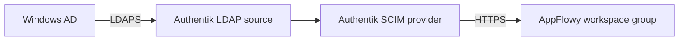
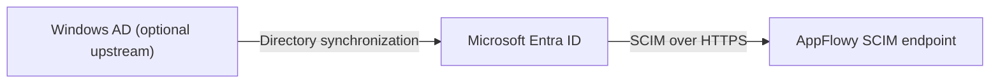

# Automatic Windows AD group sync with SCIM

Keep users and groups in **on-premises Windows Server Active Directory (AD)** and
send their changes to AppFlowy through a SCIM connector. This guide uses
**self-hosted Authentik** for that connector. Administrators make directory changes
in AD; Authentik reads them through LDAPS and provisions AppFlowy through SCIM.

Authentik is one connector option. If your organization already synchronizes AD
into Microsoft Entra ID, use the [Entra route](#using-microsoft-entra-id-instead).
For groups managed directly in Authentik, follow
[Automatic group sync from Authentik](AUTHENTIK_AUTO_SYNC.md).

> **What the media demonstrates:** The Windows AD route reuses clearly labeled
> Authentik → AppFlowy screenshots and videos. The [Entra route](#using-microsoft-entra-id-instead)
> includes four real portal setup screenshots, captured on October 9, 2026. Its
> test tenant could not assign groups because of its plan, so these show setup,
> not a completed Entra sync. Windows AD configuration still needs verification
> against a Windows test domain; no ADUC screenshots or AD-to-AppFlowy recording
> are claimed.

## In this guide

1. [Choose the correct directory](#choose-the-correct-directory)
2. [Prepare the Windows AD users and groups](#step-1-prepare-the-users-and-groups-in-windows-ad)
3. [Import AD into the connector](#step-2-import-ad-into-the-connector)
4. [Map email addresses](#step-3-map-the-ad-email-to-the-scim-username)
5. [Connect AppFlowy](#step-4-connect-the-scim-provider-to-appflowy)
6. [Check scheduling](#step-5-confirm-automatic-scheduling)
7. [Demonstrate group and member changes](#step-6-demonstrate-group-and-member-changes-in-ad)
8. [Check status and space permissions](#step-7-check-status-and-assign-space-permissions)
9. [Use Microsoft Entra ID instead](#using-microsoft-entra-id-instead)
10. [Capture the Windows AD walkthrough](#capture-the-windows-ad-walkthrough)

## Choose the correct directory

| What you have | How to recognize it | Sync route |
| --- | --- | --- |
| Windows Server Active Directory | Domain controllers and **Active Directory Users and Computers** (ADUC) | AD → LDAPS connector → SCIM → AppFlowy; the worked example below |
| Microsoft Entra ID, formerly Azure AD | The **Microsoft Entra** web portal, with **Entra ID**, **Users**, **Groups**, and **Enterprise apps** | Entra ID → SCIM → AppFlowy |
| Windows AD synchronized into Entra ID | Groups originate on a domain controller and also appear in Entra | AD → Entra ID → SCIM → AppFlowy |

An Entra portal screenshot does not establish that a Windows AD domain is
connected. Confirm where the group's membership is maintained before changing it.

## How automatic sync works



AD remains the source of directory membership. AppFlowy owns the space and page
permissions assigned to the resulting workspace group. **A group is not a space**:
SCIM creates a group that you can give access to an existing space.

There are two synchronization stages. First the connector must import an AD
change. Then its SCIM provider must deliver the change to AppFlowy. A green
**Synced** badge in AppFlowy confirms the data AppFlowy has received; it cannot
confirm an AD change that the connector has not sent yet.

## Before you begin

- Use a test AD organizational unit (OU), two test users, and a dedicated AppFlowy
  workspace. Exclude the AppFlowy system administrator and workspace owner from
  directory provisioning.
- Meet the [AppFlowy SCIM prerequisites](SCIM.md#before-you-begin), including the
  required self-hosted plan and sufficient seats. For monitoring and seat-recovery
  features, deploy Cloud and Admin versions containing those features, Cloud first.
- Run Authentik with its worker. The existing downstream demonstration uses
  **2026.5.6**, which supports the member-removal requests used by AppFlowy. Check
  the LDAP source controls against your installed Authentik version.
- Let the connector reach the domain controller over LDAPS and AppFlowy's
  `https://your-domain/scim/v2` endpoint over HTTPS. For a self-hosted connector,
  these can be private addresses reachable from its network.
- Prepare an AD service account with read access to the selected users, groups,
  and membership attributes. Store its password in the connector, not this guide.
- Choose a separate sign-in method, such as [LDAP](LDAP.md) or [OIDC](OIDC.md).
  SCIM provisions access; it does not sign users in. Sign-in and SCIM must resolve
  the same email address.

### Example directory

The following names and addresses are examples, not credentials or a customer
directory. Replace the domain and DNs with your test domain.

| Object | Example |
| --- | --- |
| Domain controller | `dc1.corp.example.com` |
| Test base DN | `OU=AppFlowy-SCIM-Demo,DC=corp,DC=example,DC=com` |
| Users below that base | `OU=Users` |
| Groups below that base | `OU=Groups` |
| Service account | `svc_appflowy_sync@corp.example.com`, outside the imported Users OU |
| Alice's email | `demo.alice@example.com` |
| Bob's email | `demo.bob@example.com` |
| Application-access group | `AppFlowy-Access` |
| Permission group to synchronize | `Engineering — SCIM Demo` |
| AppFlowy workspace | `SCIM Sync Demo` |

## Step 1: Prepare the users and groups in Windows AD

1. Open **Active Directory Users and Computers** on a Windows administrator
   machine connected to the test domain.
2. Create the test OU and its **Users** and **Groups** child OUs, or select
   equivalent existing test OUs.
3. Create Alice and Bob as ordinary test users. Populate each user's **E-mail**
   (`mail`) and display name. The Windows login name may differ from the email;
   step 3 handles that difference.
4. Under **Groups**, create two **Security** groups with **Global** scope for this
   single-domain example: **AppFlowy-Access** and **Engineering — SCIM Demo**.
5. Open **AppFlowy-Access → Properties → Members** and add Alice and Bob directly.
   Leave Engineering empty initially.

**Expected result:** Alice and Bob are eligible for the application, while
Engineering has zero members. Keeping these groups separate lets you remove
someone from Engineering without removing their workspace access.

Use direct user memberships for this first test. AppFlowy's SCIM endpoint accepts
user members, not nested groups. Nested AD memberships require explicit connector
configuration and a separate test of the resulting user list. Do not use the
special **Domain Users** primary group as your test: AD's `memberOf` attribute
omits primary-group membership. [Microsoft's membership reference](https://learn.microsoft.com/en-us/windows/win32/ad/security-properties#memberof)

## Step 2: Import AD into the connector

In Authentik, open **Directory → Federation and Social login**, create an **LDAP
Source**, and name it **Windows AD — SCIM Demo**. A source reads an external
directory; it is different from an LDAP provider that serves Authentik data.

Use the following settings for this test OU:

| Setting | Value |
| --- | --- |
| Server URI | `ldaps://dc1.corp.example.com:636` |
| StartTLS | Off when using `ldaps://` |
| TLS Verification Certificate | Select the CA chain that validates the domain controller certificate |
| Bind CN | Your read-only service account's UPN |
| Bind Password | Enter the service account password privately |
| Base DN | `OU=AppFlowy-SCIM-Demo,DC=corp,DC=example,DC=com` |
| Additional User DN | `OU=Users` |
| Additional Group DN | `OU=Groups` |
| User object filter | `(&(objectClass=user)(!(objectClass=computer)))` |
| Group object filter | `(objectClass=group)` |
| Sync users / Sync groups | Both enabled |
| Lookup using a user attribute | Off for this direct-membership example |
| Group membership field | `member` |
| User membership attribute | `distinguishedName` |
| Object uniqueness field | `objectSid`; keep it stable after setup |
| User password writeback | Off; directory changes are made in AD |

Select the built-in Active Directory/LDAP user mappings appropriate to your
directory, including email and name. Select the LDAP **Name** mapping for groups.
Confirm that both mapping selections are populated. These settings follow
[Authentik's AD integration](https://docs.goauthentik.io/users-sources/sources/directory-sync/active-directory/).

For Authentik, leaving **TLS Verification Certificate** empty skips LDAP server
certificate verification; it does not use the operating system trust store.
Import/select the issuing CA chain, use the certificate's hostname, and keep
verification enabled. [Authentik's LDAP TLS settings](https://docs.goauthentik.io/users-sources/sources/protocols/ldap/#connection-settings)

Save the source and let its initial import complete. In Authentik, check the
source's synchronization status and **Directory → Users / Groups**. Confirm
Alice, Bob, both groups, and the exact membership of AppFlowy-Access.

After confirming the test scope, enable **Delete Not Found Objects** if AD
deletions should propagate. Both user/group sync must remain enabled. Removing an
object from the source's search scope can also make it appear missing, so review
scope changes before applying them to an established connection.
[Authentik's deletion setting](https://docs.goauthentik.io/users-sources/sources/protocols/ldap/#configuration-options-for-ldap-sources)

**Expected result:** Authentik contains the imported identities and groups. Do not
manually recreate them there or edit their imported membership; subsequent AD
imports should remain authoritative.

## Step 3: Map the AD email to the SCIM username

AppFlowy requires SCIM `userName` to be the user's email address. An AD username
such as `alice` is insufficient, and a UPN ending in an internal-only suffix may
not be the email used for AppFlowy sign-in.

Before enabling outgoing provisioning, inspect Alice and Bob in Authentik and
confirm their imported email values. In the AppFlowy SCIM provider's user mapping,
map `userName` from that email. For example, add a **SCIM Mapping** named
**zz AppFlowy email username** alongside the standard User mapping:

```python
email = (user.email or "").strip().lower()
if not email:
    raise ValueError("AppFlowy provisioning requires an email address")
return {"userName": email}
```

This is an outgoing SCIM mapping, not an LDAP source mapping. The name places the
override after the standard mapping in Authentik's name-based mapping order.
Inspect the final mapping result before provisioning; keep `displayName`, `active`
and a stable `externalId`, and remove unsupported attributes such as `department`
and `manager`. Keep the standard Group mapping.
[Authentik's mapping behavior](https://docs.goauthentik.io/add-secure-apps/providers/scim/#attribute-mapping)

AppFlowy's `userName` is immutable after creation. Do not demonstrate an email
rename by changing this mapping on an existing provisioned account. Review the
[AppFlowy attribute contract](SCIM.md#attribute-mapping) first.

## Step 4: Connect the SCIM provider to AppFlowy

1. In AppFlowy Admin, open **Authentication → SCIM Provisioning → Add connection**.
   Name it **Windows AD — SCIM Demo**, select **SCIM Sync Demo**, choose **Member**
   as the default role, and leave group role mappings empty for this walkthrough.
2. Copy the **Tenant URL** and the one-time **Secret token** to the connector.
   Keep tokens and bind passwords out of screenshots and recordings.


*Reference screenshot from the Authentik demo; use your AD connection's label.*

3. In Authentik, create an application named **AppFlowy AD Sync Demo**. Under its
   **Policy / Group / User Bindings**, bind the imported **AppFlowy-Access** group.
4. Create a **SCIM provider** using the Tenant URL, **Static token** authentication,
   and the AppFlowy secret token. Configure the user mapping from step 3, the
   standard Group mapping, and a group filter selecting **Engineering — SCIM Demo**.
5. Leave **Exclude service accounts** enabled and **Dry-run** disabled. Attach the
   provider to the application's **Backchannel Providers** and save.

Application bindings select the users that may be provisioned. The provider's
group filter selects which group objects are sent; it does not by itself limit
users. Authentik documents the
[SCIM provider and backchannel setup](https://docs.goauthentik.io/add-secure-apps/providers/scim/create-scim-provider/).


*This earlier local demo shows a Docker development address. Use your connector's
reachable HTTPS AppFlowy URL, including `/scim/v2`.*

**Expected result:** the provider reports successful provisioning; AppFlowy has
Alice and Bob as workspace Members and an empty Engineering group. No role mapping
is required for the group to exist. Role mappings and space permissions are separate.

## Step 5: Confirm automatic scheduling

Check that the LDAP source has a working recurring synchronization schedule and
that the Authentik worker is running. Inspect **System Tasks** and the source's
latest synchronization result. An initial manual sync is useful for setup, but
the lifecycle checks below should complete without another manual sync.

LDAP imports and outgoing SCIM delivery have separate timing. Authentik sends
outgoing changes and also performs periodic full SCIM reconciliation. The source's
outgoing-sync setting can defer delivery until its import finishes. Use task
timestamps to measure your installation rather than assuming an AD edit appears
immediately. [Authentik's SCIM synchronization behavior](https://docs.goauthentik.io/add-secure-apps/providers/scim/#sync-behavior)

## Step 6: Demonstrate group and member changes in AD

For each action, save it in **ADUC**, wait for the LDAP import, check the imported
object in Authentik, and then check AppFlowy. Keep **AppFlowy-Access** unchanged
during the Engineering membership tests.

| Action in ADUC | Expected AppFlowy result after both sync stages |
| --- | --- |
| Add Alice under Engineering → Properties → Members | Engineering contains Alice: **1 member** |
| Add Bob | Engineering contains Alice and Bob: **2 members** |
| Remove Alice from Engineering | Engineering contains Bob: **1 member**; Alice remains a workspace Member |
| Replace Bob with Alice | Engineering contains Alice: still **1 member**, but a different person |
| Rename the Engineering group object | The same synchronized group receives the new name; retain its AD object identity |
| Change Alice's AD display name | The connector and SCIM User record update; AppFlowy's existing personal profile name remains user-controlled |
| Create another test group in the imported Groups OU | It reaches Authentik; select it in the SCIM provider's group filter before expecting it in AppFlowy |

For the rename, change the group object's name used by the selected source mapping,
not only its Description. Verify the imported name before checking downstream.


*This reference shows the expected AppFlowy result; its source changes were made
in Authentik. In this guide, make the corresponding changes in Windows AD.*


### Delete a group separately from deleting a user

Use a disposable second group for this check so that Engineering remains available.

1. Confirm that it is imported, selected for SCIM group provisioning, and visible
   in AppFlowy.
2. Delete that test group in ADUC.
3. Wait for a successful LDAP import with **Delete Not Found Objects** enabled.
   Confirm that the group disappears from Authentik.
4. Check the SCIM provider's delivery result and confirm that the corresponding
   group disappears from AppFlowy Admin and **People → Groups**.


Deleting a group does not delete its users. Alice and Bob remain provisioned while
they still belong to AppFlowy-Access. A recreated group receives a new identity;
do not expect the deleted group's old space/page grants to return.

### Deactivate or remove a user's application access

Use a separate disposable user to verify the full offboarding path: disable the
AD account or remove its AppFlowy-Access membership, then check the imported active
state/application eligibility and the resulting SCIM deactivation/deletion.
Confirm that AppFlowy workspace access is removed. Do not infer successful
offboarding from a failed AD login or an empty permission group alone.

Deactivating or deleting a User through SCIM removes workspace access. Existing
session behavior is documented under [SCIM provisioning](SCIM.md#how-provisioning-works).

## Step 7: Check status and assign space permissions

In AppFlowy Admin, select the connection's **SCIM groups** count. The monitor
compares the received group name and exact eligible membership, not just the count.
It refreshes every five seconds while open and visible.


| Status | What to check |
| --- | --- |
| Synced | The latest data AppFlowy received is applied. Check the connector if a newer AD change is still missing. |
| Pending / Retrying | AppFlowy has work queued. Allow processing; use Retry sync after resolving an AppFlowy-side failure. |
| Needs attention | Inspect the mismatch and use Retry sync to reapply the received group data. |
| Waiting for seats | Install an upgraded AppFlowy license or free a seat; accepted activation retries automatically. |

**Retry sync does not query AD or force the connector to send a missing change.**
Trace that change through the LDAP source and SCIM provider first.

To grant space access, open the space's permission controls, select the
synchronized workspace group, and choose its access level. Do this once; subsequent
eligible group membership changes affect that grant.


## When an AppFlowy license has no free seats

An accepted SCIM activation waits without granting new access. Admin shows the
waiting count, including users who are not in a group. Installing the larger
license wakes the server's retry work; the latest received group state is applied
after admission. Buying seats alone does not update an instance still using its
old license. A received User deactivation/deletion cancels waiting activation.


This image is a labeled UI test fixture. Follow the
[illustrated license-recovery steps and version-transition requirements](AUTHENTIK_AUTO_SYNC.md#when-your-license-runs-out-of-seats).
The retry covers SCIM activations, not failed LDAP sign-in attempts.

## Using Microsoft Entra ID instead

If your directory is **Microsoft Entra ID**, it can act as the SCIM client directly.
If users/groups originate in Windows AD, first synchronize the intended objects
into Entra using your organization's supported directory-sync configuration.
Validate that first stage separately.



Authentik is unnecessary for this route. Follow the steps below for a dedicated
Entra test application. For groups mastered in Windows AD, make membership changes
in AD and wait for both stages; for cloud-managed groups, make them in Entra.

### Entra step 1: Check the license and network requirements

Group-based application assignment requires **Entra ID P1 or P2**; the **Entra
Free** label alone does not establish this entitlement. Microsoft also excludes
nested memberships from group-based application assignment. These Microsoft
requirements are separate from the AppFlowy license.
[Microsoft's group-assignment requirements](https://learn.microsoft.com/en-us/entra/identity/users/groups-saasapps)


*Real warning under **Enterprise apps → application → Users and groups → Add
user/group**. This stopped the group-sync demonstration. Individual-user
assignment does not demonstrate group provisioning.*

To prepare an eligible test tenant:

1. Use a work/school administrator account for the intended tenant. Follow
   [Microsoft's P1/P2 sign-up guide](https://learn.microsoft.com/en-us/entra/fundamentals/get-started-premium),
   which links to the P2 trial, or use an existing eligible subscription. Review
   the trial's payment, renewal, and cancellation terms before enrolling.
2. Confirm that the subscription is attached to the same tenant that contains the
   test application. In the current portal, license management points to the
   **Microsoft 365 admin center**; the Entra **Try / Buy** action may be disabled.
3. Assign the appropriate licenses to the test users through **Microsoft 365 admin
   center → Users → Active users → user → Licenses and apps**.
   [Microsoft's license-assignment steps](https://learn.microsoft.com/en-us/microsoft-365/admin/manage/assign-licenses-to-users)
4. Return to the application's **Users and groups → Add user/group** and verify
   that group selection is available before starting the group demonstration.

For the direct cloud connection shown here, Microsoft must be able to reach
`https://your-domain/scim/v2` with a valid TLS certificate. A working `localhost`
URL in your browser is insufficient. If the endpoint is private, assess
[Microsoft's on-premises SCIM provisioning agent](https://learn.microsoft.com/en-us/entra/identity/app-provisioning/on-premises-scim-provisioning)
and its separate Windows/network prerequisites instead; that route was not tested
for this guide. Do not expose LDAP or a domain controller to make SCIM reachable.

Prepare the AppFlowy connection, workspace, and licensed seats from
[step 4](#step-4-connect-the-scim-provider-to-appflowy), using **Entra — SCIM Demo**
as the connection label. Only its AppFlowy connection/token steps apply to this
route. Keep the token private.

### Entra step 2: Create a dedicated enterprise application

1. Open **Entra ID → Enterprise apps → New application**.
2. Select **Create your own application**.
3. Enter **AppFlowy SCIM Demo** and select **Integrate any other application you
   don't find in the gallery (Non-gallery)**.
4. Create the application and open it. Use this dedicated test application so
   existing sign-in assignments do not enter the provisioning scope.


*Real form with an example name; captured before submission and then canceled.
The following setup screens were inspected in an existing application labeled
**AppFlowy SSO**, with no configuration saved. Your dedicated application's name
will appear in their place. SSO and SCIM remain separate settings.*

### Entra step 3: Connect the AppFlowy SCIM endpoint

Open the application's **Provisioning** page. The current portal offers **New
configuration** or **Connect your application**.


In the new configuration form:

| Field | Enter |
| --- | --- |
| Authentication method | **Bearer authentication** |
| Tenant URL | The AppFlowy connection's HTTPS URL ending in `/scim/v2` |
| Secret token | The one-time token generated by AppFlowy Admin |


*Real setup screen; endpoint and token are intentionally empty. No successful
connection is implied by this image.*

Select **Test connection**. After it succeeds, create/save the configuration.
In the legacy view, choose **Provisioning Mode → Automatic → Admin Credentials**;
if those credentials have moved, follow the link to the new configuration form.
The connection test checks connectivity and authentication. It is not proof that a
group or its members have synchronized.

### Entra step 4: Limit mappings and assignment scope

The remaining steps are the verification procedure to run after resolving the
license/network prerequisites; their successful results were not captured in
this tenant.

1. Open **Attribute mapping** (or **Mappings** in the legacy view) and enable both
   User and Group provisioning.
2. Keep only AppFlowy's supported writable attributes. Map the user's sign-in
   email to `userName` and use it as the matching attribute; map `displayName`,
   `active`, and a stable `externalId`. Remove writable `emails` and enterprise
   attributes such as `department` and `manager`. Use `displayName` directly
   instead of separate `name` mappings. See the
   [attribute contract](SCIM.md#attribute-mapping).
3. For groups, map `displayName`, `members`, and `externalId`. Give the test group
   a distinct name, such as **Engineering — Entra Demo**.
4. Set **Scope → Sync only assigned users and groups**. Under the enterprise
   application's **Users and groups**, assign the test security group and two
   ordinary test users. Use direct group memberships. Exclude the system
   administrator and workspace owner.

Keep the two users independently assigned while demonstrating changes to the
Engineering permission group. This allows group-member removal without also
removing that user's application assignment. Follow
[Microsoft's SCIM configuration procedure](https://learn.microsoft.com/en-us/entra/identity/app-provisioning/use-scim-to-provision-users-and-groups#integrate-your-scim-endpoint-with-the-microsoft-entra-provisioning-service)
for the portal's mapping and assignment controls.

### Entra step 5: Start provisioning and verify automatic changes

Start provisioning (or set **Provisioning Status → On** and save in the legacy
view). Check **Provisioning logs** for delivery and AppFlowy Admin for the applied
state. Initial on-demand user provisioning can help diagnose setup; demonstrate
ongoing synchronization by letting later changes arrive on the scheduled cycles.

| Change at the source | Check in Entra | Check in AppFlowy |
| --- | --- | --- |
| Create and assign a disposable security group | Group appears in scope; successful provisioning event | New workspace group appears and reaches **Synced** |
| Add Alice, then Bob | Membership changes delivered | Group changes from 0 → 1 → 2 members |
| Remove Alice | Removal delivered; Alice remains independently assigned | Bob remains; Alice keeps workspace membership |
| Replace Bob with Alice | Both membership changes delivered | Count remains 1, but the member is now Alice |
| Rename the group | Existing group's update delivered | Same group has the new name |
| Modify the user's display name | User update delivered | SCIM record changes; existing AppFlowy personal profile stays user-controlled |
| Delete a disposable group | Group deletion delivered | Group disappears; independently assigned users remain |
| Disable/unassign a disposable user from all application assignments | Deactivation delivered | User loses the provisioned workspace access |

For a hybrid directory, also capture the AD edit and the resulting imported Entra
state. Record the scheduled delivery, the AppFlowy roster, and the Admin status for
each operation. **Synced** confirms the latest data AppFlowy received;
**Retry sync** cannot make Entra send a change it has not delivered yet.

An Entra-only demonstration verifies Entra → AppFlowy. It does not verify a
customer's Windows AD import, nested groups, or cross-domain configuration.

## Watch the AppFlowy side

These existing captioned videos use Authentik-managed demonstration groups. They
show the downstream SCIM behavior you should see after the AD connector delivers
the corresponding changes; they are not recordings of ADUC or Entra setup.

| Video | Shows | Transcript |
| --- | --- | --- |
| [Add members automatically](assets/scim-auto-sync/add-members.mp4) | Alice, then Bob, appear in the AppFlowy group | [Read](assets/scim-auto-sync/add-members-transcript.txt) |
| [Remove a member](assets/scim-auto-sync/remove-member.mp4) | Alice leaves the group while Bob remains | [Read](assets/scim-auto-sync/remove-member-transcript.txt) |
| [Group and member lifecycle](assets/scim-auto-sync/group-lifecycle.mp4) | Creation, rename, replacement, name behavior, and deletion | [Read](assets/scim-auto-sync/group-lifecycle-transcript.txt) |
| [Monitor automatic sync](assets/scim-auto-sync/admin-sync-status.mp4) | The Admin monitor updates after SCIM delivery | [Read](assets/scim-auto-sync/admin-sync-status-transcript.txt) |

## Troubleshoot the stage that is failing

| Symptom | Check next |
| --- | --- |
| AD change is absent from Authentik | LDAP source schedule, worker health, bind account access, Base DN, filters, and the latest import result |
| LDAPS connection fails | Connector DNS/network access, domain-controller hostname and certificate, selected CA chain, and port 636 |
| Users import but groups do not | Sync groups, group property mapping, Groups OU, and group object filter |
| Group imports but its members do not | Both user/group search scopes, `member` / `distinguishedName` mapping, and whether members are nested or from another domain |
| Imported users are not sent to AppFlowy | Application bindings, AppFlowy-Access membership, source outgoing-sync setting, and SCIM provider task results |
| AppFlowy rejects `userName` | Confirm the final SCIM mapping uses the user's email, not only `sAMAccountName` or an unsuitable UPN |
| SCIM returns `400 invalidValue` | Remove unsupported attribute mappings; use the [supported attribute list](SCIM.md#attribute-mapping) |
| SCIM returns `401` / `403` | Check the token/expiry, enabled connection, HTTPS routing, and AppFlowy paid authentication entitlement |
| Group deletion never arrives | Confirm source deletion propagation and that the connector sent the SCIM delete; membership removal is a different operation |
| AppFlowy says Synced but differs from AD | Compare AD, the imported connector group, and SCIM delivery in that order; Synced covers received data |
| Removing a member also removes workspace access | Check whether that group was the user's only application assignment |
| AppFlowy shows Waiting for seats | Apply the updated AppFlowy license and watch automatic recovery; distinguish this from connector delivery failures |

## Capture the Windows AD walkthrough

Use a Windows machine with ADUC connected to a disposable test domain. Capture
only the relevant application window or panel, using the same example group and
users throughout. The following captures are still needed to turn this configuration
guide into a verified Windows AD visual walkthrough:

| Capture | What the reader must be able to see |
| --- | --- |
| AD starting state | The test OU, the two named groups, and the Engineering Members tab |
| Connector setup | LDAP source scope and membership mapping; no bind password |
| Imported state | The same named group and members in the connector after a successful import |
| Initial AppFlowy state | The corresponding workspace group and Admin sync status |
| Add/remove/replace | AD's Members tab before and after each change, paired with the resulting AppFlowy roster |
| Rename | The renamed AD object and the updated AppFlowy group |
| Delete | The disposable group before deletion, then its absence in the connector and AppFlowy |
| User offboarding | The test user's changed AD/application eligibility and removal of AppFlowy workspace access |

Record one continuous add/remove sequence showing ADUC, connector task progress,
and AppFlowy's result without manual sync clicks after setup. Add captions and a
transcript; disclose any trimmed waits. Check every frame for passwords, tokens,
personal information, and unrelated windows before publishing. An Entra recording
must be labeled as an Entra recording rather than a Windows AD capture.

## Verify before using the customer directory

Record the AD/connector/AppFlowy versions, test group identity, and timestamps of
each stage. Verify creation, rename, add/remove/replace membership, group deletion,
and user offboarding with test accounts. Test nested/cross-domain groups separately
if the customer uses them. Keep secrets, customer domain names, and personal data
out of shared screenshots and recordings.

The [Authentik guide](AUTHENTIK_AUTO_SYNC.md) records the existing downstream
demonstration and its evidence limits. Complete the Windows AD checks above before
describing this configuration as tested from AD to AppFlowy.
