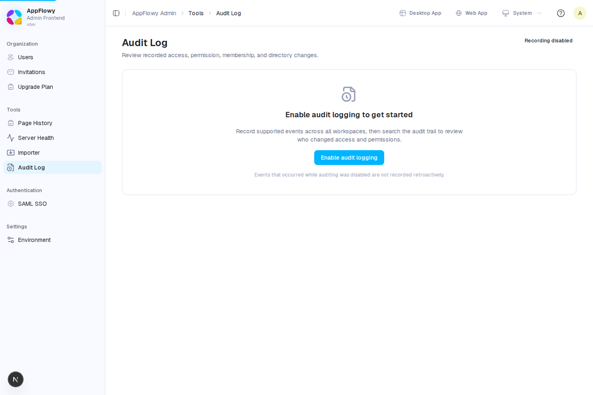
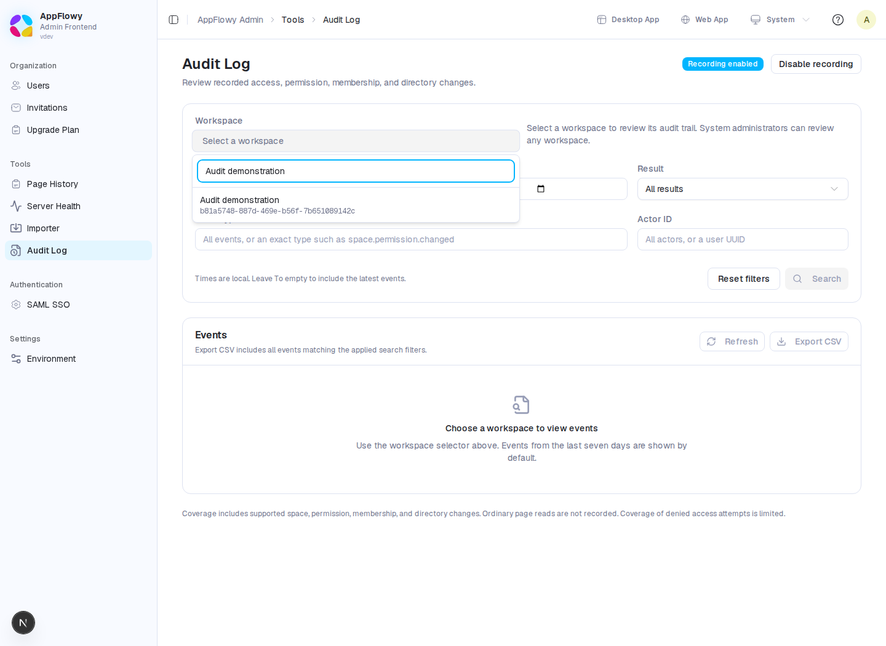
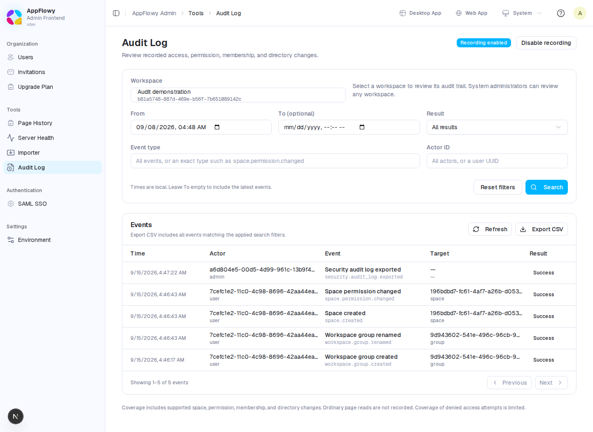
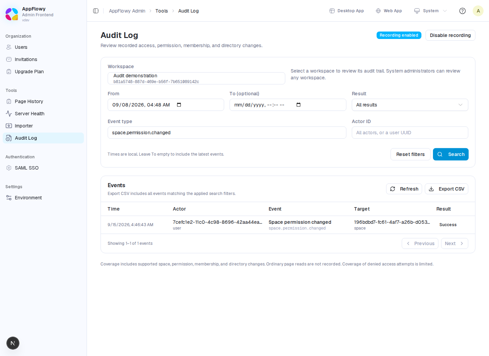
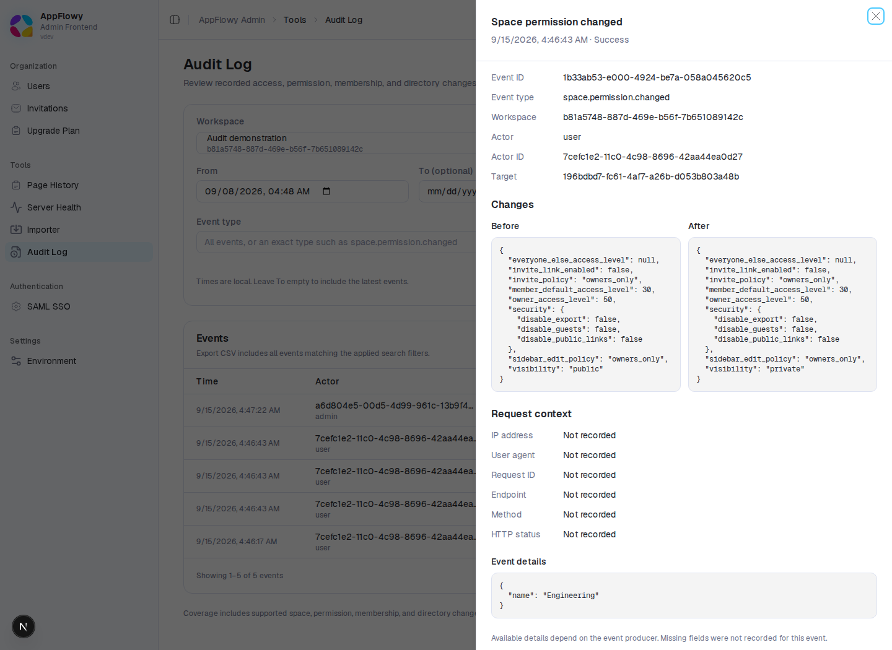
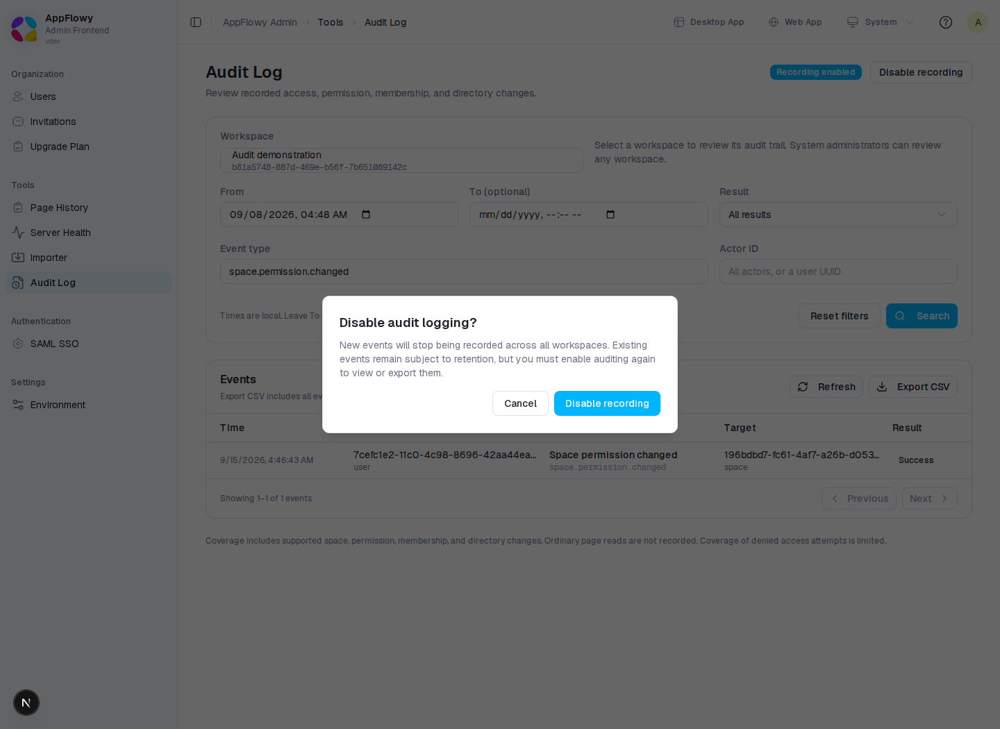

# Audit Logging

AppFlowy Self-Hosted can record supported space, permission, workspace membership, and directory changes. Use **Audit Log** in the Admin console to enable recording, search a workspace's events, inspect recorded changes, and export results.

Audit logging is disabled by default. Enabling it applies to the whole deployment; the workspace selector controls which events you view.

## Before you begin

- Run matching AppFlowy Cloud and Admin Frontend versions that include Audit Log administration. Upgrading only one component can leave the page unavailable or unable to load its status.
- Use a **self-hosted server build**. Managed builds cannot activate auditing through configuration or environment variables.
- Sign in to the Admin console at `https://your-domain/console` using the administrator account configured by `GOTRUE_ADMIN_EMAIL` and `GOTRUE_ADMIN_PASSWORD` in your deployment.

System administrators can review any workspace through this page without joining it. Being a workspace owner or space owner alone does not grant access to the Admin console.

The screenshots below were captured from a running development Admin console and self-hosted server. The **Audit demonstration** workspace contains real group and space changes made through the server APIs using a generated test account. Your workspace names, identifiers, timestamps, and available sidebar entries will differ.

## Step 1: Enable audit logging

1. Open **Tools → Audit Log**, immediately below **Importer** in the sidebar.
2. If recording is disabled, the page asks you to enable it before searching events.

   

3. Click **Enable audit logging**. The console saves the deployment-wide `audit_enabled` setting and checks the server's effective status.
4. When **Recording enabled** appears, the workspace selector and event browser become available.

Enabling recording does not require a restart. The server handling the setting change refreshes its in-memory flag immediately. Other Cloud replicas and the standalone MCP service can take up to about 60 seconds to pick up the change. The page periodically refreshes status; reload it if another administrator recently changed the setting.

**Events from periods when auditing was disabled are not reconstructed.** Enabling auditing again makes retained historical events available, alongside newly recorded events.

If the page says **Audit logging is unavailable in this build**, its enable button is disabled. An `audit_enabled=true` database setting or `APPFLOWY_AUDIT_ENABLE=true` environment variable cannot activate the feature on a non-self-hosted server.

## Step 2: Choose a workspace

1. Open the **Workspace** selector.
2. Search by workspace name or the owner's email address.
3. Select the workspace. Its identifier is shown beneath the name so that workspaces with the same name can be distinguished.



The first results cover the last seven days. Events appear newest first, with up to 50 events per page.



| Column | Meaning |
| --- | --- |
| **Time** | When the event occurred, displayed in your browser's local timezone. |
| **Actor** | The recorded email or name, when available; otherwise the actor's UUID or **System**. |
| **Event** | A readable label and the exact event type. Click the label to inspect details. |
| **Target** | The recorded resource name or identifier, with its resource type. |
| **Result** | **Success**, **Failure**, or **Partial**, as recorded by the event producer. |

Some permission-change producers record actor and target identifiers without names. A UUID in these columns is expected and does not mean the event is incomplete or the user was deleted.

## Step 3: Filter the events

Set the filters, then click **Search**.

| Filter | How to use it |
| --- | --- |
| **From** | Start date and time, inclusive. Defaults to seven days ago. Clear it to include all retained earlier events. |
| **To (optional)** | End date and time, inclusive. Leave it empty to include the latest events. |
| **Result** | Choose all results, success, failure, or partial. |
| **Event type** | Enter an exact event type, such as `space.permission.changed`. Suggested types are available, and other exact types can be entered. Wildcards and free-text searches are not supported. |
| **Actor ID** | Enter the actor's UUID, or leave it empty for all actors. Copy the full UUID from an event's details; this field does not search by email. |

Dates are entered in your local timezone and converted to UTC for the request. **From** cannot be later than **To**.



- **Reset filters** restores the last-seven-days search and clears the event, actor, and result filters.
- **Refresh** reloads the currently applied search and checks audit status.
- **Previous** and **Next** move through the same search results.
- **No events match this search** means the query succeeded but found no matching events. Try a wider date range or fewer filters, and confirm a supported action occurred while recording was enabled.

Editing a filter does not change the applied search until you click **Search**. Pagination and export continue to use the applied filters.

## Step 4: Inspect a change

Click an event label to open the detail panel.



The panel contains:

- Event, workspace, actor, and target identifiers.
- **Before** and **After** snapshots, when the producer recorded them. For example, a space visibility change shows the previous `public` policy and the new `private` policy.
- Request context, such as IP address, user agent, request ID, endpoint, method, and HTTP status, when available.
- Additional **Event details** and a failure reason when recorded.

Scroll within the panel to see the remaining fields. **Not recorded** means the event producer did not store that field. A JSON `null` inside a snapshot represents a recorded absence of a value; it is different from an omitted snapshot.

## Step 5: Export the results

1. Choose a workspace and apply the filters you need.
2. Click **Export CSV** beside **Refresh**.
3. Save the downloaded `audit-logs-<workspace-id>.csv` file.

Export includes **all events matching the applied filters**, across every results page. Narrow the date range for large workspaces: the server currently builds the matching export in memory.

The CSV contains event and actor metadata, target identifiers, results, available request metadata, and `event_details`. The separate **Before** and **After** snapshots are currently available in the detail panel and JSON API, but are not separate CSV columns. CSV timestamps are UTC.

A successful export also creates a `security.audit_log.exported` event asynchronously. That new event appears on a later refresh; it is not included in the file that just finished exporting.

## Disable recording

1. Click **Disable recording** beside the **Recording enabled** badge.
2. Review the confirmation and click **Disable recording** again, or choose **Cancel** to leave it enabled.



Disabling recording affects every workspace. New events stop being recorded, and the query and export UI is hidden until auditing is enabled again. Existing events are not deleted by this action, but normal retention continues to apply.

## Configuration and retention

### Enablement precedence

On a self-hosted build, the server resolves enablement in this order:

1. The `audit_enabled` database setting, written by the Admin console.
2. `APPFLOWY_AUDIT_ENABLE`, when no database override exists.
3. `false`.

The console shows the **effective server status**, rather than assuming the stored setting is active. Audit producers read an in-memory flag; they do not query the configuration table for every event.

An explicit database `false` overrides an environment `true`. Changing the environment variable will not override a value saved by the console. Use the console to change it, or remove the override through the system-config API if you intentionally want to return to the environment default.

### Environment configuration

The Admin console is the usual way to enable recording. If you prefer an environment default or need to change retention, pass these variables to the **AppFlowy Cloud container**:

| Variable | Default | Purpose |
| --- | --- | --- |
| `APPFLOWY_AUDIT_ENABLE` | `false` | Enablement fallback when `audit_enabled` has no database override. |
| `APPFLOWY_AUDIT_RETENTION_DAYS` | `30` | Retention cutoff used by the maintenance task. A value of zero or less disables pruning. |

For Docker Compose, add an override file such as `docker-compose.override.yml`:

```yaml
services:
  appflowy_cloud:
    environment:
      APPFLOWY_AUDIT_ENABLE: "true"
      APPFLOWY_AUDIT_RETENTION_DAYS: "90"
```

Apply it with:

```bash
docker compose up -d appflowy_cloud
```

This example applies when your deployment uses the bundled `docker-compose.yml` and Compose loads its default override file. If your startup command names Compose files explicitly, include the override with `-f` as well. Adding a variable only to `.env` does not pass it into a container unless the Compose configuration references it.

For Kubernetes or another deployment system, set the same variables on the Cloud container and roll out the updated workload. Environment and retention changes require a process restart; console enable/disable changes do not.

Retention maintenance runs daily and manages monthly PostgreSQL partitions. A partition is dropped only when it is entirely older than the cutoff; old rows in the default partition are swept separately. **Thirty days is not an exact per-event deletion deadline**: records in a retained monthly partition can remain longer. Maintenance continues while recording is disabled. Export records before they expire if you need a longer-lived archive.

If you deploy the standalone MCP service, its binary must also include self-host support. It follows the same database-backed enablement setting; configure an environment fallback on that service too if you rely on one. MCP activity uses a bounded, best-effort queue, so it does not have the same transaction guarantee as covered permission mutations.

## What is recorded

| Area | Examples |
| --- | --- |
| Spaces | Creation, visibility/security policy changes, direct membership changes, leaving a space, and group grants. |
| Workspace groups | Creation, renaming, deletion, and membership changes. |
| Permissions | Workspace role changes, supported page/guest grants and revocations, and group grants to page subtrees. |
| Access requests | Creation, approval, and rejection, with resulting grants where applicable. |
| Directory sync | Supported SCIM user/group lifecycle events, connection setting changes, and effective membership/role reconciliation. See [SCIM Provisioning](SCIM.md). |
| Audit export | A record of the CSV export request and its filters/count. |

Covered permission mutations and their audit records commit in the same database transaction when auditing is enabled. If the audit insert fails, the covered mutation rolls back. Some older producers and MCP tool activity remain best-effort.

Directory provisioning and effective access reconciliation can appear as separate events because they happen in separate operations. Changing a parent space's policy can affect inherited access without producing one event for every descendant page.

This is **not a complete log of every read or denied request**. Ordinary page/space reads, downloads, realtime access, and general permission denials do not have comprehensive audit coverage. Authentication events without a workspace association do not appear in this workspace browser. There is currently no separate filter for a space or target resource.

## Troubleshooting

| Symptom | Check |
| --- | --- |
| **Audit Log** is missing from the sidebar | Upgrade the Admin Frontend to a version containing this page and sign in as a system administrator. |
| **Audit logging is unavailable in this build** | Deploy a self-hosted Cloud build. Configuration cannot enable auditing on managed builds. |
| **Could not check audit availability** | Check the Cloud connection and server version. The page requires the admin audit status endpoint; a `404` commonly means the server is older than the console. |
| The setting changed, but status has not changed yet | Allow other server replicas time to refresh, then reload the page. Check that the console connects to the intended deployment. |
| Environment enablement has no effect | A database override takes priority. Also confirm the variable was passed to the running container. |
| No matching events | Check workspace, time range, event type, and actor UUID. Confirm auditing was enabled when a supported action occurred. Events may also have expired. |
| Actor/target names or request context are missing | The producer may only record identifiers or may not capture that request context. Inspect the stored snapshots and event details. |
| Query or export fails | Use **Retry**, check recording is still enabled, and check your administrator session. A server error is displayed separately from an empty result. |

## API reference

The Admin console uses these authenticated endpoints:

| Method | Endpoint | Purpose |
| --- | --- | --- |
| `GET` | `/api/admin/audit-logs/status` | Effective `supported` and `enabled` flags. |
| `POST` | `/api/admin/system-config` | Save `{"key":"audit_enabled","value":"true"}` or `"false"`. |
| `DELETE` | `/api/admin/system-config/audit_enabled` | Remove the override and restore the environment/default behavior. |
| `GET` | `/api/admin/audit-logs/{workspace_id}` | Paginated JSON events. |
| `POST` | `/api/admin/audit-logs/{workspace_id}/export` | CSV export using query-string filters. |

Listing and export accept `start_date` and `end_date` as RFC 3339 timestamps, an exact `event_type`, `actor_id` as a UUID, and `event_status` as `success`, `failure`, or `partial`. Listing also accepts `limit` (default 50, capped at 500) and a nonnegative `offset`.

These routes require a system administrator. The separate `/api/workspaces/{workspace_id}/audit-logs` and `/export` routes require an active workspace **Owner** membership and keep that requirement even if the optional workspace authorizer is disabled. Both API families reject listing and export while auditing is disabled.
