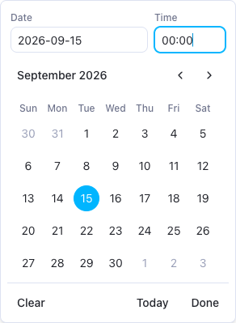
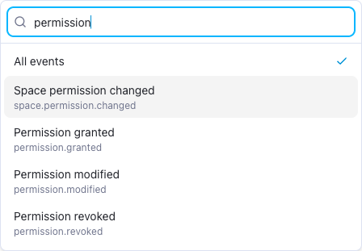

# Audit Logging

AppFlowy Self-Hosted can record the [supported actions listed below](#what-is-recorded), including authentication, workspace and space changes, permissions, directory sync, form sharing, administration, and MCP tool activity. Use **Audit Log** in the Admin console to enable recording, search events across the deployment or within a workspace, inspect recorded changes, and export results.

Audit logging is disabled by default. Enabling it applies to the whole deployment. Once enabled, the page shows the latest 50 recorded events across all workspaces. Every search filter is optional.

## Before you begin

- Run matching AppFlowy Cloud and Admin Frontend versions that include Audit Log administration. Upgrading only one component can leave the page unavailable or unable to load its status.
- Use a **self-hosted server build**. Managed builds cannot activate auditing through configuration or environment variables.
- Sign in to the Admin console at `https://your-domain/console` using the administrator account configured by `GOTRUE_ADMIN_EMAIL` and `GOTRUE_ADMIN_PASSWORD` in your deployment.

System administrators can review any workspace through this page without joining it. Being a workspace owner or space owner alone does not grant access to the Admin console.

The screenshots below show a running development Admin console connected to a self-hosted server. The example events were generated through AppFlowy Web in **My Workspace**: creating an **Audit demonstration** space, changing it from public to private, creating an **Audit reviewers** group with a member, and renaming it to **Audit review team**. Your workspace names, identifiers, timestamps, and available sidebar entries will differ.

## Step 1: Enable audit logging

1. Open **Tools → Audit Log**, immediately below **Importer** in the sidebar.
2. If recording is disabled, the page asks you to enable it before searching events.

   

3. Click **Enable audit logging**. The console saves the deployment-wide `audit_enabled` setting and checks the server's effective status.
4. The event browser opens with **All workspaces**, **Any time**, **All events**, **All actors**, and **All** results selected. The **Disable recording** button appears at the top right.

Enabling recording does not require a restart. The server handling the setting change refreshes its in-memory flag before returning the response. Other Cloud replicas refresh their audit flag on a 60-second timer, using a configuration cache with a 60-second lifetime. The standalone MCP service checks its cached setting when recording tool activity. Propagation depends on cache expiry and refresh timing, and can take longer if a refresh fails. The page checks effective status every 30 seconds; **Refresh** checks it immediately.

**Events from periods when auditing was disabled are not reconstructed.** Enabling auditing again makes retained historical events available, alongside newly recorded events.

If the page says **Audit logging is unavailable in this build**, its enable button is disabled. An `audit_enabled=true` database setting or `APPFLOWY_AUDIT_ENABLE=true` environment variable cannot activate the feature on a non-self-hosted server.

## Step 2: Browse recent events

No workspace or time range is required. With the default filters, the page shows the newest retained events across all workspaces, with up to 50 events per page. Use **Next** and **Previous** to browse older and newer pages of the same search.


| Column | Meaning |
| --- | --- |
| **Time** | Recent events use relative times, such as **5 minutes ago**; older events show a local date and time. Hover over the time or open the details to see the full local timestamp. |
| **Actor** | The recorded email or name, when available; otherwise the actor's UUID or **System**. |
| **Workspace** | The workspace UUID. This column appears when viewing **All workspaces**. |
| **Event** | A readable label and the exact event type. Click the label or its row to inspect details. |
| **Target** | The recorded resource name or identifier, with its resource type. |
| **Result** | **Success**, **Failure**, or **Partial**, as recorded by the event producer. |

Some permission-change producers record actor and target identifiers without names. A UUID in these columns is expected and does not mean the event is incomplete or the user was deleted.

To narrow the view to one workspace:

1. Open the **Workspace** selector.
2. Search by workspace name, workspace UUID, or the owner's email address.
3. Select the workspace. Its identifier is shown beneath the name so that workspaces with the same name can be distinguished.


Selecting a workspace immediately loads its first page using the other applied filters. Select **All workspaces** to remove only the workspace restriction.

## Step 3: Filter the events

All filters are optional and selections apply immediately. Each filter change returns to the first page. Use the toolbar to narrow the results, or leave its defaults to browse the latest 50 events without a workspace or time restriction.

| Filter | How to use it |
| --- | --- |
| **Workspace** | Defaults to **All workspaces**. Search by workspace name, UUID, or owner email, then select one to restrict the results. |
| **Date range** | Defaults to **Any time**. Choose **Last hour**, **Last 24 hours**, **Last 7 days**, **Last 30 days**, or **Custom range**. |
| **Event type** | Open the picker and search its suggestions by label or event type. Select an exact type, such as `space.permission.changed`, or enter another exact type and choose **Use "…"**. Select **All events** to remove the filter. Wildcards and free-text event-content searches are not supported. |
| **Actor** | Open **All actors**, enter at least two characters of an email address, and select a matching user. You can also paste a full actor UUID and choose **Use this user ID**. Select **All actors** to remove the filter. |
| **Result** | Click **All**, **Success**, **Failure**, or **Partial**. |

Choose **Custom range** to reveal **From** and **To**. Both boundaries are optional and inclusive: leave **From** empty to include all retained earlier events, or leave **To** empty to include the latest events.

Open either date field to choose a day from the calendar, or enter a date as `YYYY-MM-DD` and a time as `HH:mm`. **Today** selects the current date; **Clear** removes that boundary, and **Done** closes the picker. Valid date changes apply immediately. An incomplete date or a **From** value later than **To** displays an error and leaves the last valid range applied. Dates use your local timezone and are converted to UTC for the request.

Relative ranges are measured from the current time when results are requested. **Refresh** advances that window. Use **Custom range** when you need fixed start and end times.






- **Clear filters** restores **All workspaces**, **Any time**, **All events**, **All actors**, and **All** results, and returns to the first page. It appears when a filter is active.
- **Refresh** reloads the currently applied search and checks audit status.
- **Previous** and **Next** move through the same search results in pages of 50.
- **No events match these filters** means the query succeeded but found no matching events. Try a wider date range or fewer filters, or use **Clear filters** in the empty result area.
- **No events recorded yet** means there are no retained events in the unfiltered view. Perform a supported action while recording is enabled, then click **Refresh**.

Filters and the current page are saved in the page URL, so you can reload, bookmark, or share a filtered view with another system administrator. The link restores the selected filters; a relative range still refers to the current time. Incomplete custom-date edits are not saved in the URL.

If a periodic status check or **Refresh** cannot check audit availability, the page displays the error and a **Retry** button. After a successful initial status check, a transient status-refresh failure preserves the active filters, current page, and any custom-date draft edits.

## Step 4: Inspect a change

Click an event row or its event label to open the detail panel.


The panel contains:

- Event, workspace, actor, and target identifiers.
- **Before** and **After** snapshots, when the producer recorded them. For example, a space visibility change shows the previous `public` policy and the new `private` policy.
- Request context, such as IP address, user agent, request ID, endpoint, method, and HTTP status, when available.
- Additional **Event details** and a failure reason when recorded.

Scroll within the panel to see the remaining fields. **Not recorded** means the event producer did not store that field. A JSON `null` inside a snapshot represents a recorded absence of a value; it is different from an omitted snapshot.

## Step 5: Export the results

1. Leave **All workspaces** selected or choose a workspace, then apply any other filters you need.
2. Click **Export CSV** beside **Refresh**.
3. Save the downloaded file: `audit-logs.csv` for all workspaces, or `audit-logs-<workspace-id>.csv` for one workspace.

Export includes **all events matching the current filters**, across every results page. With no filters, this includes all retained events across the deployment. Relative date ranges are evaluated again when you export; use a custom range for a fixed interval. Narrow the workspace or date range for large exports: the server currently builds the matching export in memory.

The CSV contains event and actor metadata, target identifiers, results, available request metadata, and `event_details`. The separate **Before** and **After** snapshots are currently available in the detail panel and JSON API, but are not separate CSV columns. CSV timestamps are UTC.

A successful export also attempts to record a `security.audit_log.exported` event asynchronously. This audit write is best-effort: its failure does not fail the export. If recorded, the new event is available on a later refresh when it matches the active filters; it is not included in the file that just finished exporting.

## Disable recording

1. Click **Disable recording** at the top right of the Audit Log page.
2. Review the confirmation and click **Disable recording** again, or choose **Cancel** to leave it enabled.


Disabling recording affects every workspace. New events stop being accepted as each service observes the setting, and the query and export UI is hidden until auditing is enabled again. In-flight writes and MCP events already queued can still finish. Existing events are not deleted by this action, but normal retention continues to apply.

## Configuration and retention

### Enablement precedence

On a self-hosted build, the server resolves enablement in this order:

1. The `audit_enabled` database setting, written by the Admin console.
2. `APPFLOWY_AUDIT_ENABLE`, when no database override exists.
3. `false`.

The console shows the **effective server status**, rather than assuming the stored setting is active. Audit producers read an in-memory flag; they do not query the configuration table for every event.

An explicit database `false` overrides an environment `true`. Changing the environment variable will not override a value saved by the console. Use the console to change it, or remove the override through the system-config API if you intentionally want to return to the environment default.

### Environment configuration

The Admin console is the usual way to enable recording. If you prefer an environment default or need to change retention, pass these variables to the **AppFlowy Cloud container**:

| Variable | Default | Purpose |
| --- | --- | --- |
| `APPFLOWY_AUDIT_ENABLE` | `false` | Enablement fallback when `audit_enabled` has no database override. |
| `APPFLOWY_AUDIT_RETENTION_DAYS` | `30` | Retention cutoff used by the maintenance task. A value of zero or less disables pruning. |

For Docker Compose, add an override file such as `docker-compose.override.yml`:

```yaml
services:
  appflowy_cloud:
    environment:
      APPFLOWY_AUDIT_ENABLE: "true"
      APPFLOWY_AUDIT_RETENTION_DAYS: "90"
```

Apply it with:

```bash
docker compose up -d appflowy_cloud
```

This example applies when your deployment uses the bundled `docker-compose.yml` and Compose loads its default override file. If your startup command names Compose files explicitly, include the override with `-f` as well. Adding a variable only to `.env` does not pass it into a container unless the Compose configuration references it.

For Kubernetes or another deployment system, set the same variables on the Cloud container and roll out the updated workload. Environment and retention changes require a process restart; console enable/disable changes do not.

Retention maintenance runs at server startup and then daily, and manages monthly PostgreSQL partitions. A partition is dropped only when it is entirely older than the cutoff; old rows in the default partition are swept separately. **Thirty days is not an exact per-event deletion deadline**: records in a retained monthly partition can remain longer. Maintenance continues while recording is disabled. Export records before they expire if you need a longer-lived archive.

If you deploy the standalone MCP service, its binary must also include self-host support. It follows the same database-backed enablement setting; configure an environment fallback on that service too if you rely on one. MCP activity uses a bounded, best-effort queue, so it does not have the same transaction guarantee as covered permission mutations.

## What is recorded

The current implementation records these **62 event types** through the supported paths described here. Use the exact value in the **Event type** filter or API. The picker's suggestions contain common types only; use **Use "…"** to select a type that is not suggested.

| Area | Event types |
| --- | --- |
| Authentication | `user.signin`, `user.signin.failed`, `user.signout`, `user.password.changed` |
| Workspace lifecycle | `workspace.created`, `workspace.deleted`, `workspace.owner.transferred` |
| Workspace membership | `workspace.member.invited`, `workspace.member.joined`, `workspace.member.removed`, `workspace.member.role.changed` |
| Spaces | `space.created`, `space.permission.changed`, `space.member.added`, `space.member.changed`, `space.member.removed`, `space.member.left` |
| Workspace groups | `workspace.group.created`, `workspace.group.renamed`, `workspace.group.deleted`, `workspace.group.member.added`, `workspace.group.member.removed` |
| Group access to spaces | `space.group.granted`, `space.group.changed`, `space.group.revoked` |
| Direct page/guest permissions | `permission.granted`, `permission.modified`, `permission.revoked` |
| Group access to page subtrees | `permission.group.granted`, `permission.group.modified`, `permission.group.revoked` |
| External page sharing | `document.shared.external` |
| Access requests | `access_request.created`, `access_request.approved`, `access_request.rejected` |
| Admin guest-invite decisions | `guest_invite.approved`, `guest_invite.rejected` |
| Form sharing | `form.share.created`, `form.share.updated`, `form.share.revoked`, `form.share.reset`, `workspace.form_sharing.policy.changed` |
| Directory users | `directory.user.provisioned`, `directory.user.reactivated`, `directory.user.deprovisioned`, `directory.user.ldap_login` |
| Directory groups | `directory.group.created`, `directory.group.changed`, `directory.group.deleted`, `directory.group.membership.reconciled` |
| Directory configuration | `directory.connection.settings.changed` |
| Admin user management | `admin.user.role.updated`, `admin.user.password.reset`, `admin.user.spam.marked`, `admin.user.spam.unmarked` |
| Spam-signal management | `admin.spam_signal.deleted`, `admin.spam_signal.purged` |
| Publishing protection | `publish.blocked_spam_signal` |
| Security and audit access | `security.suspicious_activity.detected`, `security.audit_log.access_denied`, `security.audit_log.exported` |
| MCP tool activity | `mcp.tool.call` |

### How to interpret the events

- **Workspace creation:** `workspace.created` is recorded during new-user setup when the initial workspace is provisioned. Creating an additional workspace does not currently emit this event.
- **Authentication:** `user.signin` and `user.signin.failed` describe outcomes of the Cloud token-verification endpoint. A verification failure also emits `security.suspicious_activity.detected`. These events do not cover every login attempt rejected by GoTrue or an external identity provider before reaching Cloud. `user.signout` records a sign-out request, including when the upstream logout call fails.
- **Permissions and sharing:** direct grants and revocations describe actual access changes. Pending, skipped, or unchanged recipients do not produce grant-change events. `document.shared.external` accompanies grants or changes through the direct-share flow. The group permission events apply to page subtrees.
- **Directory sync:** SCIM user/group lifecycle and effective membership/role reconciliation can appear as separate events because they happen in separate operations. `directory.connection.settings.changed` covers default-role, group-role mapping, and enablement changes. See [SCIM Provisioning](SCIM.md).
- **MCP:** `mcp.tool.call` records the tool name, calling user, workspace, client, and success/failure metadata. It is a tool-call record; it does not create a dedicated page/view lifecycle event or store the full tool input/output.
- **Results:** the status is assigned by the event producer. For example, `publish.blocked_spam_signal` records a blocked publish attempt but currently uses the default **Success** status. Search by event type when looking for this action. **Partial** is accepted by the query API and UI, but none of the current producers explicitly emits it.

### Transaction and coverage limits

Covered permission mutations and their audit records commit in the same database transaction when auditing is enabled. If the audit insert fails, the covered mutation rolls back. This applies to the supported space/group changes, workspace role updates, direct page/guest permission changes, access requests, form-sharing changes, and covered directory changes. Permission events with equal before/after snapshots are suppressed.

This transaction guarantee does not apply to every event in the catalog. Older authentication, workspace, and admin events can be written independently after the underlying action. Admin guest-invite status changes and grant finalization are separate operations; permission events commit with grant finalization. Audit exports, LDAP login auditing, and MCP tool activity use best-effort delivery. Changing a parent space's policy can affect inherited access without producing one event for every descendant page.

**Ordinary page/view creation, moving to trash, restoration, permanent deletion, and content editing do not currently emit Cloud audit events.** Space creation and permission events do not imply coverage of those page actions. Successful publishing/unpublishing and changes to the audit enablement setting also have no dedicated audit event. MCP can record its supported tool calls separately.

Ordinary page/space reads, downloads, realtime access, and general permission denials do not have comprehensive audit coverage. `security.audit_log.access_denied` specifically records denied workspace audit-log access; it is not a general permission-denial event.

Recorded events without a workspace association, such as authentication events and all-workspace exports, are included in **All workspaces** and use the all-zero workspace UUID. They are excluded when a specific workspace is selected. There is currently no separate filter for a space or target resource.

## Troubleshooting

| Symptom | Check |
| --- | --- |
| **Audit Log** is missing from the sidebar | Upgrade the Admin Frontend to a version containing this page and sign in as a system administrator. |
| **Audit logging is unavailable in this build** | Deploy a self-hosted Cloud build. Configuration cannot enable auditing on managed builds. |
| **Could not check audit availability** | Check the Cloud connection and server version, then click **Retry**. A transient refresh failure keeps the active filters, page, and custom-date draft edits. The page requires the admin audit status endpoint; a `404` commonly means the server is older than the console. |
| The setting changed, but status has not changed yet | Allow other server replicas time to refresh, then reload the page. Check that the console connects to the intended deployment. |
| Environment enablement has no effect | A database override takes priority. Also confirm the variable was passed to the running container. |
| No matching events | Check workspace, time range, event type, and actor UUID. Confirm auditing was enabled when a supported action occurred. Events may also have expired. |
| Creating or deleting a page produces no event | Ordinary page/view lifecycle actions are not audited. Check the [event catalog and coverage limits](#what-is-recorded); `space.created` and `workspace.created` describe different actions. |
| An event type is missing from the picker | The suggestions are not the full catalog. Enter the exact event type and choose **Use "…"**. |
| Actor search finds no user or fails | Paste the actor UUID from an event's details and choose **Use this user ID**, or select **All actors**. The email picker searches current users; the audit filter uses the recorded actor UUID. |
| Actor/target names or request context are missing | The producer may only record identifiers or may not capture that request context. Inspect the stored snapshots and event details. |
| Query or export fails | Use **Retry**, check recording is still enabled, and check your administrator session. A server error is displayed separately from an empty result. |

## API reference

The Admin console uses these authenticated endpoints:

| Method | Endpoint | Purpose |
| --- | --- | --- |
| `GET` | `/api/admin/audit-logs/status` | Effective `supported` and `enabled` flags. |
| `POST` | `/api/admin/system-config` | Save `{"key":"audit_enabled","value":"true"}` or `"false"`. |
| `DELETE` | `/api/admin/system-config/audit_enabled` | Remove the override and restore the environment/default behavior. |
| `GET` | `/api/admin/audit-logs` | Paginated JSON events across all workspaces, or one workspace with the optional `workspace_id` query parameter. |
| `POST` | `/api/admin/audit-logs/export` | CSV export using the same optional query-string filters. |

Listing and export accept optional `workspace_id` and `actor_id` UUIDs, `start_date` and `end_date` as RFC 3339 timestamps, an exact `event_type`, and `event_status` as `success`, `failure`, or `partial`. Omitted filters impose no restriction. Listing also accepts `limit` (default 50, clamped to 1–500) and a nonnegative `offset`; the Admin console uses 50. Events are ordered by timestamp descending, then event ID descending to break ties. The JSON response's `data` object contains `logs`, `total_count`, and `has_more`.

For example, `GET /api/admin/audit-logs?limit=50&offset=0` returns the latest 50 events across all workspaces. Use `offset=50` for the next page, or add `workspace_id=<uuid>` to restrict the query. Export uses the same filters and includes all matching rows without pagination.

The earlier `GET /api/admin/audit-logs/{workspace_id}` and `POST /api/admin/audit-logs/{workspace_id}/export` routes remain available. On these routes, the path determines the workspace; a query-string `workspace_id` cannot change it.

These routes require a system administrator. The separate `/api/workspaces/{workspace_id}/audit-logs` and `/export` routes require an active workspace **Owner** membership and keep that requirement even if the optional workspace authorizer is disabled. Both API families reject listing and export while auditing is disabled.
