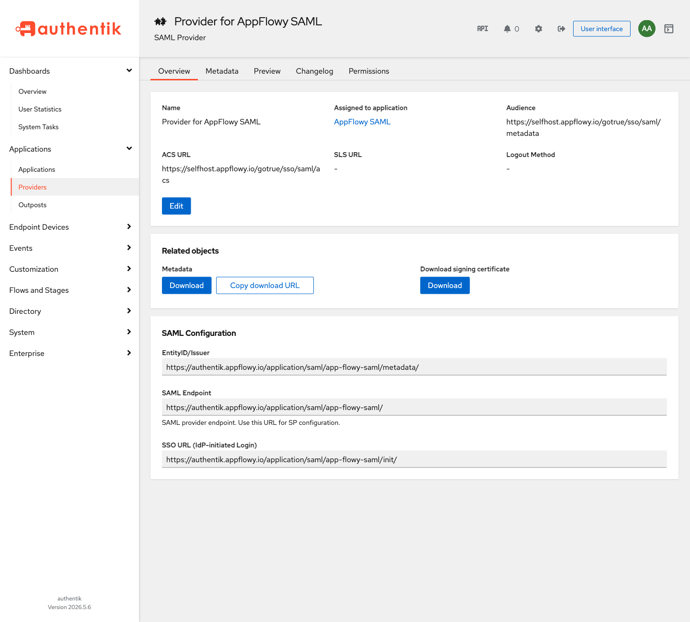

# Authentication

Follow the [authentication guide](https://appflowy.com/docs/Authentication) to set up authentication.

For this repository's environment variables and Docker Compose steps, see [OAuth providers](docker-compose.md#oauth-providers).

## Enterprise identity

These features are configured through the Admin console under **Authentication** and require a Seed plan or higher:

- [SAML SSO](OKTA_SAML.md) — sign in through a SAML 2.0 identity provider such as Okta.
- [OIDC / OAuth](OIDC.md) — sign in through any OpenID Connect or OAuth 2.0 identity provider registered at runtime.
- [LDAP](LDAP.md) — sign in with credentials from an LDAP directory such as Active Directory or OpenLDAP, with optional automatic provisioning.
- [SCIM Provisioning](SCIM.md) — provision and deprovision users and groups from the identity provider. SCIM does not sign users in; pair it with SAML, OIDC, or LDAP.

The SCIM, OIDC, and LDAP guides each include a **Verify the setup** section followed by troubleshooting. Run the verification after configuring the method and again after upgrades.

### Example identity provider: Authentik

The guides use [Authentik](https://goauthentik.io/) as the worked example because it offers OIDC, SAML, and SCIM from one self-hosted product. For SAML, create a **SAML Provider** whose **ACS URL** is `https://your-domain/gotrue/sso/saml/acs` and whose **Audience** is `https://your-domain/gotrue/sso/saml/metadata`, assign it to an application, and register the provider's metadata URL in the console under **Authentication → SAML SSO**.

The screenshot was taken against a development deployment; yours shows your own hostnames.

## Notes that apply to every method

- **Sign-in methods are additive.** **Continue with email** is always offered on the sign-in page alongside the configured providers, and provisioned accounts can use it. Restricting a deployment to a single sign-in method is not supported; AppFlowy does not expose the authentication service's switch for disabling email sign-in.
- **One account per email.** OIDC and LDAP sign-ins resolve the existing account with the same email, including accounts created by SCIM. For OIDC this holds when the identity provider reports the email as verified or `GOTRUE_MAILER_AUTOCONFIRM=true` (the template default); otherwise the authentication service creates a separate, unconfirmed account and rejects the sign-in. SAML keeps a separate account per SAML provider. After the first sign-in through each method, confirm that **Users** in the Admin console lists one account per email.
- **Sessions outlive deactivation.** Disabling a provider or disabling a directory account blocks new sign-ins only; existing sessions keep refreshing (the template configures no session timebox or inactivity timeout, so they do not expire on their own). Deactivating a user through SCIM removes the workspace membership immediately and, when the user has no other workspace, bans the account in the authentication service, which stops token refresh; the current access token stays valid until it expires (`GOTRUE_JWT_EXP`, 7 days in the template). To end a user's sessions immediately, delete the user in **Users**.
- **License expiry disables all three at once.** When the self-hosted license expires, the SCIM, OIDC, and LDAP pages disappear from the console, SCIM requests to `/Users` and `/Groups` are refused with `403` (`SCIM provisioning requires a paid self-hosted plan`; the anonymous discovery endpoints keep answering), and AppFlowy stops advertising the providers as soon as the license check reports the downgrade, so they vanish from the sign-in page the next time it loads. The authentication service's own `/gotrue/authorize` and SAML endpoints are not license-aware, so a bookmarked provider URL keeps working until the provider is disabled or deleted. Put the license expiry on the same calendar as the SCIM token (valid for 90 days; the console warns during the last 14) and the IdP client secret expiries.
- **Secret rotation.** Rotating `GOTRUE_JWT_SECRET` invalidates every issued access token (clients that still hold a refresh token obtain a new access token without signing in again) and, unless `APPFLOWY_LDAP_SECRET_KEY` is set, makes every stored LDAP bind password unreadable. OIDC client secrets are stored by the authentication service, in plaintext unless its `GOTRUE_SECURITY_DB_ENCRYPTION_*` settings are configured, and are unaffected by the rotation. SCIM tokens are stored as hashes and are unaffected. After any rotation, or a database restore onto new secrets, run **Test connection** on every LDAP connection and repeat the OIDC and SCIM verification steps.
- **Multiple replicas.** The LDAP rate limiter and AppFlowy's sign-in provider list cache (30-second TTL) are per `appflowy_cloud` process, and the authentication service caches each OIDC issuer's discovery document per process for an hour. SCIM state is stored in the database and is safe across replicas.
