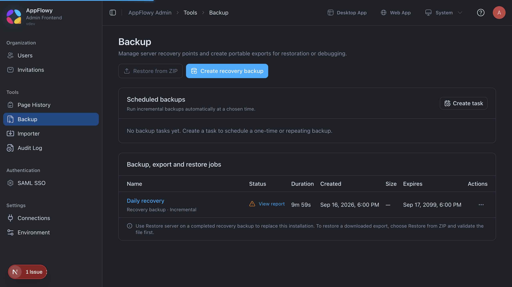
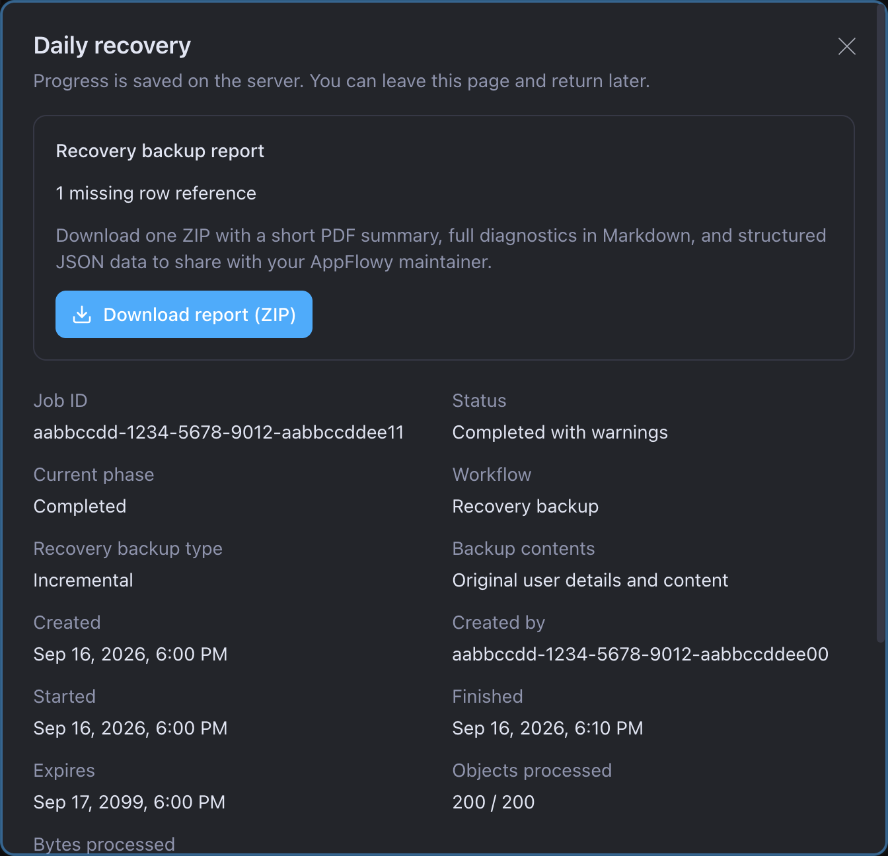
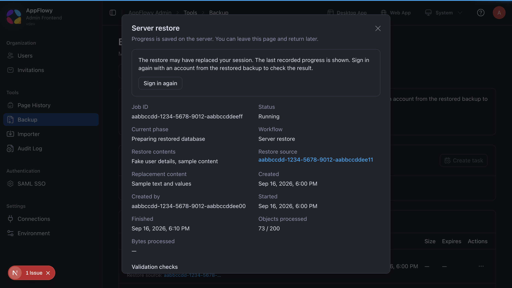

# Server Backup

[Documentation](README.md)

`appflowy-backup` is an optional service that creates recovery backups of your AppFlowy server. Administrators use **Tools → Backup** to create backups, schedule them, download portable exports, and restore the server.

Users can continue editing while a backup is created. A restore briefly pauses the application during the final switch.

## Enable Backup

Use Docker Compose **2.30 or newer** and matching releases of Cloud, Worker, Search, GoTrue, Admin,
and Backup. These instructions use the supplied Compose deployment. Platform-specific setup and
restrictions are documented separately in the [Swarm guide](docker-swarm.md) and
[Helm guide](../helm/appflowy-cloud/README.md#backup-and-restore).

1. In your deployment's root `.env`, set:

   ```dotenv
   APPFLOWY_BACKUP_PROFILE=backup
   ```

2. Start the deployment as usual:

   ```bash
   docker compose up -d
   ```

3. Sign in to the Admin console and open **Tools → Backup**. The controls become available when Backup is ready.

   

The supplied Compose configuration handles startup. Backup reuses your PostgreSQL, Redis, and object-storage connection settings, creates a private backup bucket, and prepares the files needed for restore. You do not need a separate configuration file or pgBackRest setup.

For an existing `.env`, retain your credentials and project name and copy the template's
`COMPOSE_FILE`, `COMPOSE_PROFILES`, and `COMPOSE_PATH_SEPARATOR` settings before enabling Backup.
Follow the [upgrade procedure](docker-compose.md#upgrade-with-existing-backups) when adopting the
new storage migration and service builds. Creating a Backup image alone does not upgrade Cloud's
Admin API, migrations, or the Search restore protocol.

By default, a deployment using the `appflowy` object bucket stores backups in `appflowy-backups`. When using external S3, the configured credentials must be allowed to create that private bucket, or you can create it beforehand. See [storage and deployment details](docker-compose.md#backup) for optional settings.

## Create a recovery backup

1. Select **Create recovery backup**.
2. Enter a name that helps you recognize it later.
3. Choose whether to include the **search index** and **collaboration embeddings**. Both are excluded by default to save space; they are derived search data, not your page or database content. An unconfigured local search index is skipped.
4. Create the backup. New backups are full recovery points, so they do not depend on an earlier backup.
5. Wait for **Completed** or open **View report** if the job finishes with warnings.

You can close the dialog or leave the page while the job runs. Progress is saved on the server. Use **Create task** under **Scheduled backups** to run backups automatically and choose how long to retain them.

## Download an export or report

These are two different downloads:

| Download | What it contains |
| --- | --- |
| **Export ZIP** | A portable copy of a recovery backup. Use the backup row's **More → Create export**, select the privacy options, then download the completed export. |
| **Report ZIP** | A readable PDF summary, detailed Markdown diagnostics, and structured JSON for investigating a job. Open **View report** to download it after a completed or failed job. |

For an export, you can keep the original content, replace user details, or replace both user details and content. Review the chosen option before sharing the export. When user details are replaced, the separate email-mapping CSV links original emails to replacement emails; keep that CSV private.



Recovery backups stay in the server's private backup storage. Their manifest is not a downloadable copy of the server; create an export when you need a portable ZIP.

## Restore the server

A restore replaces the server's workspaces, pages, databases, files, and accounts with the selected recovery point. Changes made after that backup will no longer appear on the restored server.

1. Close connected AppFlowy clients before restoring, so old offline edits do not sync back afterward.
2. On a completed recovery backup, open **More → Restore server**. To restore a downloaded export on a target installation, start with **Restore from ZIP**.
3. Read the confirmation, type `RESTORE`, and confirm that current data will be replaced.
4. Wait for the job to finish. The server may disconnect during the final switch. Sign in again using an account from the restored backup.
5. Verify your workspaces, page hierarchy, databases, files, and permissions before reconnecting other clients.

Search results return as the restored workspaces are reindexed. This applies whether the backup
included Search data or omitted it; the active index starts fresh. Restore selects a fresh Redis
database rather than replaying previous locks and background jobs. Configuration, deployment
secrets, and external encryption keys remain part of your separate recovery procedure.

Created export rows do not offer **Restore server**. Use the explicit ZIP import flow on the target installation when restoring a portable export.



Keep the automatically generated `backup-ops/runtime/` directory and the deployment's data volumes. They preserve the restored selection when you later run `docker compose up -d`.

Keep the same Compose project name and override files on subsequent starts. If restore is
interrupted, retain the Backup work volume and generated runtime directory and restart the same
coordinator configuration. Its durable journal determines whether to finish the committed switch
or recover the previous selection. Do not manually select one restored bucket or Redis database
while other services still use the previous selection.

The [deployment acceptance checks](deployment-ci.md#backup-acceptance) exercise the Compose API
and restore workflow on a disposable installation. A new image is qualified only when its recorded
runtime checks pass; rendering configuration or passing unit tests alone does not qualify restore.

## Common problems

| Symptom | What to do |
| --- | --- |
| Backup controls are unavailable | Check that `APPFLOWY_BACKUP_PROFILE=backup` is set and `appflowy_backup` is running. Read the readiness message and container logs. |
| Backup cannot create its bucket | Allow the existing storage credentials to create a private backup bucket, or create that bucket beforehand. |
| A job finishes with warnings or fails | Open **View report**. The report explains the affected items; include its ZIP when requesting support. |
| There is no export download | Wait for the export to complete. A recovery backup itself does not have a portable download. |
| Restore cannot start | Use a completed, unexpired source and check that the host has enough free space. |

To inspect the service:

```bash
docker compose ps appflowy_backup
docker compose logs --tail=100 appflowy_backup
```

To pause Backup, run `docker compose stop appflowy_backup`. Existing application data stays available. Keep `APPFLOWY_BACKUP_PROFILE=backup` and the generated files so downloads and restored settings remain configured. See the [Compose guide](docker-compose.md#backup) for operator details.
