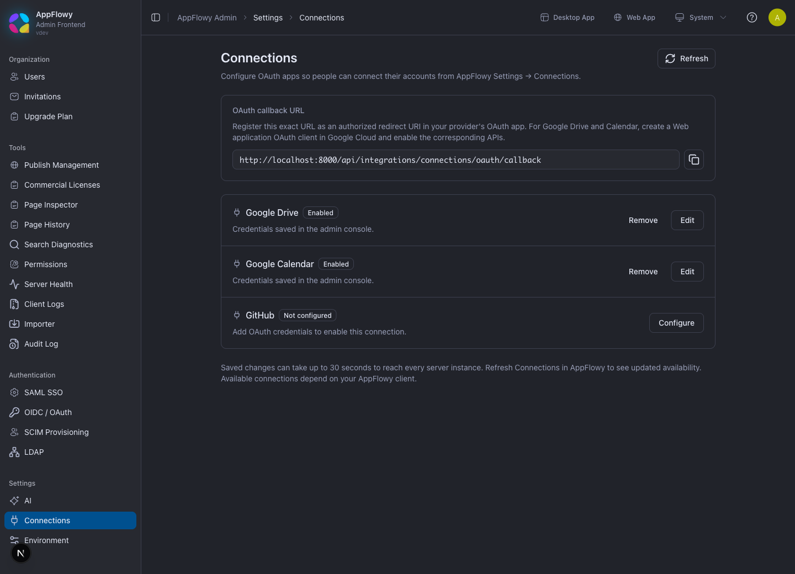
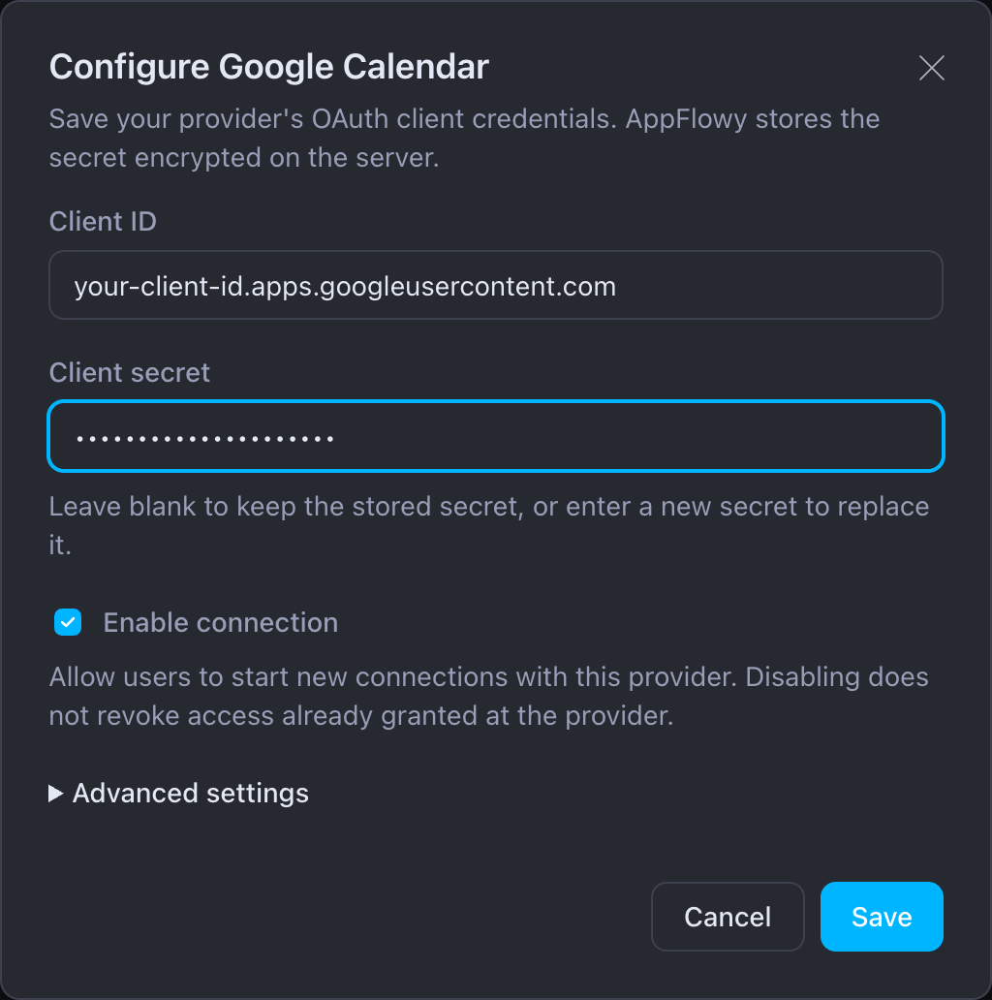
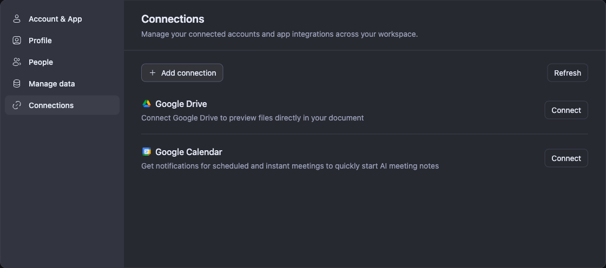
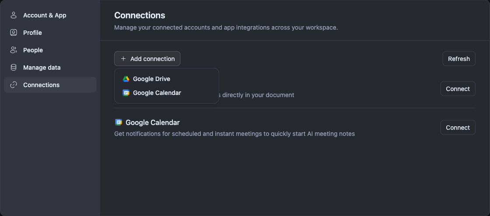
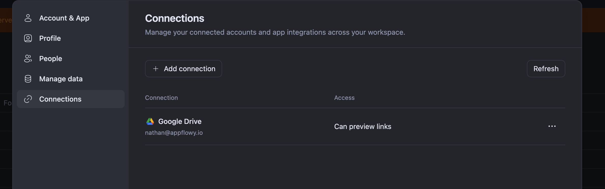

# Connections: Google Drive and Google Calendar

Use **Admin → Settings → Connections** to enable Google Drive and Google Calendar on your self-hosted instance. Users then authorize their own Google accounts from **AppFlowy → Settings → Connections**. A connection belongs to the AppFlowy user and workspace where it was created.

This guide covers provider setup, connecting from AppFlowy Web, and the desktop callback. Google sign-in to AppFlowy is configured separately; see [Authentication](AUTHENTICATION.md) and [OIDC / OAuth Sign-In](OIDC.md).

The screenshots show a local development instance. Replace its `localhost` address with your deployment's public address. The provider form uses example credentials; the connected-account screenshot shows a completed Google Drive connection.

## Before you begin

- Use compatible AppFlowy Cloud, Admin Frontend, and Web releases that include the **Connections** settings page. Update the desktop app when testing desktop connections.
- Have an AppFlowy administrator account and permission to manage OAuth clients in your Google Cloud project.
- Set the server's `APPFLOWY_BASE_URL` to its browser-accessible public URL, such as `https://appflowy.example.com`. Production deployments should use HTTPS. For local testing, the browser must run on the same machine as the server if the callback uses `localhost`.

There are two separate actions: an administrator enables a provider for the instance, then each user connects an account. Saving OAuth credentials in Admin does not connect anyone's Google account.

## 1. Copy the callback URL from Admin

1. Sign in to the Admin console.
2. Open **Settings → Connections**. The local development URL is `http://localhost:3003/console/integrations`.
3. Copy the **OAuth callback URL** using the copy button.



The screenshot shows both providers after configuration. A new instance shows **Not configured** until credentials are saved.

| Environment | Example integration callback |
| --- | --- |
| Self-hosted deployment | `https://appflowy.example.com/api/integrations/connections/oauth/callback` |
| Local development | `http://localhost:8000/api/integrations/connections/oauth/callback` |

Use the address for the server that your AppFlowy client connects to. If Admin displays the wrong host, correct `APPFLOWY_BASE_URL` in the deployment and restart/recreate the affected service before copying the URL again.

The `/api/integrations/connections/oauth/callback` path handles Drive and Calendar connections. The `/gotrue/callback` path handles signing in to AppFlowy. An OAuth client used for both purposes needs both relevant URLs registered.

## 2. Configure the Google OAuth client

1. In the [Google Cloud API Library](https://console.cloud.google.com/apis/library), select your project and enable **Google Drive API**, **Google Calendar API**, or both, according to the connections you need.
2. Configure **Google Auth Platform → Branding**, **Audience**, and **Data Access**. Choose the intended audience and access scopes. For an external app in **Testing**, add the Google accounts that will test it under **Test users**. See [Google's consent-screen setup](https://developers.google.com/workspace/guides/configure-oauth-consent).
3. Open [Google Auth Platform → Clients](https://console.cloud.google.com/auth/clients). Create or select a **Web application** OAuth client. AppFlowy's server handles OAuth for both web and desktop clients.
4. Under **Authorized redirect URIs**, choose **Add URI** and paste the callback copied from Admin. Register each environment separately. For the local instance shown above, add:

   ```text
   http://localhost:8000/api/integrations/connections/oauth/callback
   ```

5. Click **Save**, then copy the **Client ID** and **Client secret** for use in Admin.

The request must match a registered redirect URI exactly, including scheme, host, port, path, and trailing slash. Put the complete callback in **Authorized redirect URIs**. Google's [web-server OAuth guide](https://developers.google.com/identity/protocols/oauth2/web-server#redirect-uri-mismatch) explains this check.

The same Google OAuth client can be used for Drive and Calendar. AppFlowy still requires a separate provider entry for each one.

## 3. Enable each provider in Admin

1. Return to **Admin → Settings → Connections**.
2. Click **Configure** beside **Google Drive** or **Google Calendar**. For an existing entry, click **Edit**.
3. Fill in the provider form.



| Field | What to enter |
| --- | --- |
| **Client ID** | The ID of the Google OAuth client where you registered the callback. |
| **Client secret** | That client's secret. Required for a new provider. When editing, leave it blank to keep the saved secret. |
| **Enable connection** | Check this to allow users to start connections with this provider. |
| **Advanced settings → Display name** | Keep the default provider name unless you need a different admin label. |
| **Advanced settings → Scopes** | Leave blank to use AppFlowy's defaults. Override only when you have checked the permissions needed by your client. |

The default provider scopes are:

| Provider | Default scopes |
| --- | --- |
| Google Drive | `https://www.googleapis.com/auth/drive.readonly` and `https://www.googleapis.com/auth/drive.metadata.readonly` |
| Google Calendar | `https://www.googleapis.com/auth/calendar.readonly` |

AppFlowy also adds `openid`, `email`, and `profile` for Google account identification. If you change scopes after an account is connected, authorize that account again to grant the new permissions.

4. Click **Save** and check that the provider shows **Enabled**.
5. Repeat for the other provider if needed. Enabling Google Drive does not enable Google Calendar.

The server stores provider secrets encrypted. **Enabled** means the server has usable local configuration; it does not verify Google's redirect registration or complete user consent. Saved provider changes normally require no restart and can take up to **30 seconds** to reach every server instance.

## 4. Connect an account from AppFlowy Web

1. Sign in to your AppFlowy Web deployment and open the workspace where you want the connection.
2. Open the workspace menu at the top of the sidebar, choose **Settings**, and select **Connections**.
3. Click **Refresh** if the administrator has just enabled a provider.
4. Click **Connect** beside **Google Drive** or **Google Calendar**.



You can also choose **Add connection → Google Drive** or **Google Calendar**. Use this menu when you already have connected accounts.



5. Allow the Google sign-in popup, choose the Google account you want to connect, and review and approve the requested permissions. Keep the AppFlowy tab open while completing authorization.
6. Google returns to the server callback. The callback sends the result to the AppFlowy Web tab, which finishes the connection and closes the popup.
7. Confirm that the provider and Google account appear in the connection list. Use **Refresh** to reload the list if needed.



Google Drive shows **Can preview links**. A connected Google Calendar account shows **Can sync events**; the calendar features available to you depend on your AppFlowy client version.

## 5. Connect from desktop

Use the same provider configuration and registered server callback for desktop:

1. Connect the desktop app to the same self-hosted server and open the intended workspace.
2. Open **Settings → Connections**, refresh the list, and start the connection for the desired provider.
3. Complete authorization in the browser.
4. Allow **Open AppFlowy** when prompted. The server callback hands the result back through `appflowy-flutter://connection-oauth-callback`.
5. Check that the account appears in desktop Connections.

Google redirects to the HTTP(S) server callback first. The server's callback page then returns the result to the web popup's opener or opens the desktop app. Register the server callback from step 1 in Google Cloud; the desktop deep link is the later handoff.

Connections already created on web can be loaded on desktop by the same AppFlowy user in the same workspace. Refresh the connection list to check them.

## Manage connections

- **Refresh** reloads provider availability and your workspace's connected accounts.
- **Add connection** starts authorization for another provider or account.
- The **…** menu beside an account offers **Connect another account** and **Disconnect account**.
- Disconnecting removes that AppFlowy connection. To revoke the Google app's overall access, manage the grant in your Google account as well.
- In Admin, clearing **Enable connection** prevents new authorizations for that provider. It does not revoke permissions already granted in Google.

## Troubleshooting

| Symptom | What to check |
| --- | --- |
| `provider google-calendar is not configured`, or Calendar is unavailable | Configure and enable **Google Calendar** in Admin. It has a separate entry from Drive. Wait up to 30 seconds and refresh Connections. |
| Google reports `Error 400: redirect_uri_mismatch` | Click **error details** on Google's error page and inspect `redirect_uri`. Compare it with Admin's callback and the **Authorized redirect URIs** on the OAuth client matching the saved **Client ID**. Check localhost versus the public hostname, port, path, and trailing slash. |
| The callback is correct but Google still rejects it just after saving | Allow time for Google's configuration change to apply, close the failed popup, and start a new **Connect** attempt. If it persists, compare the actual rejected `redirect_uri` and `client_id` instead of assuming that the intended client was edited. |
| Drive connects but Calendar fails | Check Calendar's own Admin entry and the error details from that Calendar attempt. If the error is a redirect mismatch, compare its client ID and callback. For Calendar API permission errors after authorization, check that Google Calendar API is enabled and the account granted Calendar access. |
| Google rejects the account or says access is blocked | Check the Google app's audience, test-user list, verification requirements, and any Google Workspace administrator restrictions. Use the specific error shown by Google. |
| Clicking **Connect** does not open Google | Allow popups for your AppFlowy Web site, then start the connection again. |
| Web authorization times out or the popup cannot return to AppFlowy | Keep the original AppFlowy tab open and retry with a fresh **Connect** attempt. Check that the browser can reach the callback URL and that Cloud and Web are compatible versions. |
| Desktop does not reopen after consent | Use **Open AppFlowy** on the callback page, accept the browser prompt, and check that the installed desktop app handles the AppFlowy link. |
| Admin is enabled but this user sees no connected account | Each user must complete Google authorization in the intended workspace. Refresh Connections after returning from Google. |

### Check provider availability

For an operator check, request the server's advertised connection providers:

```bash
curl -fsS -H 'x-platform: app' \
  https://appflowy.example.com/api/server-info
```

Inspect `data.connections`. With both providers configured, it includes `google-drive` and `google-calendar`. This confirms provider availability; the connected account row in AppFlowy confirms that the user's authorization completed.
