# Automatic Microsoft Entra ID sync with SCIM

[Documentation](README.md) / [Authentication](AUTHENTICATION.md) / [SCIM setup](SCIM.md) / [Operations](SCIM_OPERATIONS.md)

This guide covers cloud-managed Entra users and groups. SCIM manages workspace
membership, directory groups, and their downstream permissions. Sign-in through
OIDC or SAML is configured separately. For an on-premises Windows AD source, start
with [the AD connector guide](AD_SCIM_AUTO_SYNC.md) and validate that import stage.

## In this guide

- [License and network requirements](#step-1-check-the-license-and-network-requirements)
- [Create the Entra application](#step-2-create-a-dedicated-enterprise-application)
- [Connect AppFlowy](#step-3-connect-the-appflowy-scim-endpoint)
- [Mappings and assignment scope](#step-4-limit-mappings-and-assignment-scope)
- [First automatic delivery](#step-5-start-provisioning-and-verify-automatic-changes)
- [Change groups and members](#step-6-change-the-source-and-compare-the-next-cycle)
- [Role and permission mapping](#step-7-understand-the-role-and-permission-mapping)
- [Move a user between groups](#step-8-move-a-user-without-deleting-their-account-or-work)
- [Seats, offboarding, and reactivation](#step-9-test-seat-capacity-offboarding-and-recovery)
- [Rotate the token](#step-10-recover-after-rotating-the-scim-token)
- [Repeatable tests](#repeatable-checks-after-the-microsoft-trial)
- [Finish a temporary test](#after-a-temporary-test)

## What to verify

Follow the setup and first automatic delivery before testing permission changes.
Use disposable users and groups; keep the workspace owner outside provisioning.

| Check | Source change | Required AppFlowy result |
| --- | --- | --- |
| Group lifecycle | Create, rename, or delete an assigned group | Correct groups and stable identity across rename |
| Group move | Move a user from one group to another | Old group-only space access removed; new group's access granted |
| Overlapping groups | Add a second granting group, then remove one | Access supported by a remaining grant is retained |
| Workspace roles | Add/remove groups with role mappings | Strongest remaining mapping or connection default applies |
| Offboarding | Remove all application assignments | Workspace access removed; reactivation reuses the identity |
| Seat recovery | Provision beyond AppFlowy's licensed capacity | Waiting user gets no access and activates after capacity becomes available |
| Credential recovery | Rotate and update the SCIM bearer token | Old credential fails; delivery resumes with the new one |
| Scheduled attributes | Change only a user's display name | Directory attribute changes without changing the sign-in identity |

The group-lifecycle recording and the scheduled group-move screenshots below are
real Entra → AppFlowy evidence. Later sections identify manual diagnostics and
server-only regressions separately.

If your directory is **Microsoft Entra ID**, it can act as the SCIM client directly.
If users/groups originate in Windows AD, first synchronize the intended objects
into Entra using your organization's supported directory-sync configuration.
Validate that first stage separately.

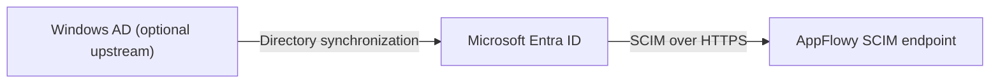
```mermaid
flowchart LR
    AD["Windows AD (optional upstream)"]
    Entra["Microsoft Entra ID"]
    AppFlowy["AppFlowy SCIM endpoint"]
    AD -->|Directory synchronization| Entra
    Entra -->|SCIM over HTTPS| AppFlowy
```

Authentik is unnecessary for this route. Follow the steps below for a dedicated
Entra test application. For groups mastered in Windows AD, make membership changes
in AD and wait for both stages; for cloud-managed groups, make them in Entra.

**[Watch the Entra walkthrough (2 min 42 sec)](assets/ad-scim-auto-sync/entra-auto-sync.mp4)**
and [read its transcript](assets/ad-scim-auto-sync/entra-auto-sync-transcript.txt).
It combines real setup/source screenshots with recordings of starting provisioning
and AppFlowy's resulting sync status. Waiting time is omitted. The groups are
cloud-managed Entra groups; the recording does not demonstrate a Windows AD import.

## Step 1: Check the license and network requirements

Group-based application assignment requires **Entra ID P1 or P2**; the **Entra
Free** label alone does not establish this entitlement. Microsoft also excludes
nested memberships from group-based application assignment. These Microsoft
requirements are separate from the AppFlowy license.
[Microsoft's group-assignment requirements](https://learn.microsoft.com/en-us/entra/identity/users/groups-saasapps)

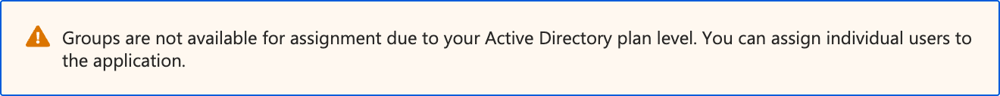

*Troubleshooting reference: this warning appeared in the original Free tenant.
The walkthrough below uses a separate work/school tenant with P2 licenses and
group assignment available. Individual-user assignment alone does not demonstrate
group provisioning.*

To prepare an eligible test tenant:

1. Use a work/school administrator account for the intended tenant. Follow
   [Microsoft's P1/P2 sign-up guide](https://learn.microsoft.com/en-us/entra/fundamentals/get-started-premium),
   which links to the P2 trial, or use an existing eligible subscription. Review
   the trial's payment, renewal, and cancellation terms before enrolling.
2. Confirm that the subscription is attached to the same tenant that contains the
   test application. In the current portal, license management points to the
   **Microsoft 365 admin center**; the Entra **Try / Buy** action may be disabled.
3. Assign the appropriate licenses to the test users through **Microsoft 365 admin
   center → Users → Active users → user → Licenses and apps**.
   [Microsoft's license-assignment steps](https://learn.microsoft.com/en-us/microsoft-365/admin/manage/assign-licenses-to-users)
4. Return to the application's **Users and groups → Add user/group** and verify
   that group selection is available before starting the group demonstration.

For the direct cloud connection shown here, Microsoft must be able to reach
`https://your-domain/scim/v2` with a valid TLS certificate. A working `localhost`
URL in your browser is insufficient. If the endpoint is private, assess
[Microsoft's on-premises SCIM provisioning agent](https://learn.microsoft.com/en-us/entra/identity/app-provisioning/on-premises-scim-provisioning)
and its separate Windows/network prerequisites instead; that route was not tested
for this guide. Do not expose LDAP or a domain controller to make SCIM reachable.

Prepare the AppFlowy connection, workspace, and licensed seats from
[the AppFlowy connection setup](SCIM.md#step-2-create-a-scim-connection), using **Microsoft Entra — SCIM Demo**
as the connection label. Keep the token private.

The demonstration uses **three AppFlowy seats**: one existing workspace owner and
two ordinary users, **Alice Demo** and **Bob Demo**. Only Alice and Bob are assigned
to provisioning. The owner is excluded. The local instance uses a three-seat
commercial test license; Microsoft P2 licenses are a separate requirement.

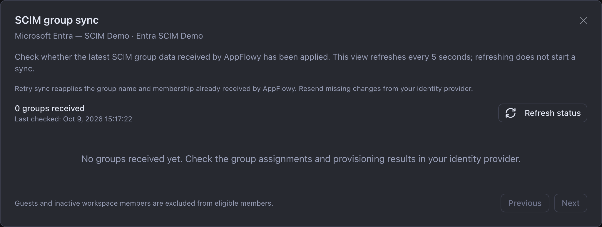

*Starting point: open the connection's **SCIM groups** monitor. Zero groups is
expected before the first delivery. This panel will show the received count and
the state of each group without creating groups manually in AppFlowy.*

## Step 2: Create a dedicated enterprise application

1. Open **Entra ID → Enterprise apps → New application**.
2. Select **Create your own application**.
3. Enter **AppFlowy SCIM Demo** and select **Integrate any other application you
   don't find in the gallery (Non-gallery)**.
4. Create the application and open it. Use this dedicated test application so
   existing sign-in assignments do not enter the provisioning scope.

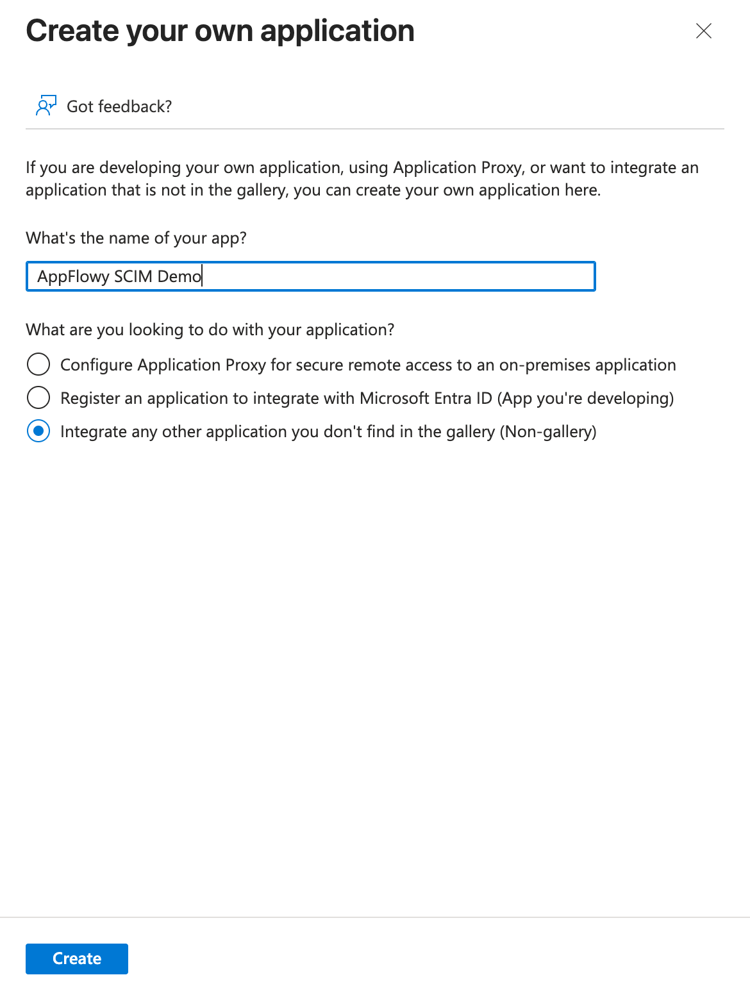

*The dedicated application used for this walkthrough. Select the non-gallery
option, then **Create**. SSO and SCIM remain separate settings.*

## Step 3: Connect the AppFlowy SCIM endpoint

Open the application's **Provisioning** page. The current portal offers **New
configuration** or **Connect your application**.

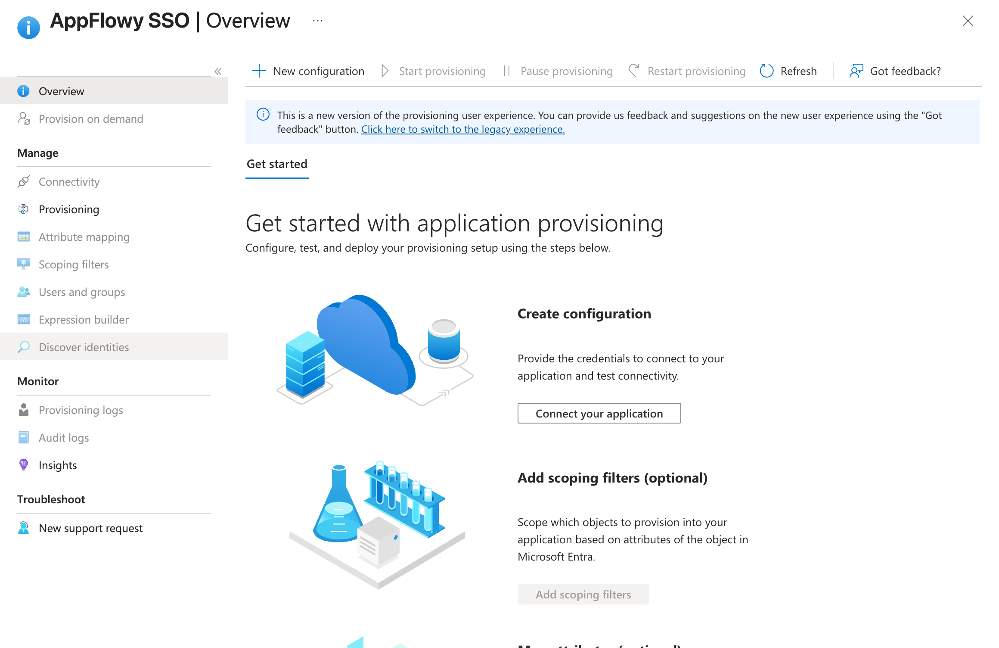

In the new configuration form:

| Field | Enter |
| --- | --- |
| Authentication method | **Bearer authentication** |
| Tenant URL | The AppFlowy connection's HTTPS URL, with the Microsoft compatibility flag: `https://your-domain/scim/v2?aadOptscim062020` |
| Secret token | The one-time token generated by AppFlowy Admin |

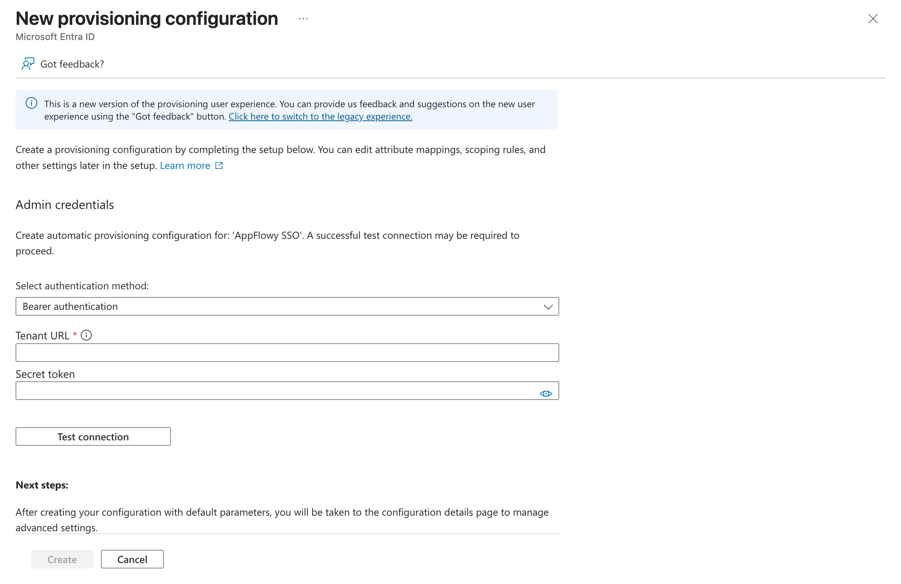

*Setup reference from the earlier application. The fields are intentionally empty
to protect the endpoint and token; enter your dedicated connection's values.*

Select **Test connection**. After it succeeds, create/save the configuration.
In the legacy view, choose **Provisioning Mode → Automatic → Admin Credentials**;
if those credentials have moved, follow the link to the new configuration form.
The connection test checks connectivity and authentication. It is not proof that a
group or its members have synchronized.

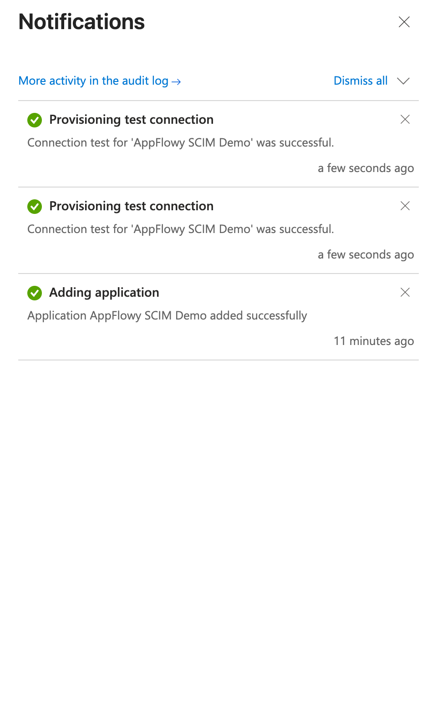

*Expected result: a successful connection notification. Continue with mappings and
assignments; AppFlowy can still correctly report zero groups at this point.*

The `aadOptscim062020` flag enables Microsoft's SCIM-compatible PATCH behavior,
including member removals and boolean `active` values. Microsoft documents that
this flag does not apply to **Provision on demand**. Use the scheduled job to
verify those operations with this configuration.
[Microsoft's SCIM compatibility guidance](https://learn.microsoft.com/en-us/entra/identity/app-provisioning/application-provisioning-config-problem-scim-compatibility)

## Step 4: Limit mappings and assignment scope

### Map users

Open **Attribute mapping → Users**. Keep only the supported writable attributes
below, then **Save** and confirm. Leave User and Group provisioning enabled.

| Source | AppFlowy target | Purpose |
| --- | --- | --- |
| Stable sign-in email, such as a suitable `userPrincipalName` or populated `mail` | `userName` | Required email identity; matching precedence 1 |
| `displayName` | `displayName` | Directory display name |
| `objectId` | `externalId` | Stable source identifier |
| `Switch([IsSoftDeleted], , "False", "True", "True", "False")` | `active` | Entra's default deprovisioning mapping |

Remove writable `emails`, separate `name` mappings, and enterprise attributes
such as `department` and `manager`. See the [attribute contract](SCIM.md#attribute-mapping).
Do not change an existing user's `userName`; AppFlowy treats this identity as immutable.

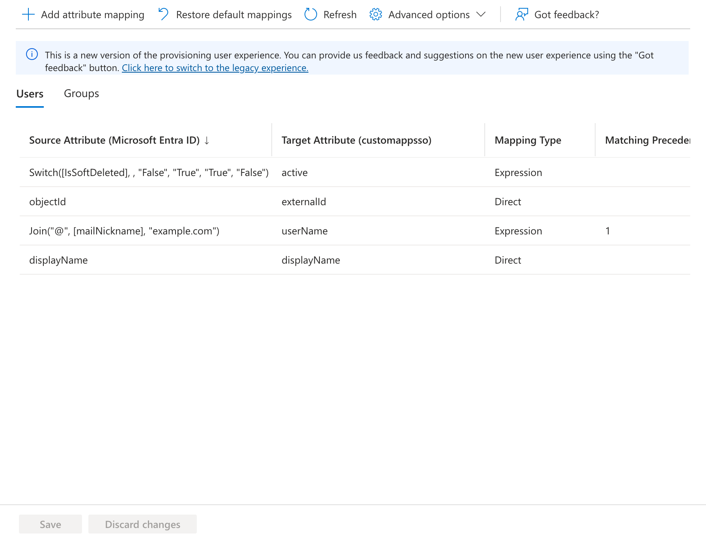

*Demo-specific privacy choice: the screenshot uses
`Join("@", [mailNickname], "example.com")` for `userName`. It creates
`alice.scim.demo@example.com` and `bob.scim.demo@example.com` without publishing
the test tenant's domain. Use your users' actual stable sign-in emails in a real
deployment; do not copy this example-domain expression into production.*

### Map groups

Select **Groups**. Keep `displayName → displayName`, `members → members`, and
`objectId → externalId`. Use `displayName` as matching precedence 1. Leave group
creation, update, and deletion enabled.

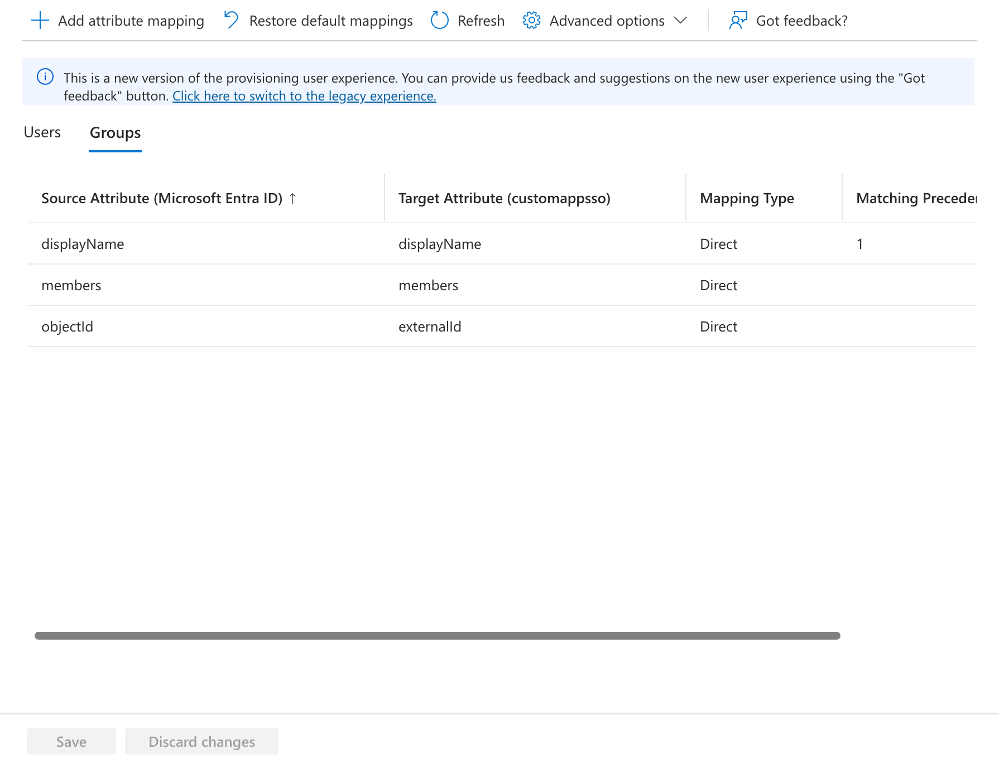

*The `members` mapping is required to synchronize membership; mapping the group
name alone is insufficient. AppFlowy supports direct User members, not nested groups.*

### Create the demo groups

Under **Entra ID → Groups → New group**, create **Engineering — Entra Demo** with
**Group type: Security** and **Membership type: Assigned**. Add **Alice Demo** as a
direct member. Leave Microsoft Entra role assignment disabled.

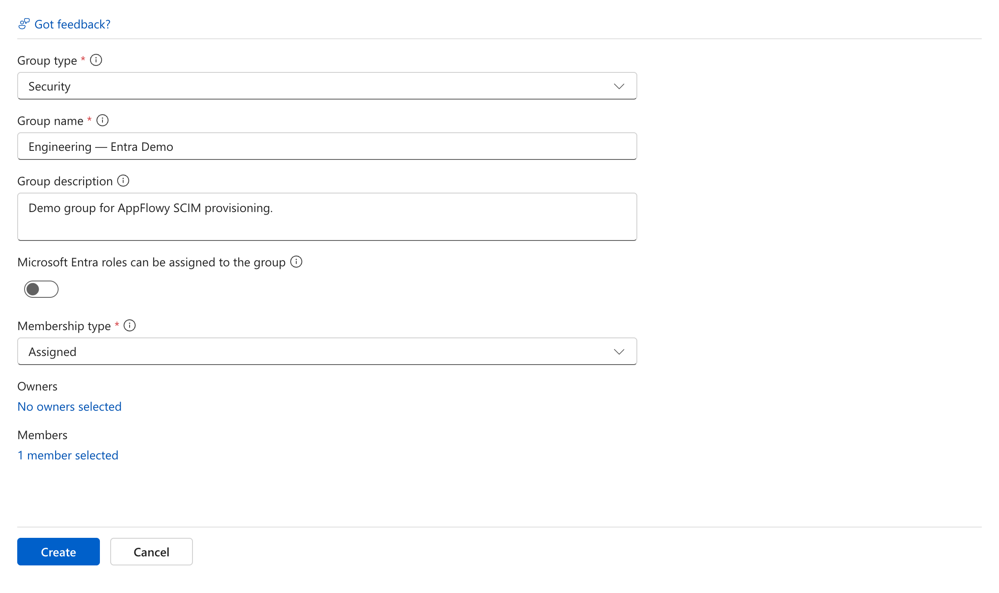

*Select the member before choosing **Create**. This is an ordinary security group;
it does not need an administrator role.*

Create a second empty security group, **Design — Entra Demo**, for the group
creation and deletion demonstration.

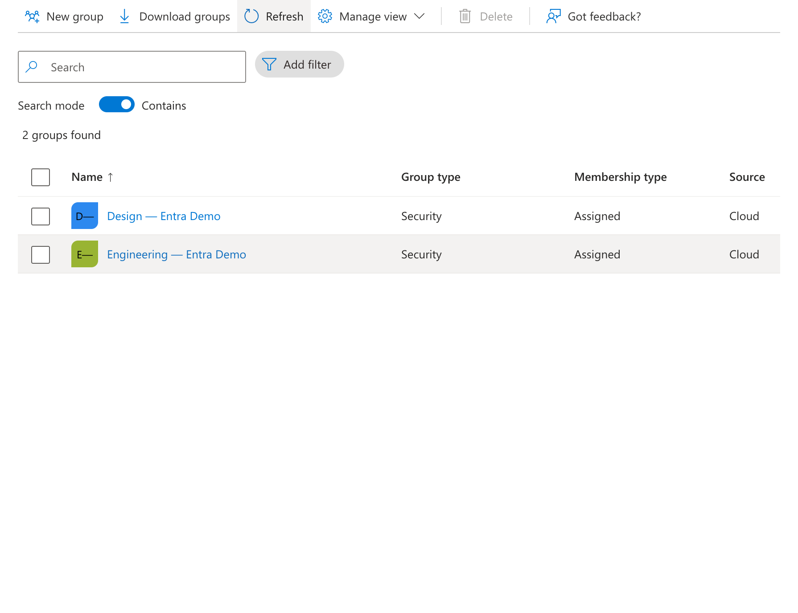

*Both groups use Assigned membership and show **Source: Cloud**. These are Entra
groups created for the demonstration, not imported Windows AD groups.*

Open **Engineering — Entra Demo → Members → Direct members** and verify Alice.

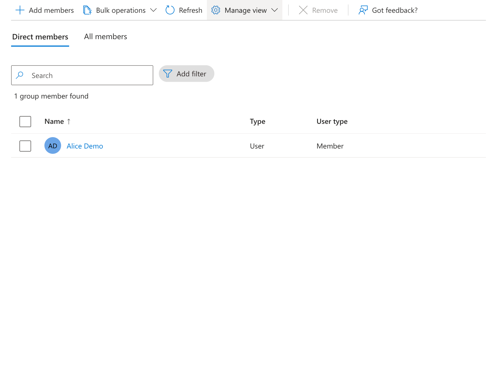

*Baseline for the membership comparison: Alice only. The portal's **Manage view →
Edit columns** control hides identifiers and email columns in the published captures.*

### Assign only the demonstration objects

Return to **Enterprise apps → AppFlowy SCIM Demo → Users and groups → Add
user/group**. Assign Alice, Bob, Engineering, and Design. Exclude the system
administrator and workspace owner.

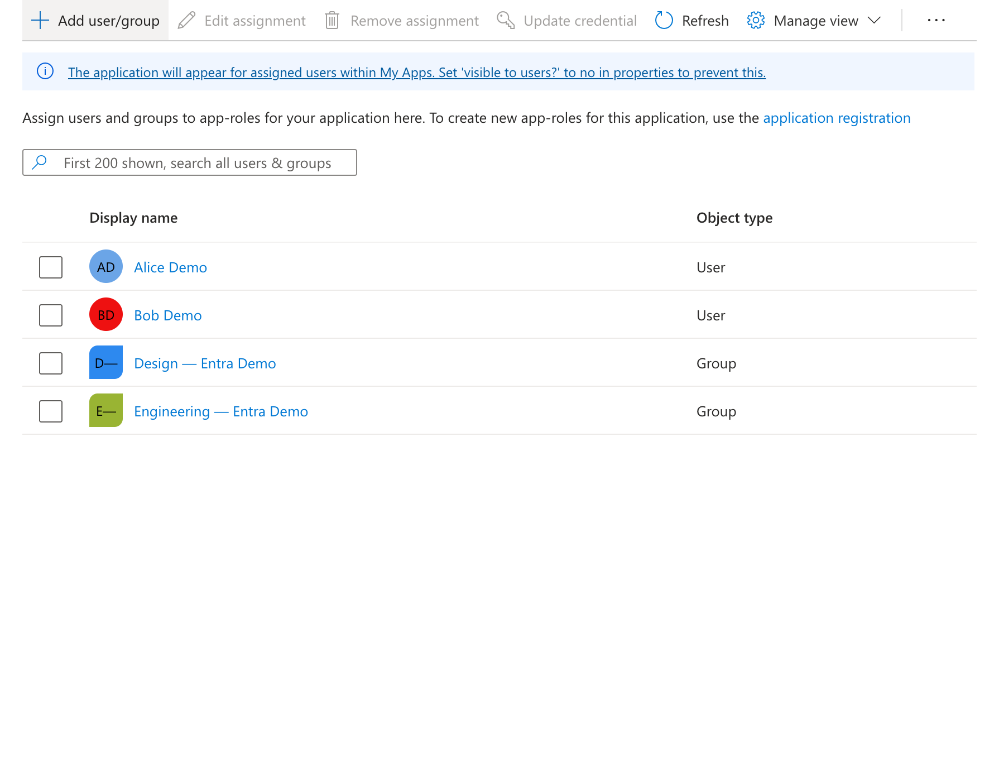

Keep the two users independently assigned while demonstrating changes to the
Engineering permission group. This allows group-member removal without also
removing that user's application assignment. Follow
[Microsoft's SCIM configuration procedure](https://learn.microsoft.com/en-us/entra/identity/app-provisioning/use-scim-to-provision-users-and-groups#integrate-your-scim-endpoint-with-the-microsoft-entra-provisioning-service)
for the portal's mapping and assignment controls.

In **Provisioning → Overview → Properties**, confirm **Provisioning scope: Sync
only assigned users and groups**. In other portal versions, this appears under
**Settings → Scope**.

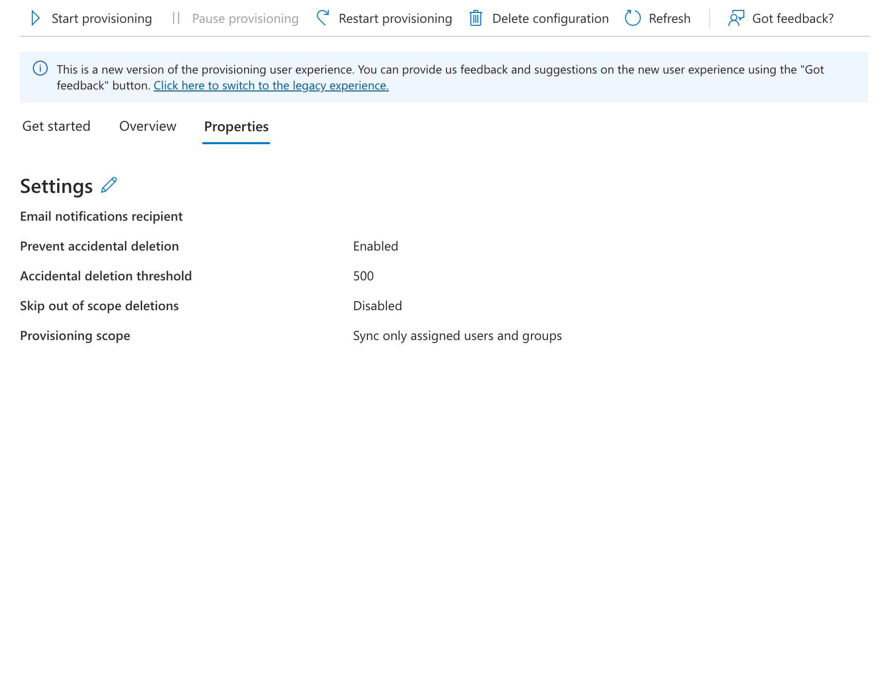

*Check the scope before starting. The demonstration keeps **Skip out of scope
deletions: Disabled**, so removing all application assignments can deprovision a
user. Group-member removal and user offboarding are separate exercises.*

## Step 5: Start provisioning and verify automatic changes

Start provisioning (or set **Provisioning Status → On** and save in the legacy
view). Check **Provisioning logs** for delivery and AppFlowy Admin for the applied
state. Initial on-demand user provisioning can help diagnose setup; demonstrate
ongoing synchronization by letting later changes arrive on the scheduled cycles.

The test job's **Overview → Provisioning details** reports a configured
**40-minute** interval. Actual delivery timing varies; this run's first incremental
cycle completed sooner. An initial cycle can also spend time waiting to start.
Keep the endpoint reachable while waiting and check the last completed cycle and
provisioning logs. Refreshing a portal page does not advance Microsoft's schedule.
[Microsoft's provisioning-status guide](https://learn.microsoft.com/en-us/entra/identity/app-provisioning/application-provisioning-when-will-provisioning-finish-specific-user)

| Control | What it confirms or does |
| --- | --- |
| Entra **Test connection** | Checks endpoint authentication/connectivity; does not demonstrate group sync |
| Entra **Start provisioning** | Enables the scheduled provisioning job |
| Entra **Provision on demand** | Runs a manual diagnostic for selected objects; label it separately from automatic delivery |
| Entra **Refresh** | Reloads the displayed job/log state |
| AppFlowy **Refresh status** | Reloads the received/applied comparison; does not query Entra |
| AppFlowy **Retry sync** | Reapplies group data already received by AppFlowy; does not start an Entra cycle |

During setup, a single on-demand check for Alice succeeded and consumed one of
the two available AppFlowy seats. The group exercise is separate: no groups were
created through that user-only check.

### Compare the first automatic delivery

In the recorded run, the first scheduled cycle delivered both groups about
20 minutes after **Start provisioning**. It also provisioned Bob. This timing is
an observation from one run, not a delivery guarantee. Neither group was created
with **Provision on demand**, AppFlowy **Retry sync**, or AppFlowy's group editor.

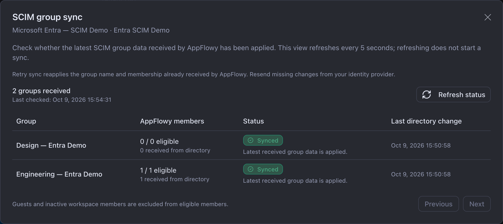

*Engineering has one received and one eligible member; Design is empty. Both
groups show **Synced** because their latest received names and eligible memberships
are applied. An empty group can be fully synchronized.*

Open **AppFlowy → workspace menu → Settings → People → Groups**. Reload the Web
page if an already-open settings panel still shows the previous list.

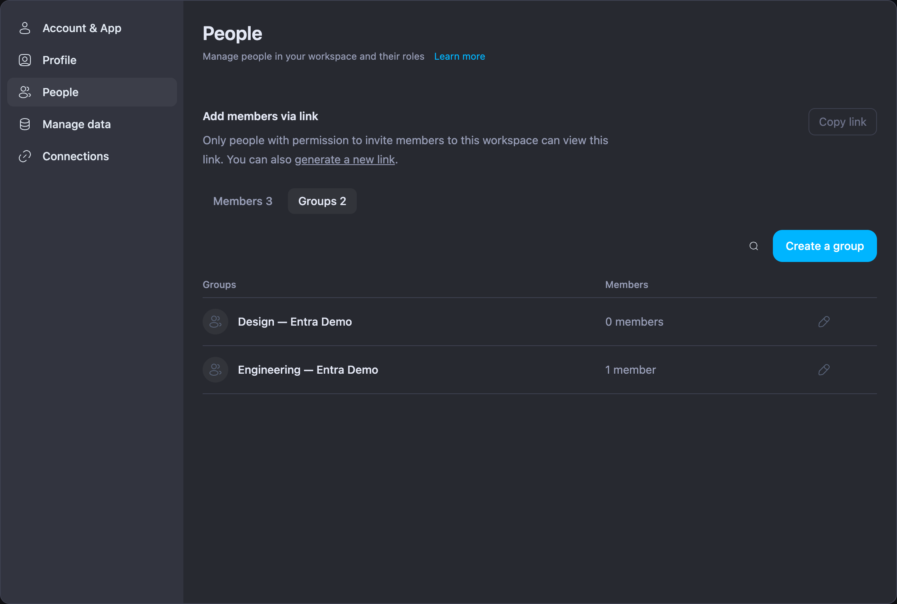

*The workspace has three members: its owner, Alice, and Bob. Only Alice belongs to
Engineering. A workspace member does not automatically belong to every group.*

Select the edit icon beside Engineering to inspect its read-only directory roster.

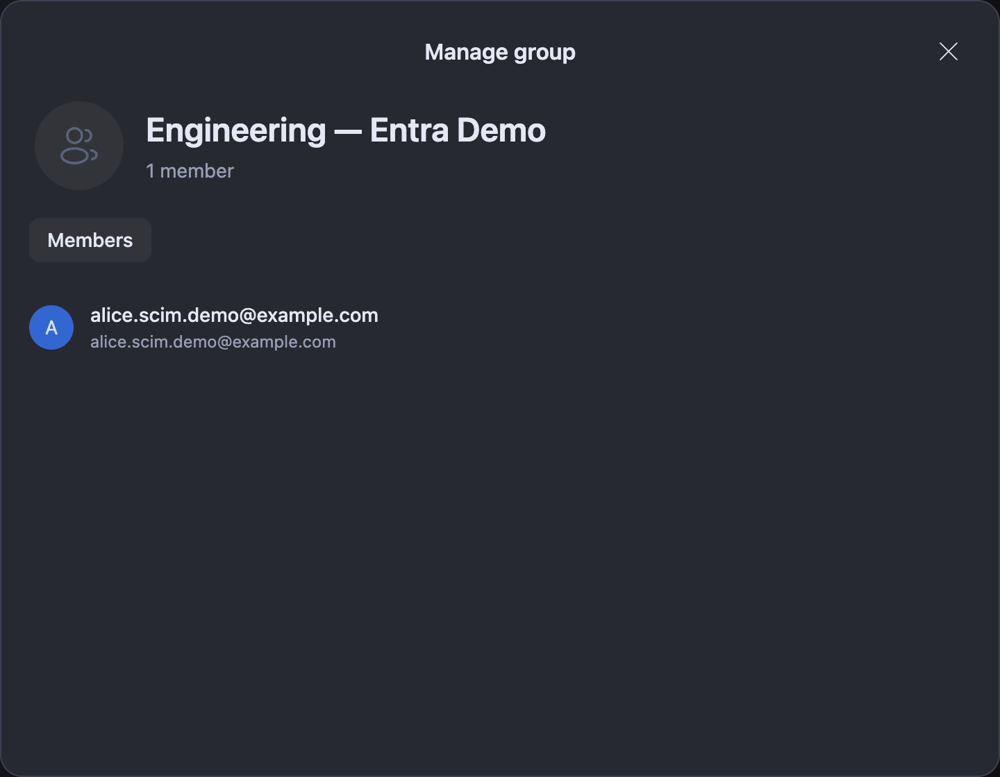

*Compare this with Alice's Entra membership above. Check the actual identity,
not just the count. The example-domain email comes from the documented demo mapping.*

## Step 6: Change the source and compare the next cycle

Use only disposable demonstration groups for the deletion exercise. Keep Alice
and Bob individually assigned to the application throughout these steps.

1. Open **Engineering — Entra Demo → Properties**. Change **Group name** to
   **Platform — Entra Demo** and **Save**. This renames the existing group.
2. Open **Members → Add members**, select **Bob Demo**, and choose **Select**.
   Refresh the member list after the operation completes.

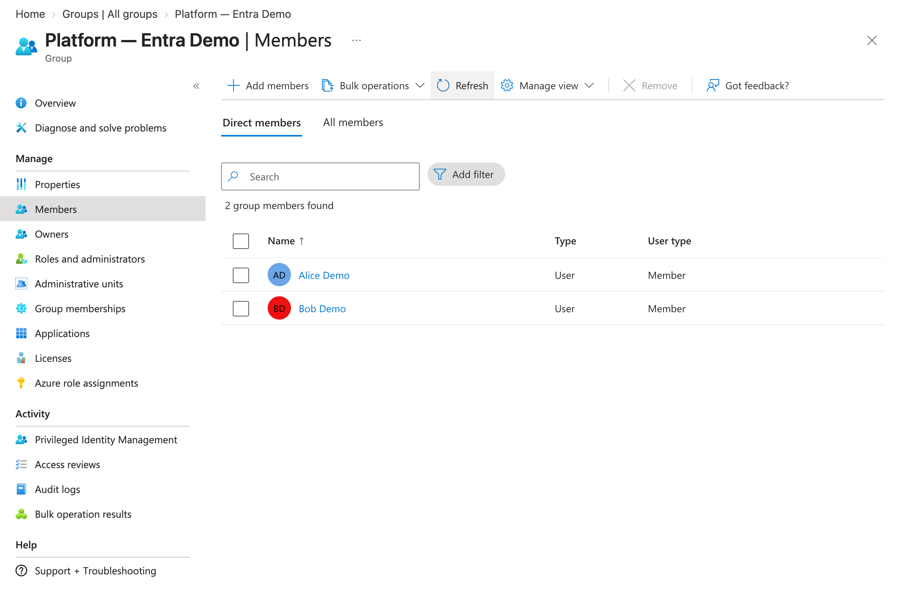

*Source change: the name is now Platform and its direct-members list contains two
users. The scheduled SCIM cycle has not delivered these edits yet.*

3. Select Alice's row, choose **Remove**, and confirm. Refresh the list to verify
   that Bob is now the only direct member.

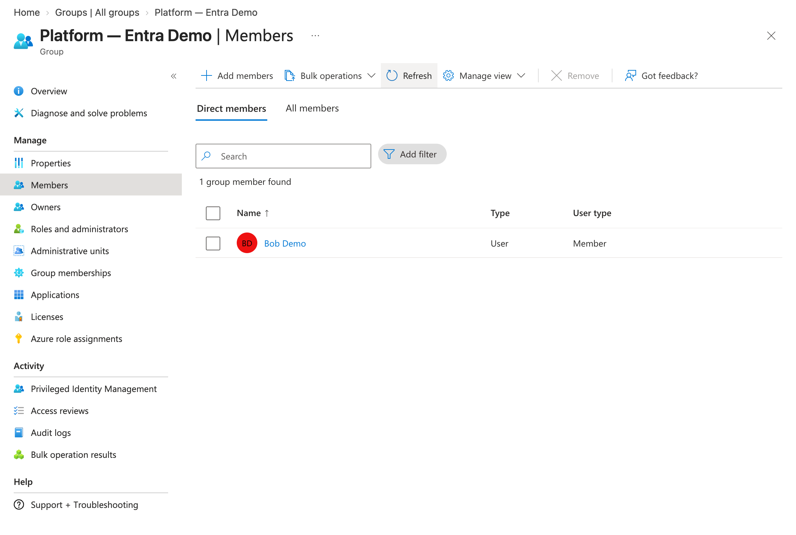

*Alice was removed from this group, not deleted or unassigned from the application.
The source membership is now Bob instead of Alice. The initial and final counts
are both one, so the downstream check must compare the member's identity.*

4. Return to **Groups → All groups**. Select only **Design — Entra Demo**, choose
   **Delete**, and confirm. Leave Platform unselected.

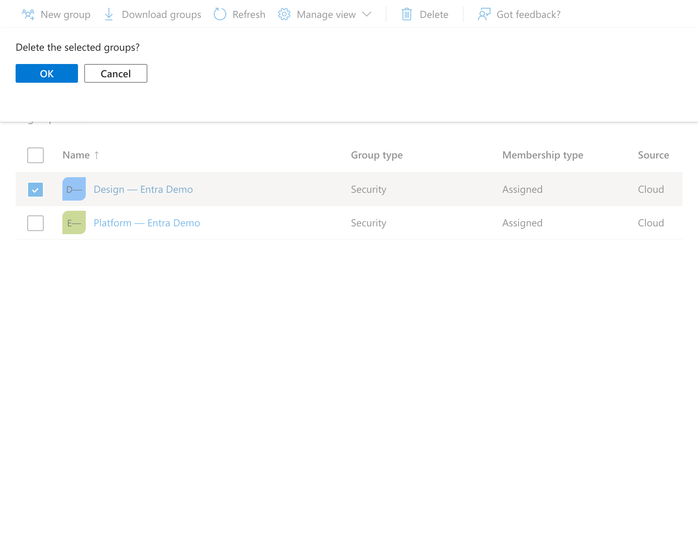

*Deleting a directory group removes its corresponding AppFlowy permission group
after delivery. It does not delete independently assigned users or their pages.*

5. Create **Quality — Entra Demo**, an Assigned Security group with Alice as its
   direct member. Keep role assignment disabled and choose **Create**.

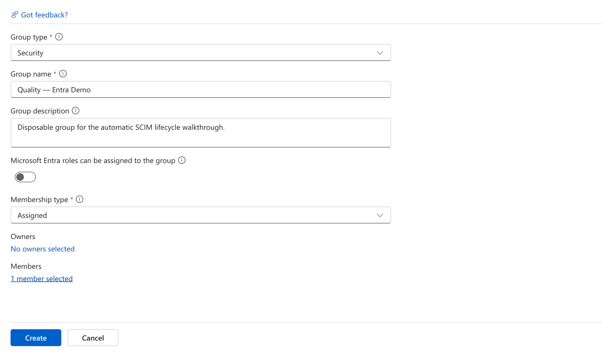

6. Open the application's **Users and groups → Add user/group**. Select Quality
   and **Assign**. Refresh to confirm Alice, Bob, Platform, and Quality are in scope.

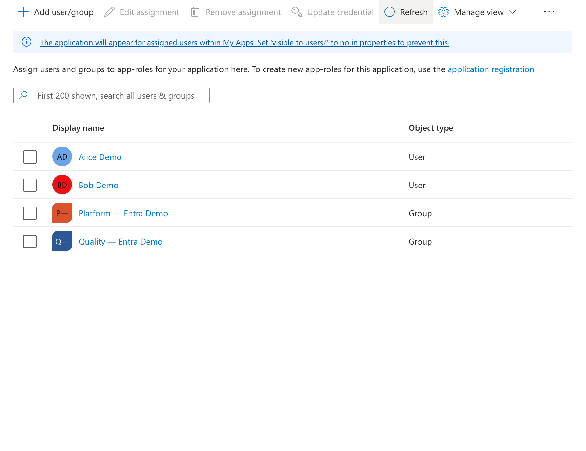

*Creating a group in the directory is not enough when the job uses assigned-only
scope. Assign it to this enterprise application so the scheduled job can provision it.*

These source edits were made between scheduled cycles. Entra can combine several
edits into the next delivery; do not expect AppFlowy to show every intermediate
source state. In particular, the brief two-member state above is a source
screenshot, not a claim that AppFlowy displayed two members during this run.

### Confirm the automatic group updates

The next incremental cycle delivered Quality, renamed Engineering, replaced its
membership, and deleted Design. No **Provision on demand**, **Restart provisioning**,
or AppFlowy **Retry sync** action was used for these group changes.

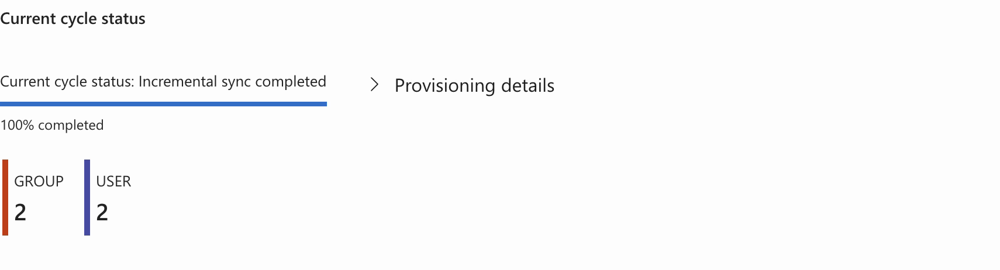

*Check the completed cycle and object-level provisioning logs. This summary alone
does not establish that every current group has the correct roster; verify AppFlowy too.*

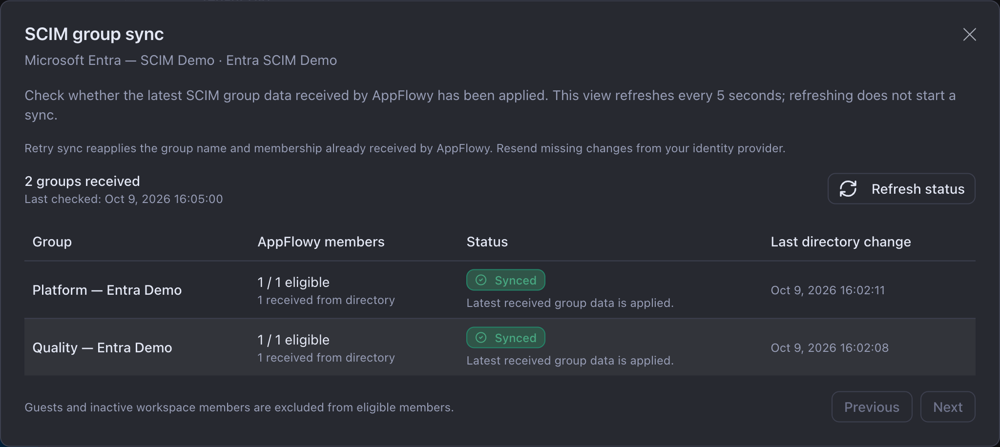

*Design is gone. Platform and Quality each have one eligible member and show
**Synced**. The received group count remains two because one group was added and
one deleted. The rename retained the original group's identity.*

Reload AppFlowy and open **Settings → People → Groups** again.

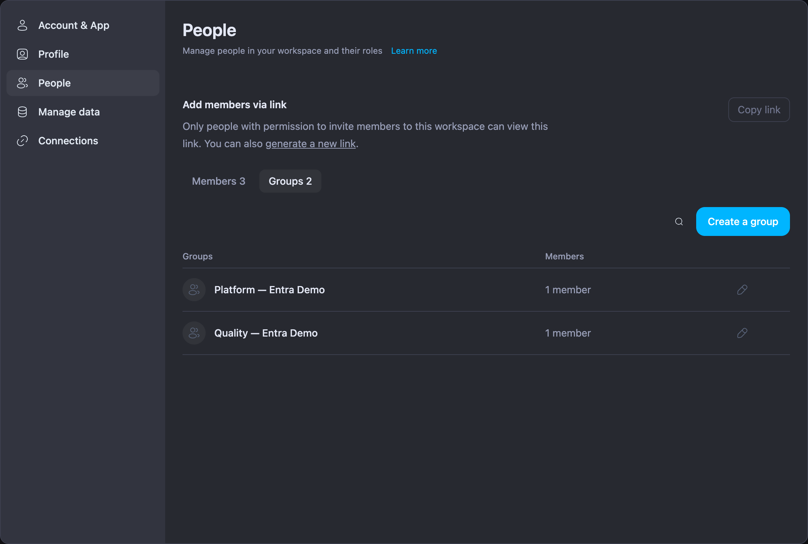

Open Platform's roster and compare it with the initial Engineering roster.

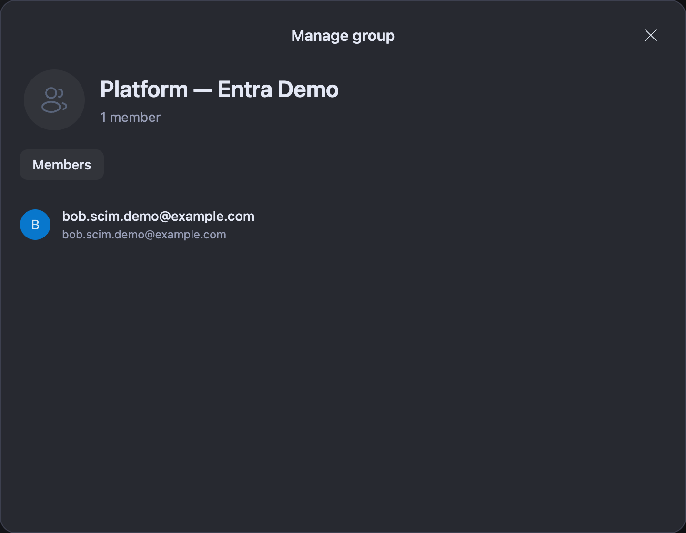

*The same group has a new name and a different member. The member count stayed
at one; this roster proves the replacement.*

Open Quality to check both the newly created group and its initial membership.

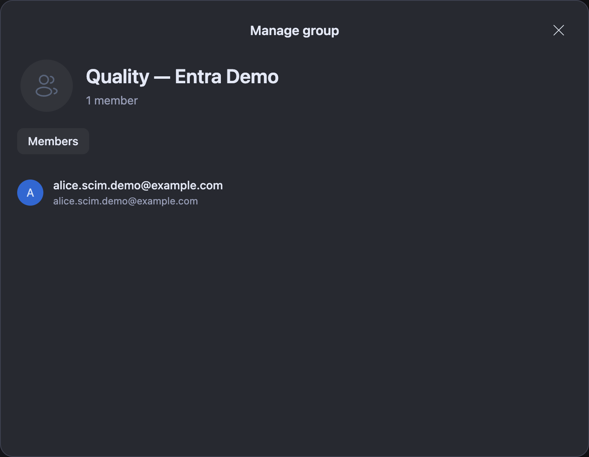

*Alice remains in the workspace and now belongs to Quality. Group removal,
group deletion, and removing a user's workspace access are distinct operations.*

## Optional: Diagnose a user display-name update

The recorded run used the default with workspace name sync disabled. To apply
received names to workspace member profiles on a current deployment, enable
[Sync workspace profile names](SCIM_OPERATIONS.md#enable-managed-names-and-direct-roles).
The personal profile remains unchanged in either mode.

To test user-attribute changes, open **Bob Demo → Edit properties → Identity**.
Search for **Display name**, change it to **Bob Demo Updated**, and **Save**.
Keep the sign-in identity unchanged.

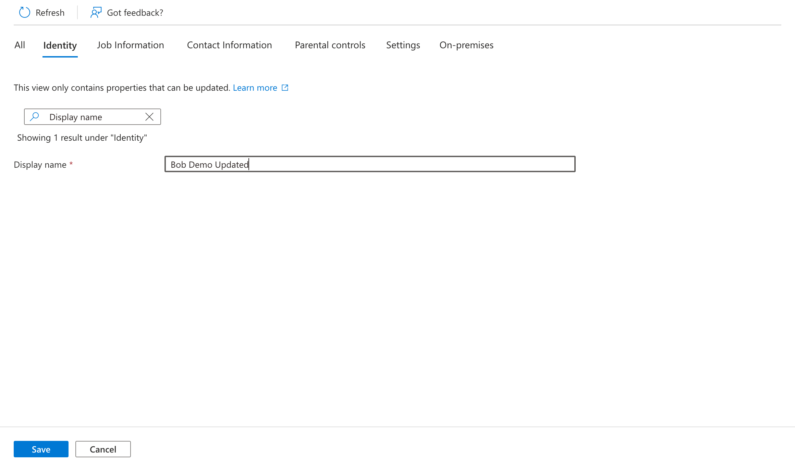

*The property search makes the field easy to find. A delivered `displayName`
change updates AppFlowy's SCIM directory record; it does not overwrite an existing
AppFlowy personal profile name. The group roster can therefore still show Bob's
example-domain email.*

For this separate user-only diagnostic, choose **Provision on demand** in the
application, select Bob, and run the check. This is a manual troubleshooting action,
not part of the automatic group-cycle evidence above. To test scheduled user
updates instead, wait for a later cycle and inspect its provisioning logs.

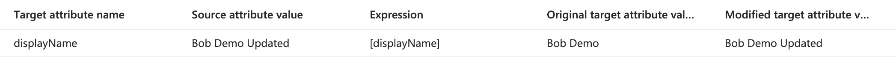

*Manual diagnostic result: Entra reports the `displayName` update. A read-only
SCIM check confirmed **Bob Demo Updated**, while AppFlowy's existing personal
profile and group roster continued to use `bob.scim.demo@example.com`.*

The follow-up run changed the source name to **Bob Demo Scheduled** and let the
scheduled cycle deliver it together with the group move at 11:59 UTC. The captured
User PATCH and SCIM readback confirmed the new display name on the same active
User resource. No manual provisioning was used for that follow-up update.

## Step 7: Understand the role and permission mapping

**Moving a user between groups must preserve the user.** Change the memberships;
do not delete and recreate the account. AppFlowy recomputes the user's workspace
role and group-based access. A page does not move to the destination group or get
deleted when its author changes teams. Someone who loses its only access grant
may no longer open that page, while other authorized users can still read it.

Entra and AppFlowy use similar role names for different purposes:

| Setting | What it controls | Mapping to AppFlowy |
| --- | --- | --- |
| Entra **Roles & admins**, such as Global Administrator or User Administrator | Administration of the Microsoft directory | No automatic mapping. Do not assign a directory administrator role to give someone AppFlowy access. |
| Entra user type **Member / Guest** | The user's relationship to the Microsoft tenant | Does not automatically choose AppFlowy Member / Guest. |
| Enterprise application **Users and groups → Role assigned** | Application assignment and, when exposed by the application, an app role | The demo's **User** assignment puts the user/group in scope. It does not grant AppFlowy Owner, Member, or Guest. |
| AppFlowy Admin **SCIM connection → Default role / Group role mappings** | The user's workspace role | Explicit mappings from SCIM group name or `externalId` to AppFlowy Owner, Member, or Guest. |
| AppFlowy Web **Manage Space → General / Members** | Access to a particular space and its pages | Add the synced group as a space member and configure that space's permissions. SCIM membership changes update who receives the grant. |
| AppFlowy page sharing | Access to a specific page | A separate grant can keep access after a group is removed. Check all grants when validating revocation. |

Microsoft describes directory roles in its [Entra RBAC overview](https://learn.microsoft.com/en-us/entra/identity/role-based-access-control/custom-overview)
and application roles in its [application-assignment guide](https://learn.microsoft.com/en-us/entra/identity/enterprise-apps/assign-user-or-group-access-portal).
AppFlowy never imports Entra administrator roles. The example uses workspace
role mappings in AppFlowy Admin. New deployments can optionally accept explicit
Member/Guest roles through the [AppFlowy User extension](SCIM_OPERATIONS.md#enable-managed-names-and-direct-roles);
this requires deliberate provider mapping and is separate from Entra's generic
`roles` field or the **User** assignment shown below.

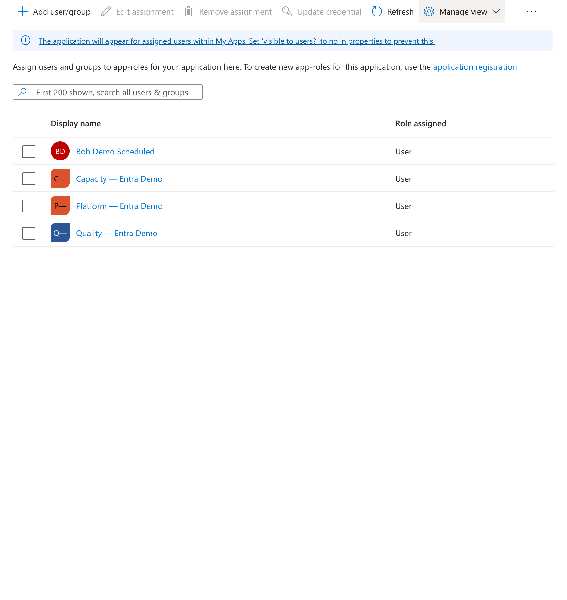

*The **User** values in Entra are enterprise-application assignments. They are not
AppFlowy workspace roles. Bob remains directly assigned during the group move.*

### Choose a connection default and group mappings

For a test that demonstrates fallback, choose **Guest** as the connection default:

| Source group | AppFlowy workspace role |
| --- | --- |
| `Platform — Entra Demo` | Member |
| `Quality — Entra Demo` | Guest |
| No remaining mapped group | Guest, from the connection default |

With **Accept roles from SCIM** off, as in this recording, the strongest role
among the default and all matching groups wins:
**Owner → Member → Guest**. With the configuration above, someone in both groups
is a Member. Removing Platform leaves a Guest. Adding Platform again restores
Member. With **Member** as the default, a Guest mapping cannot downgrade anyone
below Member. A role change can also require licensed capacity.

Check the **Guest** allowance separately from regular seats. The live three-seat
instance had one Guest seat, so converting both demo users to Guests exceeded that
allowance and reconciliation retried. The Member configuration was restored.
The role-fallback sequence below passed in the isolated automated test with one
Guest; the role-setting screenshots are configuration examples, not a completed
two-Guest live run.

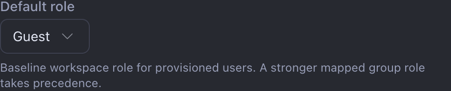

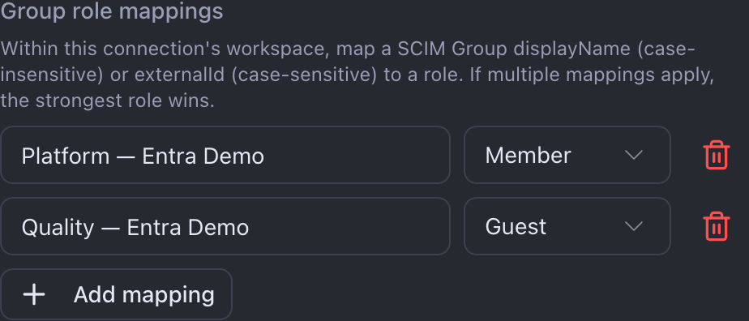

*Configuration example in **AppFlowy Admin → SCIM Provisioning → Actions → Edit connection**. Save the mappings for the role-fallback exercise; keep the Member default for the initial space-access move.*

Names match case-insensitively; `externalId` matches exactly. A matching name takes
precedence over an external-ID mapping. Mapping the Entra group's stable object
ID through SCIM `externalId` avoids changing the mapping when its display name
changes. Copy your own group's ID privately; the example screenshots omit IDs.

An AppFlowy workspace **Owner** mapping is privileged. The examples use Member
and Guest and keep the original workspace owner outside provisioning. AppFlowy
workspace roles, space Owner/Member roles, and view/edit permission levels are
separate settings.

### Configure the spaces used by the move test

First keep the connection default at **Member** for the group-move test. In
AppFlowy Web, create three custom spaces with **Everyone else: No access**:

| Space | Group added as a space member | Member permission |
| --- | --- | --- |
| Platform Demo Space | Platform — Entra Demo | Can edit |
| Quality Demo Space | Quality — Entra Demo | Can edit |
| Shared Demo Space | Both groups | Can edit |

Open the space menu and choose **Manage Space → General**. Select **Custom**,
set **Space members** to **Can edit**, and set **Everyone else** to **No access**.

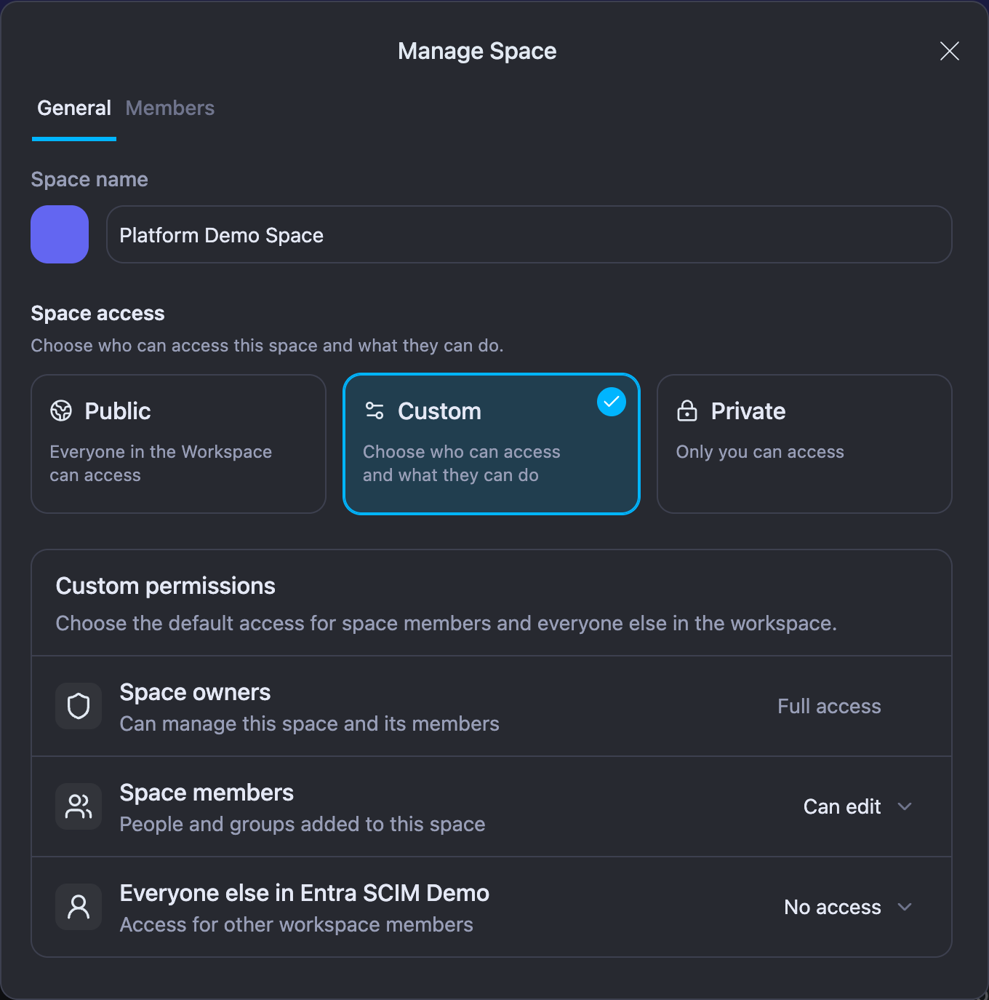

In **Members → Add people or groups**, add the matching synced group as a
**Space member**. Search by its name to verify the grant.

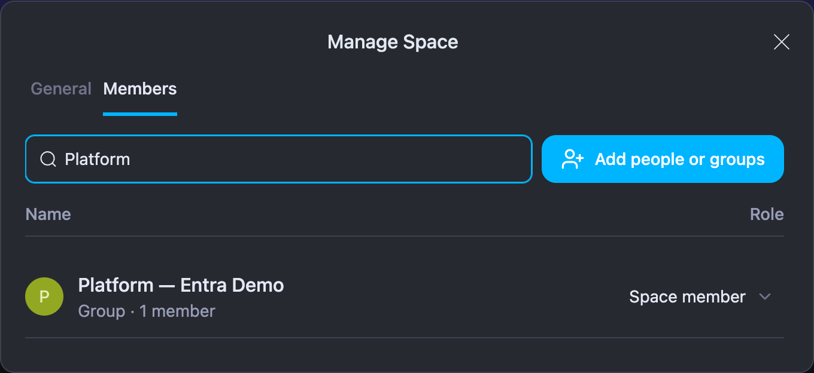

*The roster is filtered to Platform. The workspace owner still exists; filtering
does not remove other entries. This is a space role, separate from workspace Member.*

Allow **Members and owners** to edit the Platform space sidebar so Bob can create
a page for the retention check. A space's default **Owners only** sidebar setting
can otherwise prevent page creation even when a member may edit existing pages.
Keep direct user grants and workspace-wide fallback access out of this test.

Workspace **Guests** are not projected as eligible members of synced workspace
groups for group-based space/page access. A Guest can retain membership in the
SCIM directory group while its applied AppFlowy group count is zero. That can be
**Synced**: compare **received**, **eligible**, and **applied** counts. Configure
Guest page sharing separately where needed.

## Step 8: Move a user without deleting their account or work

**[Watch the group move and document-retention check (1 min 32 sec)](assets/entra-scim-auto-sync/entra-group-move.mp4)**
or [read the transcript](assets/entra-scim-auto-sync/entra-group-move-transcript.txt).
The recording combines source screenshots and actual browser captures. The wait
for the scheduled cycle is omitted; no manual provisioning triggered this move.

Use Bob, initially in Platform, and Alice, initially in Quality. Keep Bob directly
assigned to the enterprise application during this test so both source groups
can change without removing him from provisioning scope.

1. As Bob, open **Platform Demo Space** and create **Bob's project notes** with
   recognizable text. Record its URL privately. Confirm Bob can also open Shared
   Demo Space and cannot open Quality Demo Space.
2. In Entra, open **Groups → Quality — Entra Demo → Members → Add members**.
   Add Bob as a direct member. Keep Alice in the group.
3. Open **Platform — Entra Demo → Members**, select only Bob, and choose
   **Remove**. This removes a group membership, not the Entra user.
4. Wait for the scheduled provisioning cycle. Confirm the membership operations
   in Entra's provisioning logs and the resulting counts in AppFlowy Admin.
5. Reload Bob's AppFlowy view. Quality and Shared should be available. Platform
   should no longer be available through its group grant.
6. Open Bob's original page as the workspace owner. Confirm the same page URL and
   text still exist. Confirm Bob remains a workspace member and has the same
   account; no delete/recreate operation belongs in this workflow.

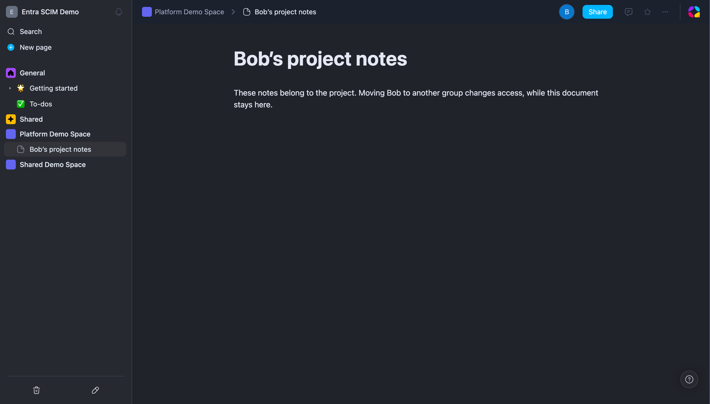

*Before: Bob can see Platform and Shared. The text is deliberately recognizable
so the workspace owner can verify it is retained after the move.*

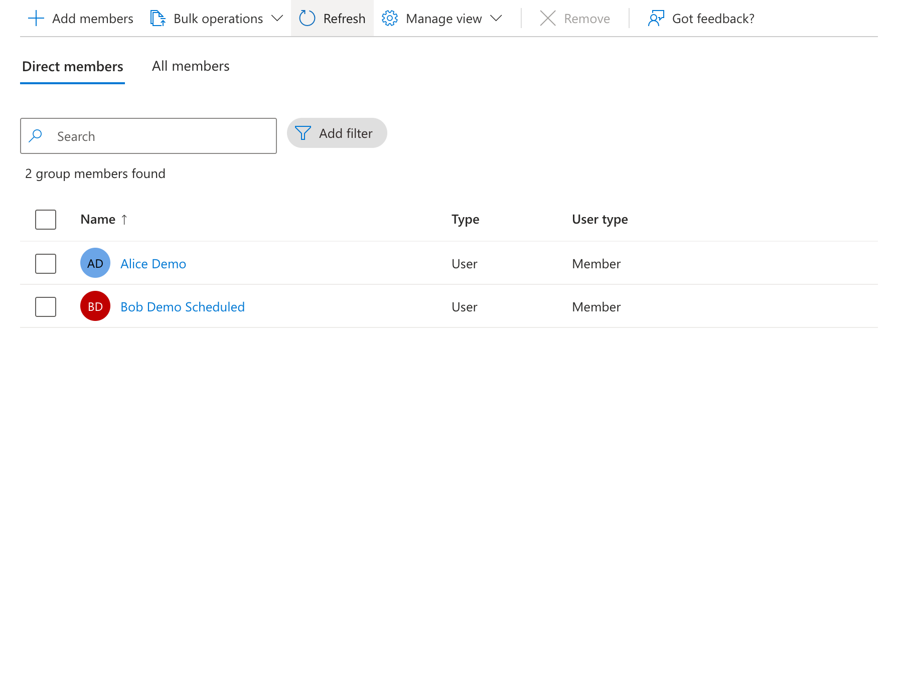

*Source: add Bob to Quality without removing Alice.*

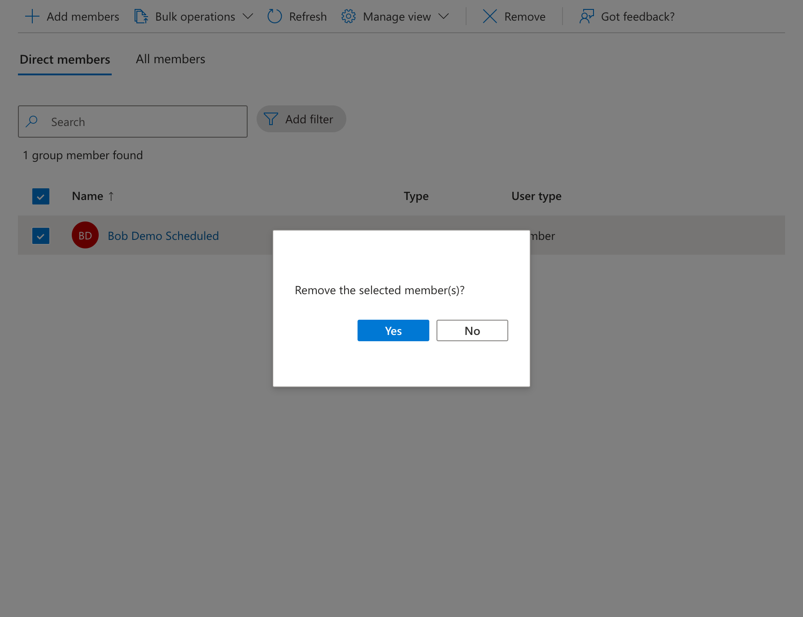

*Source: the confirmation removes the selected group member. It does not delete
the directory user. Keep Bob independently assigned to the application.*

### Recorded result of the scheduled move

The scheduled cycle delivered the changes at 11:59 UTC on October 9, 2026. No
on-demand provisioning or AppFlowy retry was used for this move. Bob retained the
same active SCIM identity. Read-only authorization checks and the browser agreed:

| Bob's access | Before | After |
| --- | --- | --- |
| Platform Demo Space | Can edit | No access |
| Quality Demo Space | No access | Can edit |
| Shared Demo Space | Can edit | Can edit |

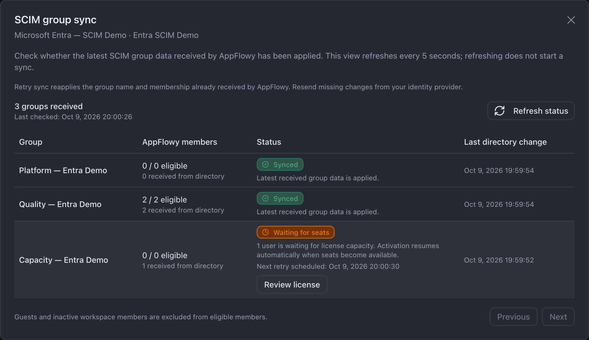

*Platform is empty and Synced. Quality contains Alice and Bob and is Synced.
Capacity's separate seat-limited user is covered in the recovery exercise below.*

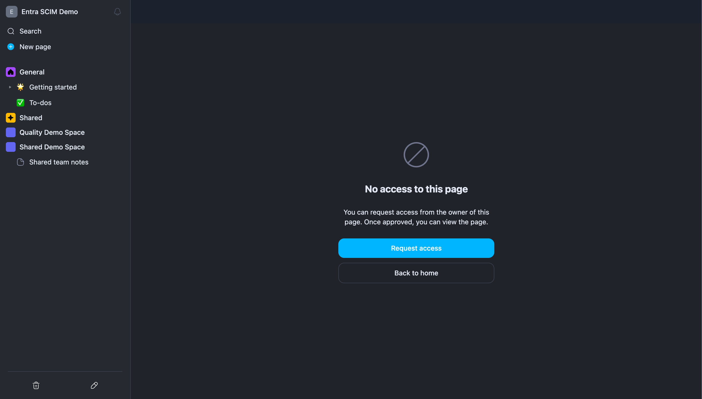

*Bob is still signed in. The message means access was removed; it does not mean
the page was deleted. Do not request access during this controlled test.*

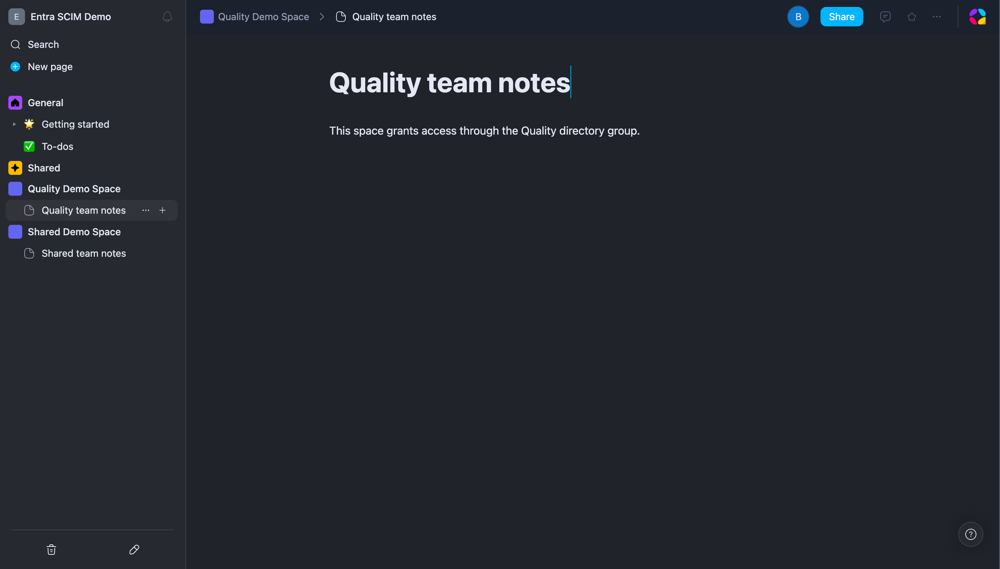

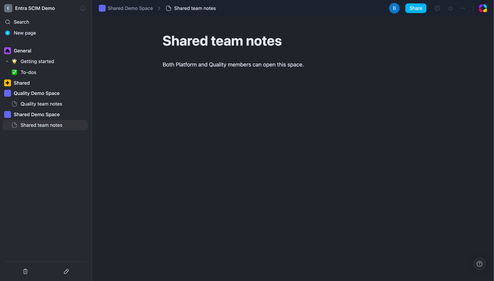

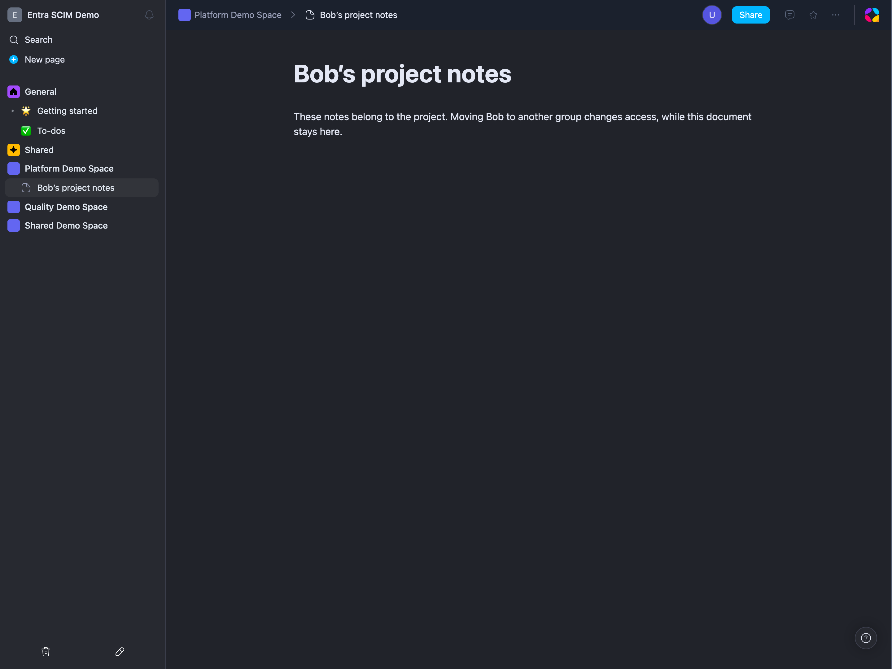

*The owner opened the same saved page URL after the move. Its contents remain in
Platform; they were neither deleted nor moved into Quality.*

### Plan the order and preserve provisioning scope

Entra sends separate updates for the two groups; a move is not an atomic
transaction across them. Add-before-remove can temporarily grant both groups'
access. Remove-before-add can temporarily remove both grants. For a planned move,
add the destination membership, confirm it has provisioned, then remove the old
membership when a temporary overlap is acceptable.

**Keep provisioning scope stable during a move.** If the old group is the user's
only application assignment, removing it before the destination assignment is
recognized can put the user out of scope. Entra can then send `active:false`.
Use an appropriate persistent application assignment, or validate the destination
assignment first. This is different from a group membership PATCH. Microsoft's
[provisioning lifecycle](https://learn.microsoft.com/en-us/entra/identity/app-provisioning/how-provisioning-works)
describes out-of-scope deactivation.

### Check overlapping roles separately

After the Member-only move test, apply the Guest-default mappings above and repeat
the membership changes. Check the user's workspace role as well as space access.
With both groups, Member wins. With Quality alone, Guest applies and the directory
membership remains, but group-based space access no longer applies. Adding
Platform restores Member and re-enables eligible group grants, including grants
on Quality whose directory membership did not change.

## Step 9: Test seat capacity, offboarding, and recovery

**[Watch offboarding and automatic seat recovery (1 min 25 sec)](assets/entra-scim-auto-sync/entra-seat-recovery.mp4)**
or [read the transcript](assets/entra-scim-auto-sync/entra-seat-recovery-transcript.txt).
The on-demand offboarding diagnostic and the automatic AppFlowy retry are labelled
separately. The retry transition is a continuous 45-second browser recording.

Use a dedicated test instance with a three-regular-user license: the existing
workspace owner, Alice, and Bob consume the available regular seats. Microsoft
licenses are separate; give the Entra test users the required Microsoft entitlement.
Do not delete an AppFlowy account to make room during this exercise.

1. Create **Charlie Demo**, add him to **Capacity — Entra Demo**, and assign that
   group to the enterprise application.
2. Wait for delivery. The recorded scheduled cycle created Charlie's retained
   SCIM resource and accepted the group membership. Charlie remained inactive
   and the Admin group monitor showed **Waiting for seats**, with one received
   member and zero eligible/applied members.
3. Check **Review license** and the next retry time. A successful Entra delivery
   does not mean AppFlowy granted access: inspect the AppFlowy state too.
4. For production capacity recovery, add sufficient AppFlowy licensed capacity.
   The pending user should activate through the normal retry worker without a new
   identity or another group edit. The automated license-upgrade regression covers
   this path; this live demo uses a released seat and does not purchase a license.
5. For the live offboarding exercise, first remove Alice's **direct** application
   assignment, keeping Quality assigned. Then remove Alice from Quality, her last
   assigned group. Bob remains directly assigned and in Quality.

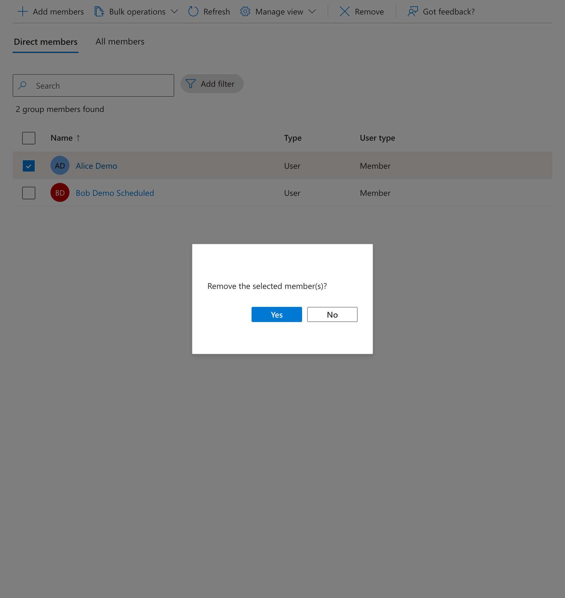

*This intentionally changes Alice's provisioning scope. In the group-move test,
Bob retained his direct application assignment, so his move did not deactivate him.*

6. Wait for the regular cycle, or use **Provision on demand → Alice Demo → Provision**
   as a manual diagnostic. This run used the manual diagnostic for offboarding;
   it is separate from the scheduled group-move evidence.
7. Open **Perform action → Modified attributes**. Verify `active` changed from
   **True** to **False**. Check AppFlowy separately for removed workspace access.

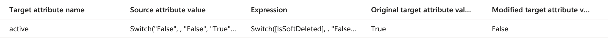

*The captured request was a User PATCH, not a User DELETE. Alice's SCIM identity
was retained. Microsoft documents [on-demand disabling after unassignment](https://learn.microsoft.com/en-us/entra/identity/app-provisioning/provision-on-demand#known-limitations).
Do not use directory-user deletion for this test.*

8. Leave Charlie's source assignment unchanged and wait for the **next retry**
   shown by AppFlowy. Seat recovery uses a background retry schedule, so the
   status can remain Waiting briefly after capacity changes. Do not click Retry
   sync or Provision on demand for Charlie when proving automatic recovery.

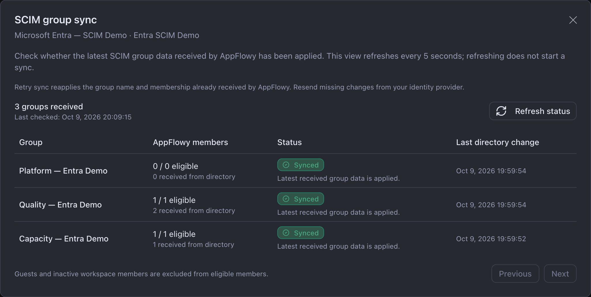

*Observed at 12:08 UTC: Capacity reached **Synced**, with one eligible and applied
member. Charlie retained the same SCIM resource and became active. No new Entra
request for Charlie and no AppFlowy Retry sync were needed. Quality still shows
two received members but only one eligible member because Alice is inactive;
its next Group update has not arrived yet.*

### Reactivate the same identity

9. To restore the original test users, remove Charlie from his final assigned
   group and provision that unassignment. Confirm he is inactive before using
   the released seat for Alice.
10. Add Alice back to Quality. Provision Alice on demand, or wait for the next
    cycle. Verify **active: False → True** on the existing identity.
11. Deliver Quality's membership too. This run used **Provision on demand →
    Quality → select Alice and Bob → Provision** as a manual recovery diagnostic.
    Confirm Quality reaches **2 / 2 eligible, Synced**, and Alice can open Quality
    and Shared again. User activation alone does not prove that the latest group
    membership has arrived.

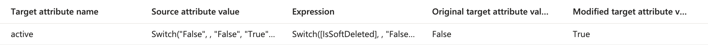

*The retained Alice SCIM resource was reactivated, not recreated. Authenticated
checks confirmed editing access to Quality and Shared after group delivery.*

## Step 10: Recover after rotating the SCIM token

1. In **AppFlowy Admin → SCIM Provisioning → Actions**, rotate the demo connection's
   token. Store the new value privately; it is shown only once. Rotation invalidates
   the previous token immediately, so coordinate the Entra update.
2. In Entra, open **Enterprise apps → AppFlowy SCIM Demo → Provisioning → Connectivity**.
   With the old credential, **Test connection** fails with **401 / Invalid SCIM token**.
   Expand the notification to inspect the error. Never publish the credential or
   full notification identifiers.

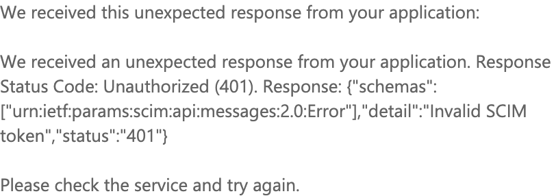

3. Replace **Secret token**, keeping the Tenant URL and its compatibility flag.
   Select **Test connection**, confirm success, and **Save**. Recheck the saved
   configuration. A successful unsaved test does not update the scheduled job.
4. Confirm the new credential works and the old one remains rejected. Check the
   next provisioning cycle and object-level logs for any pending deliveries.

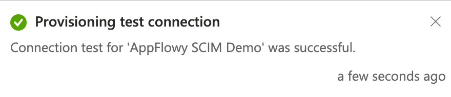

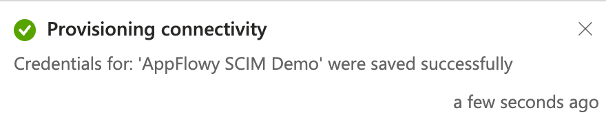

*The live check returned 401 for the old token and 200 for the new token. Entra's
connection test passed and the updated configuration was saved. This verifies
credential recovery; it is not a substitute for checking the next scheduled cycle.*

## Repeatable checks after the Microsoft trial

The Cloud repository includes sanitized Entra request fixtures and two HTTP
regressions. These run without a Microsoft tenant:

- Member moves in both delivery orders, repeated requests, old-space revocation,
  new-space access, overlapping grants, stable user identity, and retained authored text.
- Guest → Member → Guest → Member role fallback, including re-enabling a group's
  permission grant when its directory membership did not change.

Boundary tests replay actual create, membership, rename, deactivate, and reactivate
request shapes. The broader SCIM suite also covers license upgrades, freed-seat
recovery, concurrent seat limits, deactivation, deletion, and token authorization.
These tests validate AppFlowy behavior; they do not simulate Entra scheduling,
application-assignment decisions, or Windows AD import. Keep the recordings as
the evidence of the real provider workflow.

## Group removal, deactivation, and deletion are different operations

| Operation delivered to AppFlowy | Account and data behavior | Access behavior |
| --- | --- | --- |
| Remove a member from `/Groups/{id}` | Same SCIM User and AppFlowy account; existing pages remain | Remove that group's grant and recompute the strongest remaining workspace role. Other grants may still allow access. |
| Delete `/Groups/{id}` | Remove the group principal; retain users and pages | Remove grants from that group. Recompute roles for affected users. |
| Set `/Users/{id}` to `active:false` | Retain the SCIM resource and global account | Remove the connection's workspace membership and dependent access grants; release the seat. The authentication account may be banned when it has no other workspace. |
| Delete `/Users/{id}` through SCIM | Remove the SCIM resource; retain the underlying AppFlowy account | Offboard from the provisioned workspace. A later provisioning request has a new SCIM resource ID. |
| Delete an account in AppFlowy Admin | A separate account-deletion workflow | Do not use it to move a user between groups or as a substitute for SCIM deactivation. |

Deactivation is an access-removal workflow. Reactivating the same retained SCIM
resource restores membership at the current effective role, subject to licensing;
it does not promise to recreate every direct share or space ownership assignment
removed during offboarding. Validate those separately. Keeping document content
does not imply the former member still has permission to read it.

## Additional lifecycle checks

| Change at the source | Check in Entra | Check in AppFlowy |
| --- | --- | --- |
| Create and assign a disposable security group | Group appears in scope; successful provisioning event | New workspace group appears and reaches **Synced** |
| Add Alice, then Bob | Membership changes delivered | Group changes from 0 → 1 → 2 members |
| Remove Alice | Removal delivered; Alice remains independently assigned | Bob remains; Alice keeps workspace membership |
| Replace Bob with Alice | Both membership changes delivered | Count remains 1, but the member is now Alice |
| Rename the group | Existing group's update delivered | Same group has the new name |
| Modify the user's display name | User update delivered | SCIM record changes; workspace name also changes when name sync is enabled; personal profile stays independent |
| Delete a disposable group | Group deletion delivered | Group disappears; independently assigned users remain |
| Disable/unassign a disposable user from all application assignments | Deactivation delivered | User loses the provisioned workspace access |

For a hybrid directory, also capture the AD edit and the resulting imported Entra
state. Record the scheduled delivery, the AppFlowy roster, and the Admin status for
each operation. **Synced** confirms the latest data AppFlowy received;
**Retry sync** cannot make Entra send a change it has not delivered yet.

An Entra-only demonstration verifies Entra → AppFlowy. It does not verify a
customer's Windows AD import, nested groups, or cross-domain configuration.

## After a temporary test

Pause the dedicated Entra provisioning job before closing a temporary endpoint.
Disable the demo connection in AppFlowy Admin and retire its credential when the
test is complete. Keep production provisioning enabled when ongoing sync is required.

If you enrolled in a Microsoft trial, cancel it or turn off recurring billing
before the renewal date shown under **Microsoft 365 admin center → Billing →
Your products**. Confirm the subscription's ending/renewal status. Pausing SCIM
provisioning does not cancel the subscription.
[Microsoft's cancellation instructions](https://learn.microsoft.com/en-us/microsoft-365/commerce/subscriptions/cancel-your-subscription?view=o365-worldwide)
