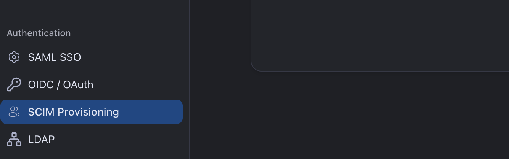
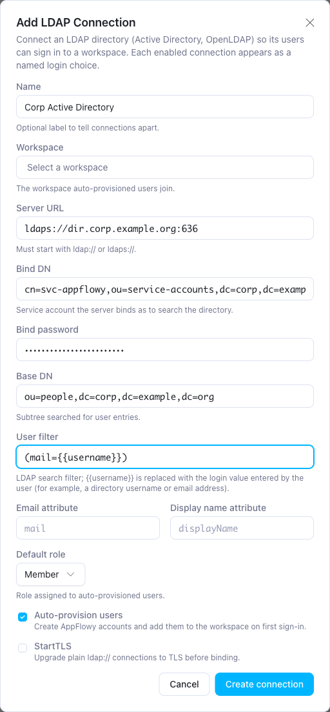
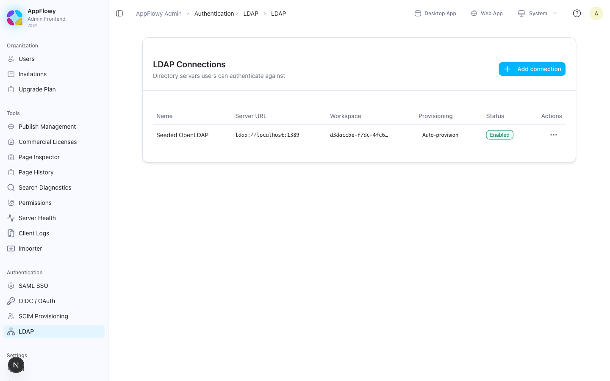
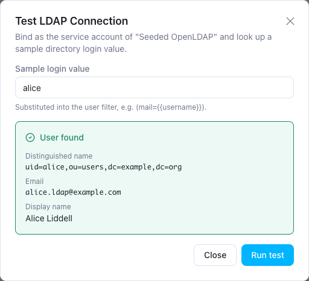
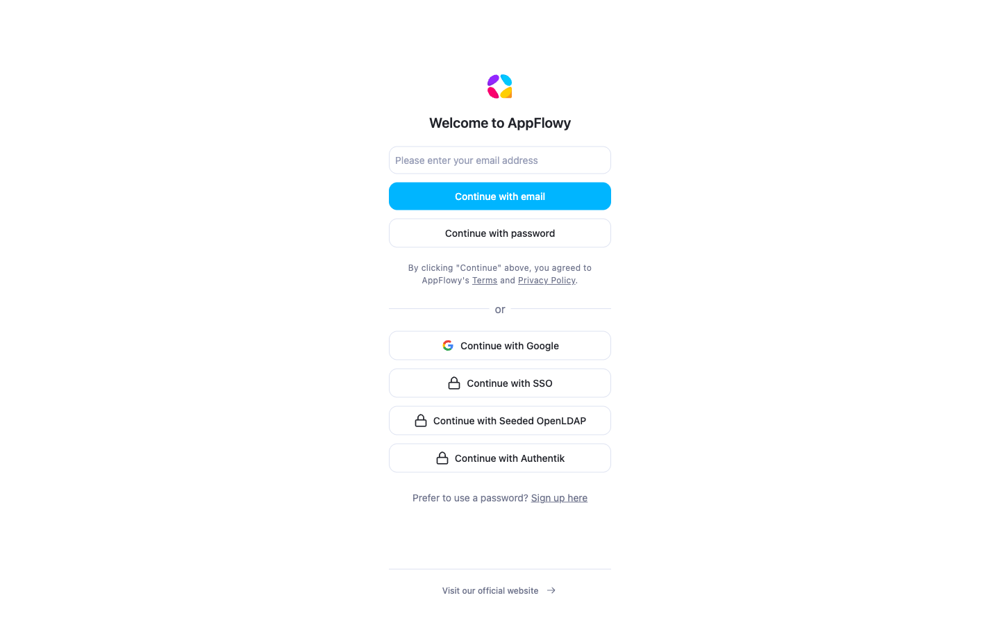
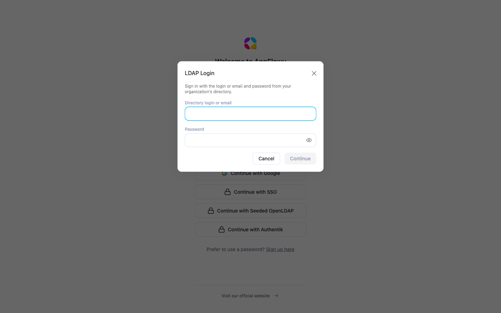

# LDAP Authentication

AppFlowy Self-Hosted can authenticate users against an LDAP directory such as Active Directory or OpenLDAP. Users sign in with their existing directory credentials, and AppFlowy can create their account and add them to a workspace on first sign-in.

AppFlowy verifies the password directly against the directory and then creates the AppFlowy session itself. Directory passwords are never stored or forwarded to the authentication service.

## Before you begin

- **Run the latest AppFlowy Self-Hosted release** (AppFlowy Cloud, Admin Frontend, and AppFlowy Web) and the latest AppFlowy desktop app, so that the LDAP sign-in button appears. See the [release notes](../README.md#release-notes).
- **Hold a Seed plan or higher.** The LDAP page is hidden in the Admin console on the Free Tier. See [Self-Hosted Plans and Pricing](https://appflowy.com/docs/Self-hosted-Plans-and-Pricing).
- **Serve the public hostname over HTTPS** (`SCHEME=https` in `.env`). Directory passwords travel in the sign-in request body, and the bundled Nginx does not block plain HTTP on `/api`. Do not publish port 80, or redirect it to HTTPS at your edge.
- **Allow network access** from the `appflowy_cloud` container to the directory server (`ldap://` on port 389 or `ldaps://` on port 636).
- **Prepare a read-only service account** (bind DN) that can search the user subtree.

### Nginx client address

AppFlowy rate-limits LDAP sign-in attempts per client IP address, taken from the `X-Forwarded-For` header. The bundled [`docker/nginx/nginx.conf`](../docker/nginx/nginx.conf) sets the header in the `location /api` block. If you maintain a copied or customized Nginx configuration, add this directive there, replacing any existing `X-Forwarded-For` directive rather than adding a duplicate:

```nginx
proxy_set_header X-Forwarded-For $remote_addr;
```

Without it, every sign-in attempt shares one rate-limit bucket, and a burst of failures from one client locks everyone out for five minutes.

The same happens when a CDN, tunnel, or load balancer sits in front of Nginx, because `$remote_addr` is then the proxy's address. In that topology, add the proxy's address range to the `server` block with `set_real_ip_from` and `real_ip_header` (for example `CF-Connecting-IP` for Cloudflare) so that `$remote_addr` becomes the end user.

### TLS to the directory

`ldaps://` and StartTLS connections verify the certificate chain and hostname against the container's system trust store. There is no option to skip verification. For a directory with a private CA, mount a bundle that contains both the public roots and your CA into the `appflowy_cloud` service and point `SSL_CERT_FILE` at it. The hostname in **Server URL** must appear in the certificate.

### Bind password encryption (optional)

The bind password is stored encrypted. By default the key is derived from `GOTRUE_JWT_SECRET`, so rotating that secret makes every stored bind password unreadable and invalidates every issued access token (clients that still hold a refresh token obtain a new access token without signing in again; delete the user under **Users** to force a fresh sign-in). To use a dedicated key, add `APPFLOWY_LDAP_SECRET_KEY` to the `appflowy_cloud` service's `environment` list in a compose override file and recreate the container. Setting it in `.env` alone has no effect, because the bundled compose file does not pass it through. Set the key before creating connections; changing it later requires re-entering the bind password on every connection.

## Step 1: Add an LDAP connection

1. Open the Admin console at `https://your-domain/console` and sign in with the administrator account from `.env`.
2. In the sidebar, open **Authentication → LDAP**. If the entry is missing, the deployment is on the Free Tier.

   

   The menu screenshot has **SCIM Provisioning** selected; choose **LDAP**.

3. Click **Add connection** and complete the form.

   | Field | Description | Example |
   | --- | --- | --- |
   | **Name** | Label for the connection; it is also the text of the sign-in button. Up to 255 bytes. Left empty, the button reads **Continue with LDAP**. | `Corp Active Directory` |
   | **Workspace** | The workspace that auto-provisioned users join. | |
   | **Server URL** | Must start with `ldap://` or `ldaps://`. | `ldaps://dir.corp.example.org:636` |
   | **Bind DN** | Service account that AppFlowy binds as to search the directory. | `cn=svc-appflowy,ou=service-accounts,dc=corp,dc=example,dc=org` |
   | **Bind password** | Password for the bind DN. Write-only: it is never shown again. | |
   | **Base DN** | Subtree searched for user entries. | `ou=people,dc=corp,dc=example,dc=org` |
   | **User filter** | LDAP search filter. `{{username}}` is replaced with the value the user types at sign-in. It must match exactly one entry. | `(mail={{username}})` (default) |
   | **Email attribute** | Attribute holding the user's email. It becomes the AppFlowy account email and must be present on every user who signs in. | `mail` (default) |
   | **Display name attribute** | Attribute used as the display name. | `displayName` (default) |
   | **Default role** | Workspace role for auto-provisioned users: **Member** (default) or **Guest**. | |
   | **Auto-provision users** | Create AppFlowy accounts and add them to the workspace on first sign-in. | On |
   | **StartTLS** | Upgrade a plain `ldap://` connection to TLS before binding. Ignored for `ldaps://`. | Off for `ldaps://` |

   

4. Click **Create connection**. Expect the toast **Connection created.** and a row with status **Enabled** and provisioning **Auto-provision** or **Manual**.

   

   The screenshots in this guide were taken on a development deployment, so they show a local test directory where yours shows your own server.

New connections are enabled immediately and appear the next time the sign-in page is loaded (with several `appflowy_cloud` replicas, allow up to 30 seconds; see step 4 under [Verify the setup](#verify-the-setup)). To configure a connection before users see it, create it, choose **Disable** in its **Actions** menu, test it, then choose **Enable**. The **Enabled** checkbox is available when editing.

### User filter examples

| Directory | Users sign in with | Filter |
| --- | --- | --- |
| Any | Email address | `(mail={{username}})` |
| Active Directory | Windows username | `(sAMAccountName={{username}})` |
| Active Directory | Username or email | `(\|(sAMAccountName={{username}})(userPrincipalName={{username}}))` |
| OpenLDAP | POSIX username | `(uid={{username}})` |

The value typed at sign-in is escaped before substitution, so filter injection is not possible. To limit which directory users can sign in, restrict the filter further, for example `(&(mail={{username}})(memberOf=cn=appflowy-users,ou=groups,dc=corp,dc=example,dc=org))`. On OpenLDAP, `memberOf` is available only when the memberof overlay is enabled.

## Step 2: Test the connection

1. In the **LDAP Connections** table, open the **Actions** menu and choose **Test connection**. Testing also works on disabled connections.
2. Enter a **Sample login value**, for example `alex.rivera@corp.example.org`, and click **Run test**.

| Result | Meaning |
| --- | --- |
| **Connection failed** | The message names the failing stage: `LDAP connect to <url> failed` (DNS, network, TLS, or the 10-second connect timeout); `LDAP service bind rejected for <bind DN>` (wrong bind DN or password); `LDAP search rejected` (the directory refused the search: wrong base DN, or the service account cannot read the subtree); `LDAP service bind failed` or `LDAP search failed` (the connection dropped, or the operation exceeded its 15-second timeout); or a filter that matched more than one entry. |
| **No match** | The directory is reachable, but no entry matched. Check the base DN and user filter. |
| **User found** | Shows the matched distinguished name, email, and display name that AppFlowy will use. |



The test directory in this screenshot uses a `(uid={{username}})` filter, so the sample value is a POSIX username. With the default `(mail={{username}})` filter, enter an email address.

The test uses the service account only; it does not verify a user password. Run it with one sample from every group of users who will sign in. An empty **Email** cell (shown as a dash) means that this user's sign-in will be refused even though the entry was found.

## Step 3: Sign in

On the AppFlowy Web and desktop sign-in pages, each enabled connection appears as **Continue with &lt;Name&gt;**. Built-in providers are listed first, then LDAP, then custom OIDC providers, and only two options are shown before **More options**. Clicking the button opens an **LDAP Login** dialog that asks for the directory login or email and the password, then signs the user in without a redirect.





A first-time user has only the connection's workspace and lands there. An existing user lands where AppFlowy Web normally opens for them and finds the LDAP workspace in the workspace switcher. When several LDAP connections exist, each has its own button, and credentials are checked only against the selected directory.

### How a sign-in works

1. AppFlowy binds to the directory with the service account.
2. It searches the base DN with the user filter. Exactly one entry must match.
3. It binds again as the matched entry with the password the user typed. Empty passwords are rejected.
4. It reads the email and display name attributes.
5. If an AppFlowy account with that email exists, it is used. Otherwise, with auto-provisioning on, a new account is created.
6. With auto-provisioning on, the user is added to the connection's workspace at the default role. The role is not lowered if the user already holds a stronger one.
7. A session is created, and the client signs in.

Every failure, including a wrong password, an unknown user, or a directory outage, returns the same `invalid username or password` error, so the sign-in form cannot be used to probe the directory. After 10 failed attempts within 5 minutes for the same login value or the same client IP, further attempts are rejected with `Too many requests: too many failed login attempts; try again later` until the window passes.

A wrong password or a login value that matches no directory entry is not logged. Every other cause, such as an unreachable directory, a rejected service bind, or a provisioning failure, is written to the `appflowy_cloud` log at error level with the failing stage; a missing email attribute is logged as a separate error line without a `stage` field (see step 10 under [Verify the setup](#verify-the-setup)). Directory-side causes are also visible through **Test connection**.

## Provisioning behaviour

- **Auto-provisioning on.** The first sign-in creates the account, sets the display name from the directory, and adds the user to the workspace. The licensed seat limit applies; when it is reached, the sign-in fails.
- **Auto-provisioning off.** Only users who already have an AppFlowy account can sign in, and their workspace membership is not changed. Invite such users to the workspace first.
- **Existing accounts.** An account with the same email as the directory entry is linked automatically. Users who previously signed in with email or another provider keep their data. If [SCIM](SCIM.md) later provisions the same email, it reuses the account and takes over its lifecycle.
- **Group mapping.** LDAP does not map directory groups to workspace roles. Every auto-provisioned user receives the default role. Use [SCIM provisioning](SCIM.md) for group-based roles and automatic deprovisioning.
- **Deactivation.** Disabling or removing a user in the directory stops new LDAP sign-ins. It does not remove existing workspace membership or end active sessions. Remove the member in the workspace, or manage the lifecycle with SCIM. A user deactivated through SCIM cannot regain access with a valid directory password.
- **Disabling or deleting a connection.** Users can no longer sign in through that directory. Their accounts, memberships, and existing sessions remain, but they must sign in another way.

## Verify the setup

Use a dedicated test account in the directory, never a real employee's. The checks below create an AppFlowy account for it, and the negative checks count against its rate-limit bucket.

### 1. Prerequisites

```bash
# self_hosted must be true; version is the running AppFlowy Cloud release.
curl -s https://your-domain/api/server-info

# The directory must be reachable from the container. Expect "Connected to".
docker compose exec appflowy_cloud curl -sv --max-time 5 telnet://dir.corp.example.org:636 </dev/null 2>&1 \
  | grep -E 'Connected|Could not resolve|timed out|refused|not supported'
# The curl in the appflowy_cloud image supports telnet://. If a customized image
# prints 'Protocol "telnet" not supported', use the shell instead:
# docker compose exec appflowy_cloud bash -c 'exec 3<>/dev/tcp/dir.corp.example.org/636 && echo Connected'

# The running Nginx must forward exactly one client IP for /api.
docker compose exec nginx nginx -T 2>/dev/null | grep -n 'location /api {' -A 8
```

The last command must show `proxy_set_header X-Forwarded-For $remote_addr;` inside `location /api`. If the file in the repository has it but the running container does not, reload Nginx.

### 2. Plan gate

This probe needs no console login. On the Free Tier, the plan check answers before credentials are examined:

```bash
curl -s -X POST https://your-domain/api/auth/ldap/login \
  -H 'Content-Type: application/json' -d '{"username":"probe","password":"probe"}'
```

Expect `{"code":1024,"message":"invalid username or password"}`. A `code` of `1067` with `SAML, LDAP, OIDC, and SCIM require a paid self-hosted plan` means the plan is below Seed. This probe counts as one failed attempt for your IP.

### 3. Test connection

Run **Test connection** from Step 2 until it reports **User found** with a populated email for a sample from each user population. For `ldaps://`, both **User found** and **No match** prove that the TLS handshake succeeded; `certificate verify failed` in the message means that the container rejected the directory's certificate; the reason, for example `unable to get local issuer certificate`, follows it.

### 4. The connection is advertised to clients

```bash
curl -s https://your-domain/api/server-info/auth-providers
```

Expect `"code":0`, `"ldap"` inside `data.providers`, and `data.ldap_providers` containing `{"id":"<connection id>","name":"<Name>"}` for each enabled connection whose workspace exists. The `ldap_providers` key is omitted entirely when no connection qualifies. Note the `id` for the next checks. Console changes are visible at once on the replica that handled them and within 30 seconds elsewhere.

### 5. The button and dialog appear

Open `https://your-domain/login` in a private window. Expect **Continue with &lt;Name&gt;**, possibly under **More options**. Clicking it opens the **LDAP Login** dialog with a **Directory login or email** field, a password field, and **Continue**. No button while step 4 passes means that AppFlowy Web is outdated. A generic **Continue with LDAP** button means that the server advertised `ldap` without connection details; upgrade AppFlowy Cloud.

### 6. Sign in from the dialog

Sign in with the test account. Expect the dialog to close and AppFlowy Web to open in the connection's workspace. On failure, the dialog stays open, clears the password, and shows the server message verbatim: `invalid username or password` for every credential, configuration, or provisioning problem, or the rate-limit message. Diagnose with **Test connection** and the server log (see step 10).

### 7. Sign in with curl

Read the password interactively to keep it out of shell history:

```bash
printf 'Directory password: '; IFS= read -rs PW; echo
printf '{"connection_id":"<connection id>","username":"alex.rivera@corp.example.org","password":"%s"}' "$PW" \
  | curl -s -X POST https://your-domain/api/auth/ldap/login -H 'Content-Type: application/json' -d @-
unset PW
```

Expect HTTP `200` with `"code":0` and a `data` object containing `access_token`, `refresh_token`, `expires_in`, and `user.email` set to the lowercased directory email. Errors also arrive as HTTP `200`: `code` `1024` is the uniform sign-in error, `1079` the rate limit, and `1067` the plan gate. `connection_id` may be omitted only while exactly one enabled connection exists. Repeating the call returns a fresh token pair without creating a duplicate account.

### 8. Confirm provisioning

- Admin console **Users**: search for the directory email. Expect exactly one account and no **Pending** badge under **Last sign in** (LDAP-created accounts are confirmed automatically).
- AppFlowy Web, as an owner of the workspace: **Settings → People → Members**. Expect the user with the connection's default role.
- With the access token from step 7:

  ```bash
  curl -s -H "Authorization: Bearer <access_token>" 'https://your-domain/api/workspace?include_role=true'
  ```

  Expect the connection's workspace with `"role":"Member"` (or `"Guest"`). Without `include_role=true`, the role is reported as `null`.

To remove the test account afterwards, open **Users** in the Admin console, search for the email, and choose **Delete User**. This releases its seat.

### 9. Negative checks

Repeat the step 7 command with a wrong password, with a login value that does not exist, with an empty password, and with `"connection_id":"00000000-0000-0000-0000-000000000000"`. All four must return exactly `{"code":1024,"message":"invalid username or password"}` with no `data` object. These four attempts count toward your IP's limit of 10 per 5 minutes.

Optionally, prove the rate limit. This locks the sending IP, and everyone sharing it, out of LDAP sign-in for five minutes, so run it outside business hours and only after the Nginx check in step 1.

```bash
for i in $(seq 1 11); do
  curl -s -X POST https://your-domain/api/auth/ldap/login -H 'Content-Type: application/json' \
    -d '{"connection_id":"<connection id>","username":"ratelimit.probe@corp.example.org","password":"wrong"}'; echo
done
```

Attempts 1 to 10 return `1024`; attempt 11 returns `{"code":1079,"message":"Too many requests: too many failed login attempts; try again later"}`. One further attempt from a different public IP, for example a phone on mobile data, **using a different login value** (the probe value above is itself locked for five minutes), must still return `1024`. If it returns `1079`, the backend sees one address for all clients; correct the client-address configuration described under [Nginx client address](#nginx-client-address).

### 10. Ongoing checks

- **Disable check.** After **Disable**, step 4 no longer lists the connection, and a step 7 sign-in returns `1024`. Existing sessions keep working until they expire.
- **Logs.** Sign-in failures other than a wrong password or an unknown user are logged as JSON error events with the message `LDAP login failed`, a `stage` field, and the cause. Self-hosted builds log only informational and error events, so nothing below error level appears.

  ```bash
  docker compose logs --since 1h appflowy_cloud | grep -E 'LDAP login failed|LDAP connection'
  ```

  | `stage` | Meaning |
  | --- | --- |
  | `load_connection`, `load_connections`, `select_connection` | The connection is missing or disabled, its workspace was deleted, its bind password cannot be decrypted, or the request omitted `connection_id` while zero or several connections are enabled. |
  | `search_user` | The directory was unreachable, the service bind was rejected, the search failed or was refused, or the filter matched several entries. |
  | `verify_bind` | The directory could not be reached again, or dropped the connection, while the user's password was being checked. |
  | `resolve_identity`, `create_identity` | The account lookup failed, auto-provisioning is off and no account exists, or the seat limit was reached. |
  | `mint_session` | The authentication service refused the session, for example because the user was deactivated through SCIM. |
  | `grant_membership` | The workspace membership could not be granted. |

  A separate error line, `LDAP connection <id>: entry <dn> has no '<attribute>' attribute`, means that the matched user has no value in the configured email attribute.

- **After a secret rotation or restore.** Whenever `GOTRUE_JWT_SECRET` (or `APPFLOWY_LDAP_SECRET_KEY`, if set) changes and the container is recreated, run **Test connection** on every row. A toast reading `Internal server error` with no result panel means that the stored bind password no longer decrypts: choose **Edit connection**, enter the bind password, and save. Until then, every sign-in through that connection fails with `1024`.
- **Bind account password changes.** AppFlowy gives no warning when the directory rotates the service account's password. Users receive the uniform error, and **Test connection** reports `LDAP service bind rejected`. Put the rotation date on a calendar and update the connection.
- **Multiple replicas.** The rate limiter is kept in memory per `appflowy_cloud` process. With more than one replica, the effective limit multiplies by the replica count.

## Troubleshooting

| Symptom | Cause | Fix |
| --- | --- | --- |
| Test shows **Connection failed** with `LDAP connect ... failed` | Wrong server URL, port, or TLS mode; the container cannot reach the directory host; or the `ldaps://` certificate is not trusted. | Confirm that the host is reachable from the `appflowy_cloud` container (step 1) and that the certificate chain and hostname are valid. |
| Test shows **Connection failed** with `LDAP service bind rejected` | Wrong bind DN or password. | Re-enter both with **Edit connection**. |
| Test shows **Connection failed** with `LDAP search rejected` | Wrong base DN, or the service account cannot read the subtree. | Adjust the base DN or the account's permissions. |
| Test shows **No match** | The base DN does not contain the user, or the filter attribute does not match the sample value. | Adjust the base DN or filter. Use a sample value of the same kind that users will type. |
| Test finds the user but sign-in fails | Wrong password, the directory account is disabled, the email attribute is empty, auto-provisioning is off and the user has no account, the seat limit is reached, the user was deactivated through SCIM, or the user is rate-limited. | Check the server log for `LDAP login failed` and its `stage`. No log line means a wrong password or an unknown user. Wait 5 minutes if the user has exceeded the failure limit. |
| Sign-in fails for everyone after a few failures | Nginx, or a proxy in front of it, forwards one address for all clients. | Set `X-Forwarded-For $remote_addr` in `location /api` and configure the real client IP for any upstream proxy. |
| `Too many requests` on a first attempt from a fresh address | The rate limiter is at capacity during a credential-stuffing storm and refuses unseen clients. | Wait for the 5-minute windows to expire, then investigate the source of the failures. |
| The LDAP button is missing on the sign-in page | The connection is disabled, its workspace was deleted, the clients are outdated, or the deployment is on the Free Tier. | Enable the connection, upgrade AppFlowy Web and the desktop app to the latest release, or upgrade the plan. |
| Test shows `Internal server error` and no result | The stored bind password cannot be decrypted because the encryption key changed. | Re-enter the bind password with **Edit connection**. |
| Filter is rejected when saving | The filter does not contain `{{username}}`. | Include the placeholder; every occurrence is replaced with the escaped login value. |
| Server URL is rejected when saving | The URL does not start with `ldap://` or `ldaps://`. | Include the scheme. |
