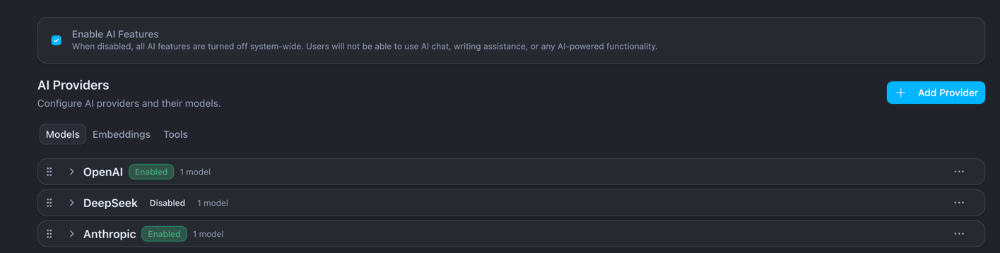
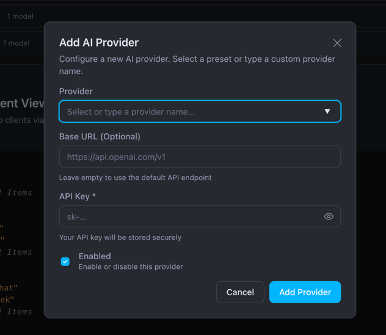
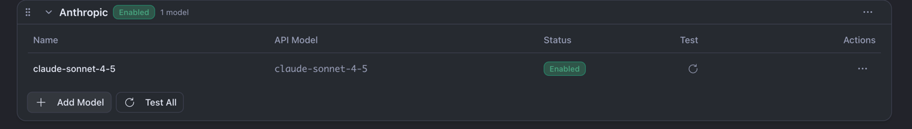
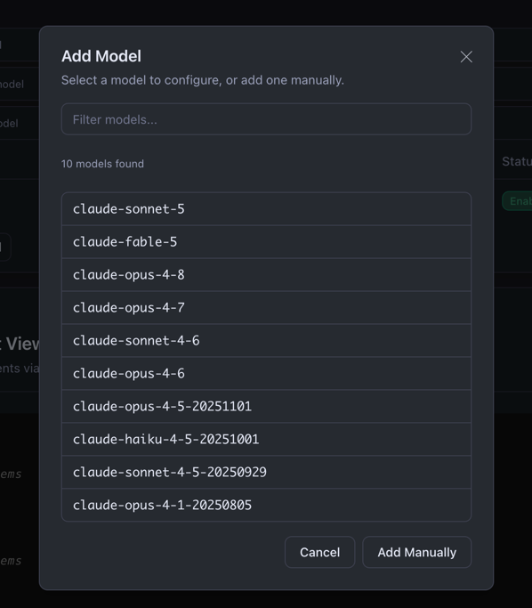
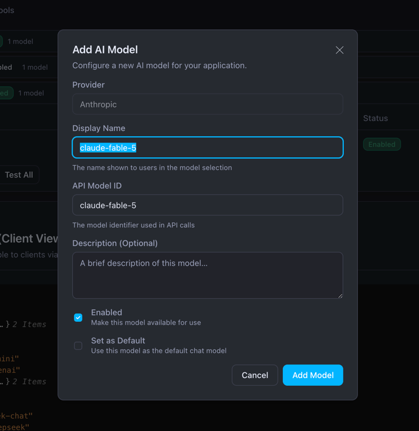
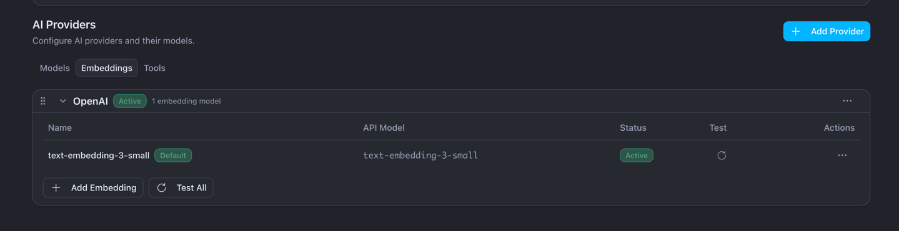
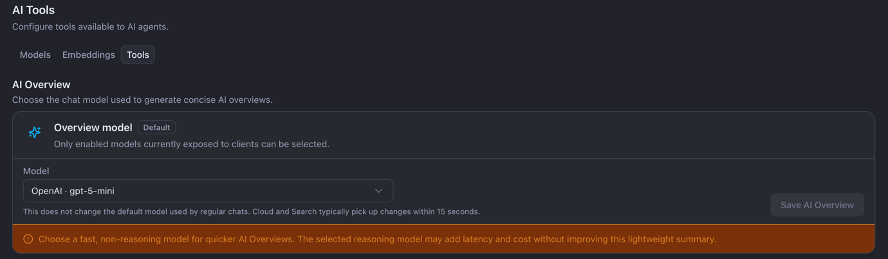
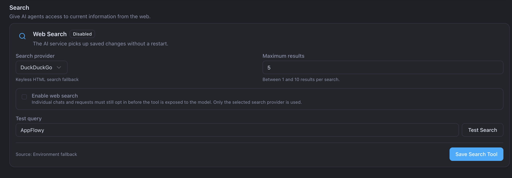

# Configure AI models

Use **Admin → Settings → AI Settings** to configure AI providers and models. Changes are saved in the database and normally do not require a redeployment.

> **Important:** Changing the embedding provider, model, model revision, or dimensions requires regenerating embeddings for every existing document. This is required even when the old and new models return the same number of dimensions.
>
> Changing the default embedding model does not automatically enqueue a bulk regeneration. Semantic search will be incomplete until all documents have been embedded with the new model.

## Before you begin

Make sure you have:

- A valid AppFlowy commercial license with AI enabled.
- Provider-aware versions of `admin-frontend`, `appflowy-cloud`, and `appflowy-ai`.
- An API key for each provider you want to use.
- Outbound network access from AppFlowy to the provider endpoint.

## 1. Enable AI

Open **AI Settings** and turn on **Enable AI Features**. When this setting is off, AI features are disabled for everyone.

## 2. Add a provider

Open the **Models** tab and select **Add Provider**.

| Provider        | What to enter                                                                                                                       |
| --------------- | ----------------------------------------------------------------------------------------------------------------------------------- |
| OpenAI          | API key. Leave **Base URL** empty for the official OpenAI endpoint. Use the Responses API for official OpenAI models.               |
| Azure OpenAI    | API key, Azure endpoint, and API version. Each model also needs its Azure deployment name.                                          |
| Anthropic       | API key. The base URL can normally be left empty.                                                                                   |
| DeepSeek        | API key and base URL. The base URL is required even if Admin labels it as optional.                                                 |
| Qwen            | API key and base URL. The default DashScope URL is `https://dashscope.aliyuncs.com/compatible-mode/v1`. Qwen uses Chat Completions. |
| Google Gemini   | API key. The base URL can normally be left empty.                                                                                   |
| Custom provider | API key, OpenAI-compatible base URL, and the API type supported by the endpoint.                                                    |

Both the provider and its models must be enabled.

## 3. Add a chat model

Expand the provider card and select **Add Model**. You can select a discovered model or use **Add Manually**.

Enter:

- **Display Name**: the name shown to users.
- **API Model ID**: the exact model ID used by OpenAI, Anthropic, DeepSeek, Qwen, Gemini, or a custom provider.
- **Deployment Name**: the exact Azure deployment name. Azure uses this instead of an API model ID.
- **Enabled**: makes the model available.
- **Set as Default**: makes it the default chat model.

Save the model, run its test, and confirm that the test passes. The **Available Models (Client View)** section shows which models AppFlowy clients can use.

## 4. Configure an embedding model

AppFlowy supports embedding models from OpenAI, Azure OpenAI, Qwen, and custom OpenAI-compatible providers. Model IDs and vector dimensions are not restricted to a fixed allowlist.

| Provider                     | Required model configuration                                                                                          |
| ---------------------------- | --------------------------------------------------------------------------------------------------------------------- |
| OpenAI                       | The exact API model ID, such as `text-embedding-3-small`.                                                             |
| Azure OpenAI                 | The exact API model ID and Azure deployment name.                                                                    |
| Qwen                         | The exact API model ID, such as `text-embedding-v4` or a pinned Qwen3 Embedding model ID.                             |
| Custom OpenAI-compatible API | The exact model ID accepted by the endpoint. Examples include `all-minilm`, `nomic-embed-text`, and `bge-m3`.         |

Anthropic, DeepSeek, and Gemini do not provide embedding backends in AppFlowy. If another service exposes an OpenAI-compatible embeddings API, configure it as a custom provider.

With pgvector, AppFlowy accepts tested dimensions from **1 to 16,000** and can store different dimensions in the same table. Typical native widths include 384 for MiniLM, 768 for Nomic, 1,024 for BGE-M3, and 1,536 for `text-embedding-3-small`; the dimension reported by the model test is authoritative.

The S3 Vectors backend remains limited to one configured dimension per index. The tested embedding model must return exactly the dimension configured by `APPFLOWY_S3_DOCUMENT_VECTOR_DIMENSION`.

To activate an embedding model:

1. Open the **Embeddings** tab.
2. Add a model from an embedding-capable provider and enter its exact **API Model ID**. For Azure OpenAI, also enter the deployment name.
3. Leave **Requested Dimensions** blank to use the model's native width. To request dimensionality reduction from a provider that supports it, enter a value from 1 to 16,000.
4. Select **Enabled** and **Set as Default**.
5. Select **Test & Add Embedding**. AppFlowy calls the provider, measures the returned vector, and registers an immutable storage profile for that provider, model, and dimension configuration.
6. Confirm that the test passes, reports the expected actual dimension and profile ID, and the model shows **Active**.

### Example: BGE-M3 with Ollama

Use Ollama as a custom OpenAI-compatible provider:

1. Make sure the Ollama host is running and has the `bge-m3` model available.
2. Open the **Models** tab, select **Add Provider**, and create a custom provider named **Ollama**.
3. Configure the provider:
   - **Base URL**: `http://<ollama-host>:11434/v1`
   - **API key**: any non-empty value for local Ollama, such as `ollama`
   - **Enabled**: yes
4. Open the **Embeddings** tab and add an embedding under the Ollama provider:
   - **Display Name**: `BGE-M3`
   - **API Model ID**: `bge-m3`
   - **Requested Dimensions**: leave blank to use the native width
   - **Enabled**: yes
   - **Set as Default**: yes, when ready
5. Select **Test & Add Embedding** and confirm that the test passes. BGE-M3 normally reports **1,024 dimensions**; use the actual dimension reported by the test.

`<ollama-host>` must be reachable from the AppFlowy containers. Do not use `localhost` unless Ollama runs in the same container or network namespace.

On an existing installation, set BGE-M3 as the default only when you are ready to regenerate every document embedding as described below.

### Changing the embedding model

Embedding vectors from different providers, models, revisions, or dimension configurations are not interchangeable. Equal dimensions do not make two models compatible, and old vectors must not be padded or truncated to fit a new dimension.

Changing only the default model does **not** enqueue all existing documents. Without a full regeneration, only newly created, edited, or explicitly replayed documents receive vectors in the new embedding profile, so semantic search against that profile will omit older documents.

For an existing installation:

1. Test and save the new model without deleting the old model or provider.
2. Run an operator-controlled full embedding regeneration for every existing document. Use the current AppFlowy document as the source; do not reuse or transform vectors from the old profile.
3. Verify that every document has been indexed with the new profile before relying on it for semantic search.
4. Keep the old model and profile available until the new index has been validated so that you can roll back if necessary.

There is currently no one-click bulk regeneration in Admin. Do not switch a production installation unless you have arranged a complete embedding backfill; switching the model alone is insufficient.

Keep `APPFLOWY_INDEXER_ENABLED=true` during this process.

## 5. Configure AI Overview

AI Overview can use a different model from normal chat:

1. Open **Tools → AI Overview**.
2. Select an enabled chat model.
3. Prefer a fast, non-reasoning model.
4. Select **Save AI Overview**.

Select **Use chat default** if AI Overview should follow the default chat model. Changes normally reach Cloud and Search within about 15 seconds.

## 6. Configure web search

Web search lets AI use current information from the web:

1. Open **Tools → Search**.
2. Select a search provider. **DuckDuckGo** is the keyless fallback.
3. Set **Maximum results** between 1 and 10.
4. Select **Enable web search**.
5. Enter a test query and select **Test Search**.
6. Select **Save Search Tool**.

Individual chats and requests must still opt in before AI can use web search.

## Important behavior

- Keep one enabled default chat model.
- Keep one active embedding model when semantic search is used.
- Treat every embedding model or dimension change as a new vector space and regenerate all existing document embeddings.
- A model works only when its provider is enabled and has a valid API key.
- Provider card order changes the order shown to clients; it does not change the default model.
- Before deleting a provider, move the chat default, embedding default, and AI Overview assignment to another provider.
- Environment variables are mainly used to bootstrap a new installation. After initialization, settings saved through Admin are authoritative.

## Troubleshooting

| Problem                                 | What to check                                                                      |
| --------------------------------------- | ---------------------------------------------------------------------------------- |
| AI Settings is missing                  | Check the commercial license and service versions.                                 |
| Model discovery fails                   | Check the API key and endpoint, or use **Add Manually**.                           |
| Model is not visible to clients         | Enable both the provider and model, then check **Available Models (Client View)**. |
| OpenAI-compatible requests fail         | Select the API type supported by the endpoint: Responses or Chat Completions.      |
| DeepSeek fails in AI Overview or Search | Configure an explicit DeepSeek base URL.                                           |
| Embedding test fails                    | Check the model ID and endpoint. Leave Requested Dimensions blank if the provider does not support dimensionality reduction. |
| Embedding model shows Standby           | Enable it and select **Set as Default**.                                           |
| Search misses older documents after an embedding switch | Restore the previous default or complete a full embedding regeneration. Changing the default does not backfill existing documents. |
| Changes are not visible immediately     | Wait about 15 seconds and refresh the client view.                                 |
