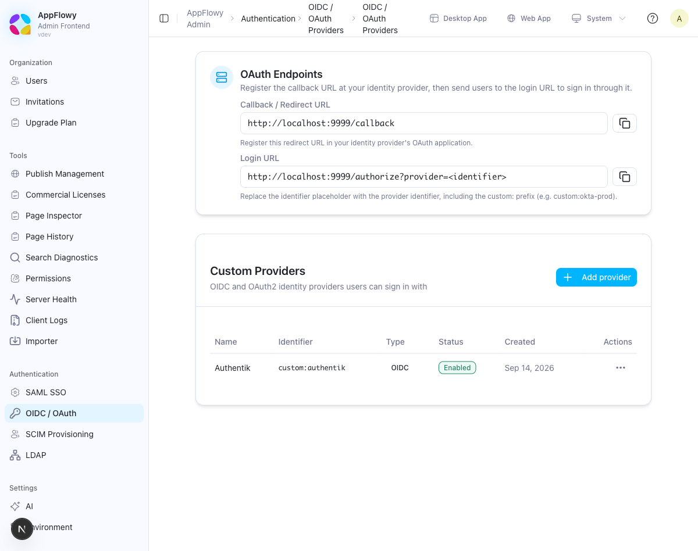
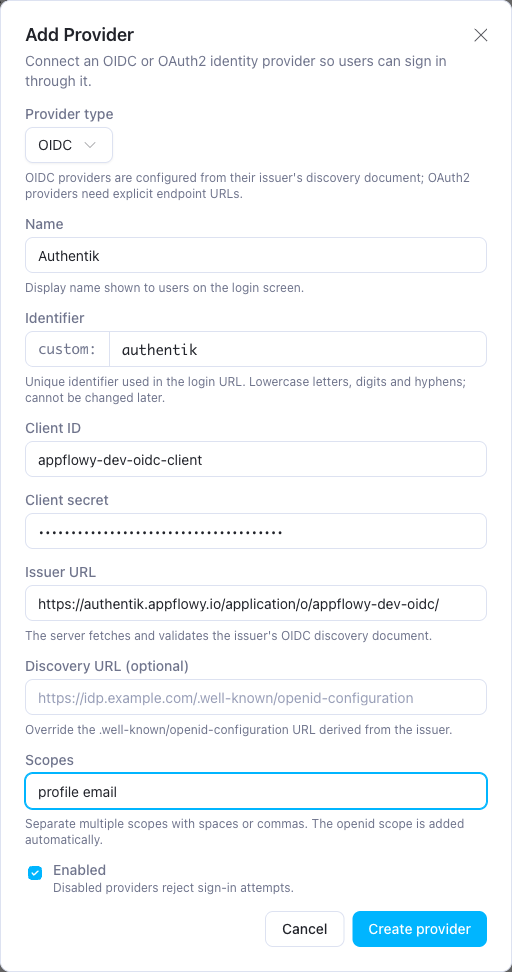
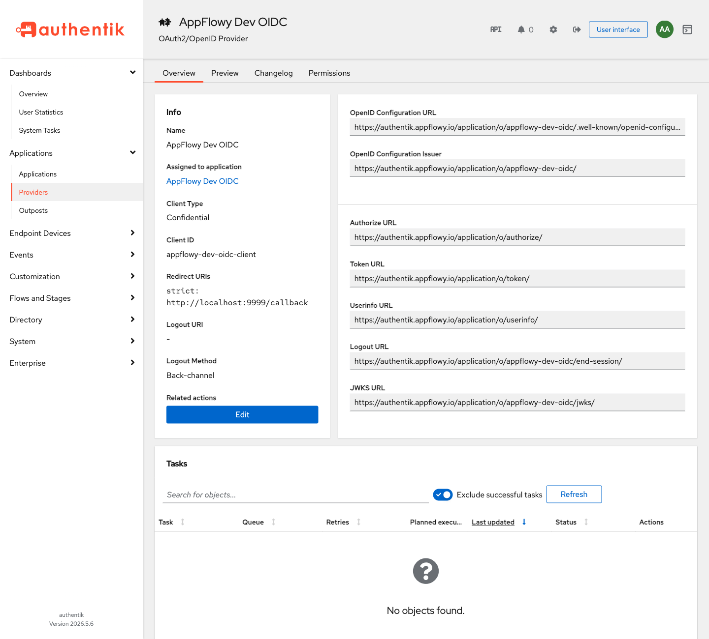
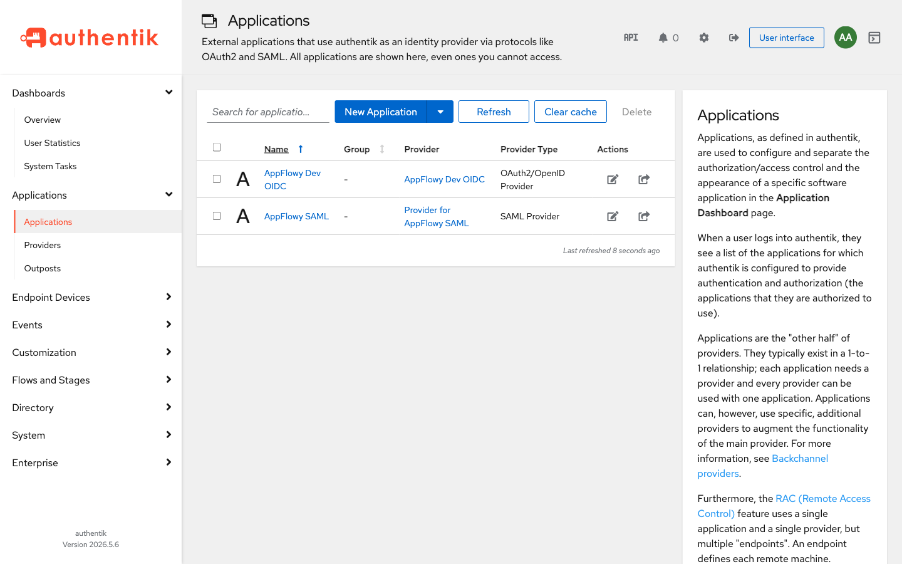

# OIDC / OAuth Sign-In

AppFlowy Self-Hosted lets you register any OpenID Connect (OIDC) or OAuth 2.0 identity provider (IdP) at runtime through the Admin console. No environment variables or restarts are required, and users see a **Continue with &lt;provider name&gt;** button on the sign-in page.

This is separate from the built-in Google, GitHub, and Discord providers, which are configured through environment variables (see [OAuth providers](docker-compose.md#oauth-providers); `deploy.env` also lists Apple settings, but the bundled `docker-compose.yml` does not pass them to the `gotrue` service), and from [SAML](OKTA_SAML.md).

## Before you begin

- **Run the latest AppFlowy Self-Hosted release** (AppFlowy Cloud, Admin Frontend, and AppFlowy Web) and the latest AppFlowy desktop app, so that the provider button appears on the sign-in page. See the [release notes](../README.md#release-notes).
- **Hold a Seed plan or higher.** The OIDC page is hidden in the Admin console on the Free Tier. See [Self-Hosted Plans and Pricing](https://appflowy.com/docs/Self-hosted-Plans-and-Pricing).
- **Set `SCHEME=https` and a DNS hostname in `FQDN` in `.env`.** The callback URL is built from them. Many IdPs, Google for example, refuse an `http://` redirect URI that is not localhost, and a bare IP address in `FQDN` breaks the return to the browser.
- **Make the IdP reachable over public HTTPS from the `gotrue` container.** For OIDC providers, the discovery document is fetched when you save the provider and again at sign-in (cached for an hour), and the token and userinfo endpoints are called at every sign-in. OAuth2 providers are only URL-validated when you save. AppFlowy validates every provider URL on save: the scheme must be `https`, the host cannot be `localhost` or a loopback address, and the hostname must resolve to public IP addresses. An IdP on a private network cannot be registered.
- **Register an OAuth application at the IdP that returns the user's email address.** Sign-in fails without an email unless `email_optional` is set through the API, which the Admin console does not expose (see [Managing providers](#managing-providers)). AppFlowy uses the authorization code flow with PKCE; the Admin console offers no switch to disable it (the API field `pkce_enabled` defaults to `true`).

## Step 1: Register an application at the identity provider

1. In the Admin console, sign in with the administrator account from `.env` and open **Authentication → OIDC / OAuth**.

   

   The menu screenshot has **SCIM Provisioning** selected; choose **OIDC / OAuth**.

2. The **OAuth Endpoints** card shows the URLs you need. The screenshots in this guide were taken on a development deployment, so they show `localhost` URLs and a development Authentik instance; the note below describes what a bundled deployment displays.

   

   | URL | Value | Purpose |
   | --- | --- | --- |
   | **Callback / Redirect URL** | `https://your-domain/gotrue/callback` | Register this as the redirect URI in the IdP's OAuth application. |
   | **Login URL** | `https://your-domain/gotrue/authorize?provider=custom:<identifier>` | Starts a sign-in through the provider. The console shows `<identifier>` as a placeholder; the clients insert the full identifier, including the `custom:` prefix. |

   The callback URL is the same `${API_EXTERNAL_URL}/callback` that the built-in OAuth providers use. With the bundled Docker Compose configuration, the console receives the internal GoTrue address and therefore displays `http://gotrue:9999/callback`. Always register the public form, `https://your-domain/gotrue/callback`, at the IdP.

3. Create a web application at the IdP with that redirect URI, enable the authorization code grant, and note the **Client ID**, the **Client secret**, and, for OIDC, the **Issuer URL**.

## Step 2: Add the provider in the Admin console

1. Click **Add provider**.
2. Complete the form.

   | Field | Description |
   | --- | --- |
   | **Provider type** | **OIDC** reads the provider's endpoints from its discovery document. **OAuth2** is for providers without discovery and requires explicit endpoint URLs. |
   | **Name** | Display name shown to users on the sign-in button, for example `Okta Production`. Up to 100 characters. |
   | **Identifier** | Unique ID used in the login URL, for example `okta-prod`. Lowercase letters, digits, and hyphens, starting and ending with a letter or digit. AppFlowy stores it as `custom:okta-prod`. It cannot be changed later. Up to 50 characters including the prefix. |
   | **Client ID** | From the IdP application. |
   | **Client secret** | From the IdP application. Write-only: it is never shown again. |
   | **Issuer URL** (OIDC) | The provider's issuer, exactly as the IdP publishes it. AppFlowy fetches `<issuer>/.well-known/openid-configuration` when you save and requires the document's `issuer` to match. |
   | **Discovery URL** (OIDC, optional) | Overrides the discovery document URL that AppFlowy fetches to validate the provider when you save. Sign-in still reads `<issuer>/.well-known/openid-configuration`, so the issuer must serve the standard path. |
   | **Authorization URL**, **Token URL**, **Userinfo URL** (OAuth2) | The provider's endpoints. No discovery document is fetched. |
   | **JWKS URI** (OAuth2, optional) | Stored and validated, but not used at sign-in. OAuth2 providers read the user from the Userinfo URL, and no ID token is verified. |
   | **Scopes** | Space- or comma-separated, for example `profile email`. For OIDC, `openid` is added automatically. Include scopes that return the user's email. |
   | **Enabled** | Disabled providers reject sign-in attempts. |

   

3. Click **Create provider**. Expect the toast **Provider created.** and a new row with the identifier, type, and **Enabled** status. For an OIDC provider, a successful save proves that the `gotrue` container could reach the IdP and that the discovery document was valid. For an OAuth2 provider it proves only that the endpoint hostnames resolve to public addresses; the endpoints are first contacted at sign-in. Missing fields and identifier-format problems are shown inline in the dialog. Errors returned by the server, including the ones below, appear as a toast notification while the dialog stays open.

   | Message | Fix |
   | --- | --- |
   | `URL must use HTTPS`, `URL cannot point to localhost or loopback addresses`, `Unable to resolve hostname`, `URL cannot resolve to private network addresses` | Use a public HTTPS hostname for the IdP. |
   | `Failed to fetch OIDC discovery document` or `returned HTTP <n>` | The `gotrue` container cannot reach the issuer, or the issuer has no discovery document. Check egress and the issuer spelling. Setting the **Discovery URL** only changes where the save-time check fetches the document; sign-in still reads `<issuer>/.well-known/openid-configuration`. |
   | An issuer mismatch error | The discovery document's `issuer` differs from what you typed, often by a trailing slash. Copy it exactly. |
   | `already exists` | The identifier is taken. Choose another one. |

### Issuer URL examples

| Provider | Issuer URL |
| --- | --- |
| Okta | `https://<your-org>.okta.com`, or a custom authorization server such as `https://<your-org>.okta.com/oauth2/default` |
| Microsoft Entra ID | `https://login.microsoftonline.com/<tenant-id>/v2.0` |
| Keycloak | `https://<keycloak-host>/realms/<realm>` |
| Authentik | `https://<authentik-host>/application/o/<application-slug>/` |

### Example: Authentik

In Authentik, create an **OAuth2/OpenID Provider** and an **Application** that uses it:

- **Client type**: Confidential.
- **Redirect URIs**: the callback URL, `https://your-domain/gotrue/callback`.
- **Scopes**: the `openid`, `email`, and `profile` scope mappings. `openid` and `email` are required, because sign-in fails without an email; `profile` supplies the name that AppFlowy shows for the user.

The provider's overview page shows everything the AppFlowy form needs. Use the **OpenID Configuration Issuer** value, including its trailing slash, as the **Issuer URL**, and the **Client ID** shown under **Info**. The client secret is generated when you create the provider and can be revealed again on its edit form. Because the issuer ends with a slash, the save-time check requests a double-slash path (`.../<application-slug>//.well-known/openid-configuration`). Authentik answers it with a redirect to the correct document, which the check follows, so the provider saves with an empty **Discovery URL**. To avoid depending on that redirect, set **Discovery URL** to the **OpenID Configuration URL** shown on the same page.



The redirect URI in this screenshot is the development deployment's `http://localhost:9999/callback`. Register `https://your-domain/gotrue/callback` on yours.



## Step 3: Sign in

On the AppFlowy Web sign-in page, each enabled provider appears as **Continue with &lt;Name&gt;**; the desktop app offers the same providers. Built-in providers are listed first, then LDAP, then custom providers, and only two options are shown before **More options**. Clicking the button sends the browser to the IdP and back to `https://your-domain/gotrue/callback`, after which AppFlowy opens the user's last workspace.


AppFlowy identifies the user by the email address that the provider returns:

- With the default `GOTRUE_MAILER_AUTOCONFIRM=true`, every email the IdP asserts is treated as verified and links to any existing AppFlowy account with that email, including accounts created with a password or through [SCIM](SCIM.md). Register only IdPs that you trust to assert email addresses.
- With `GOTRUE_MAILER_AUTOCONFIRM=false`, the IdP must return `email_verified: true`. Otherwise nothing is linked: the authentication service creates a separate unconfirmed account (without the email when that address already belongs to another account) and rejects the sign-in with `Unverified email with custom:<id> ...`. A confirmation email is sent only when the address is not already taken.
- New users are created on first sign-in when sign-up is allowed (`GOTRUE_DISABLE_SIGNUP=false`, the default). There is no per-provider sign-up switch. A new user consumes a licensed seat.

A rejected callback shows a **Login failed** dialog with the IdP's error description. The most common one, `Error getting user email from external provider`, means the scopes do not return an email.

## Managing providers

Use the **Actions** menu on the **Custom Providers** table.

- **Disable / Enable** pauses or resumes sign-in through the provider. Existing sessions are not revoked; delete the user in **Users** if that is required.
- **Edit provider** updates the name, credentials, endpoints, or scopes. The type and identifier cannot be changed. Leave **Client secret** blank to keep the current secret.
- **Delete provider** stops sign-in through the provider immediately. Existing accounts are not removed, but those users must sign in another way.

Group membership from OIDC claims is not synchronized. Use [SCIM provisioning](SCIM.md) to manage workspace membership and roles from the IdP.

The admin API behind the console (`/api/admin/sso/custom-providers`) also accepts `pkce_enabled`, `email_optional`, `acceptable_client_ids`, `attribute_mapping`, `authorization_params`, and `skip_nonce_check`, which the console does not expose.

## Verify the setup

Replace `<id>` with the identifier without the `custom:` prefix, for example `okta-prod`.

### 1. The provider is advertised to clients

```bash
curl -s https://your-domain/api/server-info/auth-providers
```

Expect `"code":0`, `"custom:<id>"` inside `data.providers`, and `{"identifier":"custom:<id>","name":"<Name>"}` inside `data.custom_providers`. The `custom_providers` key is omitted entirely when no provider is enabled. Changes made in the console are visible at once; on multi-replica deployments, other replicas catch up within 30 seconds.

If the provider is missing although the console shows it as **Enabled**, check the server log for `Failed to list custom auth providers`. AppFlowy lists providers with a service token that it signs using `GOTRUE_JWT_SECRET`. A `GOTRUE_JWT_SECRET` that differs between the `appflowy_cloud` and `gotrue` services, or a GoTrue that `appflowy_cloud` cannot reach, hides every custom provider from the sign-in page while the console still lists them. `GOTRUE_ADMIN_EMAIL` and `GOTRUE_ADMIN_PASSWORD` are used only to sign in to the console.

### 2. The authorize URL redirects to the IdP

Use a `GET` request; the endpoint answers `405` to `HEAD`.

```bash
curl -s -o /dev/null -w 'status=%{http_code}\nlocation=%{redirect_url}\n' \
  "https://your-domain/gotrue/authorize?provider=custom:<id>&redirect_to=https://your-domain/auth/callback"
```

Expect `status=302` and a `location` at the IdP's authorization endpoint containing `client_id=<Client ID>`, `redirect_uri=https%3A%2F%2Fyour-domain%2Fgotrue%2Fcallback`, `response_type=code`, `scope=openid+...`, `state=...`, and `code_challenge=...`. Each call creates a short-lived sign-in state that expires after 5 minutes.

A `400` with a JSON body instead of a redirect names the cause.

| Message | Cause |
| --- | --- |
| `Unsupported provider: custom provider custom:<id> not found` | Wrong identifier, or the provider was deleted. |
| `Unsupported provider: custom provider custom:<id> is disabled` | Disabled in the console. |
| `Unsupported provider: error creating OIDC provider: ...` | The `gotrue` container could not fetch the discovery document and has no cached copy (for example after a restart), or the issuer changed. See step 6. |

### 3. The IdP accepts the request

Paste the `location` value from step 2 into a private browser window within 5 minutes. The IdP shows its login form or, if you are already signed in there, sends you straight back into AppFlowy. This is the only step that catches IdP-side problems such as an unregistered redirect URI, a disabled authorization code grant, or a wrong client ID, which most IdPs report as an error page.

### 4. The button appears on the sign-in page

Open `https://your-domain/login` in a private window. Expect **Continue with &lt;Name&gt;**, possibly under **More options**. No button while step 1 passes means that AppFlowy Web is outdated.

### 5. End-to-end sign-in

Click the button and sign in at the IdP with a test account. Use an email that already has an AppFlowy account, which links without consuming a seat, or a dedicated test account that you will delete afterwards. Expect the IdP to redirect to `https://your-domain/gotrue/callback?code=...&state=...` and AppFlowy Web to open a workspace.

Then confirm the identity in the Admin console: open **Users** and search for the email. The row shows the sign-in time under **Last sign in**. The table has no provider column; to see the provider, open the browser's developer tools on that page and inspect the `GET /api/admin/users?...&email=...` response, where `identities[].provider` contains `custom:<id>`.

To remove a dedicated test account afterwards, choose **Delete User** on its row.

### 6. Ongoing checks

- **Issuer reachability.** AppFlowy re-reads the discovery document at sign-in time and caches it for an hour (`GOTRUE_EXTERNAL_OIDC_PROVIDER_CACHE_TTL`), falling back to the last cached copy if the refresh fails. An IdP that later becomes unreachable from the `gotrue` container therefore fails at the token exchange with `Unable to exchange external code: ...`, while the console still shows the provider as **Enabled**. Check from inside the container:

  ```bash
  docker compose exec gotrue curl -sS -o /dev/null -w '%{http_code}\n' '<issuer>/.well-known/openid-configuration'
  ```

  Expect `200`.
- **Client secret expiry.** IdPs expire client secrets (Entra ID caps them at 24 months and recommends less than 12). AppFlowy gives no warning; users see a **Login failed** dialog with `Unable to exchange external code: ...`. Put the expiry on a calendar and update the secret through **Edit provider**.
- **Disable check.** After **Disable**, step 1 no longer lists the provider and step 2 returns `400` with `is disabled`. Reload `https://your-domain/login` in a private window to confirm that the button has disappeared.

## Troubleshooting

| Symptom | Cause | Fix |
| --- | --- | --- |
| `URL must use HTTPS`, `URL cannot point to localhost or loopback addresses`, or `Unable to resolve hostname` when saving | The issuer or endpoint URL failed validation. | Use a public HTTPS hostname for the IdP. Private or local IdPs cannot be registered. |
| Discovery document error when saving | The issuer does not serve `/.well-known/openid-configuration`, or its `issuer` value differs from what you typed. | Copy the issuer exactly as the IdP publishes it. The **Discovery URL** only redirects the save-time check; sign-in still needs `<issuer>/.well-known/openid-configuration`. |
| IdP shows a `redirect_uri` mismatch | The redirect URI registered at the IdP differs from the callback URL, or `SCHEME` is still `http`. | Register `https://your-domain/gotrue/callback` exactly and set `SCHEME=https`. |
| After the IdP login, the browser tries to open the desktop app or an `appflowy-flutter://` address | `FQDN` is an IP address, or `GOTRUE_URI_ALLOW_LIST` (set to `**` in `docker-compose.yml`) was tightened. | Use a DNS hostname in `FQDN`; an IP address never passes the redirect check. If you restricted `GOTRUE_URI_ALLOW_LIST`, keep `https://your-domain/auth/callback` in it. |
| Provider button missing on the sign-in page | The provider is disabled, the clients are outdated, the deployment is on the Free Tier, or `GOTRUE_JWT_SECRET` differs between the `appflowy_cloud` and `gotrue` services. | Enable the provider, upgrade AppFlowy Web and the desktop app, upgrade the plan, or align the secret. Reload the sign-in page after changes. |
| **Login failed** with `Error getting user email from external provider` | The IdP did not return an email. | Add the `email` scope (and `profile`). |
| **Login failed** with `Unable to exchange external code: ...` | The client secret is wrong or expired, or the IdP is unreachable from the `gotrue` container. | Re-enter the client secret, or check reachability from the container. |
| **Login failed** with `Signups not allowed for this instance` | Sign-up is disabled for the deployment. | Invite the user first, or set `GOTRUE_DISABLE_SIGNUP=false`. |
| `405 Method Not Allowed` from the authorize URL | The check used a `HEAD` request. | Use `GET`. |
