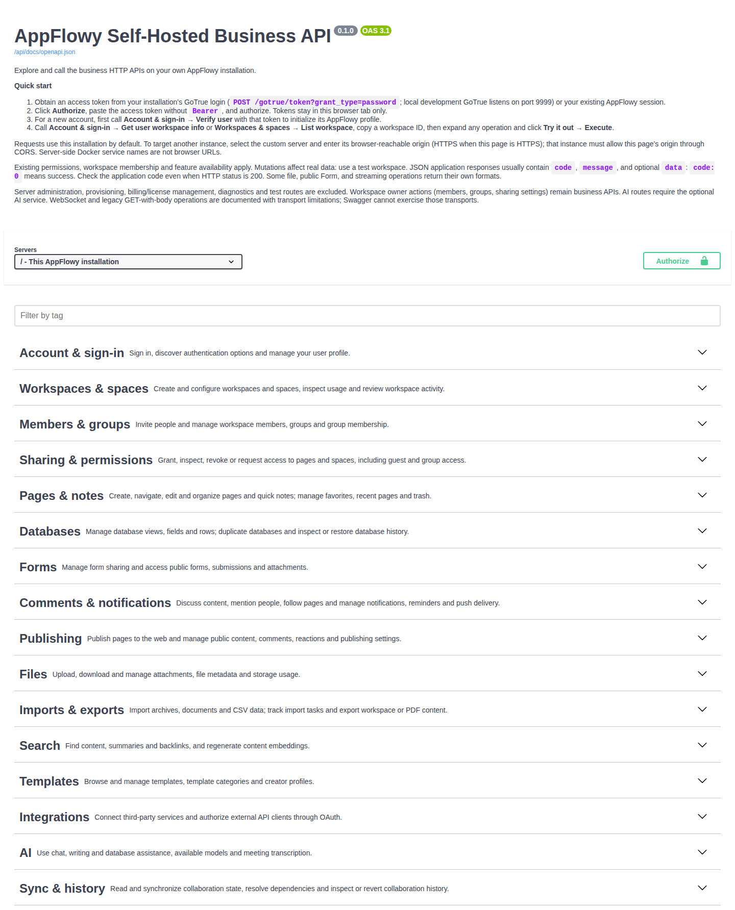
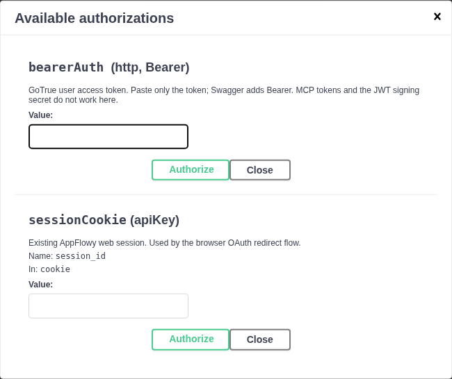
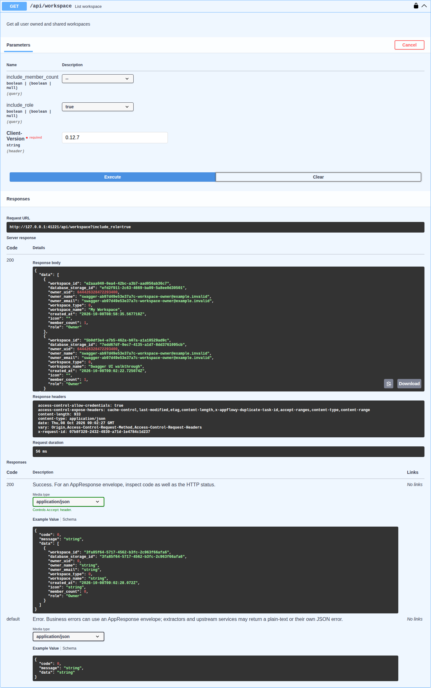
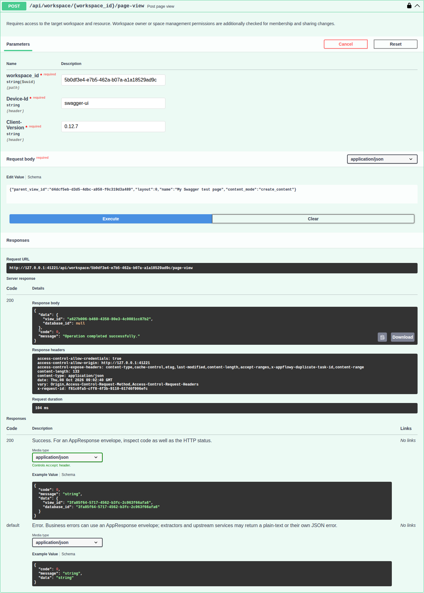
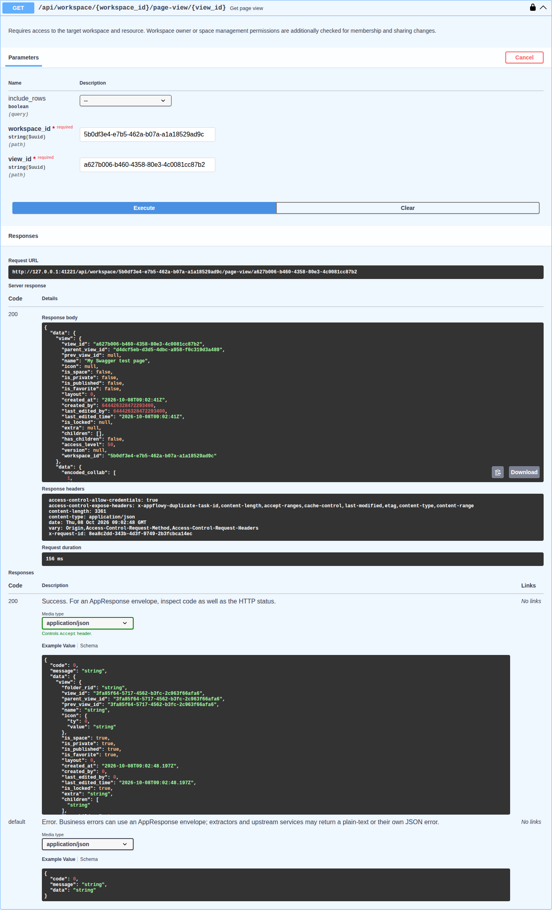
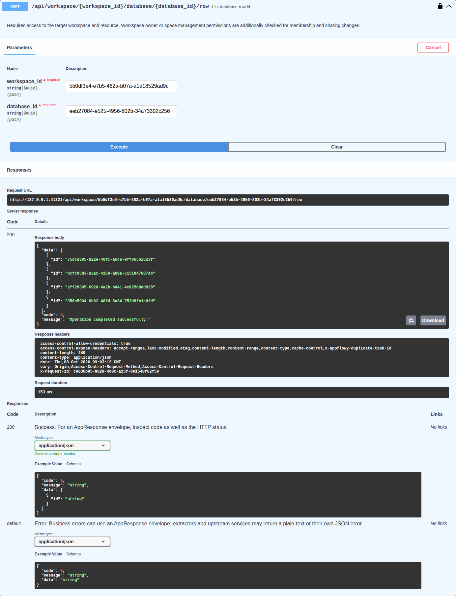
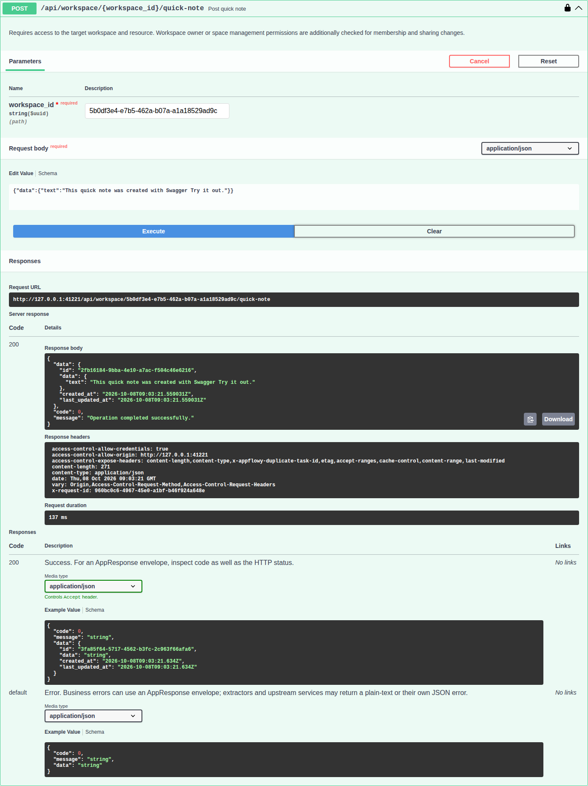
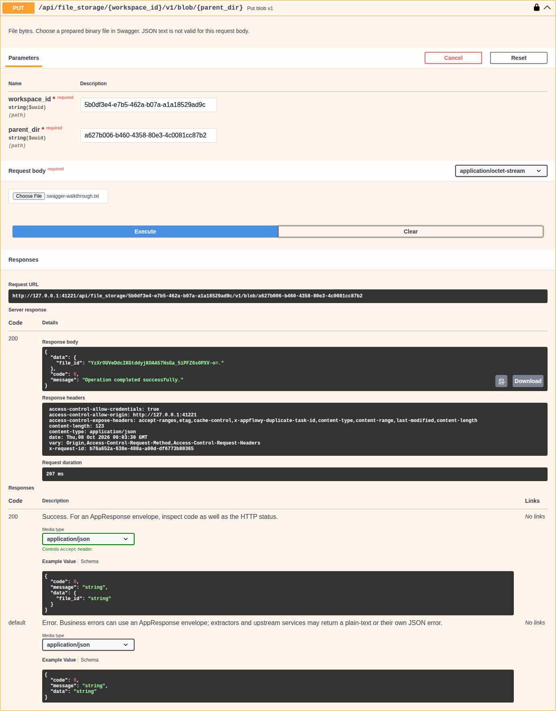
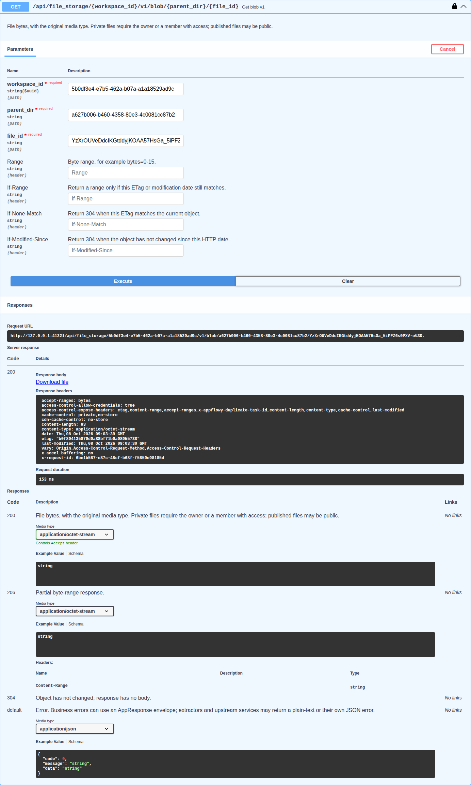

# AppFlowy OpenAPI and Swagger UI

Open `https://your-domain/api/docs` to browse AppFlowy's business APIs and send requests to your own
installation through Swagger UI. With the default local Docker Compose setup, open
[http://localhost/api/docs](http://localhost/api/docs).

Start with these four steps: **open Swagger → authorize → list workspaces → try another API**.

## Watch the 94-second walkthrough

This recording shows the current 16-category Swagger UI, authorization, and real requests for
workspaces, pages, database rows, quick notes, and file upload/download. Press **Play** below,
then follow the steps.

https://github.com/user-attachments/assets/aaaf5d22-7026-4184-828c-5d1d35ad5d27

The recording and response screenshots use disposable data from a local development preview
captured on 2026-10-08 against a hosted-mode test server. Use your own deployment URL and IDs;
the preview's localhost port is not a deployment setting. Credentials are masked and generated
curl output is hidden in these examples. All screenshots and the video use the same API categories
described below.

## Before you begin

- Run a self-host AppFlowy Cloud image containing the Swagger integration. Older images do not
  include the page. Custom Cloud builds must enable the `self-host-af` Cargo feature.
- Start your deployment using the [Docker Compose guide](docker-compose.md). Use your deployment's
  domain, scheme, and published port in place of the examples in this guide.
- Sign in to AppFlowy with a user who can access the workspace you want to test.

Swagger UI and the OpenAPI document are bundled inside the `appflowy_cloud` image. They are enabled
automatically for self-host builds; no separate Swagger image, account, or environment flag is
needed. All UI assets are served by your installation.

`APPFLOWY_ENABLE_SWAGGER` is no longer used. Remove it from older `.env` files or Compose overrides;
setting it to `false` does not disable Swagger.

## Step 1: Open Swagger

| Resource | URL |
| --- | --- |
| Interactive Swagger UI | `https://your-domain/api/docs` |
| OpenAPI JSON document | `https://your-domain/api/docs/openapi.json` |

The bundled [Nginx configuration](../docker/nginx/nginx.conf) already forwards `/api` to Cloud,
including `/api/docs` and its subpaths. If you use a custom reverse proxy, preserve these paths and
forward them to the same Cloud service as your other API requests.

Leave **Servers** set to **This AppFlowy installation**. Use **Filter by tag** to find a category,
then expand an operation. The **Authorize** button is beside the server selector.



### Find the right category

Categories follow the task you want to perform. Each API appears once, so related operations stay
together even when their URLs use different prefixes.

| Category | Use it to… |
| --- | --- |
| **Account & sign-in** | Sign in, inspect available sign-in methods, and manage your profile. |
| **Workspaces & spaces** | Create and configure workspaces and spaces, and inspect workspace activity. |
| **Members & groups** | Invite people and manage workspace members and groups. |
| **Sharing & permissions** | Grant, inspect, revoke, or request access to pages and spaces. |
| **Pages & notes** | Create, read, organize, and delete pages and quick notes; browse the folder tree. |
| **Databases** | Manage database views, fields, and rows; duplicate or restore a database. |
| **Forms** | Manage form sharing and submit public forms. |
| **Comments & notifications** | Comment, mention people, follow pages, and manage reminders and notifications. |
| **Publishing** | Publish pages to the web and manage published content. |
| **Files** | Upload, download, and manage attachments. |
| **Imports & exports** | Import documents or CSV data and export workspaces or PDFs. |
| **Search** | Find content and backlinks, or rebuild search embeddings. |
| **Templates** | Browse and manage templates, their categories, and creators. |
| **Integrations** | Connect external services and authorize third-party API clients. |
| **AI** | Use chat, writing assistance, database assistance, models, and meeting transcription. |
| **Sync & history** | Synchronize collaboration state and inspect or revert its versions. |

For example, find a CSV import under **Imports & exports**, a group access grant under
**Sharing & permissions**, and database duplication under **Databases**.

Server administration, SCIM provisioning, and license/billing management are excluded. Available
features still depend on your installation's configuration and license.

## Step 2: Authorize requests

Browsing the reference does not require an API token. To execute authenticated operations, use a
GoTrue **user access token** issued by this installation:

1. Sign in to AppFlowy Web. In your browser's developer tools, open **Network**, then open or reload
   a workspace.
2. Select an authenticated request to your installation's `/api/` routes. Under request headers,
   copy the token from `Authorization: Bearer <token>` without the `Bearer ` prefix.
3. In Swagger UI, click **Authorize**, paste the token into **bearerAuth**, click **Authorize**,
   then close the dialog.

Paste only the token into the **Value** field shown below. Swagger adds the `Bearer` prefix for you.
Use **bearerAuth** and leave **sessionCookie** empty for these API requests.



### Alternative: Get a token with email and password

For an account with email/password sign-in, you can also obtain `access_token` from GoTrue:

```bash
curl --request POST 'https://your-domain/gotrue/token?grant_type=password' \
  --header 'Content-Type: application/json' \
  --data '{"email":"your-email","password":"your-password"}'
```

Use the `access_token` field from the response. For SSO or other sign-in methods, use your signed-in
browser session as described above. The JWT signing secret, an admin service key, and an MCP token
are not user access tokens. Keep your token private; it grants your account's permissions.

Swagger retains authorization in the current tab's memory. Refreshing the page clears it. If the
token expires, obtain a new one and authorize again.

## Step 3: List your workspaces

1. Expand **Workspaces & spaces → List workspace** (`GET /api/workspace`).
2. Click **Try it out**, then **Execute**.
3. Scroll to **Server response** and find your workspaces under `data`. For AppFlowy's JSON
   envelope, `code: 0` means success; HTTP `200` alone does not guarantee business success.
4. Copy a returned workspace ID into another operation's `workspace_id` parameter. Replace example
   page, database, and object IDs with real IDs from that workspace.



Requests run with your user's normal permissions. Use a test workspace for write operations:
creating, updating, or deleting through Swagger changes the actual installation. An account created
directly through GoTrue must first initialize its AppFlowy profile; opening AppFlowy Web completes
the normal sign-in flow before you test workspace APIs.

Some operations require additional setup, such as an AI provider, an existing page, or a binary
file in the documented format. WebSocket and legacy GET-with-body operations are listed with
**Try it out** disabled because the browser cannot execute those transports.

## Step 4: Try another API

Every operation follows the same flow: **Try it out → fill in the parameters and body → Execute →
inspect Server response**. Use IDs returned by your installation, rather than copying the IDs in
these screenshots.

### Create a page

1. Open **Pages & notes → Post page view** (`POST /api/workspace/{workspace_id}/page-view`).
2. Set `workspace_id` to the ID from step 3. In the body, set `parent_view_id` to an existing space
   in that workspace and set the page `name`. The example below creates a document with `layout: 0`
   and `content_mode: "create_content"`.
3. Click **Execute**. On success, copy `data.view_id` from **Server response** for the next request.

Example body (replace `YOUR_SPACE_ID` with an existing space ID):

```json
{
  "parent_view_id": "YOUR_SPACE_ID",
  "layout": 0,
  "name": "My Swagger test page",
  "content_mode": "create_content"
}
```



### Read the page you created

Open **Pages & notes → Get page view**, reuse the same `workspace_id`, and set `view_id` to the
ID returned when creating the page. Execute it to inspect the page content in **Server response**.



### List database row IDs

Open **Databases → List database row id** for a database already present in your workspace.
Fill in its workspace and database IDs, then execute the operation. Copy a returned row ID when
testing operations on an individual row.



### Create a quick note

Open **Pages & notes → Post quick note**, fill in the workspace ID and note content, then click
**Execute**. The response contains the newly created note, which you can use in later read or
update requests.



### Upload a file

Open **Files → Put blob v1**, fill in the required parameters and select a local file using the
file input, then click **Execute**. Retain the uploaded file's identifiers for the download request.



### Download the file

Open **Files → Get blob v1** and use the same workspace and stored file identifiers. After
**Execute**, use the **Download file** link in **Server response** to save the returned bytes.



## Download and update the document

Download your installation's OpenAPI document for use in another API client or code generator:

```bash
curl --fail --output appflowy-openapi.json 'https://your-domain/api/docs/openapi.json'
```

The document belongs to the running Cloud release. When upgrading, select the intended
`APPFLOWY_CLOUD_VERSION` in the root `.env`, follow that release's upgrade instructions and companion
service requirements, then pull and recreate Cloud. From the repository root, the Cloud steps are:

```bash
docker compose pull appflowy_cloud
docker compose up -d appflowy_cloud
```

Refresh `/api/docs` afterward to load the updated reference. No separate Swagger deployment is
needed. New APIs appear when the installed Cloud release includes them in its bundled document;
refreshing the page alone does not upgrade Cloud.

## Troubleshooting

| Symptom | What to check |
| --- | --- |
| `/api/docs` returns `404` | Confirm the running image includes Swagger support and is a self-host build. Verify that your proxy forwards `/api/docs` and its subpaths to Cloud. |
| The page is blank or cannot load the definition | Open `/api/docs/openapi.json` directly; it should return JSON. Check that the proxy also forwards the UI JavaScript and CSS under `/api/docs/`. |
| A request returns `401` | Authorize with a current user access token from this installation. Refreshing Swagger clears the token. |
| A request returns `403` or a nonzero application `code` | Read the response message and check workspace membership, permissions, feature configuration, and required input IDs. |
| A request reports a network or CORS error | Use **This AppFlowy installation**. A custom server must be reachable by your browser and permit the Swagger page's origin; an HTTPS page needs an HTTPS API. |
| Documentation still looks old after an upgrade | Confirm Cloud was recreated with the intended image, refresh the page, and check whether an external proxy or CDN is serving cached assets or JSON. |
