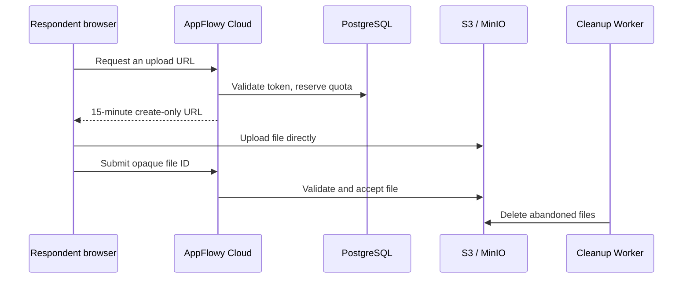
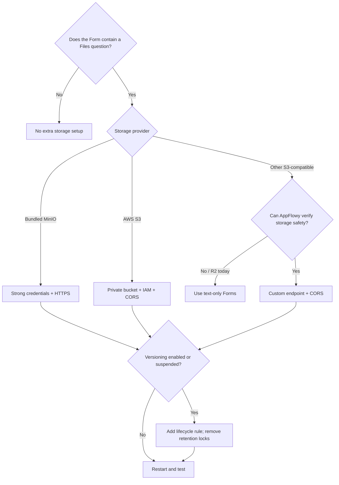

# Public Form file storage

Use this guide only when a Public Form contains a **Files** question. Text-only Forms need no
additional storage setup.

For most self-hosted deployments, use the bundled MinIO service and complete section 1 only.

## How uploads work

The browser uploads each file directly to S3 or MinIO with a short-lived, create-only presigned
URL. AppFlowy then validates the stored object and the cleanup Worker deletes abandoned files.



Because file bytes bypass Cloud, storage must remain private, use HTTPS, enforce the signed
request, and allow reliable deletion.

## Choose a setup



## 1. Bundled MinIO

In `docker/.env`, set your public domain, HTTPS, and random MinIO credentials:

```dotenv
FQDN=appflowy.example.com
SCHEME=https
WS_SCHEME=wss

AWS_ACCESS_KEY=<random-minio-root-user>
AWS_SECRET=<long-random-minio-root-secret>
```

Then:

1. Keep the supplied `APPFLOWY_S3_*` values unchanged.
2. Install a TLS certificate for `FQDN` in `docker/nginx/ssl/`.
3. Do not expose MinIO port `9000` publicly. Keep the supplied `/minio-api` Nginx route.

A fresh bundled MinIO bucket is unversioned and same-origin with AppFlowy Web. It needs no manual
CORS, lifecycle, or Object Lock configuration.

If this bucket was ever versioned, open `https://<FQDN>/minio`, check **Buckets → appflowy →
Versioning**, and follow section 4 when its status is enabled or suspended.

## 2. AWS S3

Pre-create a private general-purpose bucket, enable S3 Block Public Access, and use dedicated
credentials. In `docker/.env`, set:

```dotenv
APPFLOWY_S3_USE_MINIO=false
APPFLOWY_S3_CREATE_BUCKET=false
APPFLOWY_S3_ACCESS_KEY=<access-key-id>
APPFLOWY_S3_SECRET_KEY=<secret-access-key>
APPFLOWY_S3_BUCKET=<bucket-name>
APPFLOWY_S3_REGION=<aws-region>
APPFLOWY_S3_PRESIGNED_URL_ENDPOINT=
```

Do not commit `docker/.env`. Remove or disable the optional `minio` service in
`docker/docker-compose.yml`; otherwise Compose also passes the AWS credentials to MinIO as root
credentials. The unused Nginx `/minio` and `/minio-api` locations may also be removed.

### IAM

Add these Form permissions to the complete AppFlowy storage policy. Replace `<bucket-name>`:

```json
{
  "Version": "2012-10-17",
  "Statement": [
    {
      "Effect": "Allow",
      "Action": [
        "s3:ListBucket",
        "s3:GetBucketVersioning",
        "s3:GetLifecycleConfiguration",
        "s3:GetBucketObjectLockConfiguration"
      ],
      "Resource": "arn:aws:s3:::<bucket-name>"
    },
    {
      "Effect": "Allow",
      "Action": ["s3:PutObject", "s3:GetObject", "s3:DeleteObject"],
      "Resource": "arn:aws:s3:::<bucket-name>/form-uploads/*"
    }
  ]
}
```

Other AppFlowy features use other bucket prefixes, so this is a supplement rather than a complete
storage policy.

### Browser CORS

Allow only the exact HTTPS origin serving AppFlowy Web:

```json
{
  "CORSRules": [
    {
      "AllowedOrigins": ["https://appflowy.example.com"],
      "AllowedMethods": ["PUT", "GET", "HEAD"],
      "AllowedHeaders": ["Content-Type", "Content-Length", "If-None-Match"],
      "ExposeHeaders": ["ETag"],
      "MaxAgeSeconds": 3600
    }
  ]
}
```

Apply it with the AWS console or CLI. `put-bucket-cors` replaces all existing CORS rules, so merge
this rule into the existing configuration instead of overwriting unrelated rules.

```bash
aws s3api put-bucket-cors \
  --bucket YOUR_BUCKET_NAME \
  --cors-configuration file://cors.json
```

Do not use `*` for `AllowedOrigins`.

## 3. Other S3-compatible storage

Object `PUT` and `GET` compatibility alone is insufficient. The provider must also support:

- SigV4 presigned `PUT`, `GET`, and `HEAD`, including `If-None-Match: *`.
- `HeadObject`, `DeleteObject`, and conditional `CopyObject`.
- `GetBucketVersioning`.
- Lifecycle and retention inspection when versioning is enabled or suspended.
- Inspection of any provider-specific lock that can prevent deletion.

For a compatible custom endpoint, set:

```dotenv
APPFLOWY_S3_USE_MINIO=true
APPFLOWY_S3_CREATE_BUCKET=false
APPFLOWY_S3_MINIO_URL=https://s3-api.storage.example.com
APPFLOWY_S3_ACCESS_KEY=<access-key-id>
APPFLOWY_S3_SECRET_KEY=<secret-access-key>
APPFLOWY_S3_BUCKET=<bucket-name>
APPFLOWY_S3_REGION=<provider-region>
APPFLOWY_S3_PRESIGNED_URL_ENDPOINT=https://s3-api.storage.example.com
```

`APPFLOWY_S3_USE_MINIO=true` is currently also the custom-endpoint mode. Configure exact-origin
CORS and disable the bundled MinIO service as described in section 2.

> **Cloudflare R2 is not currently verified for Public Form file questions.** Its object API may
> work, but AppFlowy cannot reliably inspect S3 versioning/Object Lock or R2
> [Bucket Locks](https://developers.cloudflare.com/r2/buckets/bucket-locks/). It therefore cannot
> prove that uploaded files remain deletable. Use R2 only for text-only Forms until AppFlowy adds
> provider-specific checks. See Cloudflare's
> [S3 compatibility table](https://developers.cloudflare.com/r2/api/s3/api/).

## 4. Versioned or suspended buckets

`Suspended` still counts as versioned because older object versions can remain billable. Add this
rule for `form-uploads/`:

```json
{
  "Rules": [
    {
      "ID": "appflowy-form-upload-hidden-version-cleanup",
      "Status": "Enabled",
      "Filter": {"Prefix": "form-uploads/"},
      "NoncurrentVersionExpiration": {"NoncurrentDays": 1},
      "Expiration": {"ExpiredObjectDeleteMarker": true}
    }
  ]
}
```

Apply it with your provider's console or API. For AWS:

```bash
aws s3api put-bucket-lifecycle-configuration \
  --bucket YOUR_BUCKET_NAME \
  --lifecycle-configuration file://form-upload-lifecycle.json
```

This command replaces all lifecycle rules. Merge it with existing rules. The final policy must:

- Expire noncurrent `form-uploads/` versions after exactly one day.
- Leave current Form objects unchanged.
- Have no default Object Lock or provider lock that prevents deletion.

Keep `APPFLOWY_PUBLIC_FORM_ALLOW_LEGACY_UPLOAD_PROTOCOL` unset or `false`.

## 5. Restart and verify

After changing credentials, IAM, versioning, lifecycle, or retention, recreate Cloud and Worker:

```bash
cd docker
docker compose up -d --force-recreate appflowy_cloud appflowy_worker
docker compose logs appflowy_cloud appflowy_worker
```

Confirm both services report:

```text
public Form upload storage safety verified
public Form upload cleanup storage safety verified
```

Finally, submit a public Form containing a file no larger than 5 MiB and confirm that its response
row contains a downloadable attachment.

A CORS-only change does not require an AppFlowy restart. Restart Nginx only after changing its
certificate, route, or public endpoint.

If verification fails, recent AppFlowy versions keep the server available but return `503
form_uploads_unavailable` for new Form file operations and pause cleanup. Text-only Forms continue
to work. If Cloud or Worker exits instead, upgrade both services together.

No Form read, submit, or materialization feature flag is required.
