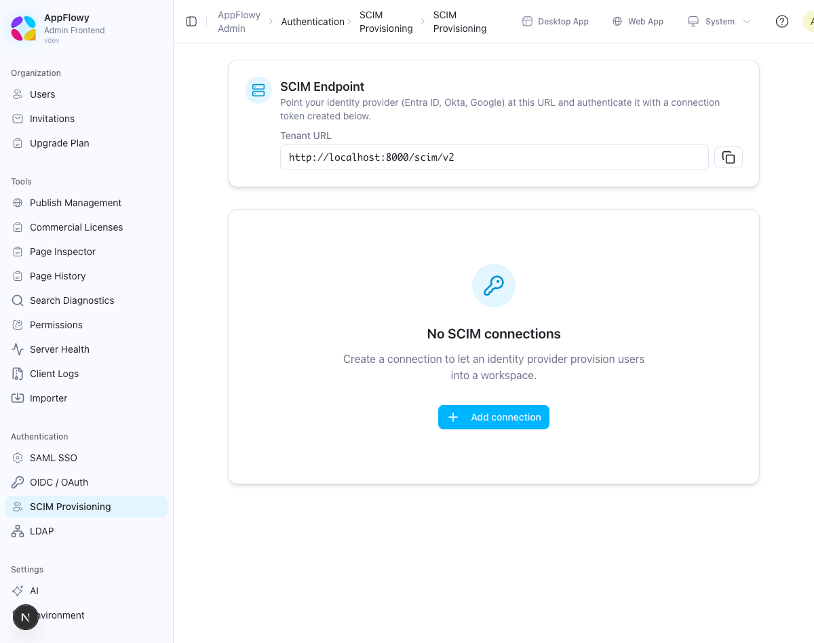
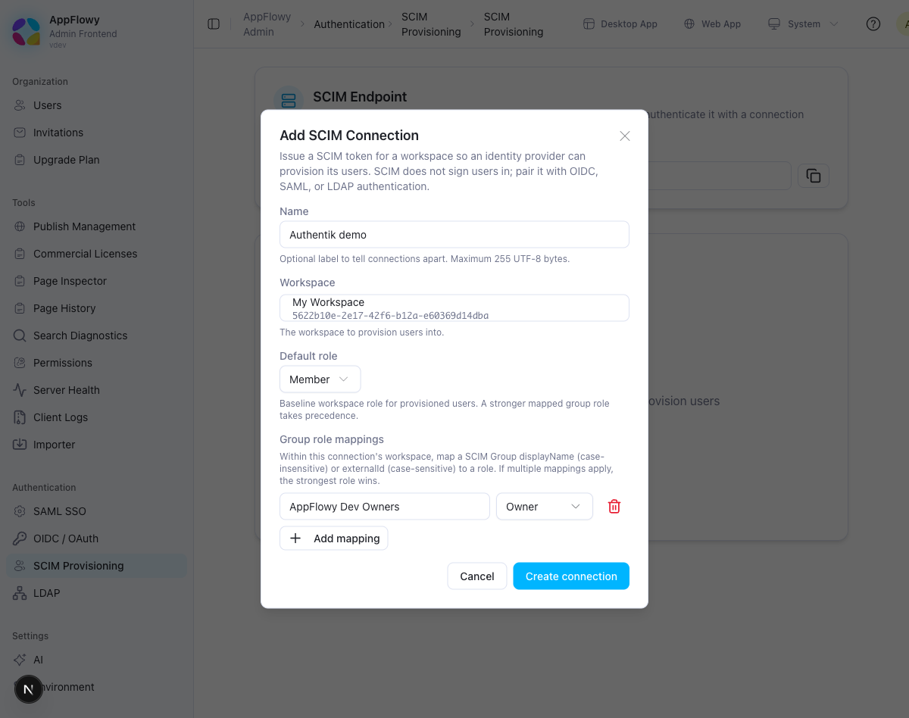
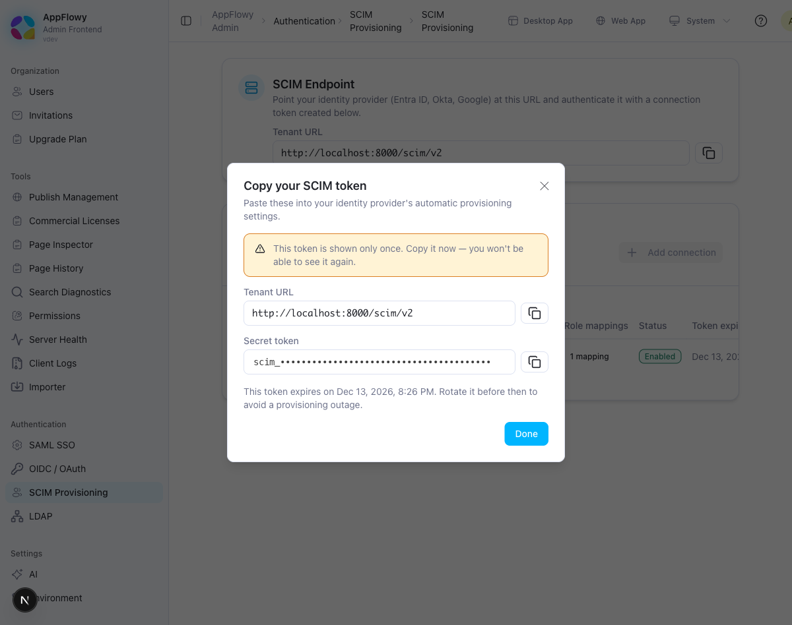
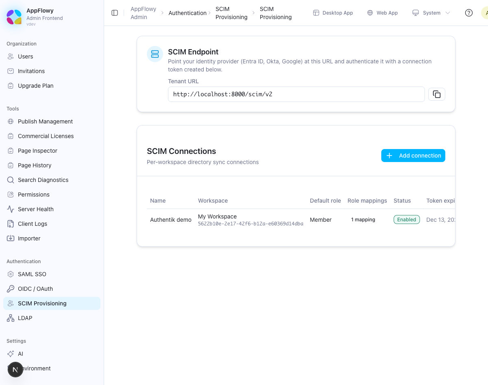
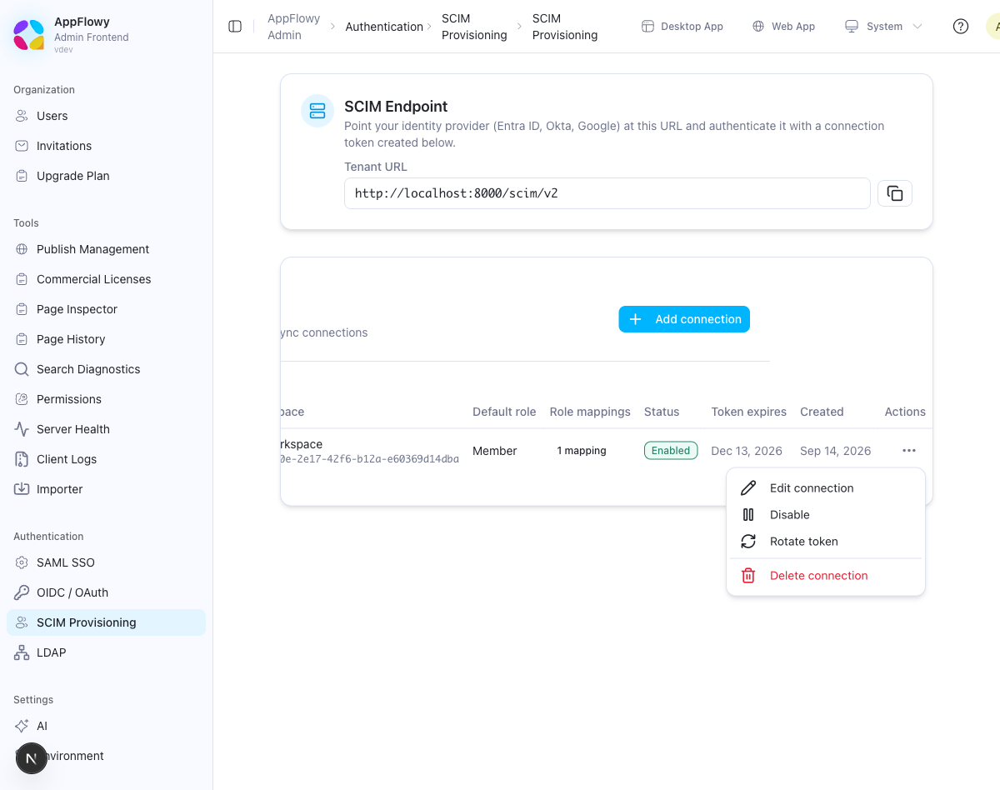

# SCIM Provisioning

AppFlowy Self-Hosted implements SCIM 2.0 so that your identity provider (IdP) can create, update, and deactivate users, and synchronize groups, in an AppFlowy workspace. Microsoft Entra ID, Okta, Authentik, and any other SCIM 2.0 client that authenticates with a bearer token are supported.

SCIM provisions accounts; it does not sign users in. Pair it with [OIDC / OAuth](OIDC.md) or [LDAP](LDAP.md) so that provisioned users can authenticate. [SAML](OKTA_SAML.md) can also be paired, subject to the account-matching behaviour described in [Sign-in for provisioned users](#sign-in-for-provisioned-users).

## What SCIM provisioning does

- **Users.** Creates AppFlowy accounts from the IdP, adds them to one workspace with a default role, and removes workspace access when the IdP deactivates or deletes them.
- **Groups.** Mirrors IdP groups and their members. A group can be mapped to a workspace role (Owner, Member, or Guest), and every synchronized group is also available as a workspace group when granting access to spaces and pages.
- **External IDs.** Stores the IdP's `externalId` so that users and groups remain matched after a rename.

## Before you begin

- **Run the latest AppFlowy Self-Hosted release** (AppFlowy Cloud and Admin Frontend). See the [release notes](../README.md#release-notes).
- **Hold a Seed plan or higher.** The SCIM page is hidden in the Admin console on the Free Tier. See [Self-Hosted Plans and Pricing](https://appflowy.com/docs/Self-hosted-Plans-and-Pricing).
- **Use a public HTTPS hostname with a certificate the IdP trusts.** Entra ID and Okta call your server from the internet and reject untrusted or self-signed certificates, so replace the development certificate in `docker/nginx/ssl/` first. Set `SCHEME=https` and `FQDN` in `.env`: the stock `.env` builds `APPFLOWY_BASE_URL=${SCHEME}://${FQDN}` from them, and the console derives the Tenant URL from `APPFLOWY_BASE_URL`.
- **Keep at least one licensed seat free.** Every active provisioned user consumes a seat.
- **Configure a sign-in method** (OIDC, SAML, or LDAP) that uses the same email addresses as the IdP.

## Step 1: Expose the SCIM endpoint

The `appflowy_cloud` service serves SCIM at `/scim/v2`. The public edge must route `/scim` to AppFlowy Cloud without rewriting the path.

### Docker Compose (Nginx)

The bundled [`docker/nginx/nginx.conf`](../docker/nginx/nginx.conf) already contains the `location /scim` block below. If you maintain a copied or customized Nginx configuration, add the block as a sibling of the `location /` catch-all and reload Nginx.

```nginx
location /scim {
    # Never redirect a request carrying a bearer credential: by the time
    # a redirect is returned, the credential has already crossed plaintext.
    if ($scheme != https) {
        return 403;
    }

    # SCIM filters can contain email addresses and external IDs.
    access_log off;
    error_log /dev/null;
    # No trailing slash or rewrite: preserve /scim/v2/* for AppFlowy Cloud.
    proxy_pass $appflowy_cloud_backend;
}
```

```bash
docker compose exec nginx nginx -s reload
```

Without this block, requests to `/scim/v2/*` fall through to the web frontend, and the IdP's connection test receives a `404`, an HTML page, or a `502`. A `proxy_pass` with a trailing slash strips the `/scim/v2` prefix and turns every request into a `404`.

If TLS terminates in front of Nginx (for example at a Cloudflare Tunnel or a load balancer), Nginx sees plain HTTP for every request and the `$scheme` guard rejects the IdP as well. In that topology, enforce HTTPS at the outer edge and remove the guard from your copy of the block.

### Helm and other edges

The bundled Helm chart adds a `/scim` path to the primary TLS Ingress when `ingress.scim.enabled` is `true` (the default). While the route is enabled, the chart fails to render if the Ingress, TLS, or AppFlowy Cloud is disabled. Set `ingress.scim.enabled=false` when SCIM is unused, when the deployment has no TLS, or when the Ingress annotations apply browser or external authentication; in the last case, define a dedicated HTTPS route instead.

For any other edge, add a `/scim` path with `Prefix` semantics to the TLS Ingress that already serves `/api`, pointing at the AppFlowy Cloud service port (default `8000`). The route must:

- terminate TLS and never redirect HTTP to HTTPS for this path;
- keep the request path intact (no rewrite);
- be exempt from any browser-login or external-auth middleware that consumes the `Authorization` header;
- allow request bodies of at least 256 KiB;
- not cache responses or retry `POST` and `PATCH` requests;
- omit query strings from access logs, because SCIM filters contain email addresses.

### Verify the route

Run these commands from a machine outside your network and without `--insecure`, so that a certificate problem appears as an SSL error rather than a routing error.

```bash
# Anonymous discovery: expect HTTP 200 and Content-Type: application/scim+json.
curl --fail-with-body --include \
  -H 'Accept: application/scim+json' \
  https://your-domain/scim/v2/ServiceProviderConfig

# Plain HTTP must be rejected with 403, not redirected. "Connection refused"
# is also acceptable when port 80 is not published.
curl --include http://your-domain/scim/v2/ServiceProviderConfig

# A bad token must reach AppFlowy and come back as a SCIM 401. On a
# self-hosted deployment this also proves the plan is Seed or higher.
# Expect WWW-Authenticate: Bearer realm="scim", error="invalid_token" and a
# JSON body with "schemas":["urn:ietf:params:scim:api:messages:2.0:Error"].
curl --include -H 'Authorization: Bearer not-a-real-token' \
  'https://your-domain/scim/v2/Users?count=1'
```

| Result of the last command | Meaning |
| --- | --- |
| `401` with `WWW-Authenticate: Bearer` and a SCIM error body | Correct. The edge routes `/scim`, and the plan allows SCIM. |
| `403` with `SCIM provisioning requires a paid self-hosted plan` | The deployment is on the Free Tier. |
| `404`, `502`, or an HTML page | The edge does not route `/scim` to AppFlowy Cloud. |
| A JSON body with `code` and `message` fields | The path was rewritten onto `/api`. Remove the rewrite. |
| `SSL certificate problem` | The certificate is not publicly trusted. The IdP will fail in the same way. |

## Step 2: Create a SCIM connection

1. Open the Admin console at `https://your-domain/console` and sign in with the administrator account from `.env` (`GOTRUE_ADMIN_EMAIL` and `GOTRUE_ADMIN_PASSWORD`).
2. In the sidebar, open **Authentication → SCIM Provisioning**. If the entry is missing, the deployment is on the Free Tier.

   

3. The **SCIM Endpoint** card shows the **Tenant URL**, `https://your-domain/scim/v2`. Copy it for the IdP. If it starts with `http://` or shows the wrong host, correct `SCHEME` and `FQDN` in `.env`, run `docker compose up -d admin_frontend`, and reload the page. Do not edit the value by hand.

   

   The screenshots in this guide were taken on a development deployment, so they show `localhost` URLs where yours shows `https://your-domain`.

4. Click **Add connection** and complete the form.

   | Field | Description |
   | --- | --- |
   | **Name** | Optional label that distinguishes connections, for example `Entra Production`. Up to 255 bytes. |
   | **Workspace** | The workspace that provisioned users join. Each workspace can have only one SCIM connection. |
   | **Default role** | Workspace role for every provisioned user: **Member** (default) or **Guest**. Owner is not offered as a default; grant it through a group mapping instead. |
   | **Group role mappings** | Optional. Map a SCIM group `displayName` (matched case-insensitively) or `externalId` (matched exactly) to Owner, Member, or Guest. A user in several mapped groups receives the strongest role. If a group matches both a display-name mapping and an external-ID mapping, the display-name mapping wins. |

   

5. Click **Create connection**. The **Copy your SCIM token** dialog shows the **Tenant URL** and the **Secret token**, which starts with `scim_` (the token is redacted in the screenshot below; the console displays it in full).

   

> **The token is shown only once.** Copy it into the IdP now. AppFlowy stores only a hash of it, and the token expires 90 days after it is issued. Rotate it before then to avoid a provisioning outage.

The new connection appears in the **SCIM Connections** table with its default role, mapping count, and status. The **Token expires** and **Created** columns are further right; scroll the table if the window is narrow.



The administrator account and the workspace owner cannot be provisioned through SCIM. Do not include them in the IdP's assignment.

## Step 3: Configure the identity provider

Enter these values in the IdP's automatic provisioning settings.

| Setting | Value |
| --- | --- |
| SCIM base URL / Tenant URL | `https://your-domain/scim/v2` |
| Authentication | HTTP header / bearer token |
| Authorization header | `Bearer <secret token>` |
| Unique user identifier | `userName`, set to the user's email address |

Enable creating users, updating user attributes, deactivating users, and pushing groups and group memberships. Scope provisioning to assigned users and groups: synchronizing an entire directory provisions every account against the licensed seat count.

### Attribute mapping

AppFlowy stores a deliberately small set of attributes. Map only the attributes below and remove every other mapping from the IdP, otherwise provisioning fails on the unsupported attribute.

| SCIM attribute | Notes |
| --- | --- |
| `userName` | Required. The user's email address. It identifies the account and cannot be changed after creation, so map it from a stable IdP attribute. |
| `displayName` | Stored on the SCIM user record for this connection and returned to the IdP. AppFlowy continues to show the user's own profile name. Map this attribute directly; `name.givenName` and `name.familyName` are accepted only as a fallback source and are not stored separately. |
| `active` | `true` grants workspace access; `false` removes it. |
| `externalId` | Optional IdP identifier used for matching. |
| `emails` | Read-only. AppFlowy derives it from `userName`. |
| Group `displayName` | The group name. Used for role mappings. |
| Group `members` | Users only. Nested groups are not supported. |
| Group `externalId` | Optional. Can also serve as a role-mapping key. |

The Enterprise User extension (`urn:ietf:params:scim:schemas:extension:enterprise:2.0:User`) may be listed in `schemas`, but none of its attributes are accepted. A request that carries any enterprise attribute, such as `department` or `manager`, fails with `400 invalidValue`, so remove those mappings from the IdP. The advertised schema is available at `https://your-domain/scim/v2/Schemas/urn:ietf:params:scim:schemas:core:2.0:User`.

### Microsoft Entra ID

1. In **Enterprise applications**, open your AppFlowy application and go to **Provisioning**.
2. Set **Provisioning Mode** to **Automatic**.
3. Under **Admin Credentials**, enter the **Tenant URL** and **Secret Token**, then click **Test Connection**. Entra probes `/Users` and `/Groups` with a filter for a random value and expects an empty list.
4. Under **Mappings**, keep `userName` as the matching attribute (mapped from `userPrincipalName` or `mail`), map `displayName`, `active`, and `externalId`, and delete the unsupported attributes.
5. Keep **Scope** at **Sync only assigned users and groups**, assign the users and groups to provision, then set **Provisioning Status** to **On**.

### Okta

1. In your Okta app integration, open the **Provisioning** tab and click **Configure API Integration**.
2. Enable API integration. Set **SCIM connector base URL** to the Tenant URL, **Unique identifier field for users** to `userName`, and **Authentication Mode** to **HTTP Header** with the secret token. Click **Test API Credentials**, then **Save**.
3. Under **Provisioning → To App**, enable **Create Users**, **Update User Attributes**, and **Deactivate Users**.
4. Assign a single test user first, then the remaining users, and use **Push Groups** to send groups.

### Authentik

1. Create a **SCIM provider** with the Tenant URL (`https://your-domain/scim/v2`, path included) as its URL and the secret token as its token. Use Authentik `2026.5.6` or later, which sends RFC-shaped group member removals.
2. Attach the provider to your application as a **backchannel provider**.
3. Bind a policy or group to the application to select the users to synchronize, and set the provider's group filters to the groups to push.
4. Run a sync from the provider page and confirm that the task finishes without warnings. If Authentik runs on the same host as AppFlowy, its containers must resolve your public hostname over HTTPS and trust your certificate (**Verify SCIM server's certificates** is on by default).

## How provisioning works

- **New users** receive an AppFlowy account and join the connection's workspace at the effective role. An existing account with the same email address is reused rather than duplicated.
- **Seat limits apply.** When the workspace would exceed the licensed seat count, AppFlowy answers with SCIM `409` and the IdP reports the failure. Upgrade the plan or free a seat, then let the IdP retry.
- **Deactivating a user** (`active: false`) removes the user from the workspace and releases the seat. If the user has no other workspace, the account is also banned in the authentication service: new sign-ins are refused and the session can no longer be refreshed, so the user is signed out when the current access token expires (up to `GOTRUE_JWT_EXP`, 7 days in the template). Until then the user remains signed in but no longer sees the workspace. A user who keeps another workspace is not banned. To end sessions immediately, delete the user in the Admin console. Reactivation restores membership at the strongest role among the default and the user's remaining mapped groups.
- **Deleting a user** removes workspace access and the SCIM record, and blocks new sign-ins if the user has no other workspace. The AppFlowy account itself is retained. A later re-provision creates a new SCIM resource ID.
- **Group membership** in a mapped group grants at least the mapped role. Removing a user from a mapped group, renaming or deleting a mapped group, or changing the connection's mappings recomputes the user's role. Unmapped groups do not change roles but remain available as workspace groups for space and page permissions. A background worker applies role changes within a few seconds.
- **Display names** set through SCIM are stored on the connection's SCIM user record and returned to the IdP. They do not rename the user's AppFlowy profile, and the workspace member list continues to show the profile name.
- **System administrators** and the workspace owner cannot be managed through SCIM.
- **Email addresses** are trimmed and lowercased before matching.

## Sign-in for provisioned users

SCIM does not authenticate. A provisioned user signs in with the same email address through a configured method:

- **OIDC / OAuth** and **LDAP** resolve the account by email, so the user lands in the SCIM workspace with the provisioned role and no additional seat is consumed.
- **SAML** keeps a separate account per SAML provider and does not link to an existing account by email. Before pairing SCIM with SAML, sign in one provisioned test user through SAML and confirm that **Users** in the Admin console lists a single account for that email. If two accounts appear, use OIDC or LDAP for sign-in instead.
- **Continue with email** is always offered on the sign-in page as well, and provisioned accounts can use it.

## Supported SCIM 2.0 surface

| Resource | Operations |
| --- | --- |
| `/Users` | `GET` (list), `POST`, `GET /{id}`, `PUT /{id}`, `PATCH /{id}`, `DELETE /{id}` |
| `/Groups` | `GET` (list), `POST`, `GET /{id}`, `PUT /{id}`, `PATCH /{id}`, `DELETE /{id}` |
| `/ServiceProviderConfig`, `/ResourceTypes`, `/Schemas` | `GET` (anonymous discovery) |

- Filters support a single `eq` comparison: `userName` or `externalId` for users, `displayName` for groups. Other operators return `400 invalidFilter`.
- Lists paginate with `startIndex` and `count` (default 100, maximum 200). Pass `excludedAttributes=members` when listing groups without membership data.
- Request bodies use `Content-Type: application/scim+json` and are limited to 256 KiB.
- `/Bulk`, ETags, and nested groups are not implemented.

## Managing connections

Use the **Actions** menu on the **SCIM Connections** table.



- **Disable / Enable** pauses or resumes the connection. While the connection is disabled, the IdP receives `401` and existing users keep their access. Disable a connection only before the IdP holds the token or during planned maintenance, because Entra and Okta record the `401` responses as credential failures.
- **Edit connection** changes the name, default role, or group mappings. Role changes are applied to existing users automatically.
- **Rotate token** issues a new token and shows it once. The old token stops working immediately, so update the IdP straight away. In Authentik, update the existing provider's token rather than recreating the provider; a recreated provider forgets its remote IDs and attempts to create duplicates.
- **Delete connection** succeeds only after the IdP has deleted every SCIM user and group for the connection and the background role reconciliation for it has finished. Deactivating users is not sufficient. A successful deletion permanently revokes the token.

The **Status** column reflects only the stored enabled flag and the token expiry: **Enabled**, **Disabled**, **Token expiring soon** during the last 14 days, or **Token expired**, which takes precedence over **Disabled**. It is not a last-sync indicator. There is no server-side alert for token expiry, so set a calendar reminder 14 days before the date in the **Token expires** column.

## Verify the setup

Work through these checks in order after Step 3. Use a dedicated test identity on your own domain, never an employee's address or the administrator account: the test user consumes a seat while active, and deactivating it blocks that identity's sign-in.

### 1. Token smoke test

Store the token once in a curl configuration file so that it never appears in shell history or process lists, then list users.

```bash
printf 'SCIM token: '; IFS= read -rs SCIM_TOKEN; echo
( umask 077; printf 'header = "Authorization: Bearer %s"\n' "$SCIM_TOKEN" > "$HOME/.scim-curl.cfg" )
unset SCIM_TOKEN

curl -sS --include -K "$HOME/.scim-curl.cfg" -H 'Accept: application/scim+json' \
  'https://your-domain/scim/v2/Users?count=1'
```

Expect `200` with a `ListResponse` whose `totalResults` is `0` on a fresh connection. A `401` means the token was mistyped, rotated, or expired, or the connection is disabled. Delete the file when you have finished:

```bash
rm -f "$HOME/.scim-curl.cfg"
```

### 2. IdP connection test

Run the test in your IdP: **Test Connection** in Entra, **Test API Credentials** in Okta, or a sync in Authentik. Authentik fetches `ServiceProviderConfig` first. Entra sends a filtered `GET /Users` (and `/Groups`) for a random GUID, and Okta sends `GET /Users?startIndex=1&count=2` followed by `GET /Groups?startIndex=1&count=100`; the token smoke test has already exercised that path. An SSL or "unable to connect" error at this stage means the certificate is not publicly trusted or the host is unreachable from the internet, even though the curl checks passed from inside your network.

### 3. Provision one user

Assign the test identity to the application in the IdP and wait for the sync. If the IdP is not ready, simulate it by creating the user directly:

```bash
curl -sS --include -K "$HOME/.scim-curl.cfg" -X POST \
  -H 'Content-Type: application/scim+json' \
  -d '{"schemas":["urn:ietf:params:scim:schemas:core:2.0:User"],"userName":"scim-test@your-domain","displayName":"SCIM Test","active":true}' \
  https://your-domain/scim/v2/Users
```

Expect `201 Created`, a `Location` header of `/scim/v2/Users/<id>`, and a body with the lowercased `userName`, `"active":true`, and `emails[0].value` equal to the `userName`. Note the `id`. The lookup that the IdP performs before every create must now find the user:

```bash
curl -sS -K "$HOME/.scim-curl.cfg" \
  'https://your-domain/scim/v2/Users?filter=userName%20eq%20%22scim-test%40your-domain%22'
```

Expect `"totalResults":1`. A user created by the IdP must also be deactivated and deleted through the IdP; a change made with curl is reverted on the IdP's next cycle.

| Create response | Cause |
| --- | --- |
| `409` with `scimType: uniqueness` | The `userName` is already provisioned on this connection. |
| `409` with a license message | No free seat. |
| `403` | The email belongs to a system administrator or to the workspace owner. |
| `400 invalidValue` naming an attribute | The IdP maps an attribute that AppFlowy does not store. |

### 4. Confirm workspace membership

Sign in to AppFlowy Web as an owner of the connection's workspace and open **Settings → People → Members**. The test user is listed with the connection's default role as soon as the `201` is returned. Guests are hidden from this list; for a Guest default, use the **Guests** tab on the **Users** page in the Admin console instead. Only role changes driven by group mappings are applied asynchronously, so if the role looks wrong immediately after a group push, wait a few seconds and reopen the page.

The server log records each provisioned user:

```bash
docker compose logs --since 1h appflowy_cloud | grep -Ei 'SCIM|directory'
```

Expect lines such as `SCIM provisioned user uid=<n> into workspace=<id> as Member`, and none containing `SCIM entitlement check failed`, `SCIM auth: failed to resolve connection by token hash`, or `SCIM internal error`. Nginx access logs are intentionally silent for `/scim`.

### 5. Push one group and a role mapping

Use a group name that no real IdP group will ever have, for example `scim-smoke-test`. In the console, choose **Edit connection** and map `scim-smoke-test` to **Owner** for the duration of the test. Then push the group from the IdP with the test user as its member, or simulate it:

```bash
curl -sS --include -K "$HOME/.scim-curl.cfg" -X POST \
  -H 'Content-Type: application/scim+json' \
  -d '{"schemas":["urn:ietf:params:scim:schemas:core:2.0:Group"],"displayName":"scim-smoke-test","members":[{"value":"<user id from step 3>"}]}' \
  https://your-domain/scim/v2/Groups
```

Expect `201 Created` and a `Location` header of `/scim/v2/Groups/<id>`. Within a few seconds the member list shows the test user as **Owner**, the log contains `SCIM recalculated role for uid=<n> in workspace=<id> to Owner`, and **Settings → People → Groups** lists the group. A `404` means a member value is not a user of this connection; a value that is not a UUID returns `400 invalidValue`. If the role never changes, either the mapping key does not match (display names match case-insensitively, external IDs exactly) or the reconciliation worker is failing; see the counters under **9. Ongoing checks → Worker health**.

Other owners cannot remove an Owner from the workspace in AppFlowy Web. Only SCIM can demote or remove the test user, which the next steps do.

### 6. Deactivate, reactivate, delete

Unassign the test user in the IdP (Entra and Okta send `active: false`), or simulate it:

```bash
curl -sS --include -K "$HOME/.scim-curl.cfg" -X PATCH \
  -H 'Content-Type: application/scim+json' \
  -d '{"schemas":["urn:ietf:params:scim:api:messages:2.0:PatchOp"],"Operations":[{"op":"replace","path":"active","value":false}]}' \
  https://your-domain/scim/v2/Users/<user id>
```

Expect `200` with `"active":false`. The member row disappears, the seat is released, and the filtered lookup from step 3 still returns the user with `active:false`, so that the IdP updates it rather than creating a duplicate.

Optionally reactivate with the same request and `"value":true`. Expect `200`, the row back at **Owner** because the group membership was retained, and the seat consumed again. Do this before deleting, because a deleted ID returns `404`.

Finally, delete the user through the IdP, or directly:

```bash
curl -sS --include -K "$HOME/.scim-curl.cfg" -X DELETE https://your-domain/scim/v2/Users/<user id>
```

Expect `204 No Content`. A `GET` of the same ID now returns `404`, and the filtered lookup returns `"totalResults":0`. Repeating the `DELETE` is harmless and returns `404`.

### 7. Clean up

1. Delete the smoke group through the IdP, or run `curl -sS --include -K "$HOME/.scim-curl.cfg" -X DELETE https://your-domain/scim/v2/Groups/<group id>` (expect `204`).
2. Choose **Edit connection** and remove the temporary `scim-smoke-test` mapping.
3. Remove the curl configuration file: `rm -f "$HOME/.scim-curl.cfg"`.
4. The AppFlowy account for the test identity is retained. To remove every trace, open **Users** in the Admin console, search for the email, and choose **Delete User**.

### 8. Confirm sign-in

Provision the test identity again through the IdP, then sign in at `https://your-domain/` with the same email through your OIDC, SAML, or LDAP method. The user lands in the SCIM workspace with the expected role, and **Users** in the Admin console shows exactly one account for that email. Two accounts mean that the sign-in method did not link to the provisioned account; see [Sign-in for provisioned users](#sign-in-for-provisioned-users).

### 9. Ongoing checks

- **Token expiry.** Check the **Status** column weekly and rotate while it shows **Token expiring soon**. After a rotation, the old token answers `401` immediately and the new one `200`; re-run the IdP's connection test with the new token. Rotating once during initial setup, before the IdP holds the token, is a safe way to rehearse the procedure.
- **Worker health.** The reconciliation worker exports counters that are not reachable through Nginx. Read them from inside the container:

  ```bash
  docker compose exec appflowy_cloud curl -s http://127.0.0.1:8000/metrics | grep '^directory_sync_'
  ```

  After a mapped-group change, `directory_sync_role_reconciliation_attempts_total` and `..._completions_total` grow by the number of affected users, while `..._failures_total` and `directory_sync_worker_errors_total` stay flat.
- **Logs.** Repeat the log check from step 4 after each IdP sync. Repeated warnings containing `will converge from durable retry state` mean the worker is retrying against a failing database, Redis, or GoTrue.

## Troubleshooting

| Symptom | Cause | Fix |
| --- | --- | --- |
| IdP test returns `401` | Wrong, rotated, or expired token, or the connection is disabled. | Rotate the token, paste the new value into the IdP, and check the connection status. |
| IdP test returns `403` | The IdP used `http://` instead of `https://`, or the deployment is on the Free Tier. | Use the HTTPS Tenant URL, or upgrade to a Seed plan or higher. |
| IdP test returns `404` or `502` | The edge does not route `/scim` to AppFlowy Cloud. | Add the `/scim` location shown above and reload Nginx. |
| IdP test reports an SSL or connection error | The certificate is not publicly trusted, or the host is not reachable from the internet. | Install a CA-issued certificate and check DNS and firewall rules. |
| `409` when creating a user | Duplicate `userName`, or the workspace has reached its seat limit. | Check for an existing user with that email, or increase the licensed seats. |
| `400 invalidFilter` | The IdP used an unsupported filter. | Match users on `userName` or `externalId` and groups on `displayName`, using `eq`. |
| Provisioning fails on an attribute | The IdP maps an attribute that AppFlowy does not store. | Remove the attribute from the IdP mapping. |
| Users are provisioned but cannot sign in | SCIM does not authenticate. | Configure [OIDC](OIDC.md), [SAML](OKTA_SAML.md), or [LDAP](LDAP.md), and make sure the sign-in email matches `userName`. |
| Group roles are not applied | Groups are not pushed, or the mapping key does not match. | Enable group push in the IdP and check that the mapping uses the exact `externalId` or the group's display name. |
| Console refuses to delete the connection | SCIM users or groups still exist for it, or role reconciliation is still pending. | Have the IdP delete every user and group first (deactivation is not sufficient), then retry once the worker has caught up. |
| SCIM page missing in the Admin console | The deployment is on the Free Tier. | Upgrade to a Seed plan or higher. |
