# Automatic group sync with SCIM

Manage your team in Authentik and let SCIM keep its AppFlowy group up to date. This
walkthrough shows how to connect the two systems, create, rename, and delete a group,
add, remove, and replace its members, check sync status, and recover a group with
**Retry sync**. It also shows how a synchronized group grants access to a space.

The example uses **Engineering — SCIM Demo**, with two directory users, **Alice Chen**
and **Bob Rivera**. You will see the AppFlowy group change from **0 → 1 → 2 → 1 members**
without manually editing its membership in AppFlowy.

A second, disposable group, **Design — SCIM Demo**, demonstrates the full lifecycle
without deleting Engineering or its space assignment. Each action below includes
the expected result and screenshots from the demonstration.

## In this guide

1. [Create the AppFlowy connection and auth key](#step-1-create-the-appflowy-connection-and-auth-key)
2. [Prepare the directory users and group](#step-2-prepare-the-directory-users-and-group)
3. [Connect Authentik to AppFlowy](#step-3-connect-authentik-to-appflowy)
4. [Check the initial group in AppFlowy](#step-4-check-the-initial-group-in-appflowy)
5. [Add Alice, then Bob](#step-5-add-alice-then-bob)
6. [Remove Alice from the group](#step-6-remove-alice-from-the-group)
7. [Watch group sync status in Admin](#watch-group-sync-status-in-admin)
8. [Give the group access to a space](#step-7-give-the-group-access-to-a-space)
9. [Create, rename, change, and delete a second group](#step-8-demonstrate-the-complete-group-lifecycle)
10. [Recover a group with Retry sync](#f-recover-a-group-with-retry-sync)
11. [Recover automatically after adding licensed seats](#when-your-license-runs-out-of-seats)

For endpoint routing, other identity providers, token rotation, and the SCIM API,
see the [SCIM provisioning reference](SCIM.md).

## What happens automatically?

**Authentik group membership → SCIM update → AppFlowy workspace group membership**

Saving a membership change in Authentik queues a SCIM update. AppFlowy receives it
and processes the corresponding workspace-group membership in the background.
You manage the group's name and members in the directory; AppFlowy owns the
permissions you assign to that group.

| Item | What it controls | Who configures it? |
| --- | --- | --- |
| SCIM connection | Which AppFlowy workspace receives directory users and groups | AppFlowy administrator, once |
| Directory group | Who belongs to Engineering | Directory administrator in Authentik |
| AppFlowy workspace group | The synchronized group available in **People → Groups** | Created and maintained by SCIM |
| Space grant | What the group can do in a particular space | Workspace or space owner, once per space |

**A group is not a space.** SCIM creates the matching workspace group. It does not
create a new space. Assign that group to an existing space in step 7.

## Before you begin

- Complete the [SCIM prerequisites](SCIM.md#before-you-begin), including an enabled
  self-hosted plan, a reachable HTTPS SCIM endpoint, and enough licensed seats for
  the test users.
- Have administrator access to AppFlowy Admin and Authentik, and owner access to the
  AppFlowy workspace used for the demonstration.
- Use a dedicated workspace, such as **SCIM Sync Demo**, and test identities rather
  than the system administrator or workspace owner. Neither owner identity should
  be assigned for SCIM provisioning.
- Use Authentik **2026.5.6 or later** for the group-removal behavior shown here.
  The recordings use 2026.5.6.
- For the new sync-status view and **Retry sync** button, update both AppFlowy Cloud
  and the Admin frontend to versions containing group monitoring and retry support.
  Deploy Cloud first. If Admin shows
  **View groups** followed by **Group status unavailable**, check server compatibility.

> The screenshots and videos use a local development installation. Replace its
> `localhost` URLs with your own HTTPS hostname. The local Docker address
> `host.docker.internal` is shown only to explain the recording's setup.

Videos have captions and no audio. Select a video preview or its **Watch video**
link to open the MP4. If your Markdown viewer does not play it, download and open
the file. All screenshots, videos, and transcripts are stored with this guide.

## Step 1: Create the AppFlowy connection and auth key

1. In AppFlowy Web, choose or create the workspace **SCIM Sync Demo**.
2. Open the Admin frontend at `https://your-domain/console` and sign in as an
   administrator.
3. Open **Authentication → SCIM Provisioning** and select **Add connection**.
4. Complete the form with these values:

   | Field | Example value |
   | --- | --- |
   | Name | `Authentik — SCIM Demo` |
   | Workspace | `SCIM Sync Demo` |
   | Default role | **Member** |
   | Group role mappings | Leave empty |

5. Select **Create connection**. Copy the **Secret token** from the token dialog and
   store it securely for step 3. This is the auth key Authentik will use.
6. Copy the **Tenant URL**, normally `https://your-domain/scim/v2`, and confirm the
   connection appears as **Enabled**.

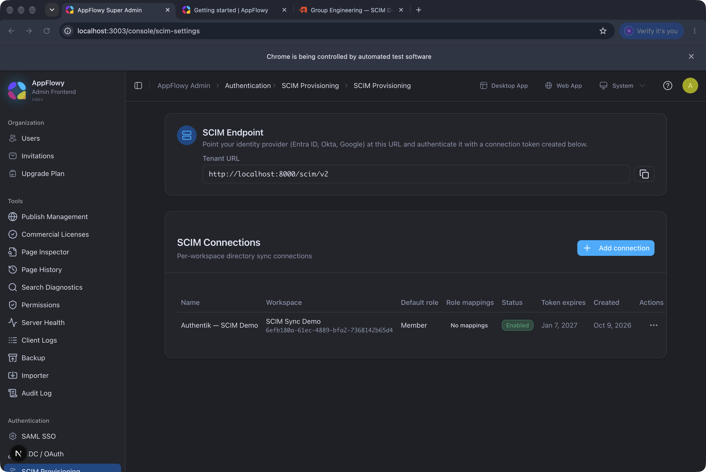

**Expected result:** one enabled connection targeting the correct workspace.
The screenshot shows the completed setup; the secret token is not included in
the media.

> The token is displayed once. If you lose or rotate it, update Authentik with the
> replacement. See [Managing connections](SCIM.md#managing-connections).

**Why no role mappings?** Role mappings choose workspace roles such as Member or
Guest. They are separate from group membership and space access. A SCIM group
becomes an AppFlowy workspace group even when this table is empty.

## Step 2: Prepare the directory users and group

1. In Authentik, open **Directory → Users** and create two active test users. Set
   their usernames to their email addresses, as required by AppFlowy's SCIM mapping.

   | Display name | Username and email used in the recording |
   | --- | --- |
   | Alice Chen | `demo.alice@example.com` |
   | Bob Rivera | `demo.bob@example.com` |

2. Open **Directory → Groups** and create **Engineering — SCIM Demo**.
3. Leave the group empty for now. You will add the users while watching the sync.

These are demonstration addresses. Use test addresses appropriate for your own
installation. The users do not need to sign in for their group membership to sync.
SCIM provisioning and [user sign-in](SCIM.md#sign-in-for-provisioned-users) are
separate operations.

## Step 3: Connect Authentik to AppFlowy

### Select the users before enabling provisioning

1. Under **Applications → Applications**, create or open an application named
   **AppFlowy SCIM Sync Demo**.
2. In that application's **Policy / Group / User Bindings**, bind Alice and Bob
   directly to the application.

Keep these user assignments independent of the Engineering group. This lets you
demonstrate removing Alice from Engineering while she remains provisioned in the
workspace. Application bindings select users; the provider's group filters select
groups. A group filter alone does not restrict which users are provisioned.

### Configure the SCIM provider

1. Open **Applications → Providers**, select **New Provider**, and choose **SCIM**.
2. Configure the provider using the values below.

   | Setting | Value |
   | --- | --- |
   | Name | A recognizable name, such as `appflowy-scim-demo` |
   | URL | The AppFlowy Tenant URL, including `/scim/v2` |
   | Authentication mode | **Static token** |
   | Token | The secret token copied from AppFlowy |
   | User property mappings | Authentik's standard SCIM User mapping |
   | Group property mappings | Authentik's standard SCIM Group mapping |
   | Group filters | **Engineering — SCIM Demo** |
   | Exclude service accounts | Enabled |
   | Dry-run | Disabled |

3. Edit the application, add this provider to **Backchannel Providers**, and save.
   Authentik documents these controls in its
   [SCIM provider setup](https://docs.goauthentik.io/add-secure-apps/providers/scim/create-scim-provider/).
4. Open the provider's overview and check provisioning status and task results.
   Let initial provisioning finish. If existing objects have not been sent, use
   the initial sync described in the [Authentik setup reference](SCIM.md#authentik).

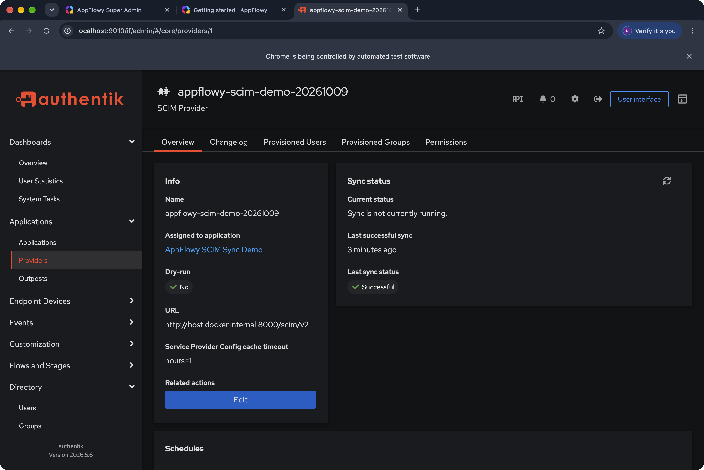

The local recording uses `http://host.docker.internal:8000/scim/v2` because
Authentik runs inside Docker and AppFlowy runs on the Mac. Your provider must use
your installation's reachable HTTPS endpoint and trust its certificate.

**Expected result:** both users and the empty Engineering group are provisioned.
For the remaining membership steps, save changes in Authentik and let automatic
sync run; do not start a manual full sync.

## Step 4: Check the initial group in AppFlowy

1. Open **SCIM Sync Demo** in AppFlowy Web.
2. Open the workspace menu → **Settings → People → Groups**.
3. Find **Engineering — SCIM Demo** with **0 members**.

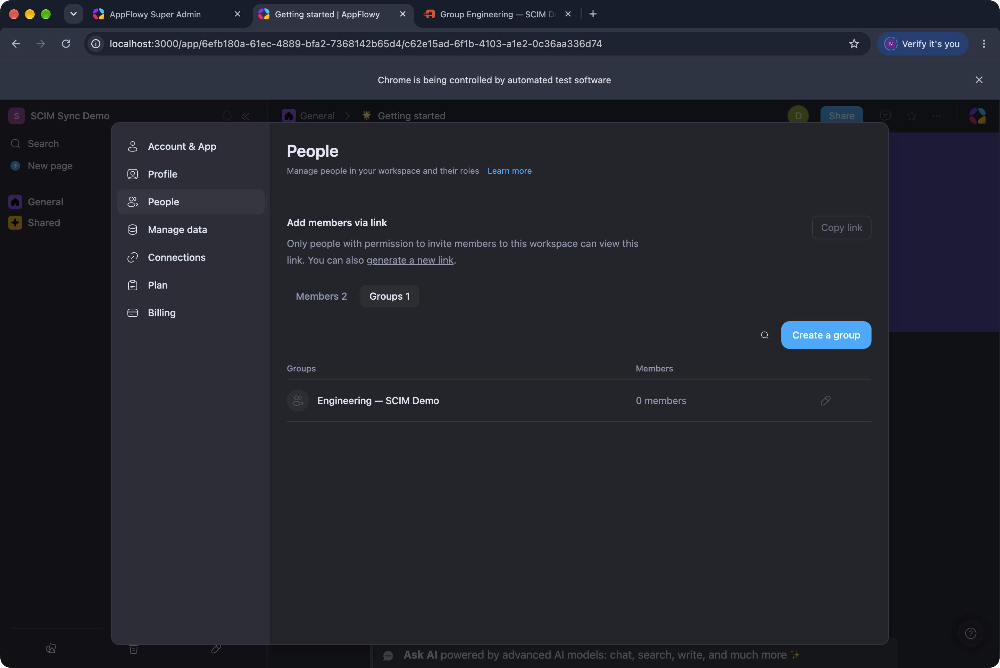

**Expected result:** the group already exists in AppFlowy. You did not need to
select **Create a group** there. The member-change videos start from this state,
after initial provisioning has completed.

You can also open the **SCIM groups** count beneath the connection name in Admin.
An empty group can be **Synced**, with **0 / 0 eligible** members. Keep this dialog
open to [watch subsequent updates automatically](#watch-group-sync-status-in-admin).

## Step 5: Add Alice, then Bob

### Add the first member

1. In Authentik, open **Directory → Groups → Engineering — SCIM Demo → Users**.
2. Select **Add Existing User**, open the user selector, and select Alice.
3. Select **Confirm**, then **Assign** to save the membership.
4. Refresh the Authentik table if necessary to see Alice in the group.

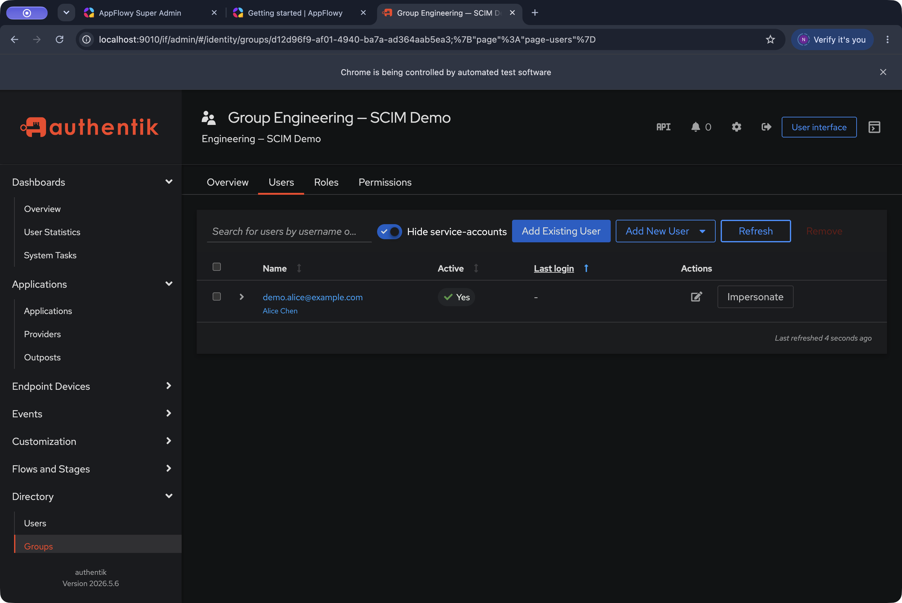

5. Return to AppFlowy. Reopen **People → Groups** and open Engineering using the
   pencil icon next to its name.
6. Check that the group has **1 member**, `demo.alice@example.com`.

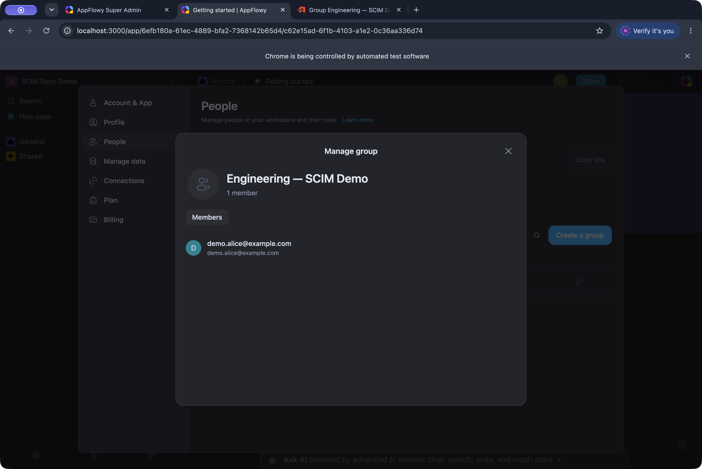

> **Reload the view, not the sync.** In the recorded Web version, the People screen
> keeps its loaded list. Close the group dialog, select **Profile**, then return to
> **People → Groups** to read the latest state. This does not trigger SCIM.
> The directory change triggers the background update. Authentik's table
> **Refresh** button likewise reloads its view.

### Add the second member

7. Repeat the Authentik assignment with Bob.
8. Reopen the group list in AppFlowy and check that Engineering now contains
   **Alice and Bob**.

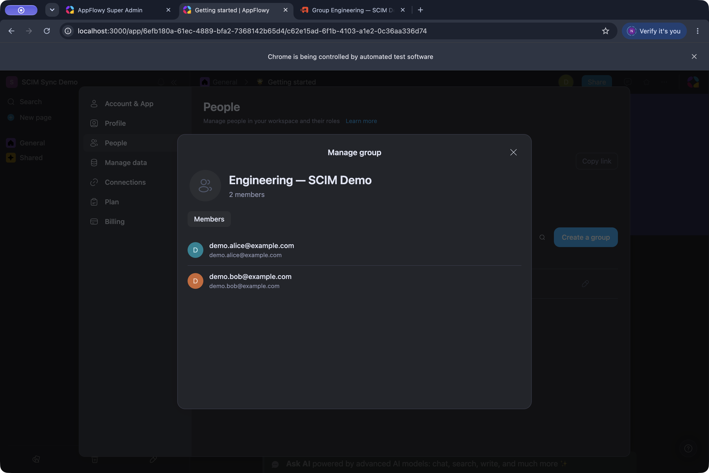

**Expected result:** membership changes from **0 → 1 → 2**. AppFlowy may display the
users' email addresses instead of their Authentik display names. The SCIM-managed
roster is read-only in AppFlowy; manage it in the directory.

### Watch the complete addition flow

[**Watch video 1 — Add members automatically**](assets/scim-auto-sync/add-members.mp4)
· 1 min 43 sec · [Text transcript](assets/scim-auto-sync/add-members-transcript.txt)

The recording includes both Authentik assignments and the matching AppFlowy
results. No manual full-sync action is used.

## Step 6: Remove Alice from the group

1. In the Authentik group's **Users** tab, select Alice.
2. Select **Remove** and confirm the group-membership removal. In Authentik 2026.5.6,
   the confirmation button says **Delete**, while the dialog describes removing
   the selected user **from Engineering — SCIM Demo**.

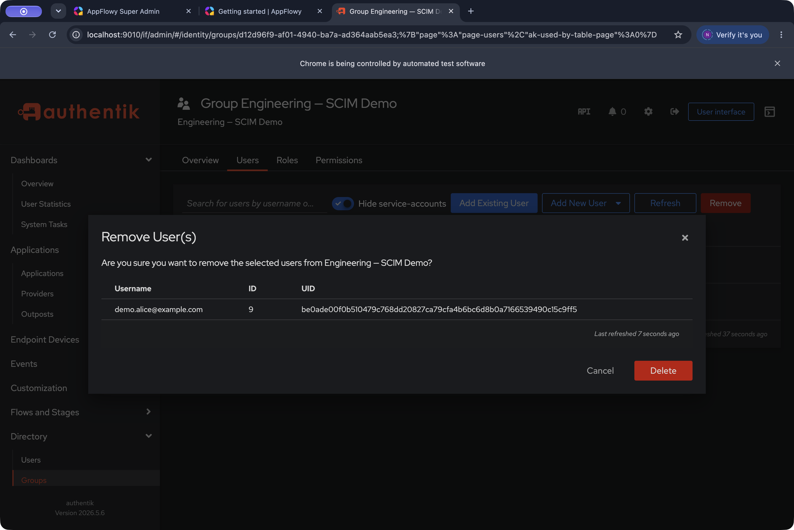

3. Check that the Authentik group now contains only Bob. Refresh its table if needed.

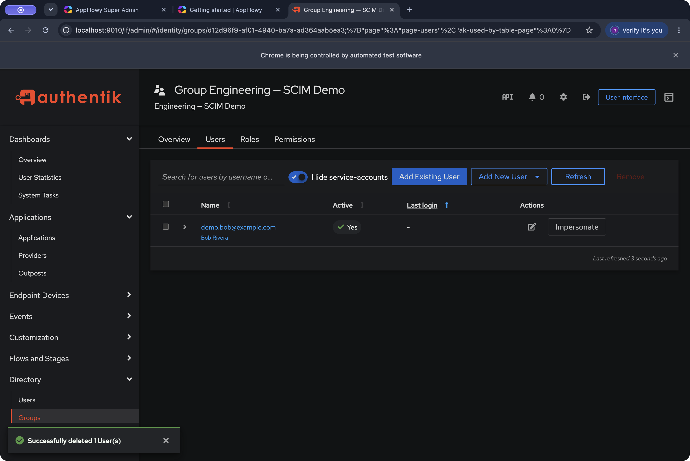

4. Return to AppFlowy and reopen **People → Groups**.
5. Open Engineering. Its count is **1 member**, and Bob is the only listed member.

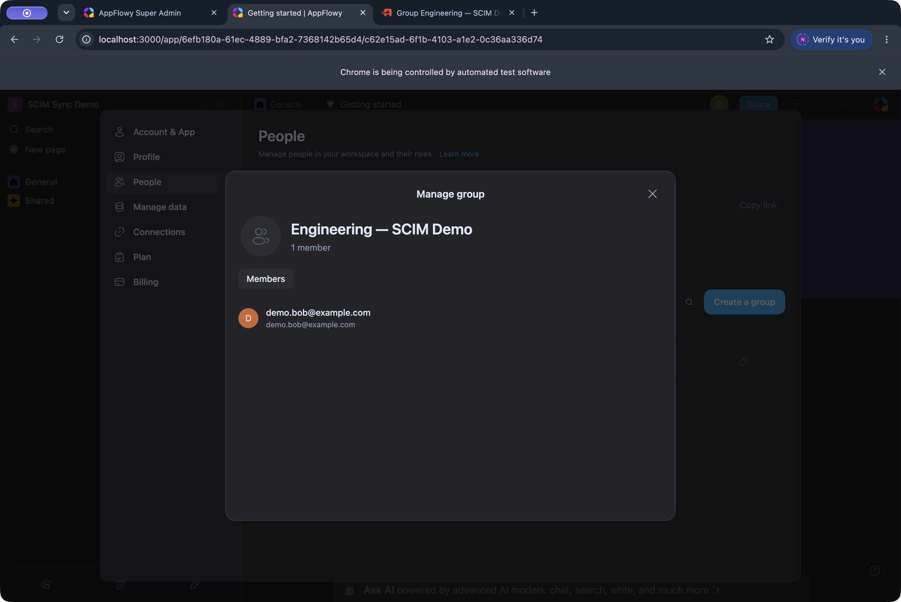

**Expected result:** the group changes from **2 → 1 members** automatically.
Alice remains a workspace Member because she is still assigned to the Authentik
application and the connection's default role is Member. This action removes
group membership; it does not delete her account or deprovision her from the
workspace.

[**Watch video 2 — Remove a member automatically**](assets/scim-auto-sync/remove-member.mp4)
· 35 sec · [Text transcript](assets/scim-auto-sync/remove-member-transcript.txt)

## Watch group sync status in Admin

Use this view to check whether AppFlowy has applied the group data it has received.
It is useful while following either membership exercise above.

1. Open **Authentication → SCIM Provisioning** in AppFlowy Admin.
2. Find **Authentik — SCIM Demo**. Beneath its name, select **1 SCIM group**.
   This count includes received groups even when **Role mappings** says **No mappings**.

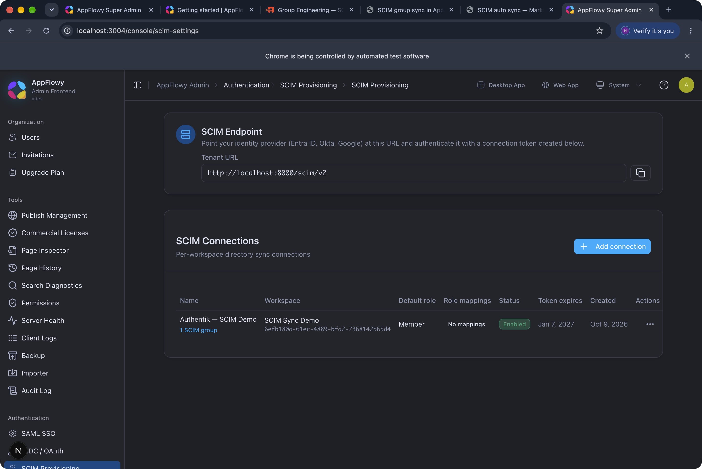

3. In **SCIM group sync**, find **Engineering — SCIM Demo**. After step 6, it should
   show **1 / 1 eligible**, **1 received from directory**, and a green **Synced** badge.

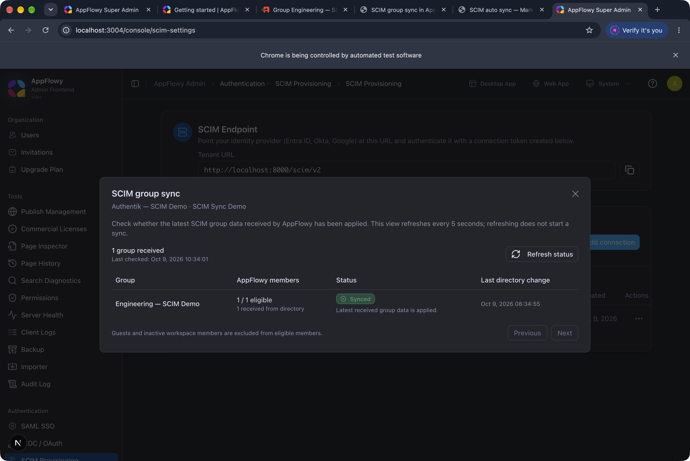

4. Keep the dialog open and make another membership change in Authentik. The status
   page refreshes every **5 seconds** while visible. The connection list's group count
   refreshes every **10 seconds**. A fast update can finish before you see **Pending**.
5. Check the new member counts and **Synced** badge. For example, adding Alice back
   alongside Bob produces **2 / 2 eligible** and **2 received from directory**.
6. Remove Alice again in Authentik to return to the guide's final state: Bob only,
   **1 / 1 eligible**, **Synced**.

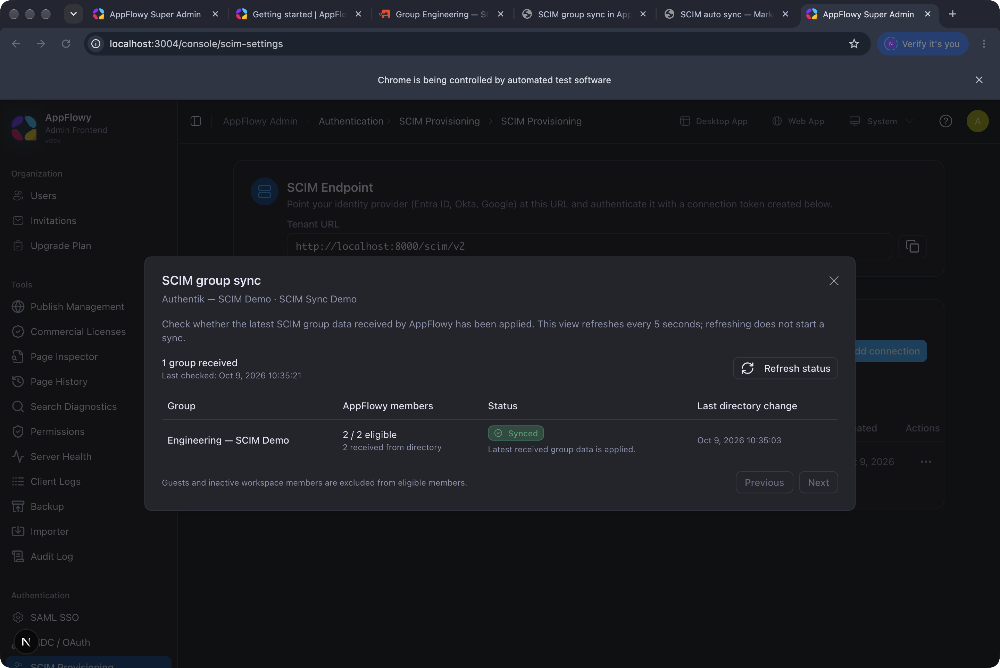

**AppFlowy members** means *applied members / eligible members*. Guests and inactive
workspace members are excluded from eligibility, so the received count can be higher.
For example, a directory group with two Members and one Guest can be **Synced** at
**2 / 2 eligible**, with **3 received from directory**. The server compares member
identities as well as counts and checks that the matching SCIM-managed group exists
with the expected name.

| Status | What it means | What to do |
| --- | --- | --- |
| **Synced** | The latest received group name and eligible membership are applied. | Continue; configure a space grant separately if needed. |
| **Pending** | Related member updates are queued or being processed. | Leave the dialog open and allow the background worker to finish. |
| **Retrying** | A member update failed and AppFlowy will retry automatically. | Check the next scheduled retry. After resolving the cause, use **Retry sync** to request another attempt now. |
| **Waiting for seats** | A user was received, but their activation needs more license capacity. | Add seats and apply the updated license. Provisioning resumes automatically. |
| **Needs attention** | The managed group is missing, its name differs, or membership differs without a related queued update. | Read the explanation, then use **Retry sync** to reapply the received data. If it persists, inspect AppFlowy logs. |

The following screenshot compares Synced, Pending, Retrying and Needs attention.
These are **test fixtures** captured from the real Admin UI to illustrate the labels
and retry details; they are separate from the live Authentik demonstration above.
The [license recovery example](#when-your-license-runs-out-of-seats) shows Waiting for seats.

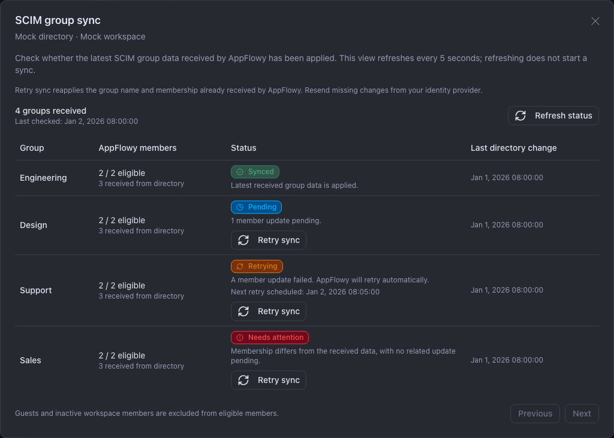

One user's pending update can affect several groups, so a matching count alone does
not guarantee a green badge. **Last directory change** records when the received
group resource changed. **Last checked** records when AppFlowy checked the status.
Neither is an identity-provider heartbeat or a last-successful-sync timestamp.

> **Synced means the latest data AppFlowy has received is applied.** It cannot prove
> that Authentik has sent a newer change. Continue checking provider task results if
> the displayed group is older than the directory. **Enabled** and token-expiry badges
> describe the connection separately; a paused or expired connection can retain a
> previously synced group.

**Refresh status** only reloads the status. It does not start a sync or retry a job.
**Retry sync** is a separate action for a group that is not Synced. It reapplies
data already received by AppFlowy; it does not fetch changes that the provider has
not sent. See the [recovery demonstration](#f-recover-a-group-with-retry-sync).
If a read fails, Admin shows **Group status unavailable** and hides old status badges
until a read succeeds. This differs from **No groups received yet**, which means the
server successfully checked an empty connection.

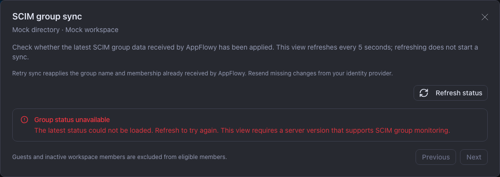

The unavailable view above is a simulated read failure. Compare it with the empty
connection example below: **0 groups received** is a successful response, and the
message directs you to the provider's assignments and provisioning results.

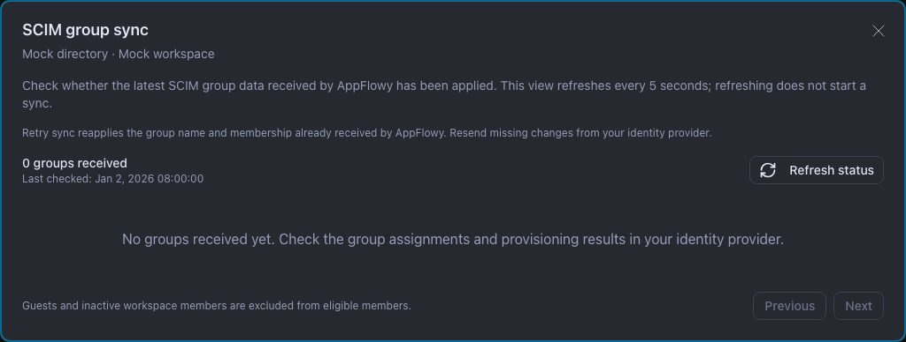

[**Watch video 4 — Monitor automatic group sync**](assets/scim-auto-sync/admin-sync-status.mp4)
· 1 min 40 sec · [Text transcript](assets/scim-auto-sync/admin-sync-status-transcript.txt)

The video uses real Authentik additions/removals and the real Admin status endpoint.
One idle confirmation pause is trimmed; no manual full sync is used. It shows the
synced member count change **1 → 2 → 1**. The separate state/error screenshots are
explicitly mocked UI examples, not failures induced in the demo installation.

## Step 7: Give the group access to a space

Group sync and space permissions are separate. An owner assigns the group to a
space once; subsequent membership changes determine who receives access through
that group.

1. In the demo workspace, choose a space called **Engineering Hub**, or create a
   space for this example.
2. Open its **••• menu → Manage Space**.
3. On **General**, select **Custom** and configure:

   | Setting | Value for this example |
   | --- | --- |
   | Space members | **Can edit** |
   | Everyone else in the workspace | **No access** |

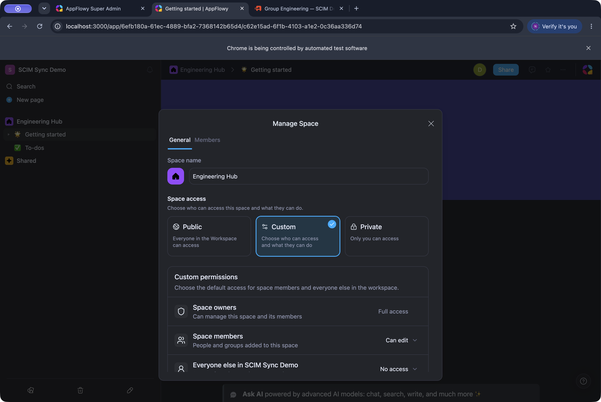

4. Open **Members**. For an example where access comes only from the group, remove
   any existing direct space-member grants for Alice and Bob. Keep the space owner.
   Converting a Public space to Custom retains its current members, so review this
   list after conversion.
5. Select **Add people or groups**, search for Engineering, and add
   **Engineering — SCIM Demo**.

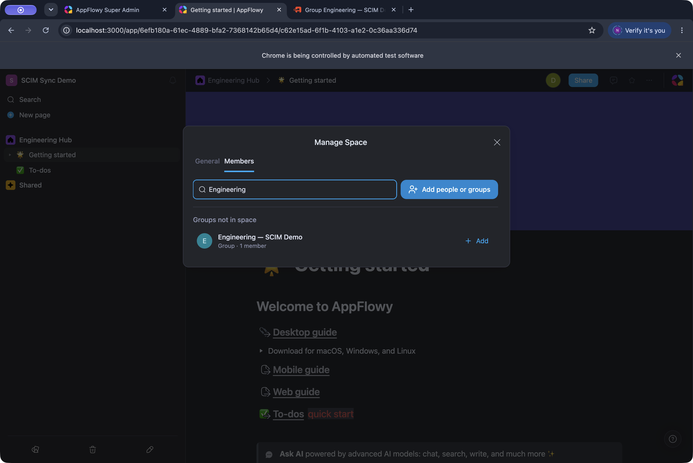

6. Confirm that Engineering appears with the role **Space member**.

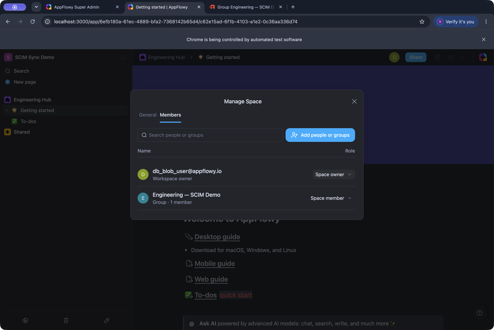

**Expected result:** Engineering is assigned to the space. Its current member,
Bob, receives the group's space-member access. You can now repeat the add/remove
exercise without reassigning the group to the space.

> A person can have more than one access path. Removing them from Engineering
> removes this group's access path. A direct grant, another group, an owner role,
> or broader space settings may still give them access.

[**Watch video 3 — Assign the synced group to a space**](assets/scim-auto-sync/space-access.mp4)
· 32 sec · [Text transcript](assets/scim-auto-sync/space-access-transcript.txt)

This clip starts with the Custom space configured and its direct test-user grants
removed. It demonstrates adding the group; it does not show a separate login as Bob.

## Step 8: Demonstrate the complete group lifecycle

Keep Engineering and its space assignment. Use a second group for this exercise so
you can delete it at the end. Alice and Bob must remain directly assigned to the
Authentik application, as configured in step 3.

| Action in Authentik | Expected AppFlowy result |
| --- | --- |
| Create Design and include it in the SCIM provider | A second group appears, empty and Synced |
| Rename Design to Product Design | The existing group's name changes |
| Add Alice | Product Design contains Alice |
| Add Bob, then remove Alice | Product Design contains Bob only |
| Change Bob's directory display name | SCIM stores the new directory value; his AppFlowy profile name remains unchanged |
| Delete Product Design | The group disappears; Engineering and the two user accounts remain |

### A. Create a group and watch it appear

1. In Authentik, open **Directory → Groups → New Group**.
2. Enter **Design — SCIM Demo**, leave **Superuser privileges** off, and select
   **Create Group**.

3. Edit the existing SCIM provider's **Group filters**. Keep Engineering selected
   and add Design, then save. A group excluded by this filter is not sent to AppFlowy.
4. Return to AppFlowy Admin. Wait for the connection count to show **2 SCIM groups**,
   then open it.

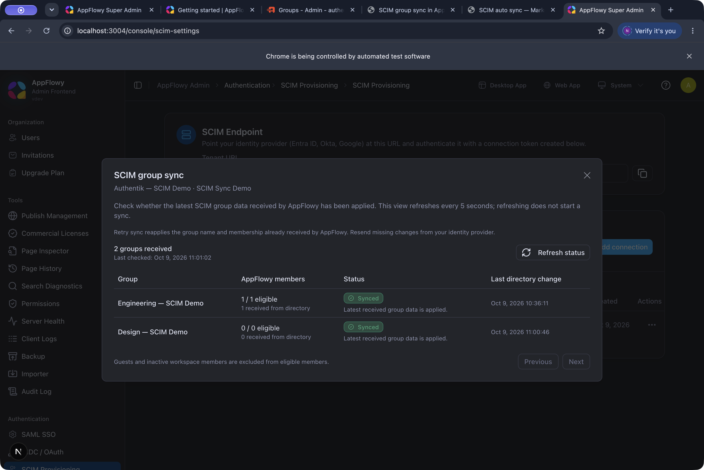

**Expected result:** Design appears automatically with **0 / 0 eligible** and
**Synced**. An empty group is valid. Do not create a matching group manually in
AppFlowy. Engineering is still present with Bob.

### B. Rename the group

1. In Authentik's group list, select Design's edit icon.
2. Change **Group Name** to **Product Design — SCIM Demo** and save.

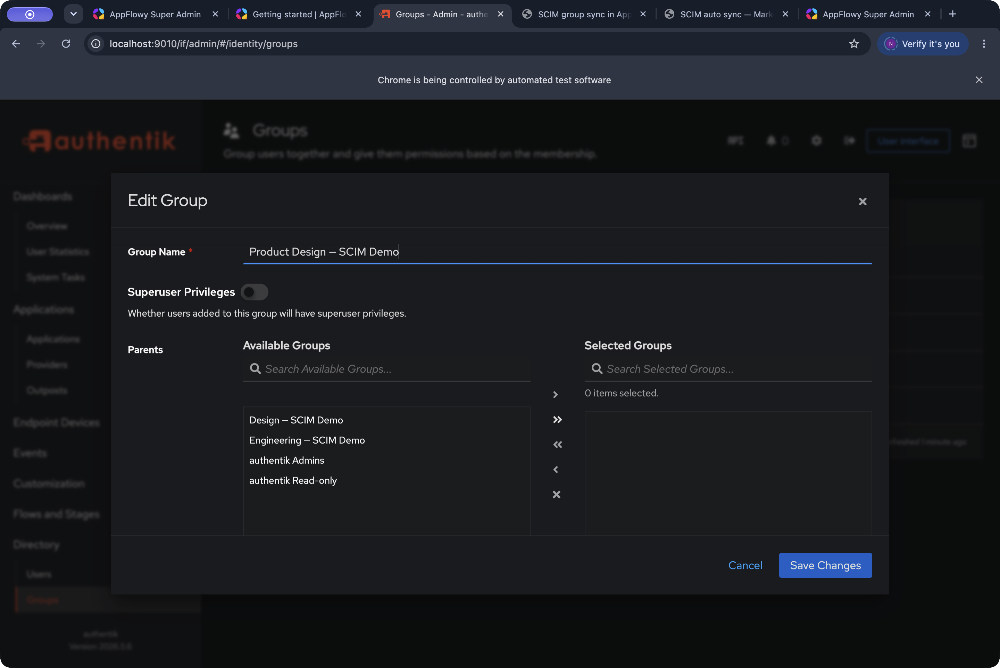

3. Keep the Admin monitor open until the new name appears with **Synced**.

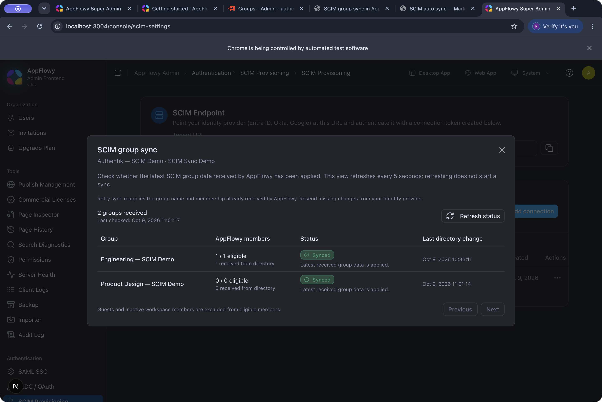

**Expected result:** the existing group is renamed; a second copy is not created.
Its identity and existing space/page permissions are preserved. If you configured
workspace-role mappings by group name, review those mappings when renaming a group.

### C. Add a member

1. Open **Product Design → Users** in Authentik.
2. Select **Add Existing User**, select Alice, choose **Confirm**, then **Assign**.
3. Refresh the directory table if needed. It should list Alice only.

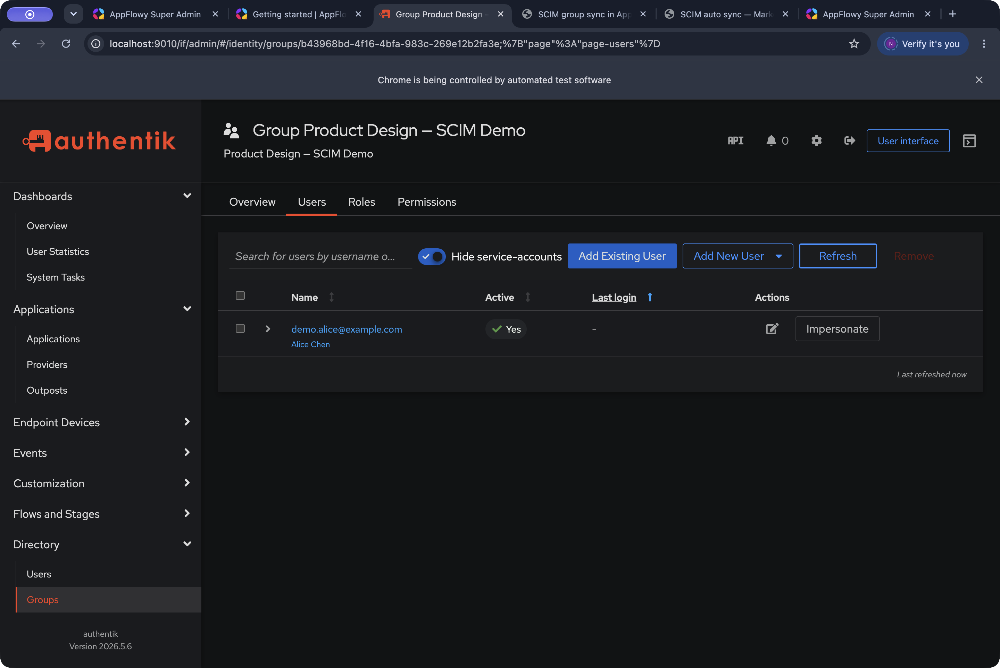

4. In AppFlowy Web, reopen **Settings → People → Groups** and open Product Design.

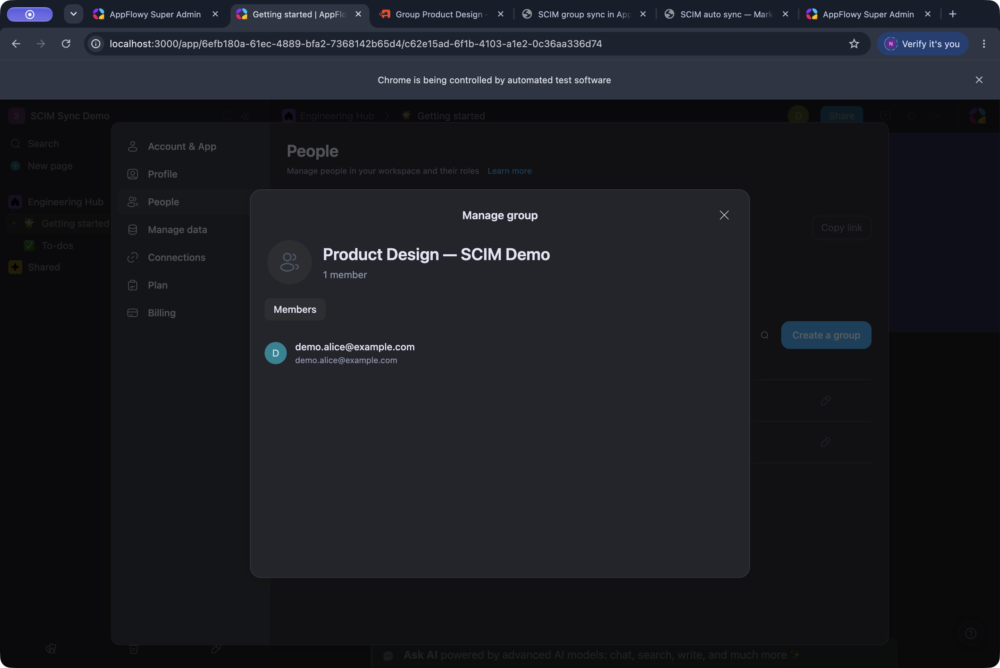

**Expected result:** the group contains Alice. Admin converges to **1 / 1 eligible**
and **Synced**. The AppFlowy roster is managed by the directory.

### D. Replace one member with another

1. In Authentik, add Bob to Product Design using the same assignment flow.
2. Select Alice in this group's **Users** tab, choose **Remove**, and confirm
   **Delete** in the membership-removal dialog.
3. Refresh the directory table. Bob should be the only remaining member.

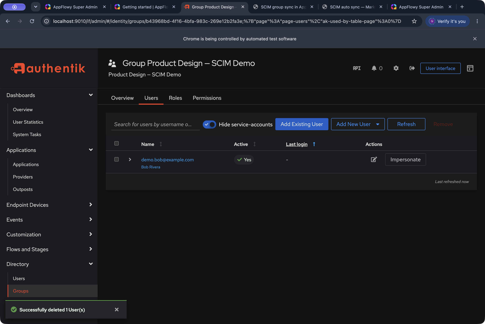

4. Reopen Product Design in AppFlowy Web and check the actual member identity.

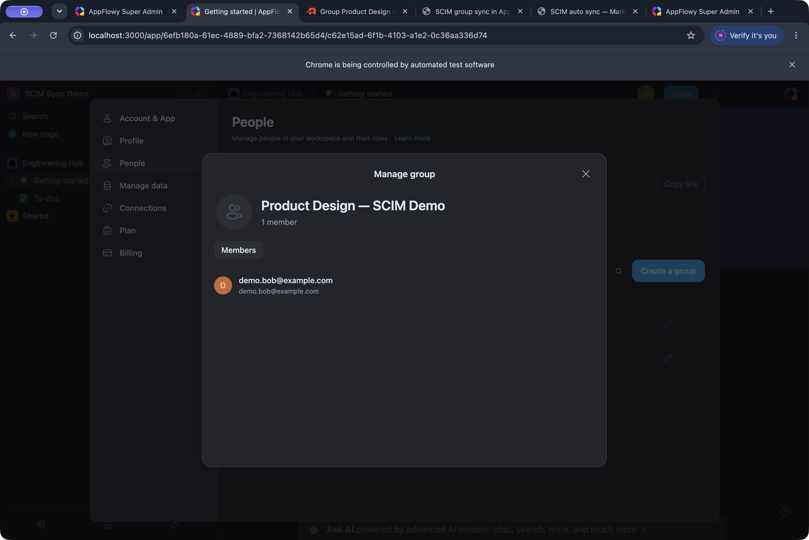

**Expected result:** membership changes **Alice → Alice and Bob → Bob**. The count
starts and ends at one, so a count alone cannot confirm sync. Admin compares the
member identities as well as the counts before reporting **Synced**.

Alice remains a workspace Member and a provisioned user. Here, **Delete** removes
her membership in Product Design; it does not delete her account.

### E. Modify a directory user's display name

1. In Authentik, edit Bob's user record.
2. Change **Display Name** from **Bob Rivera** to **Bob Rivera — Design**, then save.
   Keep his username and email unchanged.

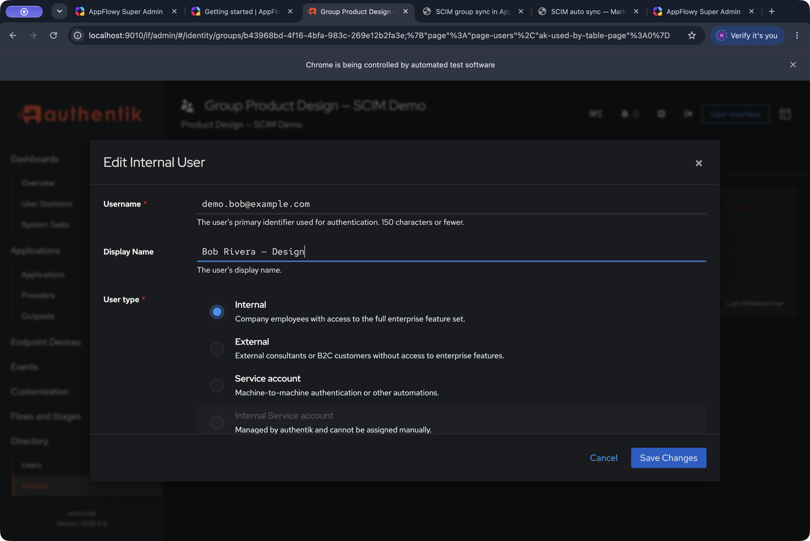

3. Check that Authentik's provisioning task succeeds. In the demonstration, a SCIM
   read also confirmed that AppFlowy had received the new `displayName` value.
4. Open **People → Members** in AppFlowy Web.

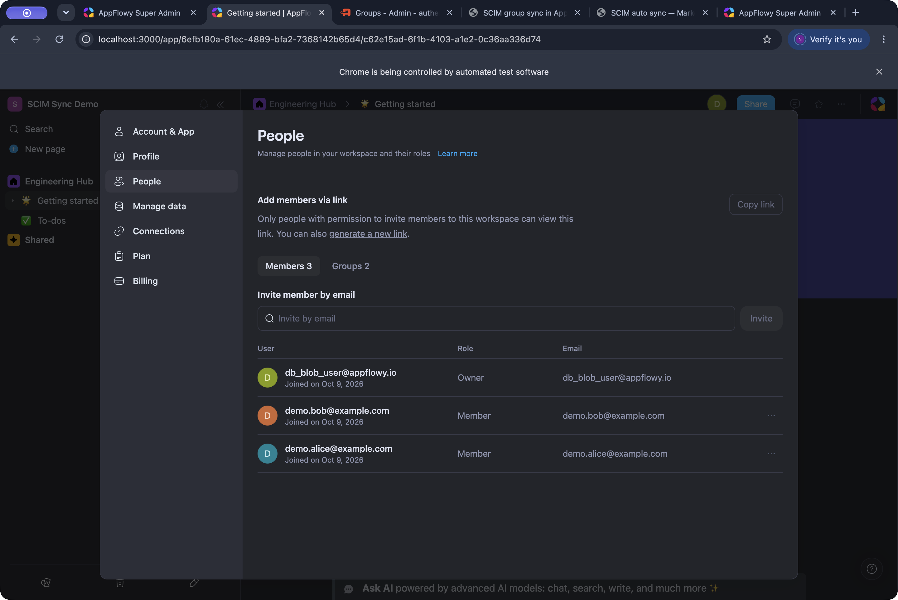

**Expected result:** Bob remains the same group member. His updated directory
display name is stored on this connection's SCIM user record, while AppFlowy keeps
his existing profile name. In this demo, AppFlowy still displays his email address.
This is expected behavior, not a failed group sync. The group badge checks the
group's name and eligible member identities; it does not compare profile names.

You can restore Bob's directory display name after the exercise. For other user
attributes, see the [SCIM attribute reference](SCIM.md#attribute-mapping).

### F. Recover a group with Retry sync

Use this action when Admin has received the correct group data but it has not been
fully applied. For ordinary **Pending** updates, first allow the background worker
to finish. A **Retrying** update also has an automatic retry scheduled.

The screenshots below use a **controlled local recovery exercise**: the demo's
AppFlowy group name was deliberately made stale while the received SCIM name and
membership were left unchanged. This was not an observed Authentik outage. You do
not need to introduce a fault in your own installation to use the recovery steps.

1. Open the group's Admin monitor and read the reason beneath **Needs attention**.
   Here, both counts are **1 / 1**, but the name differs from the received SCIM name.

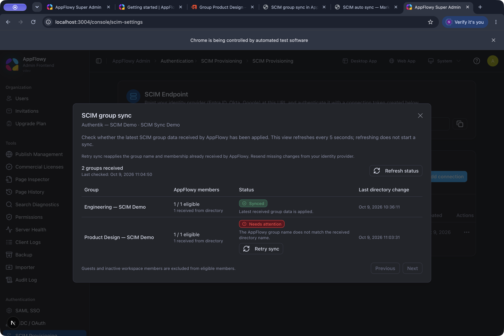

2. Select **Retry sync** for Product Design. The connection must be enabled.
3. Wait for **Sync requested**. This confirms acceptance, not completion. The server
   restores the received name and queues membership updates through its normal
   background worker. The badge can temporarily show **Pending**.

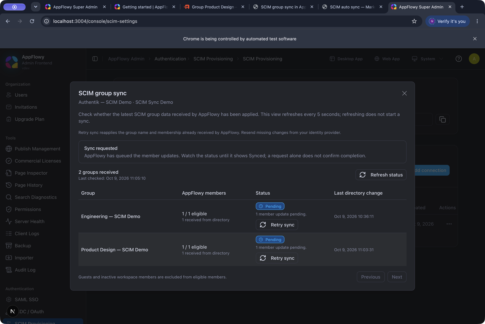

4. Leave the dialog open. After processing completes, confirm **Synced** and the
   expected members. In this demo, Product Design returns to **1 / 1 eligible**.

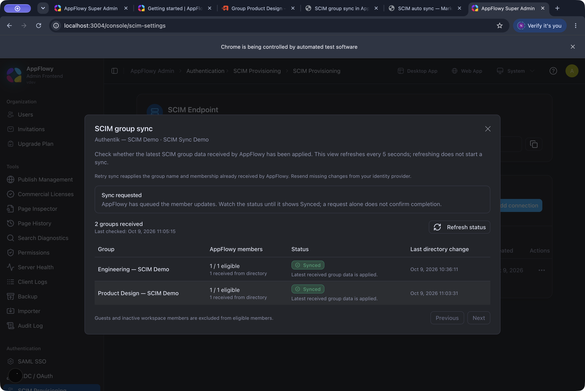

**Expected result:** the group matches the latest received SCIM data. Bob belongs
to both demo groups, so his queued reconciliation briefly makes both rows Pending.
If the retry fails, Admin displays an error and does not claim the group is synced.

| Situation | What Retry sync can do |
| --- | --- |
| Received name or membership has not been applied | Reapply the name and queue additions/removals using the received data |
| Managed AppFlowy group is missing or was deleted | Create a new group identity and rebuild membership; Admin tells you to reassign space/page permissions |
| Identity provider has a change AppFlowy has not received | No new data can be fetched by this button; resolve the provider's provisioning problem |
| Directory group has already been deleted | It is no longer listed and cannot be restored with Retry sync |

An existing active group's permissions are preserved. A recreated group starts
without the deleted group's grants; review and assign its intended permissions.
Retrying does not take ownership of a manually managed group with the same name.

[**Watch video 6 — Recover a group with Retry sync**](assets/scim-auto-sync/retry-group-sync.mp4)
· 32 sec · [Text transcript](assets/scim-auto-sync/retry-group-sync-transcript.txt)

This continuous excerpt shows the real Admin endpoint and background processing
after the controlled fault. Retry sync replays received data; it does not start an
identity-provider full sync.

### G. Delete the group

1. In Authentik's **Directory → Groups** list, select **Product Design — SCIM Demo**.
2. Choose **Delete** and confirm that the dialog names Product Design.

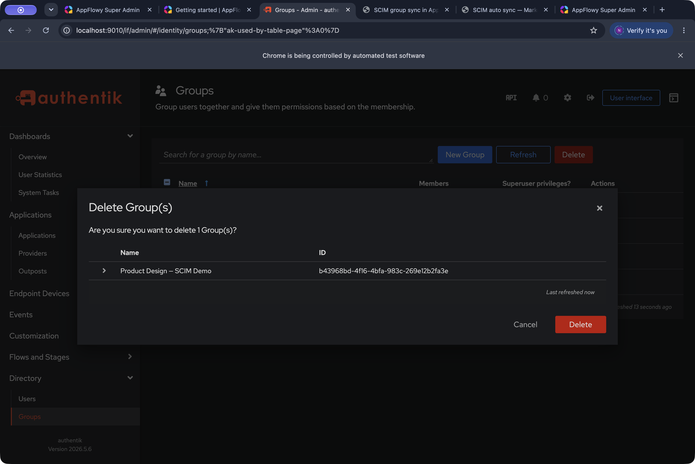

3. Return to Admin. Wait for the connection count to change **2 → 1**, then open it.

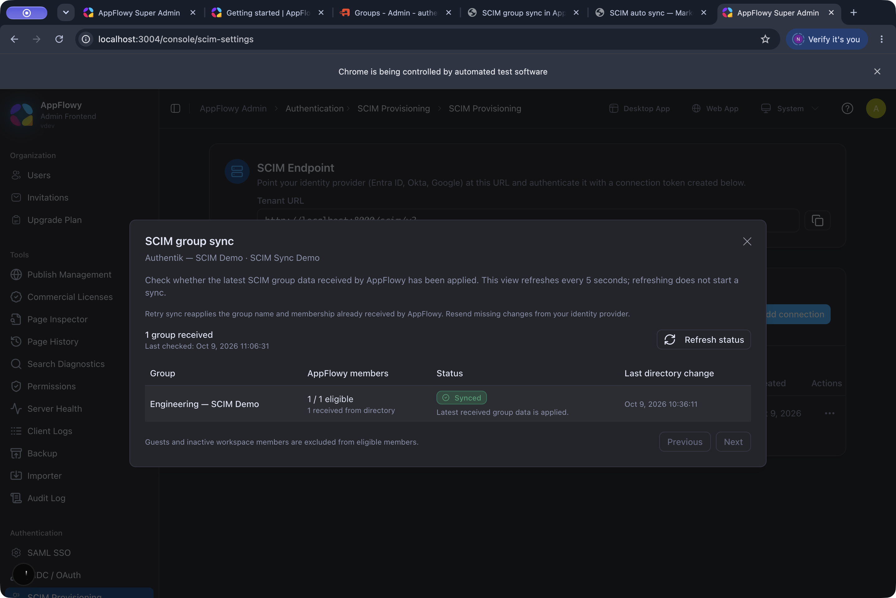

4. In AppFlowy Web, reopen **People → Groups**. Confirm that Product Design is gone
   and **Groups 1** lists Engineering only.

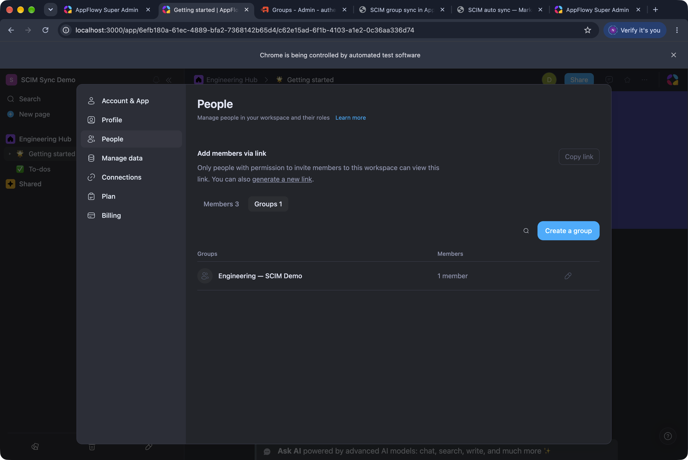

5. Switch to **Members**. Confirm that Alice and Bob are still workspace Members.

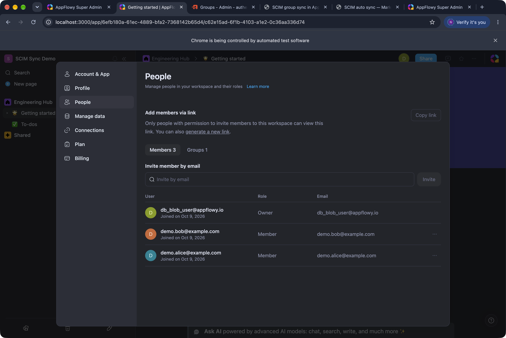

**Expected result:** Product Design disappears from the received-group list and
the AppFlowy workspace's active groups. Engineering remains Synced with Bob.
Alice and Bob remain provisioned because their application assignments were kept.
Deleting a group removes its group-based access; it does not delete its users.

If you later create another directory group with the same name, it is a new group.
It does not inherit the deleted group's space/page grants.

### Watch the lifecycle walkthrough

[**Watch video 5 — Group and member lifecycle**](assets/scim-auto-sync/group-lifecycle.mp4)
· 2 min 28 sec · [Text transcript](assets/scim-auto-sync/group-lifecycle-transcript.txt)

This edited walkthrough combines the real recording with **labeled still captures**
of the creation form and AppFlowy results. Idle waits are removed. The new group's
provider filter was configured during setup, outside the clip. No manual full sync
or direct AppFlowy membership edit is used. Video 6 shows the separate recovery step.

### Which kind of deletion is this?

| Action | Group result | User result |
| --- | --- | --- |
| Remove a user from a group | That membership is removed | The account remains; workspace role may also depend on role mappings |
| Delete the directory group | The matching AppFlowy group and its group-based access are removed | Users remain if they are still provisioned by the application |
| Deactivate or delete a SCIM user | The user no longer participates in workspace permission groups | Workspace access is removed; this is a separate deprovisioning operation |

This walkthrough demonstrates the first two actions. For user deprovisioning,
follow [Deactivate, reactivate, delete](SCIM.md#6-deactivate-reactivate-delete).

## When your license runs out of seats

Suppose your license allows **three active users** and all three seats are occupied.
The directory assigns a fourth person to AppFlowy. AppFlowy keeps that person's
SCIM record and waits for capacity. **The fourth person receives no new workspace
access while waiting.** The directory can still update, deactivate or delete the
record.

### 1. Find the waiting user count

Open **Authentication → SCIM Provisioning**. The connection shows **1 user waiting
for seats** and explains that you need to apply an updated license. This count
includes waiting users who are not in any group.

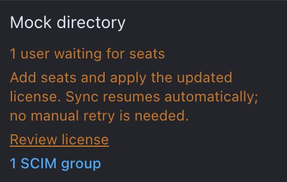

### 2. Inspect the affected group

Select the connection's **SCIM groups** count. The group displays **Waiting for
seats**. In this example, **3 received from directory** means all three group
members are known, while **2 / 2 eligible** means the two currently eligible
members have been applied. The waiting person is not counted as eligible yet.

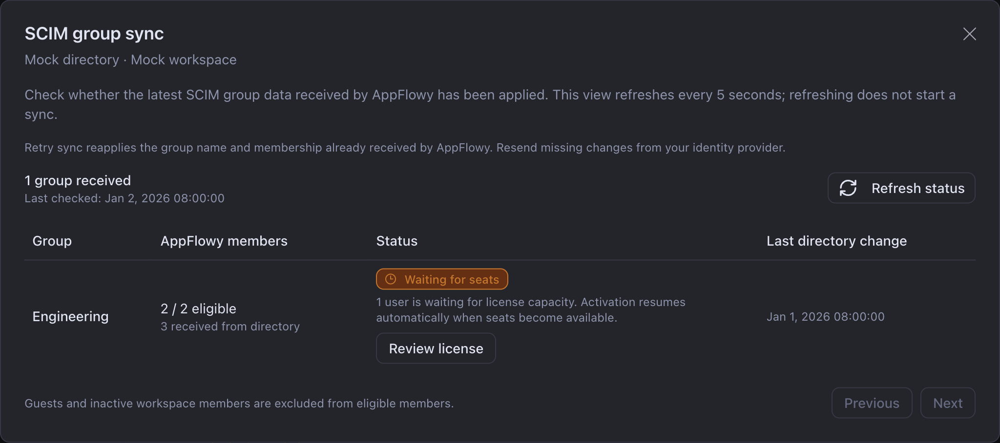

Select **Review license** to open the plan page. Purchase enough seats, then
install or refresh the updated license on this self-hosted instance. Confirm that
its displayed seat allowance has increased. A completed purchase alone does not
change an instance that still has its old license installed.

### 3. Leave the monitor open

AppFlowy detects the installed-license change and automatically retries the waiting
activation. It rechecks capacity, adds the workspace membership, and applies the
latest directory group membership. The Admin dialog refreshes every five seconds.
No **Retry sync** click or new directory change is required. Allow background
processing time; a busy instance can take longer.

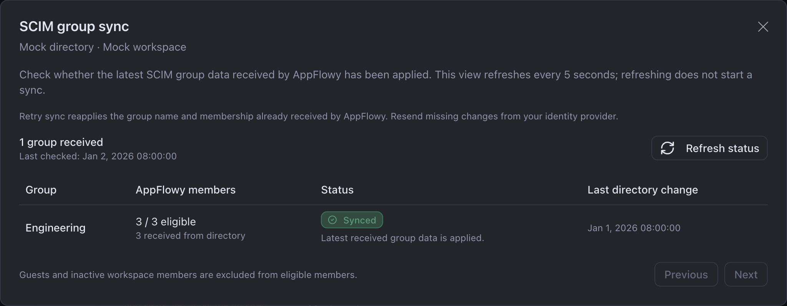

The connection's waiting count clears, the example group reaches **3 / 3 eligible**,
and its badge becomes **Synced**. Group space/page permissions still come from the
grants you configured earlier.

### 4. Know what cancels or delays recovery

- Deactivate or delete a waiting user in the directory: once AppFlowy receives that
  change, it cancels activation. Adding seats later does not restore that request.
- Change their name or group membership while waiting: recovery uses the latest
  received values. Removing them from a group does not cancel workspace activation;
  deactivate the user or remove their application assignment to revoke it.
- Pause the SCIM connection: recovery waits until you enable it again. Keep the
  connection and paid authentication entitlement enabled for recovery.
- Free a seat instead of buying one: the regular background retry can use it, with
  retry delays capped at five minutes. If several users are waiting, only those
  that fit the available capacity are admitted.

> **Evidence:** Screenshots 36–38 are UI test fixtures illustrating the warning and
> recovery display. They are not a recording of a purchase. Separate server
> regressions use a running self-hosted instance and signed licenses to verify
> automatic recovery, cancellation and final-seat enforcement. The existing six
> videos demonstrate group synchronization and manual group repair.

> **Upgrading an older instance:** Install Cloud and Admin versions containing
> automatic seat recovery. An older server's rejected `409` create request was not
> saved for replay; let the directory retry that request once after upgrading.

## Check your result

| Checkpoint | Expected result in AppFlowy |
| --- | --- |
| Initial provisioning | Engineering group exists with 0 members |
| Alice assigned in Authentik | Engineering contains Alice |
| Bob assigned in Authentik | Engineering contains Alice and Bob |
| Alice removed from Engineering | Engineering contains only Bob; Alice remains a workspace Member in this example |
| Admin sync monitor after convergence | 1 SCIM group; Engineering shows 1 / 1 eligible and Synced |
| Engineering assigned to Engineering Hub | The group appears as a Space member |
| Design created and included in the provider filter | 2 received groups; Design is empty and Synced |
| Design renamed | Product Design appears with the new name, preserving group identity |
| Alice replaced with Bob in Product Design | Bob is the only member; the final count is still 1 |
| Bob's directory display name modified | SCIM retains the new value; AppFlowy's profile name is preserved |
| Retry sync accepted, then completed | Sync requested → Pending → Synced; acceptance alone is not completion |
| Product Design deleted | 1 received group remains: Engineering; both demo user accounts remain |

## Troubleshooting

| What you see | What to check |
| --- | --- |
| No SCIM entry in Admin | Check the [self-hosted plan prerequisites](SCIM.md#before-you-begin). |
| No group appears | Confirm the target workspace, enabled connection, reachable SCIM URL, valid token, Authentik group filter, and successful initial provisioning. |
| Group exists, but a member is missing | Confirm the user is assigned to the Authentik application, active, and an AppFlowy workspace Member or Owner. Guests and inactive users are not projected into these permission groups. Check licensed seats and provider task errors. |
| The old member count remains on screen | Allow the background tasks to finish, then reopen **People → Groups**. A fixed sync delay is not guaranteed. |
| Admin shows Waiting for seats | Add seats and apply the updated license, or free a seat. The waiting activation retries automatically; see [seat recovery](#when-your-license-runs-out-of-seats). |
| Admin shows Pending or Retrying | Allow background processing to finish. After fixing a persistent worker error, use **Retry sync** to request another attempt. **Refresh status** only reloads the view. |
| Admin shows Needs attention | Read the issue beneath the badge and use **Retry sync** to reapply received data. Equal counts alone do not establish sync. If the issue persists, inspect worker logs. |
| Retry sync is disabled | Enable the connection; a request already in progress also temporarily disables the buttons. |
| Admin says the group was recreated | Review and reassign its space/page permissions. A new group does not inherit deleted grants. |
| Admin shows Group status unavailable | Retry the read and confirm Cloud supports the monitoring endpoint. This does not mean the connection has zero groups. |
| Admin shows Synced but Authentik has a newer change | Synced only covers received data. Check Authentik tasks, connectivity, connection enablement and token expiry. |
| Directory changes never arrive | Check the Authentik worker and provider task results, then AppFlowy logs. An enabled connection row indicates configuration status, not the success of the latest sync. |
| Sync stopped after token rotation | Replace the token in the existing Authentik provider. Do not recreate the provider just to change its token. |
| A removed group member can still access the space | Look for direct grants, another group, owner access, or broader space permissions. |
| You cannot edit the synchronized roster in AppFlowy | This is expected. Make the membership change in Authentik. |
| A user's directory display name changed but their AppFlowy profile did not | This is expected. The SCIM user value is stored separately from the AppFlowy profile name. |

For protocol errors, connection tests, and lifecycle behavior, continue with
[SCIM verification](SCIM.md#verify-the-setup) and
[Authentik's SCIM documentation](https://docs.goauthentik.io/add-secure-apps/providers/scim/).

## About the recordings

Recorded on **October 9, 2026** using the local AppFlowy Admin frontend, AppFlowy
Web, and Authentik **2026.5.6**. Initial provisioning was completed before the
membership videos. The add/remove recordings use normal Authentik UI changes,
without a manual full-sync action or direct AppFlowy membership edits.

The displayed member sets and the final space grant were checked against stored
active memberships and permissions. The local hosted development workspace used
a paid-plan test fixture to allow multiple members; this is not a self-hosted
license-validation test or a production latency measurement. Follow the licensed
self-hosted prerequisites above for your deployment. User sign-in is outside the
recording's scope.

The media contains demonstration identities and no SCIM auth key. There are now
**38 screenshots and 6 captioned videos**, with a text transcript for each video.
The twelve original screenshots and three original videos remain available. The
Admin monitor adds six screenshots and one video; the complete lifecycle and
recovery exercises add seventeen screenshots and two videos. Three additional UI-fixture
screenshots explain waiting for seats and automatic recovery.

Screenshots 16–18 and 36–38 are explicitly labeled UI test fixtures. The lifecycle screenshots
come from the live local demo. Screenshots 31–33 and video 6 show an actual retry
against a deliberately stale local group name, not a naturally occurring provider
failure. The lifecycle video labels its still captures and trims idle waits. The
demo's temporary directory display-name change was restored afterward. Media was
reviewed for credentials and private information before inclusion. All assets are in
[`assets/scim-auto-sync/`](assets/scim-auto-sync/).
