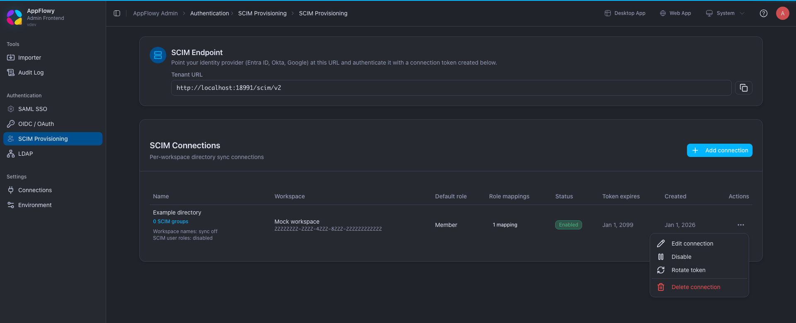
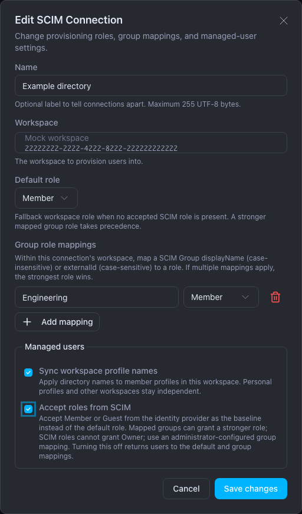
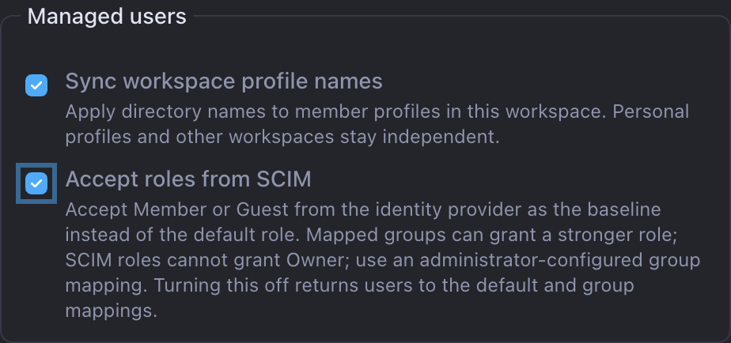
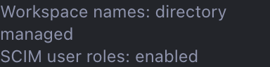

# SCIM roles, user lifecycle, and recovery

[Documentation](README.md) / [SCIM setup and API](SCIM.md) / Operations

Use this guide after creating a SCIM connection. It explains which changes belong
in your identity provider and which permissions remain under AppFlowy's control.
For setup with screenshots and videos, choose [Entra](ENTRA_SCIM_AUTO_SYNC.md),
[Authentik](AUTHENTIK_AUTO_SYNC.md), or [Windows AD](AD_SCIM_AUTO_SYNC.md).

## In this guide

- [Understand roles and permissions](#understand-roles-and-permissions)
- [Enable managed names and direct roles](#enable-managed-names-and-direct-roles)
- [Supported attributes and limits](#supported-attributes-and-limits)
- [Move a user between groups](#move-a-user-between-groups)
- [Distinguish removal, deactivation, and deletion](#distinguish-removal-deactivation-and-deletion)
- [Check sync status](#check-sync-status)
- [Recover when seats are full](#recover-when-seats-are-full)
- [Verify changes safely](#verify-changes-safely)

## Understand roles and permissions

SCIM synchronizes a workspace group. It does not create a space or choose the
space's permission level.

| Setting | Where to manage it | Effect |
| --- | --- | --- |
| Directory users and group membership | Identity provider | Selects the identities and memberships sent to AppFlowy |
| Default workspace role and group role mappings | AppFlowy Admin → SCIM Provisioning → Edit connection | Selects AppFlowy Owner, Member, or Guest |
| Group access to a space | AppFlowy Web → Manage Space | Grants the chosen space permission to eligible members of the synced group |
| Direct space or page access | AppFlowy Web | A separate grant that can retain access after group removal |
| Entra directory administrator role | Entra Roles & admins | Administers Microsoft Entra; it does not grant an AppFlowy role |

When direct SCIM roles are disabled, the strongest role among the connection
default and mapped groups wins: **Owner → Member → Guest**. A Member default
cannot be reduced to Guest by a Guest group mapping. Use a Guest default and
selected Member group mappings when those groups should decide who becomes a Member.

When **Accept roles from SCIM** is enabled and a user has an explicit Member or
Guest role, that value replaces the default as the baseline. A mapped group can
still grant a stronger role. Removing the direct role returns the baseline to
the connection default. Microsoft administrator roles are never imported.

Group names match case-insensitively; group `externalId` values match exactly.
When both match, the name mapping takes precedence. A stable external ID avoids
changing a mapping every time its group is renamed.

An AppFlowy workspace Owner mapping is privileged. Keep the system administrator
and original workspace owner outside provisioning. An Entra application
assignment labeled **User** does not itself mean AppFlowy Member.

See the [illustrated Entra role mapping](ENTRA_SCIM_AUTO_SYNC.md#step-7-understand-the-role-and-permission-mapping)
and [space configuration](ENTRA_SCIM_AUTO_SYNC.md#configure-the-spaces-used-by-the-move-test).

## Enable managed names and direct roles

Update AppFlowy Cloud and Admin together, deploying Cloud first. Both options are
off by default, including for existing connections. The original Entra and
Authentik recordings show the defaults; the configuration screenshots below use
synthetic data and do not claim a new Entra delivery.

1. Open **AppFlowy Admin → Authentication → SCIM Provisioning**.
2. Choose **Actions → Edit connection** for the intended workspace.



*Start from the connection row. The page, workspace, identifiers, and endpoint in
this screenshot are synthetic test data.*

3. Review **Default role** and **Group role mappings** before changing the
   policies below them. These settings determine the fallback and any stronger
   role granted by group membership.



*The managed-user controls are in the same form as the existing role settings.
The example retains a Member default and an Engineering → Member mapping.*

4. Under **Managed users**, enable only the policies you need.



*Configuration example from the implemented Admin UI with synthetic API data.
Both options are off by default; enabling them is an administrator decision.*

5. Select **Save changes** and confirm the policy summary beneath the connection name.



*After saving, check this summary beneath the connection name. It reports the
configured policies, not a per-user sync result. [Capture details](assets/scim-managed-users/CAPTURE_NOTES.md).*

6. Provision a disposable user and check the workspace name and effective role.

| Control | What enabling it does | What disabling it does |
| --- | --- | --- |
| Sync workspace profile names | Applies received directory names to this workspace's member profile; queues existing users for reconciliation | Stops future directory name writes; retains the last workspace name override |
| Accept roles from SCIM | Accepts an explicit Member/Guest baseline from the AppFlowy SCIM extension | Ignores stored direct roles and recalculates users from the default and group mappings |

The name preference is `displayName`, then `name.formatted`, then the joined
`name.givenName` and `name.familyName`. Removing all name values clears the managed
workspace override and falls back to the personal profile. This policy never
changes the global personal name or another workspace's profile.

SCIM keeps the full `displayName` and structured `name` in its stored data and
responses. Only the selected workspace display name is shortened to fit the
72-byte UTF-8 limit, without splitting a character. This limit can mean fewer
than 72 characters for some languages. A long directory name does not prevent
provisioning or offboarding: deactivating the user still removes their managed
workspace access.

Users can still edit their workspace profile locally. A later directory update
or reconciliation can overwrite a local name edit while this policy is enabled.

Changing only the name policy preserves manually assigned workspace roles, even
when **Save changes** resubmits the existing default role and group mappings.
Changing a role policy or mapping does recalculate the affected users' roles.
An attribute-only User update also preserves a manual role when the user is
already active and has no direct SCIM role. A full `PUT` that omits a previously
assigned direct role clears that assignment and recalculates the baseline.

The direct role belongs to this optional User extension:

```json
{
  "schemas": [
    "urn:ietf:params:scim:schemas:core:2.0:User",
    "urn:appflowy:params:scim:schemas:extension:workspace:2.0:User"
  ],
  "userName": "alice@example.com",
  "displayName": "Alice Demo",
  "active": true,
  "urn:appflowy:params:scim:schemas:extension:workspace:2.0:User": {
    "role": "guest"
  }
}
```

Enable **Accept roles from SCIM** before sending the extension; a nonempty direct
role is rejected while the policy is off. Send `member` or `guest`; a direct
`owner` role is rejected. Owner mappings remain
an explicit AppFlowy administrator decision. A provider's generic `roles` field,
Entra Member/Guest user type, or Entra **User** application assignment does not
automatically become this extension.

| Default | Direct role accepted | Strongest mapped group | Effective role |
| --- | --- | --- | --- |
| Member | None | Guest | Member |
| Member | Guest | None | Guest |
| Guest | Guest | Member | Member |
| Guest | Member | Owner | Owner |
| Guest | Removed | None | Guest |

For Entra, keep the existing group-role approach unless you intentionally configure
the AppFlowy extension in the provider mapping. The earlier Entra screenshots
demonstrate group-role mapping, not this optional extension.

## Supported attributes and limits

Use the [SCIM attribute reference](SCIM.md#attribute-mapping) when configuring the
provider. Profile and employee attributes stored by SCIM are directory data;
their presence in the SCIM response does not imply an AppFlowy People Directory
or a new permission grant.

The sign-in email remains immutable through SCIM. `userName` identifies the
existing account and `emails` is derived from it. Do not delete and recreate a
user to rename their email or move them between groups.

AppFlowy currently has Owner, Member, and Guest workspace roles. It does not add
Notion's membership administrator or restricted member roles. Provisioning is
silent; there is no per-connection invitation-email switch. SCIM lists the users
managed by the connection rather than every unmanaged workspace member.

## Move a user between groups

Change the memberships in the source directory. **Do not delete and recreate the
user to move them.** A group membership change retains the AppFlowy account and
the user's documents. AppFlowy recalculates the role and access contributed by
each group.

1. Keep the user in the identity provider's provisioning scope throughout the move.
2. Add the destination group membership and wait for its delivery and application.
3. Remove the old membership when temporary access to both groups is acceptable.
4. Confirm the account is the same, destination access works, and access supplied
   only by the old group is removed.
5. Check other group, direct-share, and owner grants before expecting access to fail.

The two group updates are separate operations. Remove-before-add can temporarily
remove both groups' access; add-before-remove can temporarily grant both. If the
old group was the user's only application assignment, removing it can instead
make the provider send `active:false`. That is offboarding, not a membership move.

Pages do not move or disappear when their author changes groups. A user can lose
permission to open a retained page while other authorized people keep access.
Guest membership also remains in the directory roster, but Guests are ineligible
for the workspace-group grants used in these demonstrations.

[Watch the recorded Entra group move and inspect its access checks](ENTRA_SCIM_AUTO_SYNC.md#step-8-move-a-user-without-deleting-their-account-or-work).

## Distinguish removal, deactivation, and deletion

| Operation received by AppFlowy | Result | Retained state |
| --- | --- | --- |
| Remove a member from a group | Removes that group's membership and recalculates roles/access | User account, documents, and unrelated access grants |
| Delete a group | Removes the synced workspace group and its grants | User accounts and documents; unrelated access remains |
| Set a user to `active:false` | Removes access to this workspace | Account, content, and SCIM identity for reactivation |
| Set the same SCIM user to `active:true` | Reuses the identity, subject to role and licensed capacity | Current received directory memberships determine restored group access |
| Delete a SCIM user | Removes the directory resource and workspace access | AppFlowy account and content; the old SCIM resource ID returns `404` |

Reactivation does not restore every old direct share, manually assigned group,
or space ownership. Review those grants separately. If the account belongs to
another workspace, SCIM offboarding is scoped to the connection's workspace;
it must not remove that other membership.

Session handling is distinct from workspace permissions. Removed members lose
workspace authorization, including updates to an existing document subscription.
When no other workspace remains, the durable authentication update bans the
account and blocks sign-in and refresh after it completes. Existing JWTs are not
all immediately invalidated. When another workspace remains, its authorized
access and session refresh remain usable.

Verify an already-open document and a previously issued access token against the
removed workspace, then separately test refresh and a new sign-in. Check an
unrelated workspace to ensure its access remains intact. See the
[authentication session notes](AUTHENTICATION.md#notes-that-apply-to-every-method).
Do not use account deletion as a logout shortcut.

Workspace-bound MCP authorization also checks the current workspace membership
and its role when the credential is used or refreshed. Removed members and
Guests cannot keep using a previously issued MCP credential for that workspace.
This does not revoke unrelated workspace access.

## Check sync status

In AppFlowy Admin, open **SCIM Provisioning** and select the connection's
**SCIM groups** count. The monitor compares each received group with the
corresponding AppFlowy workspace group.

| Status | Meaning | Next action |
| --- | --- | --- |
| Synced | Received group name and eligible membership match the applied group | Verify the provider delivered the source change you expected |
| Pending | Received state still needs to be applied | Leave the monitor open and wait |
| Retrying | A prior application attempt failed and is queued again | Inspect the issue and retry timing |
| Waiting for seats | An accepted activation needs license capacity | Add capacity or release a seat |
| Needs attention | The applied group is missing or differs from received state | Review the mismatch and select Retry sync if appropriate |

**Synced confirms only data AppFlowy has received.** It does not prove that a
change still queued in AD, Entra, or another provider has arrived. Compare the
provider's provisioning log when a recent source change is absent.

**Retry sync** reapplies the received group name and queues membership work; it
does not fetch new changes from the provider. Wait for Synced after Sync requested.
If retry recreates a missing group, review and reassign its space/page grants.

The open monitor refreshes the connection's enabled state. Pausing the connection
disables **Retry sync** on the next refresh; resuming it makes the action available
again. A successful retry request means the work was accepted. Keep the monitor
open until the received group name and eligible membership show **Synced**.

See [status screenshots](AUTHENTIK_AUTO_SYNC.md#watch-group-sync-status-in-admin)
and the [retry walkthrough](AUTHENTIK_AUTO_SYNC.md#f-recover-a-group-with-retry-sync).

## Recover when seats are full

The server accepts an eligible activation that is waiting for capacity without
granting workspace access. Admin shows the waiting count. Apply the upgraded
license or release capacity, then wait for the background retry to apply the
latest directory state. There is no need to delete and recreate the user.

Check regular seats and Guest capacity separately. A pending request that the
provider later deactivates must not gain access when a seat becomes available.

Follow the [illustrated seat recovery procedure](AUTHENTIK_AUTO_SYNC.md#when-your-license-runs-out-of-seats)
or the [recorded Entra offboarding and recovery](ENTRA_SCIM_AUTO_SYNC.md#step-9-test-seat-capacity-offboarding-and-recovery).

## Verify changes safely

Use a dedicated workspace and disposable users. Check both the Admin status and
the user's actual access after each operation.

| Check | Confirm |
| --- | --- |
| Group rename | The same group remains assigned to the intended spaces |
| Add/remove membership | Only access supported by the changed membership changes |
| Move with overlapping groups | Remaining grants retain their access |
| Role fallback | The strongest remaining role applies; Guest eligibility changes correctly |
| Offboarding and reactivation | Target workspace access is removed, identity/content remain, and reactivation uses the same account |
| Seat recovery | A waiting identity gains no access until capacity is available |
| Token rotation | Old token is rejected; the provider resumes with the replacement |

The [Entra guide's repeatable checks](ENTRA_SCIM_AUTO_SYNC.md#repeatable-checks-after-the-microsoft-trial)
identify what was tested through the provider and what is covered by automated
server tests. A Windows AD import requires separate validation of that upstream
stage. For route, token, or mapping errors, use [SCIM troubleshooting](SCIM.md#troubleshooting).
