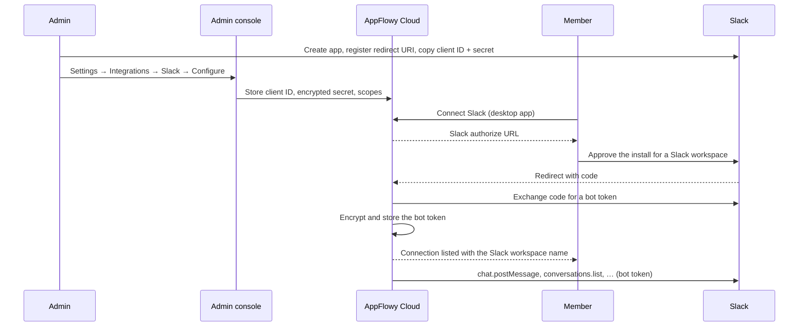
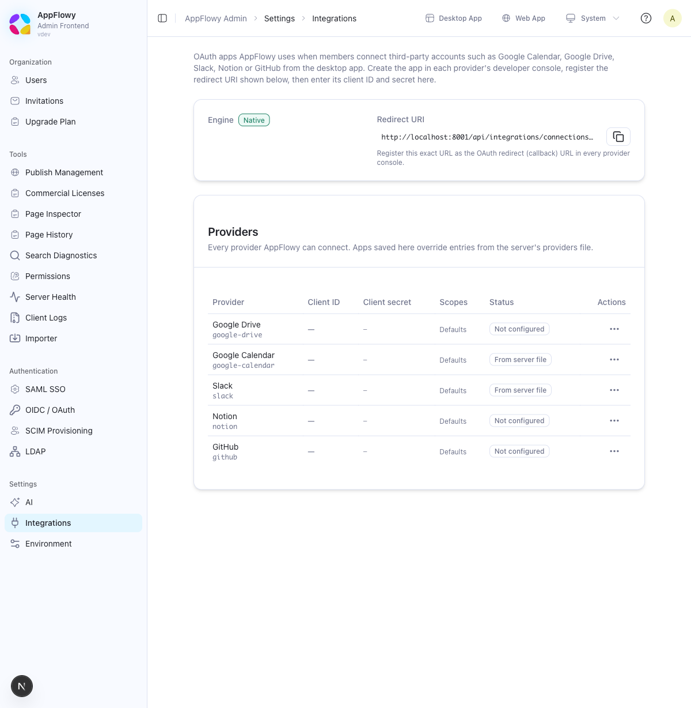

# Slack integration

> **Draft.** This guide describes the native integrations engine (AppFlowy Cloud PR #1125 and
> Admin console PR #85). Sections marked *planned* are not shipped yet.

Connecting Slack lets AppFlowy act in a Slack workspace on behalf of your team: today through the
integrations API, and, once database automations ship, through a **Send Slack notification**
action that posts to a channel when a row is added or a property changes.

Setup has two halves. An administrator registers one Slack app for the deployment in
**Admin → Settings → Integrations**. Members then connect Slack from the AppFlowy app.

## How it works



AppFlowy stores the Slack **bot token** (`xoxb-…`), not a user token. Everything AppFlowy posts
appears as the app, not as the member who connected it.

## Before you begin

Make sure you have:

- AppFlowy Cloud and the Admin console at versions that include the **Integrations** settings
  page. On a fresh self-hosted install no environment variable is needed; the native engine is on
  by default.
- A public HTTPS URL for AppFlowy Cloud: `SCHEME=https` and your domain in `FQDN` in
  `docker/.env`. The redirect URI is built from these. Slack refuses `http://` redirect URLs
  except for `localhost`.
- Permission to create apps in the Slack workspace you want to connect. Some Slack workspaces
  require an admin to approve new apps.

## 1. Create the Slack app

1. Open <https://api.slack.com/apps> and select **Create New App → From scratch**. Name it (for
   example `AppFlowy`) and pick the Slack workspace that will own the app.
2. In **OAuth & Permissions → Redirect URLs**, add the **Redirect URI** shown at the top of
   **Admin → Settings → Integrations** and select **Save URLs**. It has the form
   `https://<your-appflowy-domain>/api/integrations/connections/oauth/callback`. Copy it from the
   page rather than typing it; Slack requires an exact match, including the scheme and path.
3. Still under **OAuth & Permissions**, add **Bot Token Scopes**:

   | Scope               | Needed for                                                          |
   | ------------------- | ------------------------------------------------------------------- |
   | `channels:read`     | Listing public channels (channel pickers). Requested by default.     |
   | `users:read`        | Resolving member names. Requested by default.                        |
   | `chat:write`        | Posting messages. Required for *Send Slack notification* (planned).  |
   | `chat:write.public` | Posting to public channels the app has not been invited to. Optional. |
   | `groups:read`       | Listing private channels the app is a member of. Optional.           |

   Slack only grants scopes that are both listed here **and** requested by AppFlowy (step 2 of
   the next section). Adding a scope later requires members to reconnect.
4. Leave **Token Rotation** off. Rotated bot tokens expire after 12 hours and are not refreshed
   by the current engine.
5. In **Basic Information → App Credentials**, copy the **Client ID** and **Client Secret**.
6. Optional: under **Install App**, install the app into the Slack workspace yourself once. This
   is not required; connecting from AppFlowy performs the install.

## 2. Configure AppFlowy



1. Open **Admin → Settings → Integrations**. The **Engine** badge should read **Native**. If it
   reads **Nango**, the deployment still has `NANGO_ENABLED=true`; remove it and restart.
2. On the **Slack** row, select **⋯ → Configure** and enter:

   - **Client ID** and **Client secret** from the Slack app. The secret is stored encrypted and is
     never shown again; the row shows only its last four characters.
   - **Scopes**: leave blank for the defaults (`channels:read users:read`), or list exactly the
     bot scopes you added to the Slack app, separated by spaces or commas. For notifications:

     ```
     chat:write channels:read users:read
     ```

3. Select **Save**. The row changes to **Configured**. No restart is needed; the change is live
   on every server replica within 30 seconds.

To verify from the command line, `GET /api/server-info` now lists `slack` under `connections`.

## 3. Connect Slack from AppFlowy

Each member connects once per AppFlowy workspace:

1. In the desktop app, open **Settings → Connections** and select **Connect** next to Slack.
2. The browser opens Slack's install screen. Choose the Slack workspace and select **Allow**.
3. Slack returns to AppFlowy's callback page, which reopens the app. The connection appears with
   the Slack workspace name as its account.

Disconnecting from the same page revokes the token at Slack and deletes it from AppFlowy.

> Connections are **per member** today. Two members who connect the same Slack workspace hold
> two separate bot tokens. A workspace-shared connection, installed once by an owner and used by
> every automation in that AppFlowy workspace, is *planned* (see Roadmap).

## 4. Use it

**Available now.** Any client with a connection can call Slack's Web API through
`POST /api/integrations/proxy` with the connection id, an HTTP method, a Slack endpoint such as
`/conversations.list` or `/chat.postMessage`, and a JSON body. AppFlowy adds the bot token and
returns Slack's JSON response.

**Planned: Send Slack notification.** A database automation action that posts a message to a
chosen channel when its trigger fires. The message template can reference row properties; the
channel picker uses `conversations.list`. The action runs as the automation's creator and uses
that member's connection until workspace-shared connections land.

## Security and data

- Tokens are encrypted with AES-256-GCM before they are stored. The key is
  `APPFLOWY_INTEGRATIONS_SECRET_KEY` when set (base64, 32 bytes), otherwise a key derived from
  the GoTrue JWT secret. Rotating either secret invalidates stored tokens; members then see the
  connection marked **reauth_required** and reconnect.
- The Slack client secret is write-only in the console and stored encrypted with the same key.
- The redirect URI is fixed per deployment. Slack will not redirect anywhere else, so a leaked
  client ID alone cannot complete an install.
- Only the member who created a connection can use its token. Deleting the member deletes the
  connection.
- Slack bot tokens do not expire. Uninstalling the app from Slack invalidates them; AppFlowy then
  marks the connection **reauth_required** on the next use.

## Troubleshooting

| Symptom                                                              | Cause and fix                                                                                                                        |
| -------------------------------------------------------------------- | ------------------------------------------------------------------------------------------------------------------------------------ |
| **Connect** fails with `provider slack is not configured`            | The Slack row is **Not configured** or **Disabled** in the console, or the client ID is blank.                                       |
| Slack shows `redirect_uri did not match any configured URIs`         | The URL in the Slack app differs from the one on the Integrations page (scheme, host, port, or path). Copy it again and **Save URLs**. |
| Slack shows `invalid_scope`                                          | A scope in the console is misspelled or not added to the Slack app's bot scopes.                                                     |
| Slack shows `access_denied`                                          | The member cancelled, or the Slack workspace requires admin approval for new apps.                                                    |
| Connection shows **reauth_required**                                 | The token was revoked (app uninstalled, workspace admin action) or the encryption key changed. Disconnect and connect again.         |
| Posting returns `not_in_channel`                                     | Invite the app to the channel (`/invite @AppFlowy`) or add the `chat:write.public` scope and reconnect.                             |
| Engine badge reads **Nango**                                         | `NANGO_ENABLED=true` is still set from an older deployment. Remove it (or set `INTEGRATIONS_ENGINE=native`) and restart.             |
| Members see no Slack option in **Connections**                       | Their app version predates Slack in the Connections page, or `GET /api/server-info` does not list `slack`.                          |

## Roadmap

- **Workspace-shared connections.** A connection scoped to the AppFlowy workspace, created by an
  owner or admin, listed for every member, and used by automations regardless of who created them.
  Removes the per-member setup for notifications.
- **Send Slack notification** automation action, with channel picker and message templates.
- **Incoming webhooks** as a lighter alternative: with the `incoming-webhook` scope Slack asks the
  installer to pick one channel and returns a webhook URL for it, which covers one-channel
  notifications without `chat:write` or a bot presence in the channel.
- **Token rotation** support, so apps with rotation enabled can be used.
